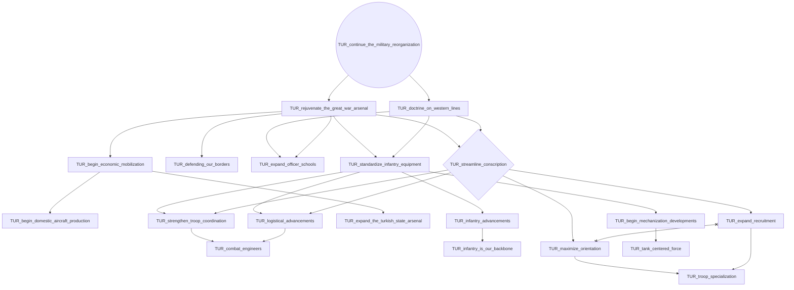
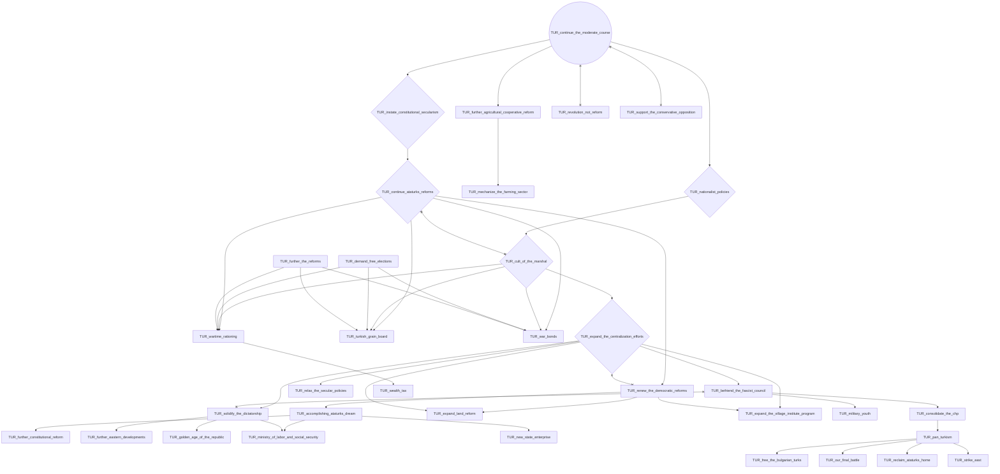
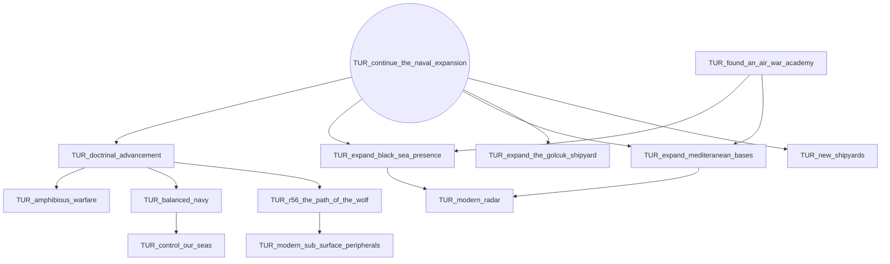
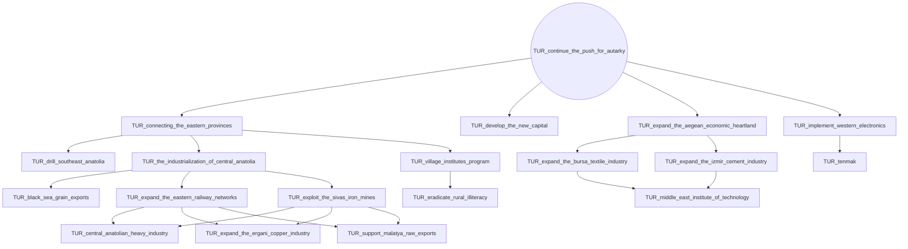
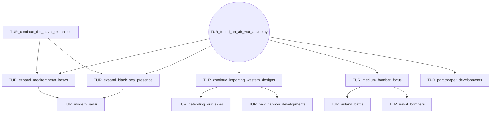
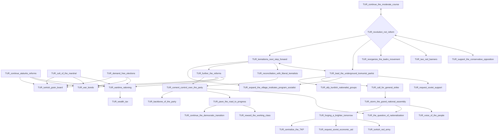
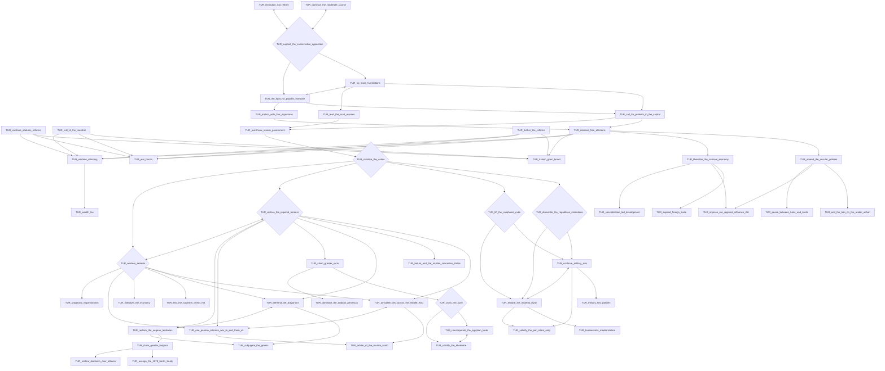
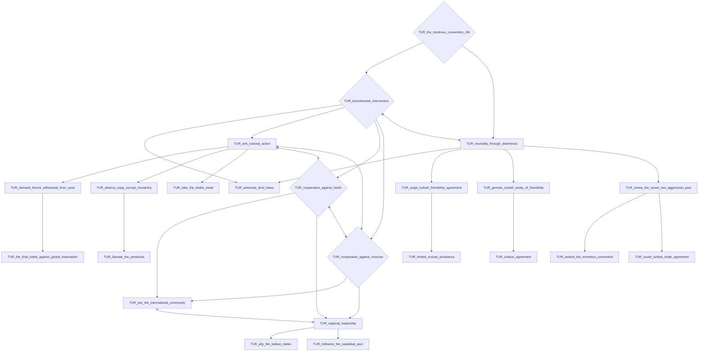

# TUR_continue_the_military_reorganization

# TUR_continue_the_moderate_course

# TUR_continue_the_naval_expansion

# TUR_continue_the_push_for_autarky

# TUR_found_an_air_war_academy

# TUR_revolution_not_reform

# TUR_support_the_conservative_opposition

# TUR_the_montreux_convention_r56

