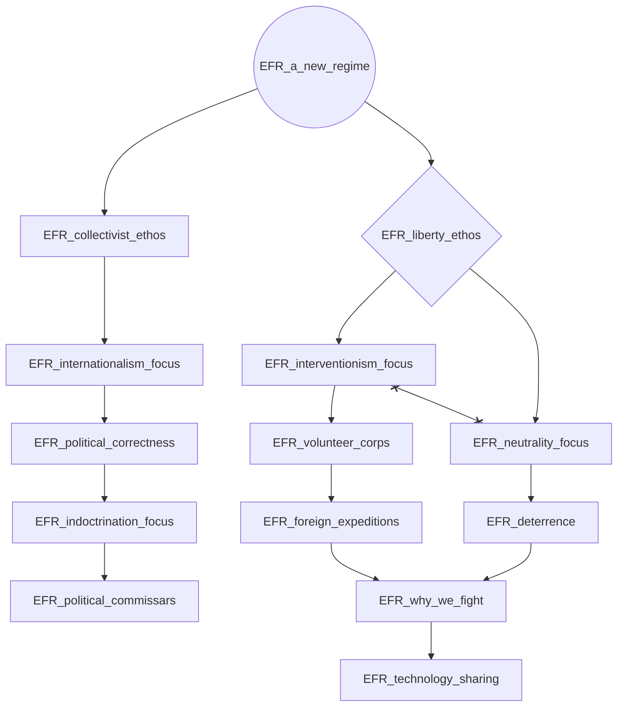
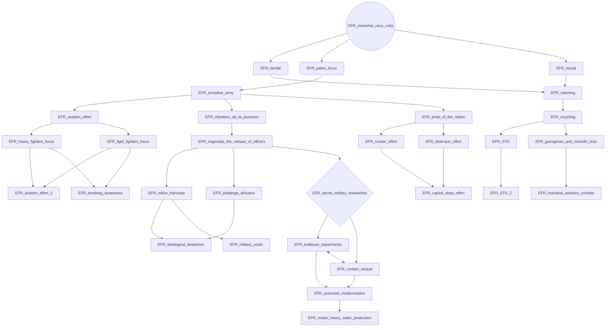

# EFR_a_new_regime

```mermaid
flowchart TD
    n1(("EFR_a_new_regime"))
    n2["EFR_collectivist_ethos"]
    n3["EFR_deterrence"]
    n4["EFR_foreign_expeditions"]
    n5["EFR_indoctrination_focus"]
    n6["EFR_internationalism_focus"]
    n7["EFR_interventionism_focus"]
    n8{"EFR_liberty_ethos"}
    n9["EFR_neutrality_focus"]
    n10["EFR_political_commissars"]
    n11["EFR_political_correctness"]
    n12["EFR_technology_sharing"]
    n13["EFR_volunteer_corps"]
    n14["EFR_why_we_fight"]
    n1 --> n2
    n9 --> n3
    n13 --> n4
    n11 --> n5
    n2 --> n6
    n8 --> n7
    n1 --> n8
    n8 --> n9
    n5 --> n10
    n6 --> n11
    n14 --> n12
    n7 --> n13
    n4 --> n14
    n3 --> n14
    n7 x--x n9
```

# EFR_marechal_nous_voila

```mermaid
flowchart TD
    n15["EFR_STO"]
    n16["EFR_STO_2"]
    n17["EFR_armistice_army"]
    n18["EFR_autorized_modernization"]
    n19["EFR_aviation_effort"]
    n20["EFR_aviation_effort_2"]
    n21["EFR_bombing_awareness"]
    n22["EFR_bulldozer_experiments"]
    n23["EFR_capital_ships_effort"]
    n24["EFR_chantiers_de_la_jeunesse"]
    n25["EFR_contact_renault"]
    n26["EFR_cruiser_effort"]
    n27["EFR_destroyer_effort"]
    n28["EFR_famille"]
    n29["EFR_gazogenes_and_michelin_tires"]
    n30["EFR_heavy_fighters_focus"]
    n31["EFR_ideological_fanaticism"]
    n32["EFR_industrial_advisory_comitee"]
    n33["EFR_light_fighters_focus"]
    n34(("EFR_marechal_nous_voila"))
    n35["EFR_milice_francaise"]
    n36["EFR_military_youth"]
    n37["EFR_negociate_the_release_of_officers"]
    n38["EFR_patrie_focus"]
    n39["EFR_phalange_africaine"]
    n40["EFR_pride_of_the_nation"]
    n41["EFR_rationing"]
    n42["EFR_recycling"]
    n43["EFR_restart_heavy_water_production"]
    n44{"EFR_secret_military_researches"}
    n45["EFR_travail"]
    n42 --> n15
    n15 --> n16
    n38 --> n17
    n25 --> n18
    n22 --> n18
    n17 --> n19
    n30 --> n20
    n33 --> n20
    n30 --> n21
    n33 --> n21
    n44 --> n22
    n26 --> n23
    n27 --> n23
    n17 --> n24
    n44 --> n25
    n40 --> n26
    n40 --> n27
    n34 --> n28
    n42 --> n29
    n19 --> n30
    n35 --> n31
    n39 --> n31
    n29 --> n32
    n19 --> n33
    n37 --> n35
    n35 --> n36
    n24 --> n37
    n34 --> n38
    n37 --> n39
    n17 --> n40
    n28 --> n41
    n45 --> n41
    n41 --> n42
    n18 --> n43
    n37 --> n44
    n34 --> n45
    n22 x--x n25
```
