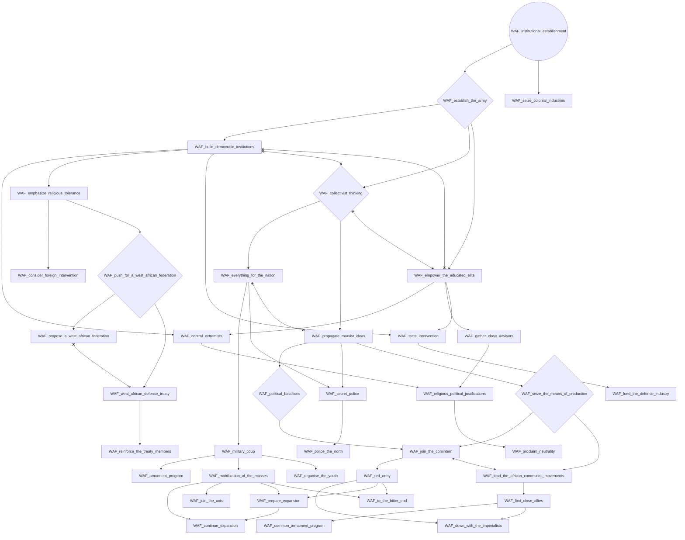

# WAF_institutional_establishment

```mermaid
flowchart TD
    n1["WAF_armament_program"]
    n2["WAF_build_democratic_institutions"]
    n3{"WAF_collectivist_thinking"}
    n4["WAF_common_armament_program"]
    n5["WAF_consider_foreign_intervention"]
    n6["WAF_continue_expansion"]
    n7["WAF_control_extremists"]
    n8["WAF_down_with_the_imperialists"]
    n9["WAF_emphasize_religious_tolerance"]
    n10["WAF_empower_the_educated_elite"]
    n11{"WAF_establish_the_army"}
    n12["WAF_everything_for_the_nation"]
    n13["WAF_find_close_allies"]
    n14["WAF_fund_the_defense_industry"]
    n15["WAF_gather_close_advisors"]
    n16(("WAF_institutional_establishment"))
    n17["WAF_join_the_axis"]
    n18["WAF_join_the_comintern"]
    n19["WAF_lead_the_african_communist_movements"]
    n20["WAF_military_coup"]
    n21["WAF_mobilization_of_the_masses"]
    n22["WAF_organise_the_youth"]
    n23["WAF_police_the_north"]
    n24{"WAF_political_batallions"}
    n25["WAF_prepare_expansion"]
    n26["WAF_proclaim_neutrality"]
    n27["WAF_propagate_marxist_ideas"]
    n28["WAF_propose_a_west_african_federation"]
    n29{"WAF_push_for_a_west_african_federation"}
    n30["WAF_red_army"]
    n31["WAF_reinforce_the_treaty_members"]
    n32["WAF_religious_political_justifications"]
    n33["WAF_secret_police"]
    n34["WAF_seize_colonial_industries"]
    n35{"WAF_seize_the_means_of_production"}
    n36["WAF_state_intervention"]
    n37["WAF_to_the_bitter_end"]
    n38["WAF_west_african_defense_treaty"]
    n20 --> n1
    n11 --> n2
    n11 --> n3
    n13 --> n4
    n9 --> n5
    n25 --> n6
    n21 --> n6
    n2 --> n7
    n10 --> n7
    n13 --> n8
    n30 --> n8
    n2 --> n9
    n11 --> n10
    n16 --> n11
    n3 --> n12
    n19 --> n13
    n36 --> n14
    n10 --> n15
    n21 --> n17
    n24 --> n18
    n35 --> n18
    n35 --> n19
    n12 --> n20
    n20 --> n21
    n20 --> n22
    n33 --> n23
    n27 --> n24
    n30 --> n25
    n21 --> n25
    n32 --> n26
    n3 --> n27
    n29 --> n28
    n9 --> n29
    n18 --> n30
    n38 --> n31
    n15 --> n32
    n7 --> n32
    n27 --> n33
    n12 --> n33
    n16 --> n34
    n27 --> n35
    n2 --> n36
    n10 --> n36
    n30 --> n37
    n21 --> n37
    n29 --> n38
    n2 x--x n3
    n2 x--x n10
    n3 x--x n10
    n12 x--x n27
    n18 x--x n19
    n28 x--x n38
```
