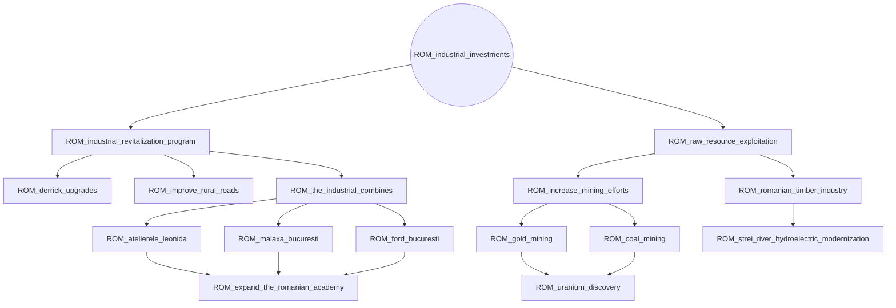
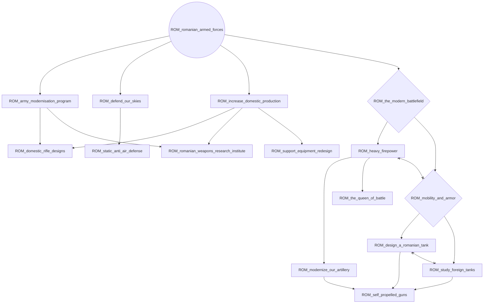
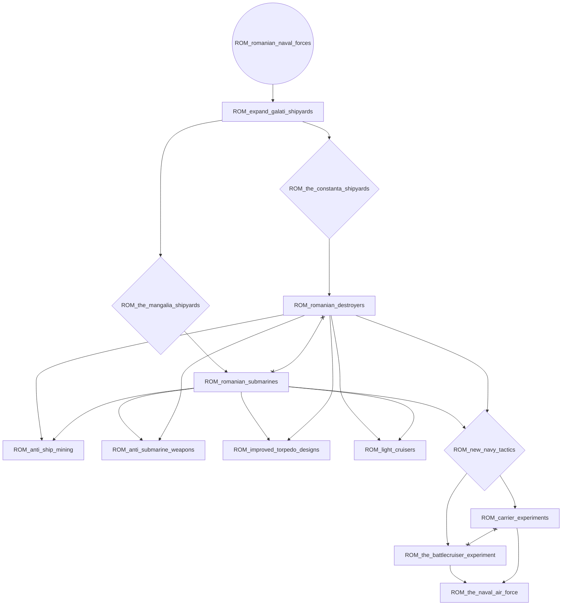
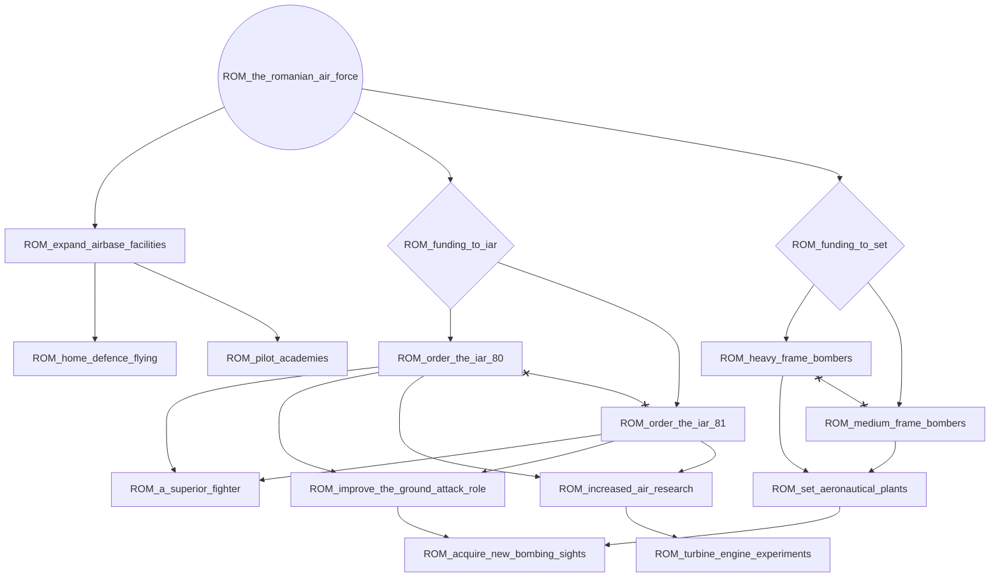

# ROM_a_flawed_democracy

```mermaid
flowchart TD
    n1{"ROM_a_flawed_democracy"}
    n2["ROM_agricultural_boom"]
    n3["ROM_align_greece"]
    n4["ROM_align_turkey"]
    n5["ROM_allegiance_to_moscow"]
    n6{"ROM_alliance_with_the_germans"}
    n7{"ROM_alliance_with_the_italians"}
    n8["ROM_allies_membership"]
    n9["ROM_anti_communist_measures"]
    n10["ROM_anti_italian_aid_in_albania"]
    n11["ROM_anti_revolutionary_policies"]
    n12["ROM_arms_for_the_workers"]
    n13["ROM_axis_membership"]
    n14{"ROM_balkan_diplomacy"}
    n15["ROM_balkan_research_institute"]
    n16["ROM_balkan_research_institute_2"]
    n17["ROM_bedrock_of_balkan_democracy"]
    n18["ROM_break_our_shackles"]
    n19["ROM_build_the_carol_line"]
    n20["ROM_bureau_of_economics"]
    n21["ROM_bureau_of_warfare"]
    n22["ROM_carve_up_yugo"]
    n23["ROM_challenge_moscow"]
    n24["ROM_christian_education_centers"]
    n25["ROM_claims_in_the_east"]
    n26["ROM_clamp_down_on_extremism"]
    n27["ROM_codreanus_iron_guard"]
    n28["ROM_coerce_the_turks"]
    n29["ROM_collectivized_farming_programs"]
    n30["ROM_concessions_to_the_right"]
    n31["ROM_constitutional_reform"]
    n32["ROM_contact_the_unions"]
    n33["ROM_contacts_in_moscow"]
    n34["ROM_crack_down_on_anti_legionary_activity"]
    n35["ROM_crack_down_on_communism"]
    n36["ROM_crush_the_fatherland_front"]
    n37{"ROM_deadlock_in_election"}
    n38["ROM_deal_with_the_hungarians"]
    n39["ROM_demand_hungarian_submission"]
    n40["ROM_dissolve_the_parliament"]
    n41["ROM_divide_the_czechs"]
    n42["ROM_dominate_the_black_sea"]
    n43["ROM_empower_the_securitate"]
    n44["ROM_enforce_royal_dictatorship"]
    n45["ROM_enforce_the_tariffs"]
    n46["ROM_ensure_eastern_loyalties"]
    n47["ROM_establish_the_legion"]
    n48["ROM_establish_the_upla"]
    n49{"ROM_exile_or_execution"}
    n50["ROM_expand_the_iron_guard"]
    n51["ROM_fate_of_codreanu"]
    n52["ROM_finalize_the_tax_reforms"]
    n53["ROM_finalize_the_trials"]
    n54["ROM_form_a_coalition"]
    n55["ROM_form_a_united_balkan_pact"]
    n56["ROM_formalize_the_balkan_entente"]
    n57["ROM_foundation_romanian_red_army"]
    n58["ROM_handle_bulgaria"]
    n59["ROM_handle_the_bulgarians"]
    n60["ROM_handle_the_guard"]
    n61["ROM_handle_the_hungarians"]
    n62["ROM_hold_emergency_election"]
    n63["ROM_initial_political_reforms"]
    n64["ROM_intervene_in_greece"]
    n65["ROM_intervention_in_spain"]
    n66["ROM_invite_albania"]
    n67["ROM_invite_bulgaria_to_the_pact"]
    n68["ROM_invite_german_military_advisors"]
    n69["ROM_invite_the_hungarians"]
    n70["ROM_joint_german_oil_exploitation"]
    n71["ROM_militarized_industry"]
    n72{"ROM_military_law_enforcement"}
    n73["ROM_nationalized_industrial_complex"]
    n74{"ROM_oppose_the_royal_dictatorship"}
    n75["ROM_pan_balkan_economic_pact"]
    n76["ROM_peasant_militias"]
    n77["ROM_political_commissars"]
    n78["ROM_preempt_counter_revolution"]
    n79["ROM_preempt_the_bulgarian_threat"]
    n80["ROM_prepare_anti_soviet_cells"]
    n81["ROM_prepare_the_eastern_front"]
    n82["ROM_preservation_of_greater_romania"]
    n83["ROM_pressure_fatherland_front"]
    n84["ROM_privatize_state_owned_enterprises"]
    n85["ROM_protect_our_eastern_front"]
    n86["ROM_protect_yugoslavia"]
    n87["ROM_public_department_buildings"]
    n88["ROM_public_works_programs"]
    n89["ROM_purchase_german_designs_and_equipment"]
    n90["ROM_push_across_the_tisza_river"]
    n91["ROM_r56_german_romanian_trade_agreement"]
    n92["ROM_ratify_traditional_gender_roles"]
    n93["ROM_reclaim_the_mother_church"]
    n94["ROM_reconfigure_the_government"]
    n95["ROM_recruit_the_iron_guard"]
    n96["ROM_reestablish_foreign_connections"]
    n97["ROM_request_balkan_aid"]
    n98["ROM_restore_the_bulgarian_patriarchate"]
    n99["ROM_restore_the_little_entente"]
    n100["ROM_restrict_freedom_of_press"]
    n101["ROM_romanian_autarky"]
    n102["ROM_romanian_bulgarian_ssr"]
    n103["ROM_romanias_final_stand"]
    n104{"ROM_royal_coup"}
    n105["ROM_rural_investments"]
    n106["ROM_safeguard_the_greeks"]
    n107["ROM_secure_the_home_front"]
    n108["ROM_seek_western_support"]
    n109["ROM_seize_foreign_companies"]
    n110["ROM_seize_royal_assets"]
    n111["ROM_seize_the_vatican"]
    n112["ROM_service_abroad"]
    n113["ROM_simas_ascendancy"]
    n114["ROM_solidify_church_presence"]
    n115["ROM_soviet_influenced_industry"]
    n116["ROM_soviet_military_expertise"]
    n117["ROM_spread_latin_influence_south"]
    n118["ROM_stabilize_the_new_government"]
    n119{"ROM_strengthen_the_balkan_pact"}
    n120{"ROM_strengthen_the_sentinels"}
    n121["ROM_subvert_fascism_in_romania"]
    n122["ROM_subvert_moscow_authority"]
    n123["ROM_tatarescus_regime"]
    n124["ROM_the_capital_of_the_balkans"]
    n125["ROM_the_capital_of_the_balkans_demo"]
    n126["ROM_the_capital_of_the_balkans_monarchist"]
    n127["ROM_the_carpathian_trap"]
    n128["ROM_the_east"]
    n129["ROM_the_general_election"]
    n130["ROM_the_german_eagle"]
    n131["ROM_the_german_four_year_plan"]
    n132{"ROM_the_great_trial_of_year"}
    n133["ROM_the_holy_land"]
    n134["ROM_the_iron_guard"]
    n135["ROM_the_iron_guard_threat"]
    n136["ROM_the_italian_cross"]
    n137["ROM_the_new_greater_romania"]
    n138["ROM_the_new_kingdom"]
    n139["ROM_the_old_kingdom"]
    n140["ROM_the_peace_front"]
    n141["ROM_the_romanian_civil_war"]
    n142["ROM_the_romanian_communist_party"]
    n143["ROM_the_romanian_peoples_republic"]
    n144{"ROM_the_royal_guard"}
    n145["ROM_the_seat_of_balkan_orthodoxy"]
    n146["ROM_the_soviet_sickle"]
    n147["ROM_the_tilea_affair"]
    n148["ROM_the_tisza_plan"]
    n149["ROM_the_transnistrian_exchange"]
    n150["ROM_total_ban_on_communism"]
    n151["ROM_total_ban_on_paramilitaries"]
    n152["ROM_tractors_to_tanks"]
    n153["ROM_united_against_extremism"]
    n154["ROM_western_diplomacy"]
    n155["ROM_yugoslav_intervention"]
    n128 --> n2
    n105 --> n2
    n117 --> n3
    n117 --> n4
    n132 --> n5
    n72 --> n6
    n72 --> n7
    n140 --> n8
    n131 --> n9
    n86 --> n10
    n118 --> n11
    n23 --> n12
    n5 --> n12
    n144 --> n13
    n120 --> n13
    n105 --> n14
    n56 --> n15
    n75 --> n16
    n118 --> n17
    n80 --> n18
    n96 --> n18
    n31 --> n19
    n82 --> n19
    n152 --> n20
    n152 --> n21
    n39 --> n22
    n69 --> n22
    n132 --> n23
    n27 --> n24
    n81 --> n25
    n87 --> n26
    n49 --> n27
    n106 --> n28
    n78 --> n29
    n54 --> n30
    n44 --> n31
    n76 --> n32
    n37 --> n33
    n63 --> n34
    n47 --> n35
    n103 --> n36
    n74 --> n37
    n56 --> n38
    n6 --> n39
    n7 --> n39
    n129 --> n40
    n69 --> n41
    n39 --> n41
    n6 --> n41
    n36 --> n42
    n127 --> n42
    n78 --> n43
    n40 --> n44
    n52 --> n45
    n33 --> n46
    n145 --> n47
    n18 --> n48
    n150 --> n49
    n34 --> n49
    n113 --> n50
    n135 --> n51
    n123 --> n52
    n62 --> n52
    n5 --> n53
    n37 --> n54
    n14 --> n55
    n67 --> n56
    n79 --> n56
    n53 --> n57
    n8 --> n58
    n55 --> n59
    n135 --> n60
    n55 --> n61
    n99 --> n61
    n1 --> n62
    n134 --> n63
    n35 --> n64
    n112 --> n65
    n56 --> n66
    n119 --> n67
    n91 --> n68
    n6 --> n69
    n7 --> n69
    n89 --> n70
    n109 --> n71
    n50 --> n72
    n109 --> n73
    n62 --> n74
    n1 --> n74
    n55 --> n75
    n99 --> n75
    n33 --> n76
    n53 --> n77
    n141 --> n78
    n119 --> n79
    n122 --> n80
    n13 --> n81
    n44 --> n82
    n57 --> n83
    n77 --> n83
    n52 --> n84
    n6 --> n85
    n7 --> n85
    n8 --> n86
    n123 --> n87
    n45 --> n88
    n84 --> n88
    n13 --> n89
    n6 --> n89
    n104 --> n90
    n82 --> n91
    n31 --> n91
    n27 --> n92
    n47 --> n93
    n143 --> n94
    n30 --> n95
    n122 --> n96
    n108 --> n97
    n35 --> n98
    n14 --> n99
    n87 --> n100
    n113 --> n101
    n27 --> n101
    n83 --> n102
    n104 --> n103
    n25 --> n104
    n138 --> n105
    n86 --> n106
    n108 --> n107
    n54 --> n108
    n101 --> n109
    n101 --> n110
    n27 --> n110
    n93 --> n111
    n113 --> n112
    n27 --> n112
    n49 --> n113
    n24 --> n114
    n92 --> n114
    n29 --> n115
    n76 --> n116
    n46 --> n116
    n22 --> n117
    n141 --> n118
    n120 --> n119
    n144 --> n119
    n9 --> n120
    n131 --> n121
    n23 --> n122
    n1 --> n123
    n42 --> n124
    n75 --> n125
    n119 --> n126
    n140 --> n126
    n103 --> n127
    n139 --> n128
    n100 --> n129
    n26 --> n129
    n153 --> n130
    n91 --> n131
    n43 --> n132
    n93 --> n133
    n74 --> n134
    n17 --> n135
    n153 --> n136
    n42 --> n137
    n139 --> n138
    n17 --> n139
    n147 --> n140
    n142 --> n141
    n107 --> n141
    n116 --> n142
    n90 --> n143
    n121 --> n144
    n114 --> n145
    n153 --> n146
    n144 --> n147
    n120 --> n147
    n140 --> n148
    n25 --> n149
    n63 --> n150
    n51 --> n151
    n60 --> n151
    n12 --> n152
    n55 --> n153
    n99 --> n153
    n31 --> n154
    n35 --> n155
    n5 x--x n23
    n6 x--x n7
    n13 x--x n119
    n13 x--x n147
    n27 x--x n113
    n33 x--x n54
    n37 x--x n134
    n39 x--x n69
    n55 x--x n99
    n62 x--x n123
    n67 x--x n79
    n90 x--x n103
    n119 x--x n147
```

# ROM_industrial_investments

```mermaid
flowchart TD
    n156["ROM_atelierele_leonida"]
    n157["ROM_coal_mining"]
    n158["ROM_derrick_upgrades"]
    n159["ROM_expand_the_romanian_academy"]
    n160["ROM_ford_bucuresti"]
    n161["ROM_gold_mining"]
    n162["ROM_improve_rural_roads"]
    n163["ROM_increase_mining_efforts"]
    n164(("ROM_industrial_investments"))
    n165["ROM_industrial_revitalization_program"]
    n166["ROM_malaxa_bucuresti"]
    n167["ROM_raw_resource_exploitation"]
    n168["ROM_romanian_timber_industry"]
    n169["ROM_strei_river_hydroelectric_modernization"]
    n170["ROM_the_industrial_combines"]
    n171["ROM_uranium_discovery"]
    n170 --> n156
    n163 --> n157
    n165 --> n158
    n156 --> n159
    n166 --> n159
    n160 --> n159
    n170 --> n160
    n163 --> n161
    n165 --> n162
    n167 --> n163
    n164 --> n165
    n170 --> n166
    n164 --> n167
    n167 --> n168
    n168 --> n169
    n165 --> n170
    n161 --> n171
    n157 --> n171
```

# ROM_romanian_armed_forces

```mermaid
flowchart TD
    n172["ROM_army_modernisation_program"]
    n173["ROM_defend_our_skies"]
    n174["ROM_design_a_romanian_tank"]
    n175["ROM_domestic_rifle_designs"]
    n176["ROM_heavy_firepower"]
    n177["ROM_increase_domestic_production"]
    n178{"ROM_mobility_and_armor"}
    n179["ROM_modernize_our_artillery"]
    n180(("ROM_romanian_armed_forces"))
    n181["ROM_romanian_weapons_research_institute"]
    n182["ROM_self_propelled_guns"]
    n183["ROM_static_anti_air_defense"]
    n184["ROM_study_foreign_tanks"]
    n185["ROM_support_equipment_redesign"]
    n186{"ROM_the_modern_battlefield"}
    n187["ROM_the_queen_of_battle"]
    n180 --> n172
    n180 --> n173
    n178 --> n174
    n177 --> n175
    n172 --> n175
    n186 --> n176
    n180 --> n177
    n186 --> n178
    n176 --> n179
    n177 --> n181
    n172 --> n181
    n179 --> n182
    n174 --> n182
    n184 --> n182
    n173 --> n183
    n178 --> n184
    n177 --> n185
    n180 --> n186
    n176 --> n187
    n174 x--x n184
    n176 x--x n178
```

# ROM_romanian_naval_forces

```mermaid
flowchart TD
    n188["ROM_anti_ship_mining"]
    n189["ROM_anti_submarine_weapons"]
    n190["ROM_carrier_experiments"]
    n191["ROM_expand_galati_shipyards"]
    n192["ROM_improved_torpedo_designs"]
    n193["ROM_light_cruisers"]
    n194{"ROM_new_navy_tactics"}
    n195["ROM_romanian_destroyers"]
    n196(("ROM_romanian_naval_forces"))
    n197["ROM_romanian_submarines"]
    n198["ROM_the_battlecruiser_experiment"]
    n199{"ROM_the_constanta_shipyards"}
    n200{"ROM_the_mangalia_shipyards"}
    n201["ROM_the_naval_air_force"]
    n195 --> n188
    n197 --> n188
    n197 --> n189
    n195 --> n189
    n194 --> n190
    n196 --> n191
    n197 --> n192
    n195 --> n192
    n195 --> n193
    n197 --> n193
    n197 --> n194
    n195 --> n194
    n199 --> n195
    n200 --> n197
    n194 --> n198
    n191 --> n199
    n191 --> n200
    n198 --> n201
    n190 --> n201
    n190 x--x n198
    n195 x--x n197
```

# ROM_the_romanian_air_force

```mermaid
flowchart TD
    n202["ROM_a_superior_fighter"]
    n203["ROM_acquire_new_bombing_sights"]
    n204["ROM_expand_airbase_facilities"]
    n205{"ROM_funding_to_iar"}
    n206{"ROM_funding_to_set"}
    n207["ROM_heavy_frame_bombers"]
    n208["ROM_home_defence_flying"]
    n209["ROM_improve_the_ground_attack_role"]
    n210["ROM_increased_air_research"]
    n211["ROM_medium_frame_bombers"]
    n212["ROM_order_the_iar_80"]
    n213["ROM_order_the_iar_81"]
    n214["ROM_pilot_academies"]
    n215["ROM_set_aeronautical_plants"]
    n216(("ROM_the_romanian_air_force"))
    n217["ROM_turbine_engine_experiments"]
    n213 --> n202
    n212 --> n202
    n209 --> n203
    n215 --> n203
    n216 --> n204
    n216 --> n205
    n216 --> n206
    n206 --> n207
    n204 --> n208
    n213 --> n209
    n212 --> n209
    n213 --> n210
    n212 --> n210
    n206 --> n211
    n205 --> n212
    n205 --> n213
    n204 --> n214
    n207 --> n215
    n211 --> n215
    n210 --> n217
    n207 x--x n211
    n212 x--x n213
```
