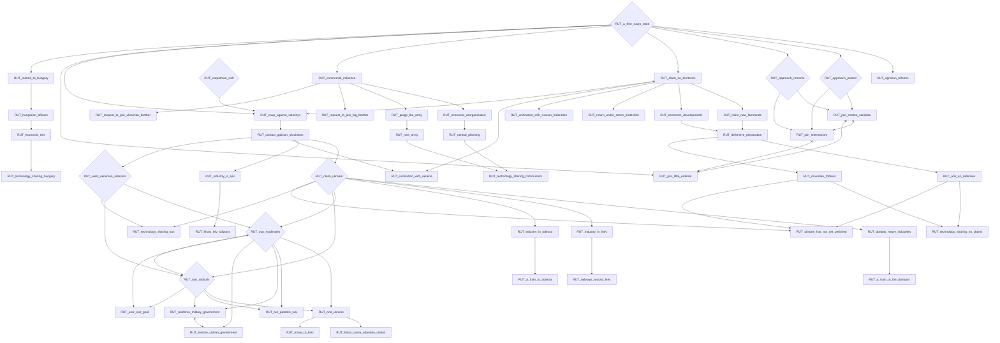
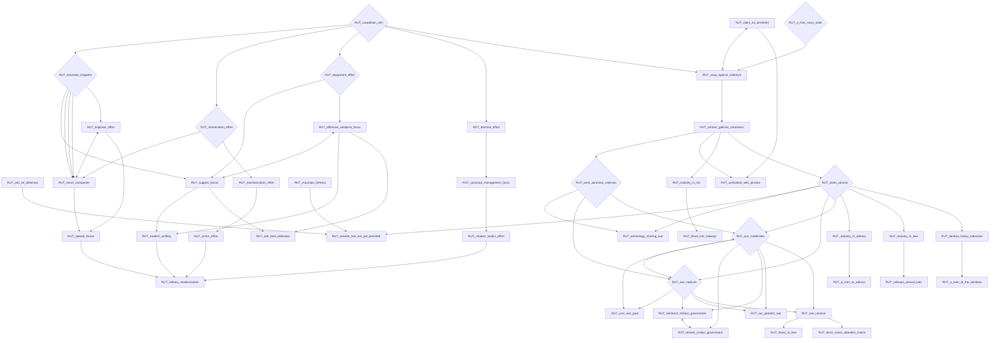
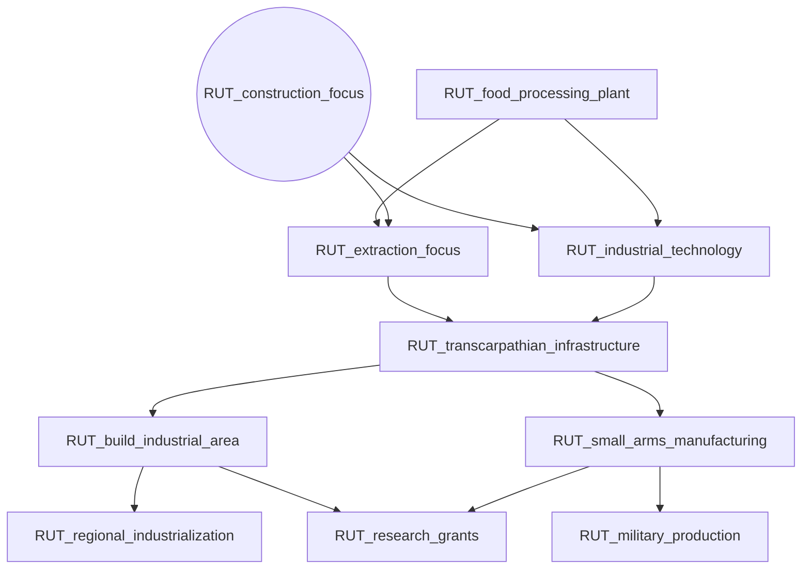
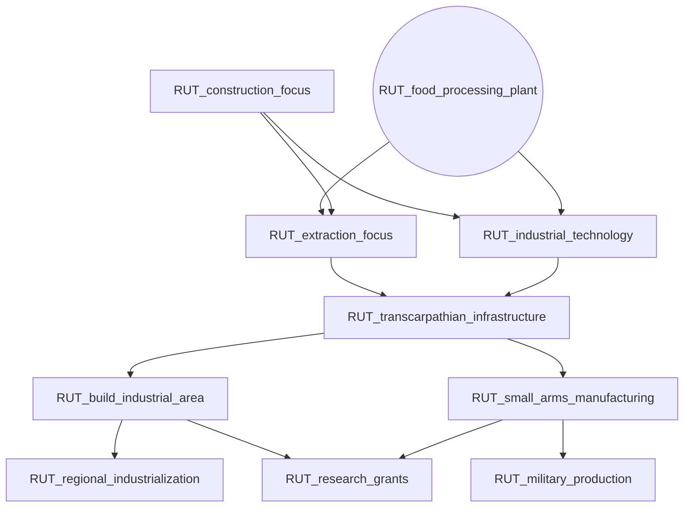
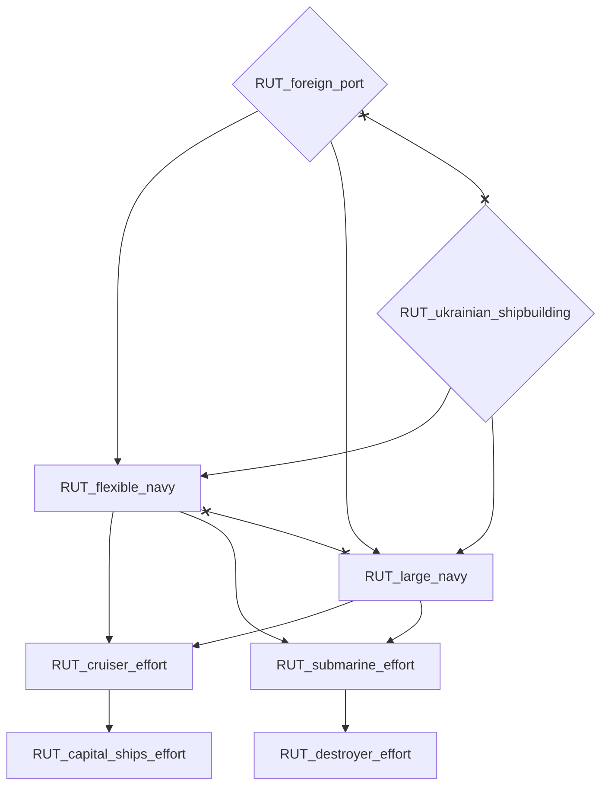
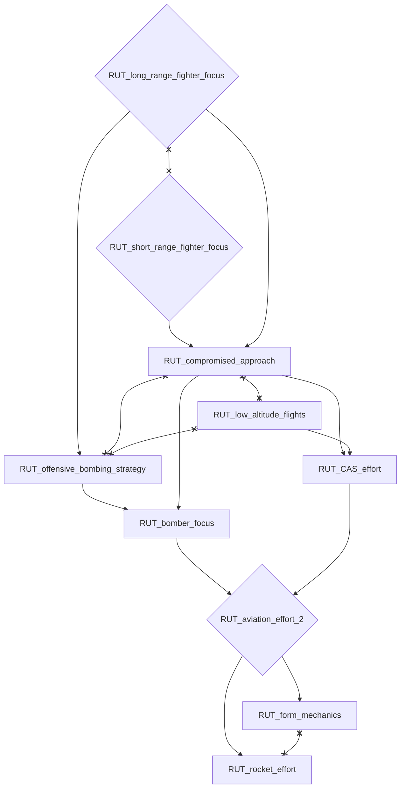
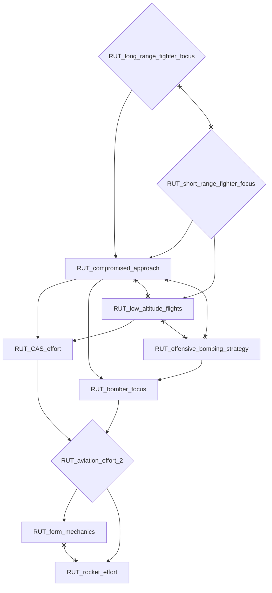

# RUT_a_free_rusyn_state

# RUT_carpathian_sich

# RUT_construction_focus

# RUT_food_processing_plant

# RUT_foreign_port

# RUT_long_range_fighter_focus

# RUT_short_range_fighter_focus

# RUT_ukrainian_shipbuilding

