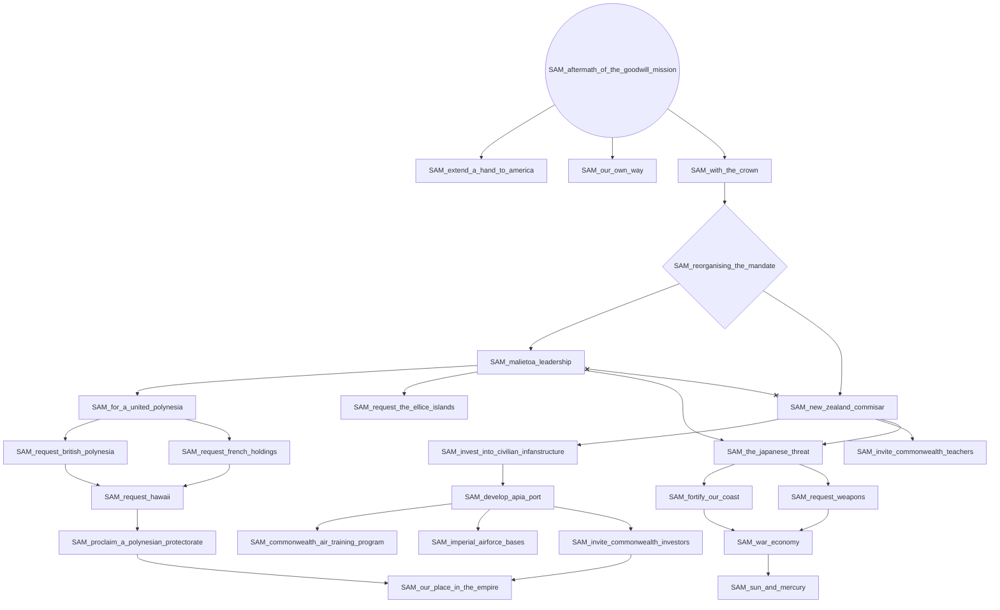

# SAM_aftermath_of_the_goodwill_mission

```mermaid
flowchart TD
    n1(("SAM_aftermath_of_the_goodwill_mission"))
    n2["SAM_commonwealth_air_training_program"]
    n3["SAM_develop_apia_port"]
    n4["SAM_extend_a_hand_to_america"]
    n5["SAM_for_a_united_polynesia"]
    n6["SAM_fortify_our_coast"]
    n7["SAM_imperial_airforce_bases"]
    n8["SAM_invest_into_civilian_infanstructure"]
    n9["SAM_invite_commonwealth_investors"]
    n10["SAM_invite_commonwealth_teachers"]
    n11["SAM_malietoa_leadership"]
    n12["SAM_new_zealand_commisar"]
    n13["SAM_our_own_way"]
    n14["SAM_our_place_in_the_empire"]
    n15["SAM_proclaim_a_polynesian_protectorate"]
    n16{"SAM_reorganising_the_mandate"}
    n17["SAM_request_british_polynesia"]
    n18["SAM_request_french_holdings"]
    n19["SAM_request_hawaii"]
    n20["SAM_request_the_ellice_islands"]
    n21["SAM_request_weapons"]
    n22["SAM_sun_and_mercury"]
    n23["SAM_the_japanese_threat"]
    n24["SAM_war_economy"]
    n25["SAM_with_the_crown"]
    n3 --> n2
    n8 --> n3
    n1 --> n4
    n11 --> n5
    n23 --> n6
    n3 --> n7
    n12 --> n8
    n3 --> n9
    n12 --> n10
    n16 --> n11
    n16 --> n12
    n1 --> n13
    n15 --> n14
    n9 --> n14
    n19 --> n15
    n25 --> n16
    n5 --> n17
    n5 --> n18
    n17 --> n19
    n18 --> n19
    n11 --> n20
    n23 --> n21
    n24 --> n22
    n11 --> n23
    n12 --> n23
    n6 --> n24
    n21 --> n24
    n1 --> n25
    n11 x--x n12
```
