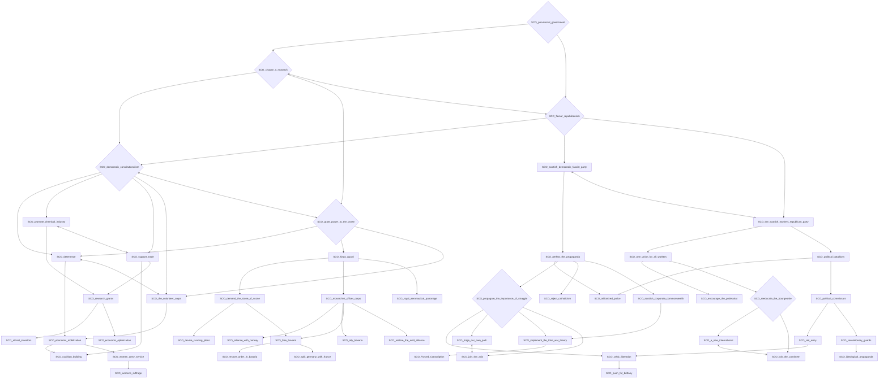

# SCO_provisional_government

```mermaid
flowchart TD
    n1["SCO_Forced_Conscription"]
    n2["SCO_a_new_international"]
    n3["SCO_alliance_with_norway"]
    n4["SCO_ally_bavaria"]
    n5["SCO_attract_investors"]
    n6["SCO_celtic_liberation"]
    n7{"SCO_choose_a_monarch"}
    n8["SCO_coalition_building"]
    n9["SCO_demand_the_stone_of_scone"]
    n10{"SCO_democratic_constitutionalism"}
    n11["SCO_deterrence"]
    n12["SCO_devise_cunning_plans"]
    n13["SCO_economic_mobilization"]
    n14["SCO_economic_optimization"]
    n15["SCO_encourage_the_proletariat"]
    n16{"SCO_favour_republicanism"}
    n17["SCO_forge_our_own_path"]
    n18["SCO_free_bavaria"]
    n19{"SCO_grant_power_to_the_crown"}
    n20["SCO_ideological_propaganda"]
    n21["SCO_implement_the_total_war_theory"]
    n22["SCO_join_the_axis"]
    n23["SCO_join_the_comintern"]
    n24["SCO_kings_guard"]
    n25["SCO_militarized_police"]
    n26["SCO_monarchist_officer_corps"]
    n27["SCO_one_union_for_all_workers"]
    n28["SCO_perfect_the_propaganda"]
    n29["SCO_political_batallions"]
    n30["SCO_political_commissars"]
    n31["SCO_promote_chemical_industry"]
    n32{"SCO_propagate_the_importance_of_struggle"}
    n33{"SCO_provisional_government"}
    n34["SCO_push_for_brittany"]
    n35["SCO_red_army"]
    n36{"SCO_reeducate_the_bourgeoisie"}
    n37["SCO_reject_catholicism"]
    n38["SCO_research_grants"]
    n39["SCO_restore_order_in_bavaria"]
    n40["SCO_restore_the_auld_alliance"]
    n41["SCO_revolutionary_guards"]
    n42["SCO_royal_aeronautical_patronage"]
    n43["SCO_scottish_corporate_commonwealth"]
    n44["SCO_scottish_democratic_fascist_party"]
    n45["SCO_split_germany_with_france"]
    n46["SCO_support_trade"]
    n47["SCO_the_scottish_workers_republican_party"]
    n48["SCO_the_volunteer_corps"]
    n49["SCO_women_army_service"]
    n50["SCO_womens_suffrage"]
    n21 --> n1
    n36 --> n2
    n26 --> n3
    n26 --> n4
    n38 --> n5
    n35 --> n6
    n32 --> n6
    n33 --> n7
    n46 --> n8
    n13 --> n8
    n24 --> n9
    n7 --> n10
    n16 --> n10
    n10 --> n11
    n19 --> n11
    n9 --> n12
    n11 --> n13
    n48 --> n13
    n38 --> n14
    n27 --> n15
    n33 --> n16
    n32 --> n17
    n9 --> n18
    n26 --> n18
    n7 --> n19
    n41 --> n20
    n32 --> n21
    n43 --> n21
    n32 --> n22
    n36 --> n23
    n19 --> n24
    n28 --> n25
    n29 --> n25
    n24 --> n26
    n47 --> n27
    n44 --> n28
    n47 --> n29
    n29 --> n30
    n10 --> n31
    n28 --> n32
    n6 --> n34
    n30 --> n35
    n27 --> n36
    n28 --> n37
    n46 --> n38
    n31 --> n38
    n18 --> n39
    n26 --> n40
    n30 --> n41
    n24 --> n42
    n28 --> n43
    n16 --> n44
    n18 --> n45
    n10 --> n46
    n16 --> n47
    n10 --> n48
    n19 --> n48
    n13 --> n49
    n49 --> n50
    n2 x--x n23
    n7 x--x n16
    n10 x--x n19
    n11 x--x n48
    n17 x--x n22
    n31 x--x n46
    n44 x--x n47
```
