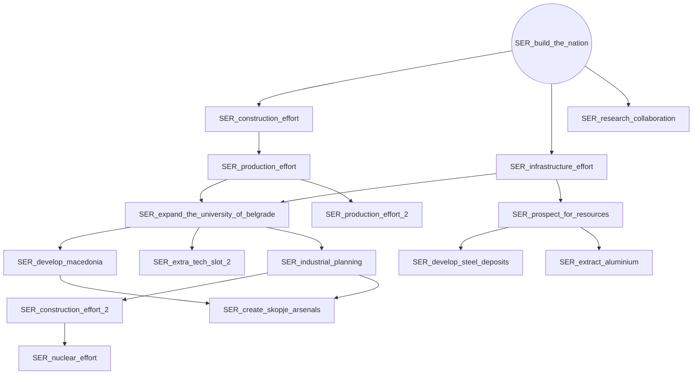
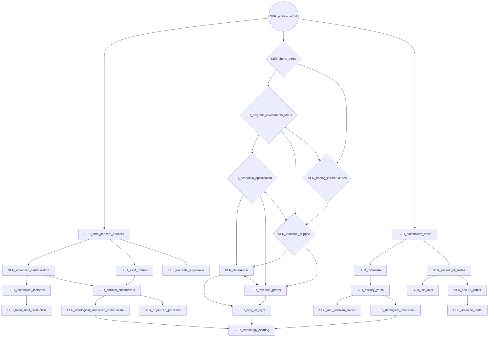
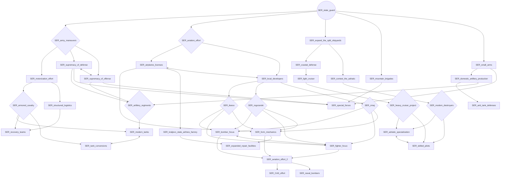

# SER_build_the_nation

```mermaid
flowchart TD
    n1(("SER_build_the_nation"))
    n2["SER_construction_effort"]
    n3["SER_construction_effort_2"]
    n4["SER_create_skopje_arsenals"]
    n5["SER_develop_macedonia"]
    n6["SER_develop_steel_deposits"]
    n7["SER_expand_the_university_of_belgrade"]
    n8["SER_extra_tech_slot_2"]
    n9["SER_extract_aluminium"]
    n10["SER_industrial_planning"]
    n11["SER_infrastructure_effort"]
    n12["SER_nuclear_effort"]
    n13["SER_production_effort"]
    n14["SER_production_effort_2"]
    n15["SER_prospect_for_resources"]
    n16["SER_research_collaboration"]
    n1 --> n2
    n10 --> n3
    n5 --> n4
    n10 --> n4
    n7 --> n5
    n15 --> n6
    n11 --> n7
    n13 --> n7
    n7 --> n8
    n15 --> n9
    n7 --> n10
    n1 --> n11
    n3 --> n12
    n2 --> n13
    n13 --> n14
    n11 --> n15
    n1 --> n16
```

# SER_political_effort

```mermaid
flowchart TD
    n17["SER_advance_north"]
    n18["SER_anti_partizan_tactics"]
    n19{"SER_belgrade_investments_focus"}
    n20["SER_deterrence"]
    n21["SER_economic_centralization"]
    n22{"SER_economic_optimization"}
    n23["SER_form_peasant_councils"]
    n24["SER_ideological_fanaticism"]
    n25["SER_ideological_fanaticism_communism"]
    n26{"SER_industrial_support"}
    n27["SER_join_axis"]
    n28{"SER_liberty_ethos"}
    n29["SER_local_militias"]
    n30["SER_local_steel_production"]
    n31["SER_militarism"]
    n32["SER_military_youth"]
    n33["SER_nationalism_focus"]
    n34["SER_nationalize_factories"]
    n35["SER_organized_partizans"]
    n36["SER_political_commissars"]
    n37(("SER_political_effort"))
    n38["SER_recreate_yugoslavia"]
    n39["SER_research_grants"]
    n40["SER_saviour_of_serbia"]
    n41["SER_secure_flanks"]
    n42["SER_technology_sharing"]
    n43{"SER_trading_infrastructures"}
    n44["SER_why_we_fight"]
    n41 --> n17
    n32 --> n18
    n28 --> n19
    n22 --> n20
    n26 --> n20
    n23 --> n21
    n19 --> n22
    n37 --> n23
    n32 --> n24
    n36 --> n25
    n43 --> n26
    n19 --> n26
    n40 --> n27
    n37 --> n28
    n23 --> n29
    n34 --> n30
    n33 --> n31
    n31 --> n32
    n37 --> n33
    n21 --> n34
    n36 --> n35
    n21 --> n36
    n29 --> n36
    n23 --> n38
    n22 --> n39
    n26 --> n39
    n33 --> n40
    n40 --> n41
    n25 --> n42
    n24 --> n42
    n44 --> n42
    n28 --> n43
    n20 --> n44
    n39 --> n44
    n19 x--x n43
    n20 x--x n39
    n22 x--x n26
```

# SER_state_guard

```mermaid
flowchart TD
    n45["SER_CAS_effort"]
    n46["SER_adriatic_specialization"]
    n47["SER_airplanes_licenses"]
    n48["SER_anti_tank_defenses"]
    n49{"SER_armored_cavalry"}
    n50{"SER_army_maneuvers"}
    n51{"SER_artillery_regiments"}
    n52{"SER_aviation_effort"}
    n53["SER_aviation_effort_2"]
    n54["SER_bomber_focus"]
    n55["SER_coastal_defense"]
    n56["SER_contest_the_adriatic"]
    n57["SER_domestic_artillery_production"]
    n58["SER_expand_the_split_shipyards"]
    n59["SER_expanded_repair_facilities"]
    n60["SER_fighter_focus"]
    n61["SER_form_mechanics"]
    n62{"SER_heavy_cruiser_project"}
    n63{"SER_ikarus"}
    n64["SER_kraljevo_state_airlines_factory"]
    n65["SER_light_cruiser"]
    n66["SER_local_developers"]
    n67{"SER_modern_destroyers"}
    n68["SER_modern_tanks"]
    n69["SER_motorization_effort"]
    n70["SER_mountain_brigades"]
    n71["SER_naval_bombers"]
    n72["SER_recovery_teams"]
    n73{"SER_rogozarski"}
    n74["SER_skilled_pilots"]
    n75["SER_small_arms"]
    n76["SER_special_forces"]
    n77(("SER_state_guard"))
    n78["SER_structured_logistics"]
    n79["SER_supremacy_of_defense"]
    n80["SER_supremacy_of_offense"]
    n81["SER_tank_conversions"]
    n82{"SER_zmaj"}
    n53 --> n45
    n67 --> n46
    n62 --> n46
    n52 --> n47
    n57 --> n48
    n69 --> n49
    n77 --> n50
    n80 --> n51
    n79 --> n51
    n57 --> n51
    n77 --> n52
    n54 --> n53
    n60 --> n53
    n61 --> n53
    n63 --> n54
    n73 --> n54
    n82 --> n54
    n58 --> n55
    n58 --> n56
    n75 --> n57
    n77 --> n58
    n64 --> n59
    n61 --> n59
    n63 --> n60
    n73 --> n60
    n82 --> n60
    n47 --> n61
    n63 --> n61
    n73 --> n61
    n82 --> n61
    n65 --> n62
    n66 --> n63
    n47 --> n64
    n55 --> n65
    n52 --> n66
    n56 --> n67
    n49 --> n68
    n51 --> n68
    n50 --> n69
    n77 --> n70
    n53 --> n71
    n78 --> n72
    n49 --> n72
    n66 --> n73
    n67 --> n74
    n62 --> n74
    n77 --> n75
    n70 --> n76
    n75 --> n76
    n79 --> n76
    n80 --> n76
    n69 --> n78
    n50 --> n79
    n50 --> n80
    n49 --> n81
    n66 --> n82
    n46 x--x n74
    n47 x--x n66
    n54 x--x n60
    n68 x--x n81
    n79 x--x n80
```
