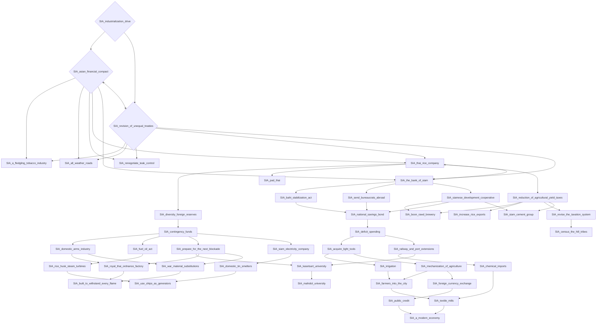
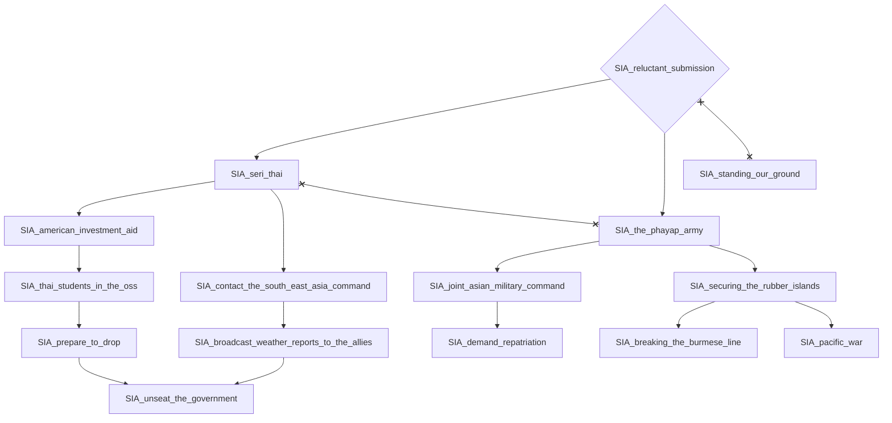
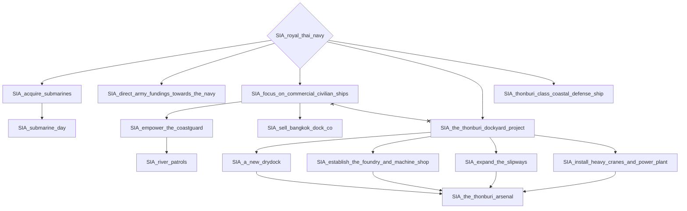
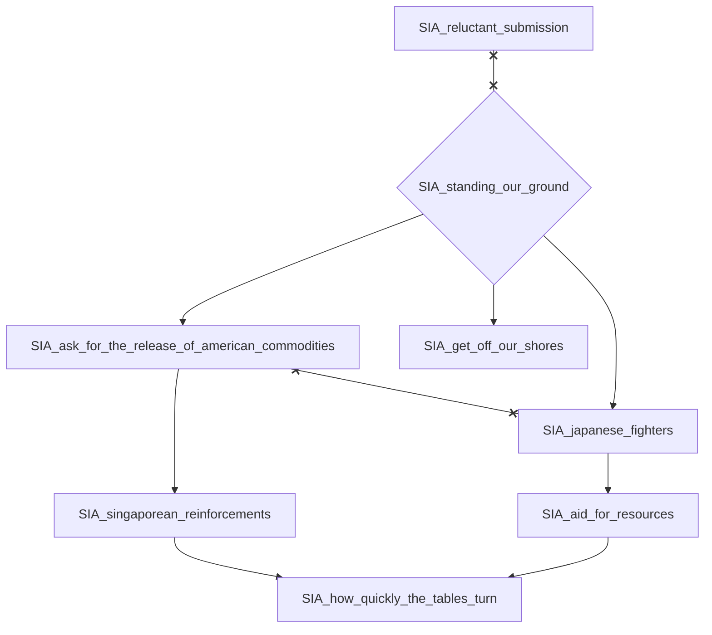
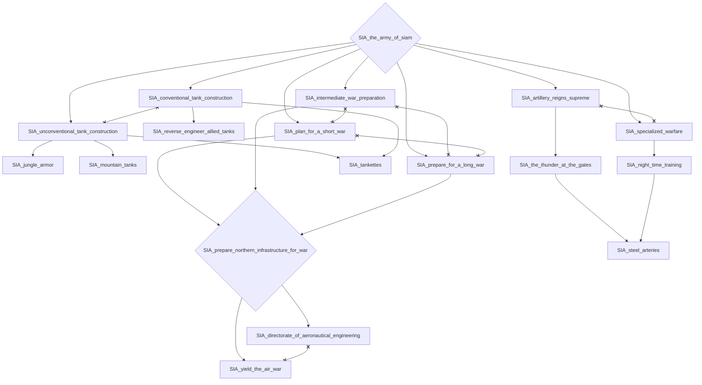
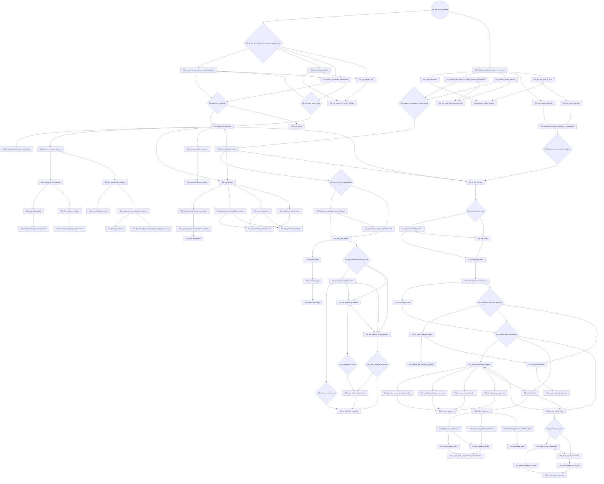

# SIA_industrialization_drive

```mermaid
flowchart TD
    n1["SIA_a_fledgling_tobacco_industry"]
    n2["SIA_a_modern_economy"]
    n3["SIA_acquire_light_tools"]
    n4["SIA_all_weather_roads"]
    n5{"SIA_asian_financial_compact"}
    n6["SIA_baht_stabilization_act"]
    n7["SIA_boon_rawd_brewery"]
    n8["SIA_built_to_withstand_every_flame"]
    n9["SIA_census_the_hill_tribes"]
    n10["SIA_chemical_imports"]
    n11["SIA_contingency_funds"]
    n12["SIA_deficit_spending"]
    n13["SIA_diversity_foreign_reserves"]
    n14["SIA_domestic_arms_industry"]
    n15["SIA_domestic_tin_smelters"]
    n16["SIA_farmers_into_the_city"]
    n17["SIA_foreign_currency_exchange"]
    n18["SIA_fuel_oil_act"]
    n19["SIA_increase_rice_exports"]
    n20{"SIA_industrialization_drive"}
    n21["SIA_irrigation"]
    n22["SIA_kasetsart_university"]
    n23["SIA_mahidol_university"]
    n24["SIA_mechanization_of_agriculture"]
    n25["SIA_national_savings_bond"]
    n26["SIA_pad_thai"]
    n27["SIA_prepare_for_the_next_blockade"]
    n28["SIA_public_credit"]
    n29["SIA_railway_and_port_extensions"]
    n30["SIA_reduction_of_agricultural_yield_taxes"]
    n31["SIA_renegotiate_teak_control"]
    n32["SIA_revise_the_taxation_system"]
    n33{"SIA_revision_of_unequal_treaties"}
    n34["SIA_rice_husk_steam_turbines"]
    n35["SIA_royal_thai_ordnance_factory"]
    n36["SIA_send_bureaucrats_abroad"]
    n37["SIA_siam_cement_group"]
    n38["SIA_siam_electricity_company"]
    n39["SIA_siamese_development_cooperative"]
    n40["SIA_textile_mills"]
    n41["SIA_thai_rice_company"]
    n42["SIA_the_bank_of_siam"]
    n43["SIA_use_ships_as_generators"]
    n44["SIA_war_material_substitutions"]
    n5 --> n1
    n33 --> n1
    n28 --> n2
    n40 --> n2
    n12 --> n3
    n5 --> n4
    n33 --> n4
    n20 --> n5
    n42 --> n6
    n39 --> n7
    n30 --> n7
    n44 --> n8
    n35 --> n8
    n32 --> n9
    n29 --> n10
    n13 --> n11
    n25 --> n12
    n41 --> n13
    n11 --> n14
    n38 --> n15
    n21 --> n16
    n24 --> n16
    n24 --> n17
    n11 --> n18
    n30 --> n19
    n3 --> n21
    n29 --> n22
    n27 --> n22
    n22 --> n23
    n3 --> n24
    n6 --> n25
    n39 --> n25
    n36 --> n25
    n41 --> n26
    n11 --> n27
    n17 --> n28
    n12 --> n29
    n41 --> n30
    n5 --> n31
    n33 --> n31
    n30 --> n32
    n20 --> n33
    n18 --> n34
    n14 --> n35
    n27 --> n35
    n42 --> n36
    n39 --> n37
    n30 --> n37
    n11 --> n38
    n42 --> n39
    n16 --> n40
    n10 --> n40
    n5 --> n41
    n33 --> n41
    n5 --> n42
    n33 --> n42
    n15 --> n43
    n34 --> n43
    n27 --> n44
    n14 --> n44
    n5 x--x n33
    n41 x--x n42
```

# SIA_reluctant_submission

```mermaid
flowchart TD
    n45["SIA_american_investment_aid"]
    n46["SIA_breaking_the_burmese_line"]
    n47["SIA_broadcast_weather_reports_to_the_allies"]
    n48["SIA_contact_the_south_east_asia_command"]
    n49["SIA_demand_repatriation"]
    n50["SIA_joint_asian_military_command"]
    n51["SIA_pacific_war"]
    n52["SIA_prepare_to_drop"]
    n53{"SIA_reluctant_submission"}
    n54["SIA_securing_the_rubber_islands"]
    n55["SIA_seri_thai"]
    n56["SIA_standing_our_ground"]
    n57["SIA_thai_students_in_the_oss"]
    n58["SIA_the_phayap_army"]
    n59["SIA_unseat_the_government"]
    n55 --> n45
    n54 --> n46
    n48 --> n47
    n55 --> n48
    n50 --> n49
    n58 --> n50
    n54 --> n51
    n57 --> n52
    n58 --> n54
    n53 --> n55
    n45 --> n57
    n53 --> n58
    n52 --> n59
    n47 --> n59
    n53 x--x n56
    n55 x--x n58
```

# SIA_royal_thai_navy

```mermaid
flowchart TD
    n60["SIA_a_new_drydock"]
    n61["SIA_acquire_submarines"]
    n62["SIA_direct_army_fundings_towards_the_navy"]
    n63["SIA_empower_the_coastguard"]
    n64["SIA_establish_the_foundry_and_machine_shop"]
    n65["SIA_expand_the_slipways"]
    n66["SIA_focus_on_commercial_civilian_ships"]
    n67["SIA_install_heavy_cranes_and_power_plant"]
    n68["SIA_river_patrols"]
    n69{"SIA_royal_thai_navy"}
    n70["SIA_sell_bangkok_dock_co"]
    n71["SIA_submarine_day"]
    n72["SIA_the_thonburi_arsenal"]
    n73["SIA_the_thonburi_dockyard_project"]
    n74["SIA_thonburi_class_coastal_defense_ship"]
    n73 --> n60
    n69 --> n61
    n69 --> n62
    n66 --> n63
    n73 --> n64
    n73 --> n65
    n69 --> n66
    n73 --> n67
    n63 --> n68
    n66 --> n70
    n61 --> n71
    n67 --> n72
    n65 --> n72
    n60 --> n72
    n64 --> n72
    n69 --> n73
    n69 --> n74
    n66 x--x n73
```

# SIA_standing_our_ground

```mermaid
flowchart TD
    n75["SIA_aid_for_resources"]
    n76["SIA_ask_for_the_release_of_american_commodities"]
    n77["SIA_get_off_our_shores"]
    n78["SIA_how_quickly_the_tables_turn"]
    n79["SIA_japanese_fighters"]
    n53["SIA_reluctant_submission"]
    n80["SIA_singaporean_reinforcements"]
    n56{"SIA_standing_our_ground"}
    n79 --> n75
    n56 --> n76
    n56 --> n77
    n80 --> n78
    n75 --> n78
    n56 --> n79
    n76 --> n80
    n76 x--x n79
    n53 x--x n56
```

# SIA_the_army_of_siam

```mermaid
flowchart TD
    n81["SIA_artillery_reigns_supreme"]
    n82["SIA_conventional_tank_construction"]
    n83["SIA_directorate_of_aeronautical_engineering"]
    n84["SIA_intermediate_war_preparation"]
    n85["SIA_jungle_armor"]
    n86["SIA_mountain_tanks"]
    n87["SIA_night_time_training"]
    n88["SIA_plan_for_a_short_war"]
    n89["SIA_prepare_for_a_long_war"]
    n90{"SIA_prepare_northern_infrastructure_for_war"}
    n91["SIA_reverse_engineer_allied_tanks"]
    n92["SIA_specialized_warfare"]
    n93["SIA_steel_arteries"]
    n94["SIA_tankettes"]
    n95{"SIA_the_army_of_siam"}
    n96["SIA_the_thunder_at_the_gates"]
    n97["SIA_unconventional_tank_construction"]
    n98["SIA_yield_the_air_war"]
    n95 --> n81
    n95 --> n82
    n90 --> n83
    n95 --> n84
    n97 --> n85
    n97 --> n86
    n92 --> n87
    n95 --> n88
    n95 --> n89
    n88 --> n90
    n84 --> n90
    n89 --> n90
    n82 --> n91
    n95 --> n92
    n96 --> n93
    n87 --> n93
    n97 --> n94
    n82 --> n94
    n81 --> n96
    n95 --> n97
    n90 --> n98
    n81 x--x n92
    n82 x--x n97
    n83 x--x n98
    n84 x--x n88
    n84 x--x n89
    n88 x--x n89
```

# SIA_the_khana_ratsadon

```mermaid
flowchart TD
    n99["SIA_a_constitutional_monarchy"]
    n100{"SIA_a_land_war_in_asia"}
    n101["SIA_a_more_moderate_option"]
    n102["SIA_a_new_dawn_over_asia"]
    n103["SIA_a_race_against_time"]
    n104["SIA_achieve_domestic_legitimacy"]
    n105{"SIA_achieve_foreign_legitimacy"}
    n106["SIA_allies_integration"]
    n107["SIA_an_absolute_monarchy"]
    n108{"SIA_and_spring_the_trap"}
    n109["SIA_as_the_eyes_turn_towards_southeast_asia"]
    n110["SIA_ascend_the_throne"]
    n111["SIA_asian_democratic_compact"]
    n112["SIA_civil_nationalism"]
    n113["SIA_civil_service_heroism"]
    n114{"SIA_constitutional_virtue"}
    n115["SIA_crack_down_of_foreign_merchants"]
    n116["SIA_death_to_the_communists"]
    n117["SIA_death_to_the_nationalists"]
    n118{"SIA_defenders_of_constitutional_liberty"}
    n119["SIA_demand_the_return_of_lost_territory"]
    n120["SIA_department_of_publicity"]
    n121["SIA_direct_funds_from_the_military_towards_development"]
    n122["SIA_dominate_public_symbols"]
    n123{"SIA_drum_up_irredentism"}
    n124["SIA_embed_technocrats_in_civilian_institutions"]
    n125["SIA_end_factionalism"]
    n126["SIA_end_military_grift"]
    n127["SIA_expand_domestic_arms_workshops"]
    n128["SIA_expand_upon_the_dossier"]
    n129["SIA_facilitate_prajadhipoks_move_to_japan"]
    n130{"SIA_for_the_preservation_of_siamese_independence"}
    n131["SIA_hold_military_parades"]
    n132["SIA_join_the_allies"]
    n133["SIA_join_the_united_front"]
    n134["SIA_look_to_european_fascism"]
    n135{"SIA_meet_with_king_prajadhipok"}
    n136["SIA_military_academies_indoctrination"]
    n137["SIA_military_oversight_bureau"]
    n138["SIA_mobilize_the_defenders_of_siam"]
    n139["SIA_national_defense_in_asia"]
    n140["SIA_new_territories_administration"]
    n141{"SIA_order_discipline_and_unity"}
    n142["SIA_pan_asian_weapon_standardization"]
    n143["SIA_pan_thaiism"]
    n144["SIA_phibuns_premiership"]
    n145["SIA_prajadhipok_audience_with_churchill"]
    n146["SIA_preemtive_strike"]
    n147["SIA_prepare_for_a_pacific_war"]
    n148["SIA_press_censorship"]
    n149["SIA_radio_propaganda"]
    n150{"SIA_rebuild_the_war_torn_economy"}
    n151["SIA_recover_indochina"]
    n152["SIA_relocate_the_capital_to_phetchabun"]
    n153["SIA_restore_order"]
    n154["SIA_retake_lost_british_states"]
    n155["SIA_royal_palace_bureau_directive_no_1523"]
    n156["SIA_sala_chaloem_thai_movie_theater"]
    n157["SIA_secure_the_state"]
    n158{"SIA_sell_privy_purse_lands"}
    n159["SIA_shuffle_pridi_to_the_minister_of_interior"]
    n160["SIA_siamese_youth_movement"]
    n161["SIA_sideline_disloyal_officers"]
    n162["SIA_southeast_asia_joint_command"]
    n163["SIA_spread_democratic_sentiment_in_universities"]
    n164["SIA_stronger_together"]
    n165["SIA_sue_the_king_in_exile"]
    n166{"SIA_support_songsuradets_military_clique"}
    n167["SIA_suspend_ordinary_legal_procedures"]
    n168["SIA_territorial_defense_student"]
    n169["SIA_thai_cultural_mandates"]
    n170["SIA_thammasat_university"]
    n171["SIA_the_duty_of_the_thai_people_during_the_war_act"]
    n172["SIA_the_end_of_gunboat_diplomacy"]
    n173["SIA_the_greater_thai_empire"]
    n174["SIA_the_hammers_that_strike"]
    n175(("SIA_the_khana_ratsadon"))
    n176["SIA_the_king_of_the_white_elephant"]
    n177["SIA_the_kings_gambit"]
    n178["SIA_the_malay_peninsular_defense_plan"]
    n179["SIA_the_midnight_meeting"]
    n180["SIA_the_peoples_day"]
    n181["SIA_the_peoples_war_in_asia"]
    n182{"SIA_the_provincial_council_of_state"}
    n183["SIA_the_purge"]
    n184["SIA_the_regency_of_boworadet"]
    n185["SIA_the_regency_of_rangsit"]
    n186["SIA_the_regency_of_songsuradet"]
    n187["SIA_the_royal_police_counterweight"]
    n188{"SIA_the_sacred_hierarchy"}
    n189["SIA_the_siamese_armada"]
    n190["SIA_the_songsuradet_rebellion"]
    n191["SIA_the_true_heirs_of_1932"]
    n192["SIA_the_yellow_dossier"]
    n193["SIA_to_forge_a_king"]
    n194["SIA_to_lay_the_bait"]
    n195["SIA_united_against_aggression"]
    n196["SIA_war_fervor"]
    n141 --> n99
    n114 --> n99
    n133 --> n100
    n150 --> n101
    n139 --> n102
    n181 --> n102
    n147 --> n103
    n157 --> n104
    n126 --> n105
    n150 --> n105
    n132 --> n106
    n188 --> n107
    n141 --> n107
    n194 --> n108
    n189 --> n109
    n103 --> n109
    n193 --> n110
    n105 --> n111
    n159 --> n112
    n191 --> n113
    n185 --> n114
    n143 --> n115
    n100 --> n116
    n100 --> n117
    n163 --> n118
    n143 --> n119
    n134 --> n120
    n159 --> n121
    n112 --> n122
    n191 --> n122
    n124 --> n123
    n136 --> n123
    n130 --> n124
    n155 --> n125
    n104 --> n126
    n144 --> n127
    n192 --> n128
    n135 --> n129
    n175 --> n130
    n130 --> n131
    n105 --> n132
    n105 --> n133
    n144 --> n134
    n179 --> n135
    n130 --> n136
    n108 --> n137
    n101 --> n138
    n116 --> n139
    n154 --> n140
    n151 --> n140
    n119 --> n140
    n186 --> n141
    n111 --> n142
    n179 --> n143
    n144 --> n143
    n123 --> n144
    n158 --> n144
    n135 --> n145
    n178 --> n146
    n106 --> n147
    n167 --> n148
    n120 --> n149
    n104 --> n150
    n143 --> n151
    n169 --> n152
    n177 --> n153
    n143 --> n154
    n115 --> n155
    n149 --> n156
    n183 --> n157
    n137 --> n157
    n136 --> n158
    n124 --> n158
    n175 --> n159
    n144 --> n160
    n159 --> n161
    n111 --> n162
    n170 --> n163
    n113 --> n163
    n162 --> n164
    n142 --> n164
    n195 --> n164
    n174 --> n164
    n190 --> n165
    n161 --> n166
    n121 --> n166
    n190 --> n167
    n160 --> n168
    n120 --> n169
    n159 --> n170
    n167 --> n171
    n106 --> n172
    n151 --> n173
    n119 --> n173
    n111 --> n174
    n180 --> n176
    n131 --> n176
    n145 --> n177
    n129 --> n177
    n106 --> n178
    n166 --> n179
    n130 --> n180
    n117 --> n181
    n177 --> n182
    n108 --> n183
    n182 --> n184
    n182 --> n185
    n182 --> n186
    n161 --> n187
    n121 --> n187
    n184 --> n188
    n172 --> n189
    n147 --> n189
    n134 --> n190
    n159 --> n191
    n150 --> n192
    n153 --> n193
    n118 --> n194
    n111 --> n195
    n123 --> n196
    n99 x--x n107
    n101 x--x n192
    n111 x--x n132
    n111 x--x n133
    n116 x--x n117
    n124 x--x n136
    n129 x--x n145
    n131 x--x n180
    n132 x--x n133
    n137 x--x n183
    n144 x--x n179
    n144 x--x n194
    n179 x--x n194
    n184 x--x n185
    n184 x--x n186
    n185 x--x n186
```
