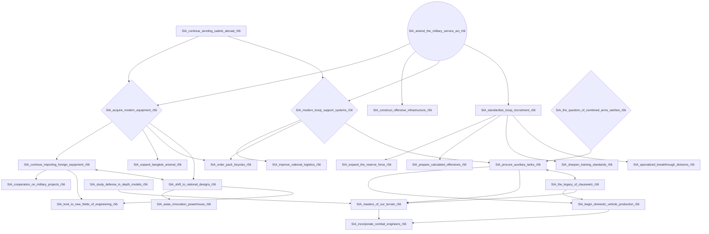
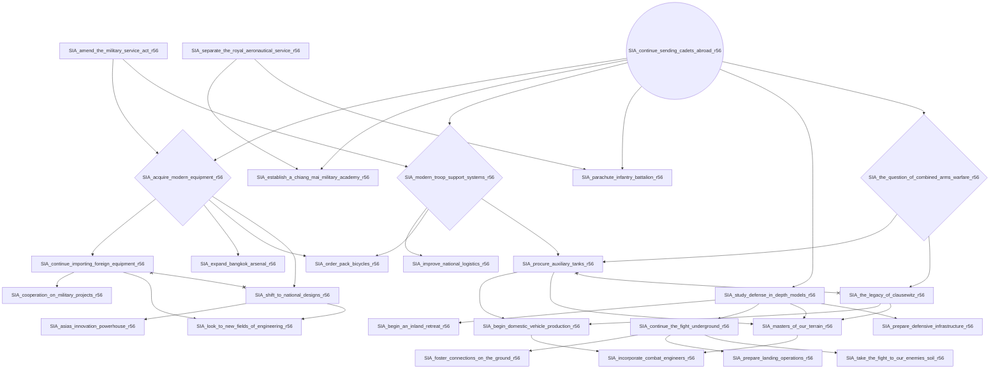
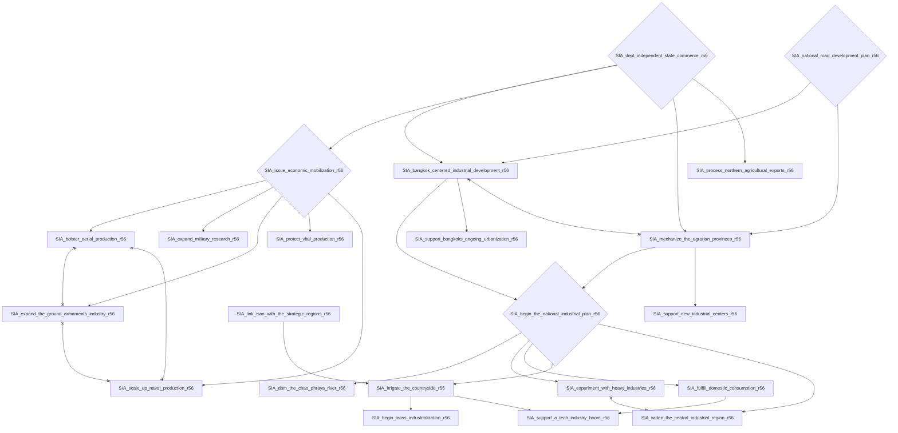
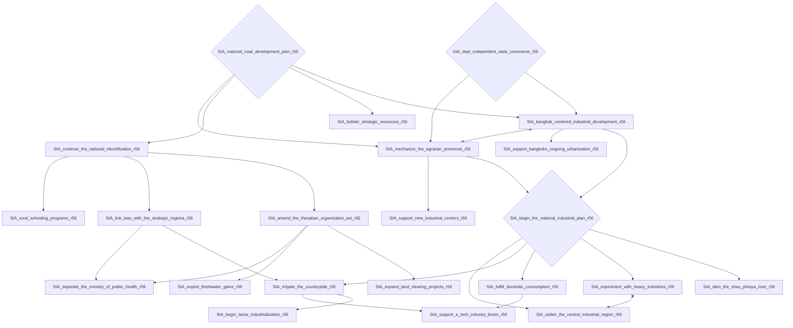
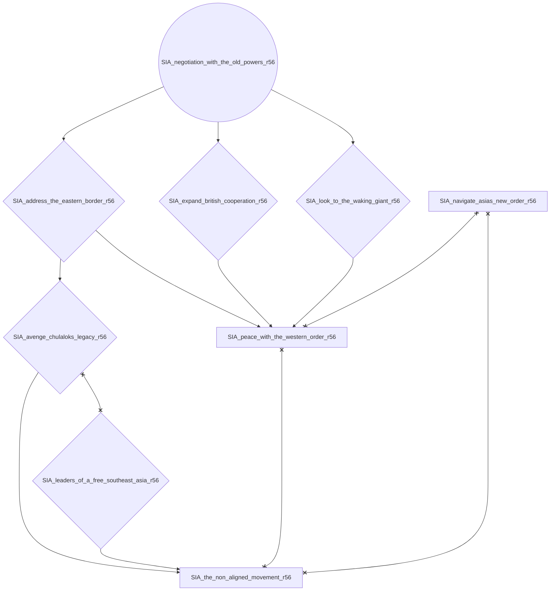
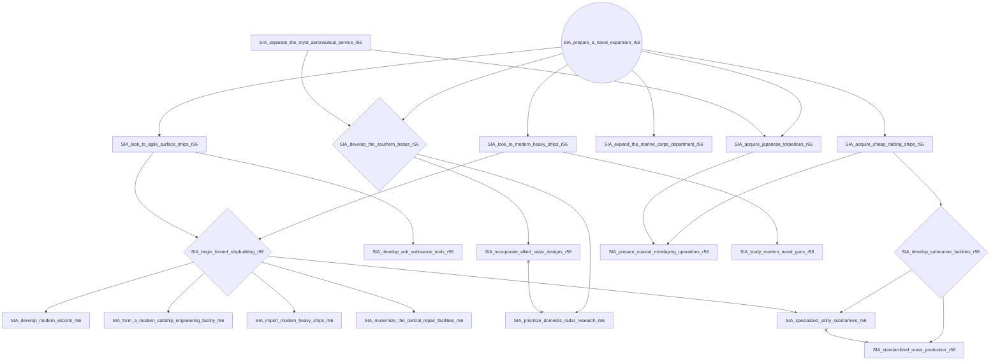
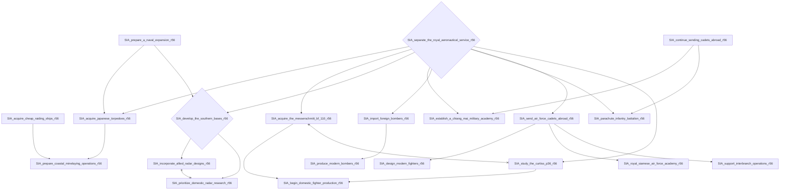
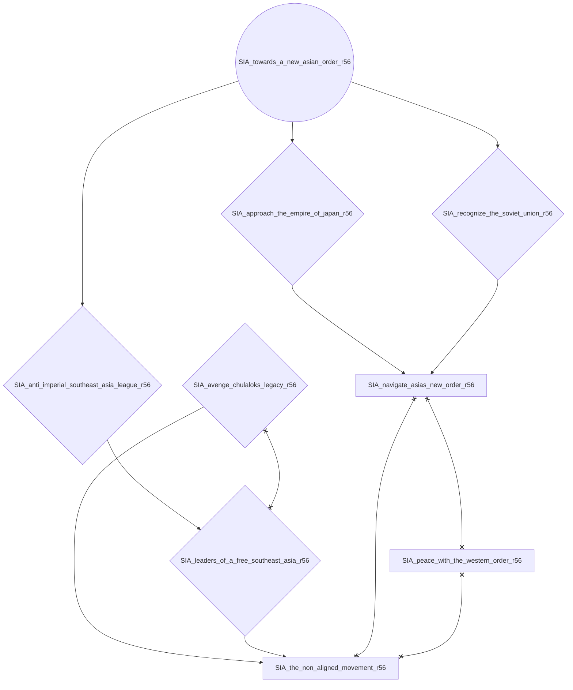

# SIA_address_rama_viis_abdication_r56

```mermaid
flowchart TD
    n1{"SIA_absorb_the_nationalist_movement_r56"}
    n2{"SIA_address_rama_viis_abdication_r56"}
    n3["SIA_address_the_need_for_reforms_r56"]
    n4["SIA_asias_liberal_firebrand_r56"]
    n5["SIA_bottom_up_societal_modernization_r56"]
    n6["SIA_build_a_modest_social_state_r56"]
    n7["SIA_build_rural_popular_support_r56"]
    n8["SIA_consolidate_the_peoples_assembly_r56"]
    n9["SIA_continue_the_democratic_transition_r56"]
    n10["SIA_crown_property_bureau_r56"]
    n11["SIA_deal_with_the_armed_forces_r56"]
    n12["SIA_disciplined_separate_army_r56"]
    n13["SIA_economy_of_national_defense_r56"]
    n14["SIA_elevate_the_special_branch_r56"]
    n15["SIA_enact_nationalist_policies_r56"]
    n16["SIA_end_foreign_subversion_r56"]
    n17{"SIA_end_the_constitutional_protection_act_r56"}
    n18["SIA_end_the_revolutionary_turbulence_r56"]
    n19["SIA_ensure_wartime_stability_r56"]
    n20{"SIA_equality_under_our_law_r56"}
    n21["SIA_escalate_industrial_policy_r56"]
    n22["SIA_everything_for_victory_r56"]
    n23["SIA_flexible_wartime_policies_r56"]
    n24["SIA_focus_on_economic_growth_r56"]
    n25{"SIA_forced_out_of_neutrality_r56"}
    n26["SIA_forge_a_democratic_legacy_r56"]
    n27["SIA_form_a_cult_of_personality_r56"]
    n28{"SIA_hold_national_elections_r56"}
    n29["SIA_improve_national_education_r56"]
    n30["SIA_improve_the_siamese_countryside_r56"]
    n31["SIA_industrial_workers_reforms_r56"]
    n32["SIA_iron_chancellor_of_the_east_r56"]
    n33["SIA_limit_wartime_activity_r56"]
    n34["SIA_limited_worker_protections_r56"]
    n35["SIA_maintain_the_fire_r56"]
    n36["SIA_military_first_policies_r56"]
    n37{"SIA_military_led_nation_building_r56"}
    n38["SIA_move_to_depoliticize_the_army_r56"]
    n39["SIA_national_cultural_preservation_act_r56"]
    n40["SIA_negotiate_a_mass_development_plan_r56"]
    n41["SIA_open_up_the_economy_r56"]
    n42{"SIA_opportunistic_militarization_r56"}
    n43{"SIA_phahon_steps_down_r56"}
    n44["SIA_phibuns_takeover_r56"]
    n45["SIA_prepare_a_defense_of_the_nation_r56"]
    n46["SIA_pridis_premiership_r56"]
    n47["SIA_prioritize_socioeconomic_progress_r56"]
    n48["SIA_promote_national_unity_r56"]
    n49["SIA_propagandize_our_rule_r56"]
    n50["SIA_propagandize_the_six_principles_r56"]
    n51{"SIA_protectors_of_the_old_order_r56"}
    n52["SIA_prove_thailands_worth_r56"]
    n53["SIA_push_for_universal_education_r56"]
    n54{"SIA_push_wichitwathakan_to_the_forefront_r56"}
    n55["SIA_redressment_for_the_june_coup_r56"]
    n56["SIA_refine_the_revolutionary_policies_r56"]
    n57{"SIA_remodel_the_fine_arts_department_r56"}
    n58{"SIA_respond_to_the_international_crisis_r56"}
    n59{"SIA_restore_the_honor_of_the_chakri_r56"}
    n60["SIA_restorer_of_thailands_power_and_modernity_r56"]
    n61["SIA_return_to_international_prestige_r56"]
    n62{"SIA_return_to_the_world_stage_r56"}
    n63["SIA_rewrite_the_1932_constitution_r56"]
    n64{"SIA_secure_the_armed_forces_r56"}
    n65["SIA_siamese_national_banking_bureau_r56"]
    n66["SIA_solidify_governmental_control_r56"]
    n67{"SIA_songsuradets_ascendency_r56"}
    n68["SIA_stability_centered_policies_r56"]
    n69["SIA_stabilize_our_economic_course_r56"]
    n70["SIA_stabilize_siams_political_woes_r56"]
    n71["SIA_steady_path_to_rural_development_r56"]
    n72["SIA_strengthen_business_ties_r56"]
    n73["SIA_strengthen_the_anti_communist_act_r56"]
    n74["SIA_strengthen_the_youth_corps_r56"]
    n75["SIA_the_question_of_the_regency_r56"]
    n76["SIA_tighten_the_dictatorship_r56"]
    n77["SIA_towards_a_great_thai_empire_r56"]
    n78["SIA_towards_national_autarky_r56"]
    n79["SIA_utilize_the_royal_opulence_r56"]
    n80["SIA_wartime_economic_policies_r56"]
    n81["SIA_weaken_the_feudalist_institutions_r56"]
    n64 --> n1
    n73 --> n3
    n28 --> n4
    n20 --> n4
    n47 --> n5
    n40 --> n6
    n2 --> n7
    n59 --> n8
    n59 --> n9
    n17 --> n10
    n46 --> n11
    n1 --> n12
    n1 --> n13
    n42 --> n14
    n66 --> n15
    n77 --> n15
    n52 --> n16
    n33 --> n16
    n2 --> n17
    n8 --> n18
    n54 --> n18
    n76 --> n19
    n62 --> n19
    n25 --> n19
    n11 --> n20
    n65 --> n21
    n52 --> n22
    n33 --> n23
    n9 --> n24
    n8 --> n24
    n42 --> n25
    n4 --> n26
    n66 --> n27
    n63 --> n28
    n17 --> n29
    n65 --> n30
    n47 --> n31
    n27 --> n32
    n25 --> n33
    n17 --> n34
    n28 --> n35
    n20 --> n35
    n21 --> n36
    n62 --> n36
    n25 --> n36
    n2 --> n37
    n2 --> n38
    n76 --> n39
    n67 --> n40
    n40 --> n41
    n73 --> n41
    n44 --> n42
    n7 --> n43
    n43 --> n44
    n11 --> n45
    n65 --> n45
    n43 --> n46
    n20 --> n47
    n58 --> n48
    n57 --> n49
    n37 --> n50
    n54 --> n51
    n51 --> n51
    n25 --> n52
    n62 --> n52
    n65 --> n53
    n1 --> n54
    n64 --> n55
    n64 --> n56
    n67 --> n57
    n46 --> n57
    n67 --> n58
    n46 --> n58
    n64 --> n59
    n27 --> n60
    n76 --> n60
    n58 --> n61
    n57 --> n61
    n42 --> n62
    n46 --> n63
    n67 --> n64
    n46 --> n65
    n44 --> n65
    n44 --> n66
    n43 --> n67
    n37 --> n68
    n73 --> n69
    n28 --> n70
    n40 --> n71
    n2 --> n72
    n67 --> n73
    n37 --> n74
    n63 --> n75
    n11 --> n75
    n81 --> n76
    n15 --> n76
    n44 --> n77
    n30 --> n78
    n21 --> n78
    n59 --> n79
    n58 --> n80
    n77 --> n81
    n4 x--x n47
    n8 x--x n9
    n8 x--x n54
    n9 x--x n54
    n12 x--x n51
    n25 x--x n62
    n33 x--x n52
    n34 x--x n72
    n38 x--x n74
    n40 x--x n73
    n44 x--x n46
    n44 x--x n67
    n46 x--x n67
    n48 x--x n49
    n55 x--x n56
```

# SIA_amend_the_military_service_act_r56

# SIA_continue_sending_cadets_abroad_r56

# SIA_dept_independent_state_commerce_r56

# SIA_national_road_development_plan_r56

# SIA_negotiation_with_the_old_powers_r56

# SIA_prepare_a_naval_expansion_r56

# SIA_separate_the_royal_aeronautical_service_r56

# SIA_towards_a_new_asian_order_r56

