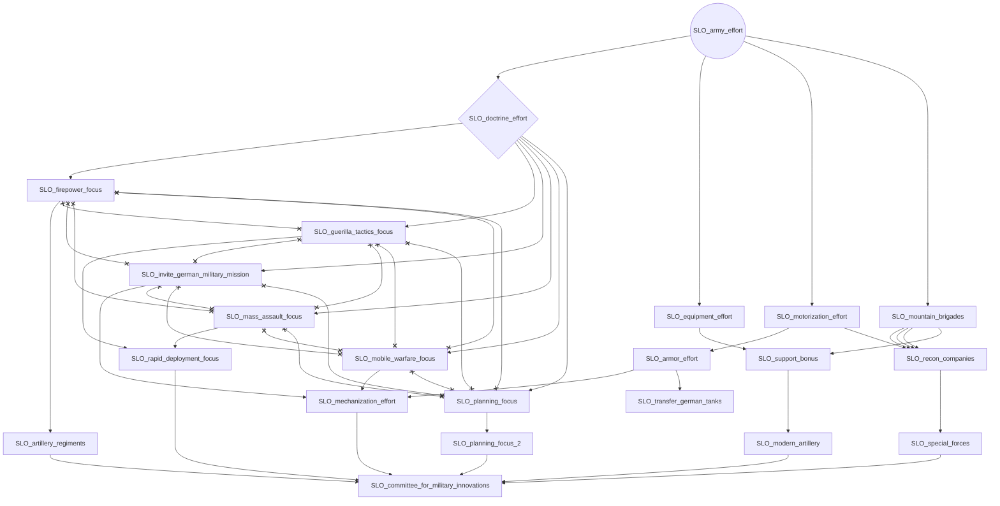
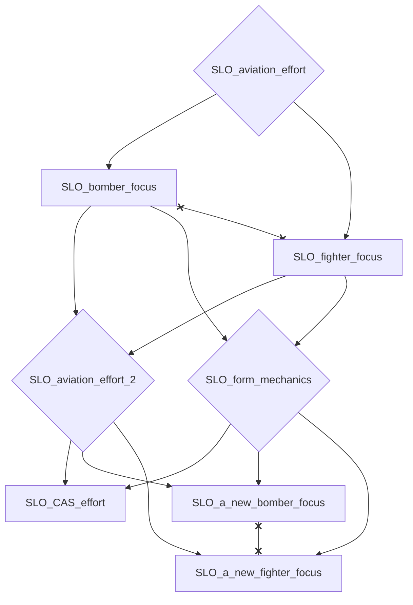
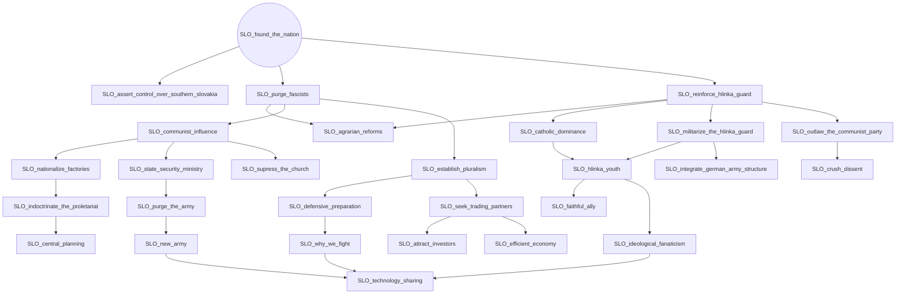
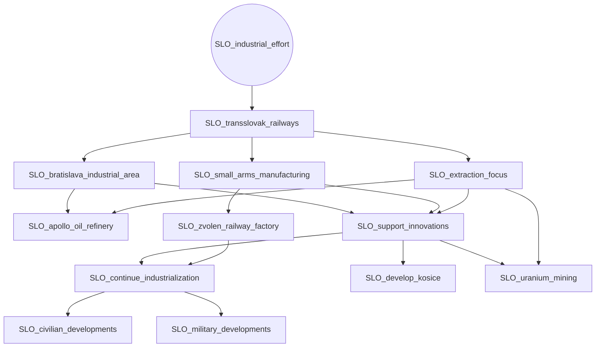
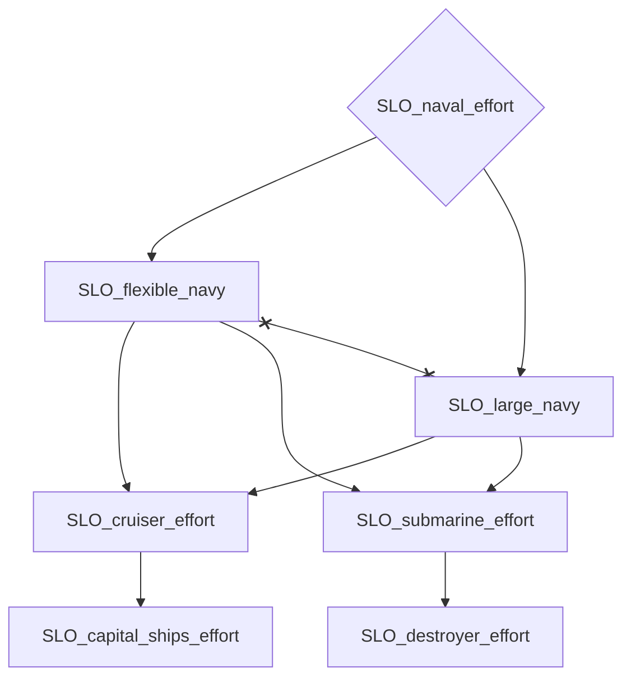

# SLO_army_effort

```mermaid
flowchart TD
    n1["SLO_armor_effort"]
    n2(("SLO_army_effort"))
    n3["SLO_artillery_regiments"]
    n4["SLO_committee_for_military_innovations"]
    n5{"SLO_doctrine_effort"}
    n6["SLO_equipment_effort"]
    n7["SLO_firepower_focus"]
    n8["SLO_guerilla_tactics_focus"]
    n9["SLO_invite_german_military_mission"]
    n10["SLO_mass_assault_focus"]
    n11["SLO_mechanization_effort"]
    n12["SLO_mobile_warfare_focus"]
    n13["SLO_modern_artillery"]
    n14["SLO_motorization_effort"]
    n15["SLO_mountain_brigades"]
    n16["SLO_planning_focus"]
    n17["SLO_planning_focus_2"]
    n18["SLO_rapid_deployment_focus"]
    n19["SLO_recon_companies"]
    n20["SLO_special_forces"]
    n21["SLO_support_bonus"]
    n22["SLO_transfer_german_tanks"]
    n14 --> n1
    n7 --> n3
    n20 --> n4
    n13 --> n4
    n17 --> n4
    n3 --> n4
    n11 --> n4
    n18 --> n4
    n2 --> n5
    n2 --> n6
    n5 --> n7
    n5 --> n8
    n5 --> n9
    n5 --> n10
    n1 --> n11
    n9 --> n11
    n12 --> n11
    n5 --> n12
    n21 --> n13
    n2 --> n14
    n2 --> n15
    n5 --> n16
    n16 --> n17
    n10 --> n18
    n8 --> n18
    n15 --> n19
    n14 --> n19
    n15 --> n19
    n15 --> n19
    n19 --> n20
    n6 --> n21
    n15 --> n21
    n1 --> n22
    n7 x--x n8
    n7 x--x n9
    n7 x--x n10
    n7 x--x n12
    n7 x--x n16
    n8 x--x n9
    n8 x--x n10
    n8 x--x n12
    n8 x--x n16
    n9 x--x n10
    n9 x--x n12
    n9 x--x n16
    n10 x--x n12
    n10 x--x n16
    n12 x--x n16
```

# SLO_aviation_effort

```mermaid
flowchart TD
    n23["SLO_CAS_effort"]
    n24["SLO_a_new_bomber_focus"]
    n25["SLO_a_new_fighter_focus"]
    n26{"SLO_aviation_effort"}
    n27{"SLO_aviation_effort_2"}
    n28["SLO_bomber_focus"]
    n29["SLO_fighter_focus"]
    n30{"SLO_form_mechanics"}
    n30 --> n23
    n27 --> n23
    n27 --> n24
    n30 --> n24
    n30 --> n25
    n27 --> n25
    n28 --> n27
    n29 --> n27
    n26 --> n28
    n26 --> n29
    n29 --> n30
    n28 --> n30
    n24 x--x n25
    n28 x--x n29
```

# SLO_found_the_nation

```mermaid
flowchart TD
    n31["SLO_agrarian_reforms"]
    n32["SLO_assert_control_over_southern_slovakia"]
    n33["SLO_attract_investors"]
    n34["SLO_catholic_dominance"]
    n35["SLO_central_planning"]
    n36["SLO_communist_influence"]
    n37["SLO_crush_dissent"]
    n38["SLO_defensive_preparation"]
    n39["SLO_efficient_economy"]
    n40["SLO_establish_pluralism"]
    n41["SLO_faithful_ally"]
    n42(("SLO_found_the_nation"))
    n43["SLO_hlinka_youth"]
    n44["SLO_ideological_fanaticism"]
    n45["SLO_indoctrinate_the_proletariat"]
    n46["SLO_integrate_german_army_structure"]
    n47["SLO_militarize_the_hlinka_guard"]
    n48["SLO_nationalize_factories"]
    n49["SLO_new_army"]
    n50["SLO_outlaw_the_communist_party"]
    n51["SLO_purge_fascists"]
    n52["SLO_purge_the_army"]
    n53["SLO_reinforce_hlinka_guard"]
    n54["SLO_seek_trading_partners"]
    n55["SLO_state_security_ministry"]
    n56["SLO_supress_the_church"]
    n57["SLO_technology_sharing"]
    n58["SLO_why_we_fight"]
    n51 --> n31
    n53 --> n31
    n42 --> n32
    n54 --> n33
    n53 --> n34
    n45 --> n35
    n51 --> n36
    n50 --> n37
    n40 --> n38
    n54 --> n39
    n51 --> n40
    n43 --> n41
    n47 --> n43
    n34 --> n43
    n43 --> n44
    n48 --> n45
    n47 --> n46
    n53 --> n47
    n36 --> n48
    n52 --> n49
    n53 --> n50
    n42 --> n51
    n55 --> n52
    n42 --> n53
    n40 --> n54
    n36 --> n55
    n36 --> n56
    n44 --> n57
    n58 --> n57
    n49 --> n57
    n38 --> n58
```

# SLO_industrial_effort

```mermaid
flowchart TD
    n59["SLO_apollo_oil_refinery"]
    n60["SLO_bratislava_industrial_area"]
    n61["SLO_civilian_developments"]
    n62["SLO_continue_industrialization"]
    n63["SLO_develop_kosice"]
    n64["SLO_extraction_focus"]
    n65(("SLO_industrial_effort"))
    n66["SLO_military_developments"]
    n67["SLO_small_arms_manufacturing"]
    n68["SLO_support_innovations"]
    n69["SLO_transslovak_railways"]
    n70["SLO_uranium_mining"]
    n71["SLO_zvolen_railway_factory"]
    n60 --> n59
    n64 --> n59
    n69 --> n60
    n62 --> n61
    n68 --> n62
    n71 --> n62
    n68 --> n63
    n69 --> n64
    n62 --> n66
    n69 --> n67
    n60 --> n68
    n67 --> n68
    n64 --> n68
    n65 --> n69
    n68 --> n70
    n64 --> n70
    n67 --> n71
```

# SLO_naval_effort

```mermaid
flowchart TD
    n72["SLO_capital_ships_effort"]
    n73["SLO_cruiser_effort"]
    n74["SLO_destroyer_effort"]
    n75["SLO_flexible_navy"]
    n76["SLO_large_navy"]
    n77{"SLO_naval_effort"}
    n78["SLO_submarine_effort"]
    n73 --> n72
    n76 --> n73
    n75 --> n73
    n78 --> n74
    n77 --> n75
    n77 --> n76
    n75 --> n78
    n76 --> n78
    n75 x--x n76
```
