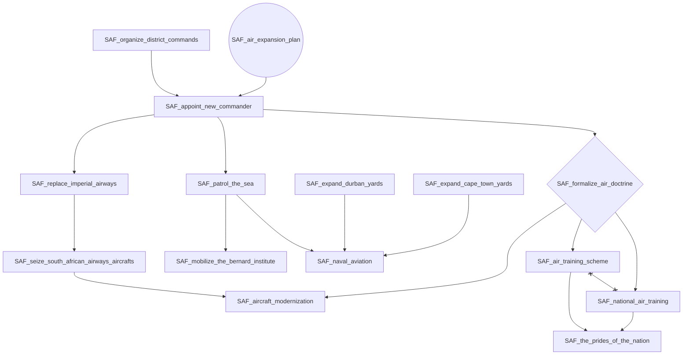
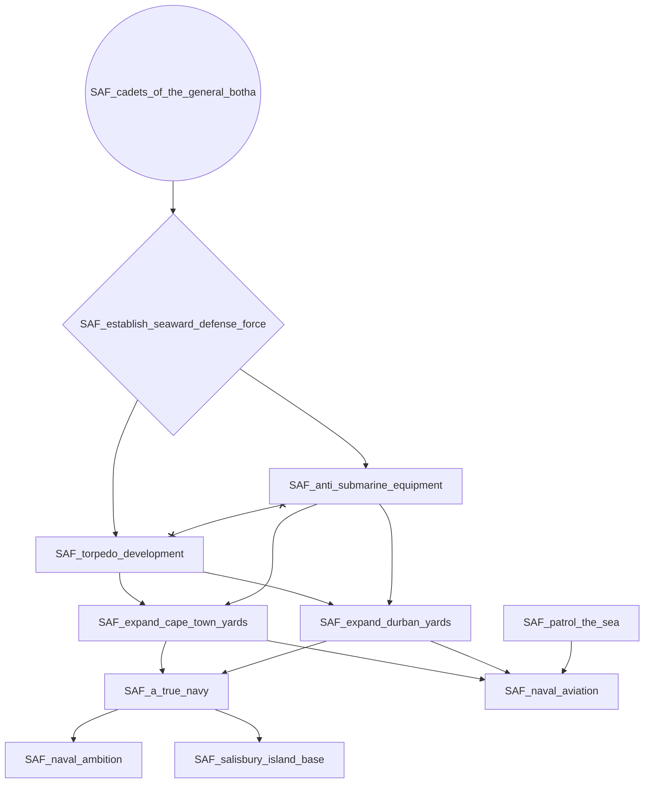
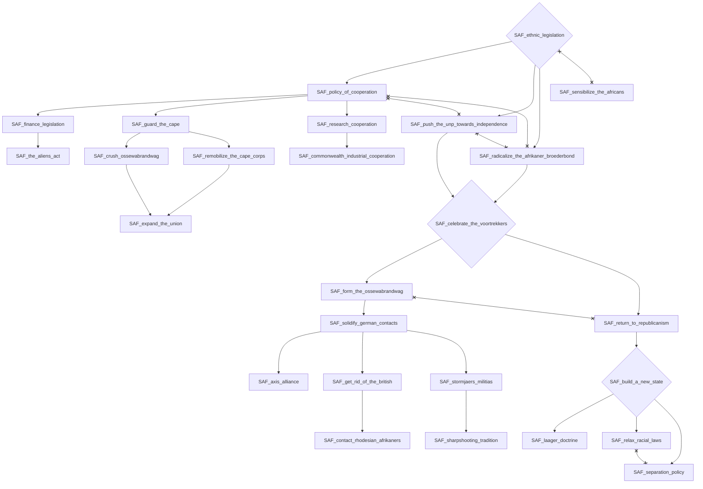
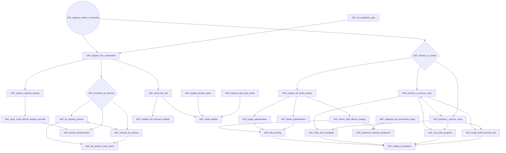
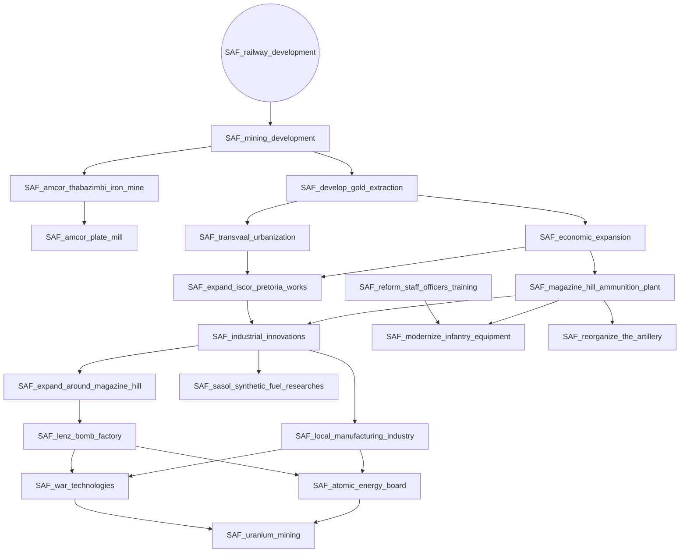
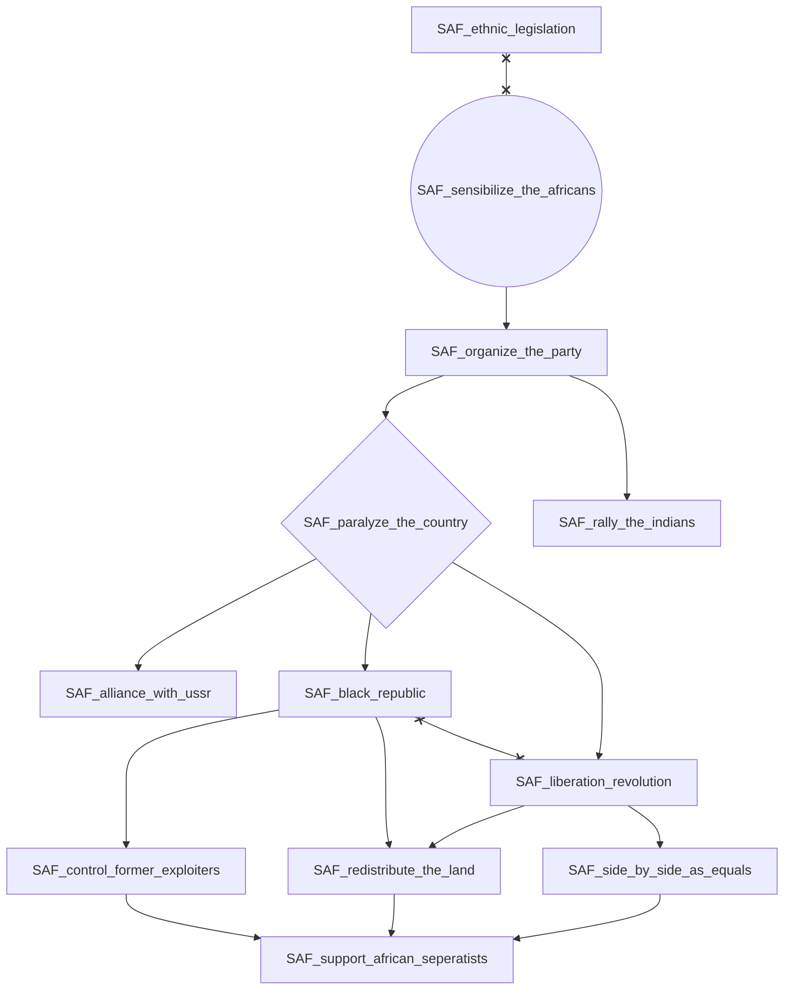

# SAF_air_expansion_plan

```mermaid
flowchart TD
    n1(("SAF_air_expansion_plan"))
    n2["SAF_air_training_scheme"]
    n3["SAF_aircraft_modernization"]
    n4["SAF_appoint_new_commander"]
    n5["SAF_expand_cape_town_yards"]
    n6["SAF_expand_durban_yards"]
    n7{"SAF_formalize_air_doctrine"}
    n8["SAF_mobilize_the_bernard_institute"]
    n9["SAF_national_air_training"]
    n10["SAF_naval_aviation"]
    n11["SAF_organize_district_commands"]
    n12["SAF_patrol_the_sea"]
    n13["SAF_replace_imperial_airways"]
    n14["SAF_seize_south_african_airways_aircrafts"]
    n15["SAF_the_prides_of_the_nation"]
    n7 --> n2
    n7 --> n3
    n14 --> n3
    n1 --> n4
    n11 --> n4
    n4 --> n7
    n12 --> n8
    n7 --> n9
    n5 --> n10
    n6 --> n10
    n12 --> n10
    n4 --> n12
    n4 --> n13
    n13 --> n14
    n9 --> n15
    n2 --> n15
    n2 x--x n9
```

# SAF_cadets_of_the_general_botha

```mermaid
flowchart TD
    n16["SAF_a_true_navy"]
    n17["SAF_anti_submarine_equipment"]
    n18(("SAF_cadets_of_the_general_botha"))
    n19{"SAF_establish_seaward_defense_force"}
    n5["SAF_expand_cape_town_yards"]
    n6["SAF_expand_durban_yards"]
    n20["SAF_naval_ambition"]
    n10["SAF_naval_aviation"]
    n12["SAF_patrol_the_sea"]
    n21["SAF_salisbury_island_base"]
    n22["SAF_torpedo_development"]
    n5 --> n16
    n6 --> n16
    n19 --> n17
    n18 --> n19
    n22 --> n5
    n17 --> n5
    n22 --> n6
    n17 --> n6
    n16 --> n20
    n5 --> n10
    n6 --> n10
    n12 --> n10
    n16 --> n21
    n19 --> n22
    n17 x--x n22
```

# SAF_ethnic_legislation

```mermaid
flowchart TD
    n23["SAF_axis_alliance"]
    n24{"SAF_build_a_new_state"}
    n25{"SAF_celebrate_the_voortrekkers"}
    n26["SAF_commonwealth_industrial_cooperation"]
    n27["SAF_contact_rhodesian_afrikaners"]
    n28["SAF_crush_ossewabrandwag"]
    n29{"SAF_ethnic_legislation"}
    n30["SAF_expand_the_union"]
    n31["SAF_finance_legislation"]
    n32["SAF_form_the_ossewabrandwag"]
    n33["SAF_get_rid_of_the_british"]
    n34["SAF_guard_the_cape"]
    n35["SAF_laager_doctrine"]
    n36["SAF_policy_of_cooperation"]
    n37["SAF_push_the_unp_towards_independence"]
    n38["SAF_radicalize_the_afrikaner_broederbond"]
    n39["SAF_relax_racial_laws"]
    n40["SAF_remobilize_the_cape_corps"]
    n41["SAF_research_cooperation"]
    n42["SAF_return_to_republicanism"]
    n43["SAF_sensibilize_the_africans"]
    n44["SAF_separation_policy"]
    n45["SAF_sharpshooting_tradition"]
    n46["SAF_solidify_german_contacts"]
    n47["SAF_stormjaers_militias"]
    n48["SAF_the_aliens_act"]
    n46 --> n23
    n42 --> n24
    n38 --> n25
    n37 --> n25
    n41 --> n26
    n33 --> n27
    n34 --> n28
    n40 --> n30
    n28 --> n30
    n36 --> n31
    n25 --> n32
    n46 --> n33
    n36 --> n34
    n24 --> n35
    n29 --> n36
    n29 --> n37
    n29 --> n38
    n24 --> n39
    n34 --> n40
    n36 --> n41
    n25 --> n42
    n24 --> n44
    n47 --> n45
    n32 --> n46
    n46 --> n47
    n31 --> n48
    n29 x--x n43
    n32 x--x n42
    n36 x--x n37
    n36 x--x n38
    n37 x--x n38
    n39 x--x n44
```

# SAF_organize_district_commands

```mermaid
flowchart TD
    n49["SAF_SAR_and_H_brigade"]
    n1["SAF_air_expansion_plan"]
    n2["SAF_air_training_scheme"]
    n3["SAF_aircraft_modernization"]
    n4["SAF_appoint_new_commander"]
    n50["SAF_desert_specialization"]
    n51["SAF_elite_training"]
    n5["SAF_expand_cape_town_yards"]
    n6["SAF_expand_durban_yards"]
    n7{"SAF_formalize_air_doctrine"}
    n52["SAF_jungle_specialization"]
    n53["SAF_local_tank_program"]
    n54["SAF_locally_built_armored_cars"]
    n55["SAF_magazine_hill_ammunition_plant"]
    n56["SAF_military_innovations"]
    n57{"SAF_mission_to_europe"}
    n8["SAF_mobilize_the_bernard_institute"]
    n58["SAF_modernize_infantry_equipment"]
    n9["SAF_national_air_training"]
    n10["SAF_naval_aviation"]
    n11(("SAF_organize_district_commands"))
    n12["SAF_patrol_the_sea"]
    n59["SAF_prepare_for_bush_warfare"]
    n60["SAF_prioritize_q_service_corps"]
    n61["SAF_prioritize_t_service_corps"]
    n62["SAF_reform_staff_officers_training"]
    n13["SAF_replace_imperial_airways"]
    n14["SAF_seize_south_african_airways_aircrafts"]
    n15["SAF_the_prides_of_the_nation"]
    n61 --> n49
    n60 --> n49
    n7 --> n2
    n7 --> n3
    n14 --> n3
    n1 --> n4
    n11 --> n4
    n59 --> n50
    n50 --> n51
    n52 --> n51
    n62 --> n51
    n4 --> n7
    n59 --> n52
    n61 --> n53
    n60 --> n53
    n61 --> n54
    n60 --> n54
    n54 --> n56
    n53 --> n56
    n49 --> n56
    n51 --> n56
    n11 --> n57
    n12 --> n8
    n62 --> n58
    n55 --> n58
    n7 --> n9
    n5 --> n10
    n6 --> n10
    n12 --> n10
    n4 --> n12
    n57 --> n59
    n57 --> n60
    n57 --> n61
    n59 --> n62
    n4 --> n13
    n13 --> n14
    n9 --> n15
    n2 --> n15
    n2 x--x n9
    n60 x--x n61
```

# SAF_railway_development

```mermaid
flowchart TD
    n63["SAF_amcor_plate_mill"]
    n64["SAF_amcor_thabazimbi_iron_mine"]
    n65["SAF_atomic_energy_board"]
    n66["SAF_develop_gold_extraction"]
    n67["SAF_economic_expansion"]
    n68["SAF_expand_around_magazine_hill"]
    n69["SAF_expand_iscor_pretoria_works"]
    n70["SAF_industrial_innovations"]
    n71["SAF_lenz_bomb_factory"]
    n72["SAF_local_manufacturing_industry"]
    n55["SAF_magazine_hill_ammunition_plant"]
    n73["SAF_mining_development"]
    n58["SAF_modernize_infantry_equipment"]
    n74(("SAF_railway_development"))
    n62["SAF_reform_staff_officers_training"]
    n75["SAF_reorganize_the_artillery"]
    n76["SAF_sasol_synthetic_fuel_researches"]
    n77["SAF_transvaal_urbanization"]
    n78["SAF_uranium_mining"]
    n79["SAF_war_technologies"]
    n64 --> n63
    n73 --> n64
    n71 --> n65
    n72 --> n65
    n73 --> n66
    n66 --> n67
    n70 --> n68
    n77 --> n69
    n67 --> n69
    n69 --> n70
    n55 --> n70
    n68 --> n71
    n70 --> n72
    n67 --> n55
    n74 --> n73
    n62 --> n58
    n55 --> n58
    n55 --> n75
    n70 --> n76
    n66 --> n77
    n79 --> n78
    n65 --> n78
    n71 --> n79
    n72 --> n79
```

# SAF_sensibilize_the_africans

```mermaid
flowchart TD
    n80["SAF_alliance_with_ussr"]
    n81["SAF_black_republic"]
    n82["SAF_control_former_exploiters"]
    n29["SAF_ethnic_legislation"]
    n83["SAF_liberation_revolution"]
    n84["SAF_organize_the_party"]
    n85{"SAF_paralyze_the_country"}
    n86["SAF_rally_the_indians"]
    n87["SAF_redistribute_the_land"]
    n43(("SAF_sensibilize_the_africans"))
    n88["SAF_side_by_side_as_equals"]
    n89["SAF_support_african_seperatists"]
    n85 --> n80
    n85 --> n81
    n81 --> n82
    n85 --> n83
    n43 --> n84
    n84 --> n85
    n84 --> n86
    n83 --> n87
    n81 --> n87
    n83 --> n88
    n87 --> n89
    n88 --> n89
    n82 --> n89
    n81 x--x n83
    n29 x--x n43
```
