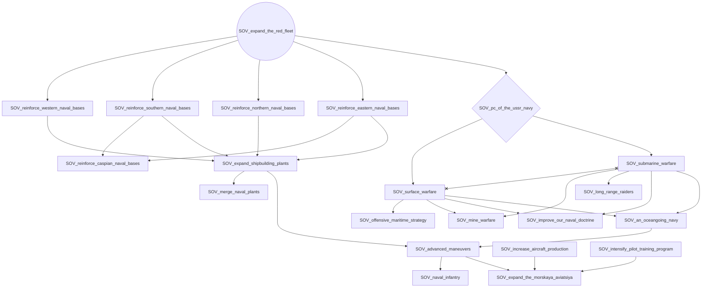
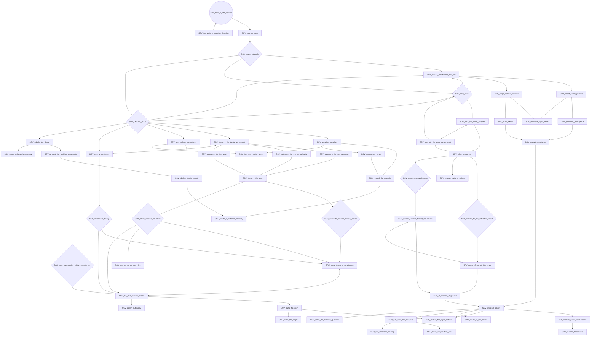
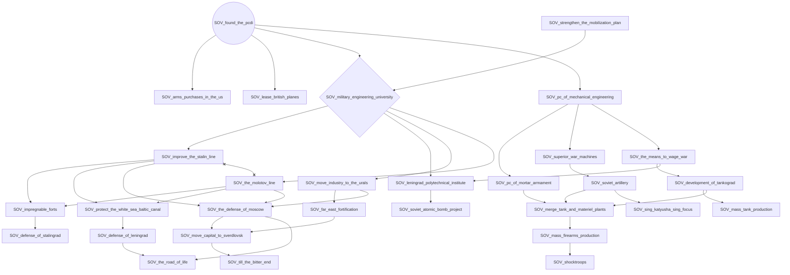
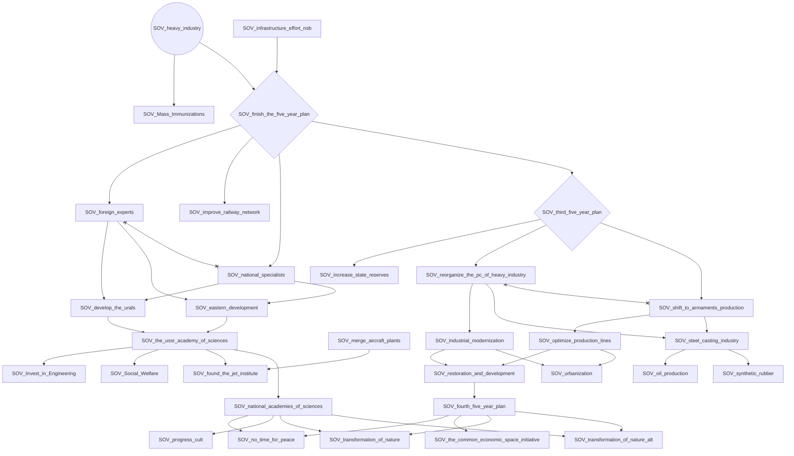
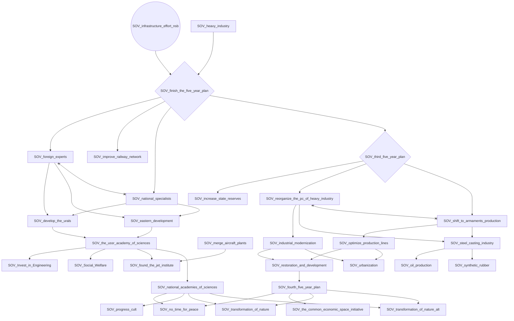
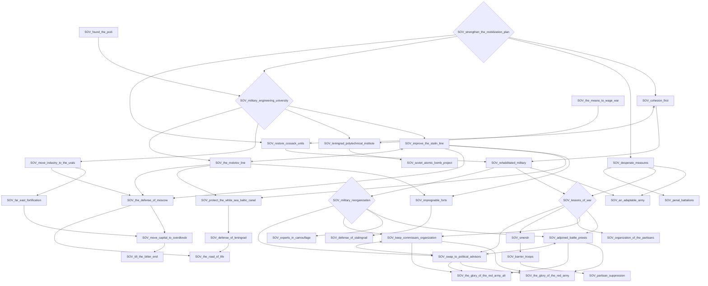
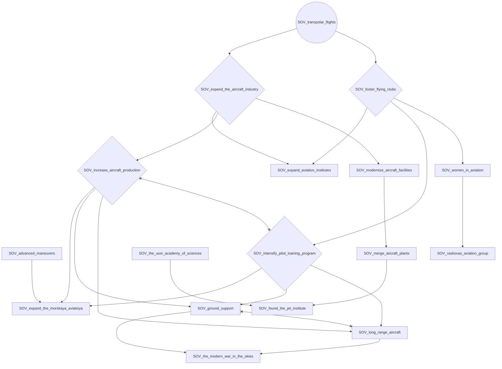

# SOV_beaten_but_not_defeated

```mermaid
flowchart TD
    n1["SOV_abolish_death_penalty_nsb"]
    n2["SOV_agrarian_socialism_nsb"]
    n3["SOV_amnesty_for_political_opponents_nsb"]
    n4["SOV_an_empire_in_the_pacific"]
    n5["SOV_approach_semyonov"]
    n6["SOV_aristocratic_investments"]
    n7["SOV_article_124"]
    n8["SOV_autonomy_for_the_caucasus_nsb"]
    n9["SOV_autonomy_for_the_central_asia_nsb"]
    n10["SOV_autonomy_for_the_west_nsb"]
    n11["SOV_baltic_freedom"]
    n12["SOV_baltic_freedom_nsb"]
    n13(("SOV_beaten_but_not_defeated"))
    n14["SOV_bringing_breakaways_back_to_the_fold"]
    n15["SOV_call_for_aid"]
    n16["SOV_capital_of_the_tsars"]
    n17{"SOV_church_candidates"}
    n18{"SOV_consolidate_power"}
    n19["SOV_covert_operations"]
    n20["SOV_create_a_national_directory_nsb"]
    n21{"SOV_deterrence_treaty"}
    n22{"SOV_deterrence_treaty_nsb"}
    n23["SOV_dismantle_the_zemsky_sobor"]
    n24["SOV_dissolve_the_treaty_agreement_nsb"]
    n25["SOV_dissolve_the_ussr_nsb"]
    n26{"SOV_eastern_expansion"}
    n27["SOV_embrace_the_black_hundreds"]
    n28{"SOV_evacuate_russian_military_assets_nsb"}
    n29["SOV_fascist_youth_union"]
    n30["SOV_form_solider_committees_nsb"]
    n31{"SOV_hold_emergency_elections"}
    n32["SOV_imperial_legacy"]
    n33["SOV_intervention_in_the_americas"]
    n34["SOV_into_central_asia"]
    n35["SOV_japanese_overtures"]
    n36["SOV_memories_of_1905"]
    n37["SOV_modernize_the_far_eastern_fleet"]
    n38["SOV_move_towards_isolationism"]
    n39["SOV_move_towards_isolationism_nsb"]
    n40["SOV_muster_the_old_guard"]
    n41["SOV_my_brothers_keeper"]
    n42["SOV_national_unification"]
    n43["SOV_new_union_treaty_nsb"]
    n44["SOV_offer_autonomy_to_former_soviet_republics"]
    n45["SOV_organize_wreckers"]
    n46["SOV_our_slavic_commitments"]
    n47["SOV_pacify_the_rim"]
    n48["SOV_panslavic_nationalism"]
    n49["SOV_polish_autonomy"]
    n50["SOV_polish_autonomy_nsb"]
    n51["SOV_purge_religous_beurocracy_nsb"]
    n52["SOV_rebuild_the_duma_nsb"]
    n53{"SOV_rebuild_the_far_eastern_fleet"}
    n54["SOV_rebuild_the_nation"]
    n55["SOV_rebuild_the_republic_nsb"]
    n56["SOV_rebuild_the_savior_cathedral"]
    n57{"SOV_reconvene_the_zemsky_sobor"}
    n58{"SOV_reformalize_the_role_of_the_patriarchate"}
    n59["SOV_reinstitute_okhrana"]
    n60["SOV_reinstitute_the_mestnichestvo"]
    n61["SOV_reopen_novodevichi"]
    n62["SOV_request_imperial_protection"]
    n63["SOV_restore_the_glory_of_the_motherland"]
    n64["SOV_restore_the_old_eastern_empire"]
    n65["SOV_restore_the_triple_entente"]
    n66["SOV_return_of_the_rocor"]
    n67{"SOV_return_russian_industries"}
    n68{"SOV_return_russian_industries_nsb"}
    n69["SOV_romanov_reconstruction"]
    n70["SOV_russian_corporate_state"]
    n71["SOV_sabotage_behind_enemy_lines"]
    n72{"SOV_secure_finland"}
    n73{"SOV_secure_the_baltics"}
    n74["SOV_siberian_forest_soldiers_focus"]
    n75["SOV_solidify_the_provisional_government"]
    n76["SOV_south_manchuria_railway"]
    n77["SOV_strike_the_eagle"]
    n78["SOV_strike_the_eagle_nsb"]
    n79["SOV_support_young_republics_nsb"]
    n80{"SOV_the_berlin_moscow_axis"}
    n81["SOV_the_declaration"]
    n82["SOV_the_eyes_fear"]
    n83["SOV_the_fate_of_romania"]
    n84["SOV_the_free_russian_people"]
    n85["SOV_the_free_russian_people_nsb"]
    n86["SOV_the_hands_do"]
    n87["SOV_the_iron_wall_of_russian_resolve"]
    n88["SOV_the_last_break_southward"]
    n89["SOV_the_lonely_island"]
    n90["SOV_the_new_russian_army_nsb"]
    n91{"SOV_the_old_enemy"}
    n92["SOV_the_path_of_marxism_leninism"]
    n93["SOV_the_rightful_heir_to_the_empire"]
    n94["SOV_the_synod"]
    n95["SOV_the_third_rome"]
    n96{"SOV_the_triple_entente"}
    n97["SOV_the_true_tsars"]
    n98["SOV_tolkachi"]
    n99["SOV_unification_of_the_exiles"]
    n100["SOV_vengeance_for_the_yoke"]
    n101["SOV_verkhovsky_funds_nsb"]
    n102["SOV_westward_bound"]
    n103["SOV_womens_fascist_movement"]
    n3 --> n1
    n30 --> n1
    n31 --> n2
    n52 --> n3
    n89 --> n4
    n27 --> n5
    n86 --> n6
    n13 --> n7
    n24 --> n8
    n24 --> n9
    n24 --> n10
    n84 --> n11
    n85 --> n12
    n18 --> n14
    n86 --> n15
    n69 --> n16
    n69 --> n17
    n23 --> n17
    n86 --> n18
    n45 --> n19
    n55 --> n20
    n1 --> n20
    n43 --> n22
    n57 --> n23
    n31 --> n24
    n10 --> n25
    n8 --> n25
    n9 --> n25
    n47 --> n26
    n23 --> n26
    n103 --> n27
    n97 --> n27
    n42 --> n27
    n25 --> n28
    n27 --> n29
    n31 --> n30
    n75 --> n31
    n26 --> n33
    n26 --> n34
    n80 --> n35
    n53 --> n36
    n53 --> n37
    n68 --> n39
    n28 --> n39
    n22 --> n39
    n27 --> n40
    n60 --> n41
    n96 --> n41
    n99 --> n42
    n31 --> n43
    n18 --> n44
    n40 --> n45
    n29 --> n45
    n96 --> n46
    n23 --> n47
    n69 --> n47
    n73 --> n48
    n72 --> n48
    n91 --> n48
    n84 --> n49
    n85 --> n50
    n52 --> n51
    n31 --> n52
    n47 --> n53
    n56 --> n54
    n2 --> n55
    n101 --> n55
    n61 --> n56
    n18 --> n57
    n58 --> n57
    n81 --> n58
    n82 --> n59
    n69 --> n60
    n7 --> n61
    n15 --> n62
    n56 --> n63
    n33 --> n64
    n11 --> n65
    n32 --> n65
    n81 --> n66
    n58 --> n66
    n25 --> n68
    n57 --> n69
    n23 --> n70
    n59 --> n71
    n102 --> n72
    n102 --> n73
    n27 --> n74
    n58 --> n75
    n18 --> n75
    n40 --> n76
    n29 --> n76
    n11 --> n77
    n12 --> n78
    n68 --> n79
    n47 --> n80
    n94 --> n81
    n98 --> n82
    n45 --> n82
    n76 --> n82
    n46 --> n83
    n48 --> n83
    n67 --> n84
    n28 --> n84
    n21 --> n84
    n68 --> n85
    n28 --> n85
    n22 --> n85
    n82 --> n86
    n60 --> n87
    n34 --> n88
    n36 --> n89
    n2 --> n90
    n30 --> n90
    n102 --> n91
    n17 --> n93
    n61 --> n94
    n93 --> n95
    n102 --> n96
    n69 --> n96
    n99 --> n97
    n40 --> n98
    n29 --> n98
    n13 --> n99
    n69 --> n100
    n23 --> n100
    n2 --> n101
    n69 --> n102
    n23 --> n102
    n99 --> n103
    n13 x--x n92
    n14 x--x n44
    n23 x--x n69
    n24 x--x n43
    n33 x--x n34
    n35 x--x n36
    n38 x--x n84
    n39 x--x n85
    n46 x--x n48
    n48 x--x n93
    n57 x--x n75
```

# SOV_expand_the_red_fleet

# SOV_form_a_fifth_column

# SOV_found_the_pcdi

# SOV_heavy_industry

# SOV_infrastructure_effort_nsb

# SOV_strengthen_the_mobilization_plan

# SOV_the_path_of_marxism_leninism

```mermaid
flowchart TD
    n251["SOV_a_cold_war"]
    n252["SOV_a_global_class_struggle"]
    n253["SOV_a_gun_in_every_hand"]
    n254["SOV_a_new_theory_of_revolution"]
    n255["SOV_a_sustainable_economy"]
    n256["SOV_addressing_internal_affairs"]
    n257["SOV_administrative_reforms"]
    n258["SOV_align_the_zinovyevites"]
    n259{"SOV_all_power_to_the_soviets"}
    n260["SOV_annex_tannu_tuva"]
    n261["SOV_anti_capitalist_policies"]
    n262["SOV_anti_fascist_policies"]
    n263["SOV_approach_germany"]
    n264["SOV_approach_primakov"]
    n265["SOV_approach_tukhachevsky"]
    n266["SOV_architect_of_communism"]
    n267["SOV_autonomous_soviet_republics"]
    n268["SOV_back_to_the_nep"]
    n269{"SOV_baltic_security"}
    n270["SOV_ban_excessive_hero_worship"]
    n13["SOV_beaten_but_not_defeated"]
    n271["SOV_begin_destalinization"]
    n272["SOV_behead_the_snake"]
    n273["SOV_brilliant_genius"]
    n274["SOV_bring_old_trotskyists_back"]
    n275["SOV_carry_revolution_east"]
    n276{"SOV_claim_on_bessarabia"}
    n277["SOV_claim_on_the_straits"]
    n278["SOV_claims_in_baltic"]
    n279{"SOV_claims_on_poland"}
    n280["SOV_clandestine_cells"]
    n281["SOV_collectivist_propaganda"]
    n282["SOV_committee_in_exile"]
    n283["SOV_concessions_to_foreign_powers"]
    n284["SOV_conduct_nationwide_inspections"]
    n285["SOV_control_scandinavia"]
    n286{"SOV_cooperation_against_stalin"}
    n287{"SOV_coup_detat"}
    n288["SOV_covert_support_for_spanish_poum"]
    n289{"SOV_curtailment_of_the_collective_farms"}
    n290["SOV_demand_balkan_submission"]
    n291["SOV_demand_eastern_poland"]
    n292["SOV_denounce_stalinist_crimes"]
    n293["SOV_depoliticize_the_military"]
    n294["SOV_development_aid_for_eastern_allies"]
    n295["SOV_dissent_in_the_party"]
    n296["SOV_divert_attention_towards_military"]
    n297["SOV_eliminate_the_left"]
    n298["SOV_end_the_khalkhin_gol_conflict"]
    n299["SOV_eradicate_western_fascism"]
    n300{"SOV_expand_the_agitprop"}
    n301["SOV_expand_western_spy_rings"]
    n302["SOV_extend_the_curtain_outwards"]
    n303["SOV_facilitate_a_balkan_federation"]
    n304["SOV_father_of_nations"]
    n305["SOV_for_the_common_good"]
    n306{"SOV_forge_new_future"}
    n142["SOV_form_a_fifth_column"]
    n307["SOV_fortify_mongolian_border"]
    n308["SOV_found_the_comecon"]
    n309{"SOV_found_the_warsaw_pact"}
    n310{"SOV_freedom_of_debate_unity_of_action"}
    n311["SOV_funds_for_the_cause"]
    n312{"SOV_gain_support_from_party_members"}
    n313["SOV_great_commander"]
    n314["SOV_ideological_propaganda"]
    n315{"SOV_incite_a_greek_revolution"}
    n316{"SOV_incorporate_local_organizations"}
    n317["SOV_infiltrate_the_nkvd"]
    n318{"SOV_inheritor_of_the_mantle_of_lenin"}
    n319["SOV_integrate_smirnovs_bloc"]
    n320["SOV_interest_in_cuba"]
    n321{"SOV_international_revolutionary_marxist_centre"}
    n322["SOV_international_union_of_soviet_republics"]
    n323["SOV_intervention_in_china"]
    n324["SOV_into_the_plateau"]
    n325{"SOV_invite_romania"}
    n326["SOV_iron_curtain"]
    n327{"SOV_leader_of_the_party_and_the_people"}
    n328["SOV_left_eliminate_right"]
    n329{"SOV_left_opposition_coup"}
    n330["SOV_left_purges"]
    n331["SOV_liberate_ryutin"]
    n332["SOV_liberation_of_the_european_proletariat"]
    n333["SOV_localized_quality_control"]
    n334{"SOV_long_live_the_workers_government"}
    n335["SOV_look_to_the_east"]
    n336{"SOV_middle_east_diplomacy"}
    n337["SOV_militarized_schools"]
    n338{"SOV_military_chairman"}
    n339["SOV_military_support"]
    n340["SOV_nkvd_primacy"]
    n341["SOV_offer_poland_protection"]
    n342["SOV_organization_centralization_discipline"]
    n343["SOV_organize_the_wreckers"]
    n344["SOV_organize_uprisings_in_the_country"]
    n345["SOV_overthrow_weak_king"]
    n346["SOV_paced_industrialization"]
    n347["SOV_patriarch_of_all_russia"]
    n348["SOV_planned_economy"]
    n349["SOV_policy_of_collective_security"]
    n350["SOV_policy_of_individual_security"]
    n351["SOV_positive_heroism"]
    n352["SOV_preemptive_invasion_of_iran"]
    n353{"SOV_prepare_a_war_with_japan"}
    n354["SOV_prepare_to_hunt_the_bear"]
    n355["SOV_pressure_finnish_government"]
    n356["SOV_proclaim_soviet_hegemony"]
    n357{"SOV_prolong_the_stalin_legacy"}
    n358["SOV_recalibration_of_quotas"]
    n359["SOV_reconcile_japan"]
    n360["SOV_recover_alaska"]
    n361["SOV_recover_the_kuril_islands"]
    n362["SOV_regional_development"]
    n363["SOV_rehabilitate_stalins_legacy"]
    n364["SOV_reigniting_the_revolutionary_spirit"]
    n365["SOV_respect_baltic_self_determination"]
    n366["SOV_restore_the_union"]
    n367["SOV_return_dalian"]
    n368["SOV_return_democracy_to_the_party"]
    n369{"SOV_reverse_the_collectivization_process"}
    n370["SOV_revive_the_stakhanovite_movement"]
    n371["SOV_right_purges"]
    n372["SOV_secure_leningrad"]
    n373["SOV_secure_the_administration"]
    n374["SOV_seek_a_defense_pact_with_the_allies"]
    n375["SOV_seek_balkan_cooperation"]
    n376["SOV_send_military_advisors_to_spain"]
    n377["SOV_sino_soviet_treaty"]
    n378["SOV_socialism_in_one_country"]
    n379["SOV_socialist_emulation"]
    n380["SOV_socialist_humanism"]
    n381["SOV_socialist_realism"]
    n382["SOV_soviet_japanese_pact_against_usa_focus"]
    n383["SOV_spheres_of_influence_in_china"]
    n384{"SOV_stalins_cult_of_personality"}
    n385["SOV_status_of_labour_unions"]
    n386["SOV_strengthen_heavy_industry"]
    n387["SOV_strengthen_the_trade_unions"]
    n388["SOV_strike_the_NKVD_positions"]
    n389["SOV_support_afghan_ideology"]
    n390["SOV_support_the_kuomintang"]
    n391["SOV_support_vietnamese_revolutionaries"]
    n392["SOV_sway_the_railway_workers"]
    n393["SOV_system_decentralization"]
    n394["SOV_take_out_tito"]
    n395["SOV_the_anti_soviet_trotskyist_center"]
    n396{"SOV_the_bloc_of_rights_and_trotskyites"}
    n397["SOV_the_builder_of_the_red_army"]
    n398["SOV_the_centre"]
    n399["SOV_the_collectivization_process"]
    n400{"SOV_the_comintern"}
    n401["SOV_the_construction_of_communism"]
    n402["SOV_the_end_of_the_imperialist_era"]
    n403["SOV_the_enemies_of_the_people"]
    n404{"SOV_the_faithful_servant_of_lenin"}
    n405["SOV_the_fight_for_the_pacific"]
    n406["SOV_the_fourth_international"]
    n407["SOV_the_gobi_gambit"]
    n408["SOV_the_khakimov_proposal"]
    n409["SOV_the_komsomol"]
    n410{"SOV_the_left_opposition"}
    n411["SOV_the_military_conspiracy"]
    n412{"SOV_the_need_for_policy_changes"}
    n413["SOV_the_new_soviet_woman"]
    n414["SOV_the_onslaught_on_colonialism"]
    n92{"SOV_the_path_of_marxism_leninism"}
    n415["SOV_the_peoples_revolution"]
    n416["SOV_the_permanent_revolution"]
    n417["SOV_the_plan_for_the_coup"]
    n418["SOV_the_power_of_the_peasantry"]
    n419{"SOV_the_right_opposition"}
    n420["SOV_the_socialist_bulwark"]
    n421["SOV_the_southern_thrust"]
    n422["SOV_the_stalin_constitution"]
    n423["SOV_the_supreme_soviet"]
    n424{"SOV_the_threat_from_the_land_of_the_rising_sun"}
    n425["SOV_the_trade_union_as_labor_organizer"]
    n426["SOV_the_vanguard_of_the_true_revolution"]
    n427["SOV_the_workers_dictatorship"]
    n428["SOV_the_zinovyevite_terrorist_center"]
    n429["SOV_they_will_know_fear"]
    n430["SOV_trotskyite_narrative"]
    n431["SOV_two_red_flags"]
    n432["SOV_ultimatum_to_greece"]
    n433["SOV_undermine_stalins_authority"]
    n434["SOV_victory_over_devastation"]
    n435["SOV_war_economy"]
    n436["SOV_war_heroes"]
    n437["SOV_war_measures_in_the_east"]
    n438["SOV_workers_of_the_world_unite"]
    n439["SOV_world_revolution"]
    n309 --> n251
    n416 --> n252
    n293 --> n253
    n289 --> n254
    n346 --> n255
    n92 --> n256
    n289 --> n257
    n286 --> n258
    n393 --> n259
    n437 --> n260
    n400 --> n261
    n349 --> n262
    n350 --> n263
    n261 --> n263
    n319 --> n264
    n319 --> n265
    n404 --> n266
    n327 --> n266
    n362 --> n267
    n289 --> n268
    n400 --> n269
    n404 --> n270
    n368 --> n271
    n411 --> n272
    n318 --> n273
    n410 --> n274
    n252 --> n275
    n279 --> n276
    n290 --> n277
    n375 --> n277
    n269 --> n278
    n365 --> n279
    n278 --> n279
    n344 --> n280
    n300 --> n281
    n406 --> n282
    n274 --> n282
    n369 --> n283
    n271 --> n284
    n372 --> n285
    n312 --> n286
    n295 --> n287
    n369 --> n288
    n287 --> n289
    n276 --> n290
    n325 --> n290
    n279 --> n291
    n306 --> n292
    n338 --> n292
    n397 --> n293
    n364 --> n293
    n400 --> n294
    n412 --> n295
    n410 --> n296
    n419 --> n296
    n412 --> n297
    n353 --> n298
    n374 --> n299
    n256 --> n300
    n326 --> n301
    n309 --> n302
    n315 --> n303
    n327 --> n304
    n316 --> n305
    n321 --> n305
    n310 --> n306
    n437 --> n307
    n377 --> n308
    n320 --> n308
    n303 --> n308
    n394 --> n308
    n345 --> n308
    n308 --> n309
    n354 --> n310
    n384 --> n310
    n265 --> n311
    n264 --> n311
    n282 --> n311
    n410 --> n312
    n419 --> n312
    n318 --> n313
    n327 --> n313
    n439 --> n314
    n326 --> n315
    n257 --> n316
    n254 --> n316
    n410 --> n317
    n419 --> n317
    n384 --> n318
    n410 --> n319
    n301 --> n320
    n254 --> n321
    n257 --> n321
    n348 --> n321
    n267 --> n322
    n431 --> n323
    n390 --> n323
    n407 --> n324
    n279 --> n325
    n299 --> n326
    n261 --> n326
    n290 --> n326
    n375 --> n326
    n291 --> n326
    n341 --> n326
    n318 --> n327
    n404 --> n327
    n410 --> n328
    n265 --> n329
    n264 --> n329
    n329 --> n330
    n286 --> n331
    n263 --> n332
    n386 --> n333
    n329 --> n334
    n354 --> n335
    n400 --> n336
    n409 --> n337
    n310 --> n338
    n410 --> n339
    n419 --> n339
    n256 --> n340
    n279 --> n341
    n399 --> n342
    n427 --> n342
    n410 --> n343
    n412 --> n344
    n315 --> n345
    n268 --> n346
    n436 --> n347
    n381 --> n347
    n268 --> n348
    n400 --> n349
    n400 --> n350
    n300 --> n351
    n389 --> n352
    n431 --> n353
    n390 --> n353
    n396 --> n354
    n326 --> n355
    n403 --> n356
    n310 --> n357
    n284 --> n358
    n400 --> n359
    n405 --> n360
    n353 --> n361
    n259 --> n362
    n338 --> n363
    n357 --> n363
    n334 --> n364
    n269 --> n365
    n400 --> n366
    n326 --> n367
    n286 --> n368
    n419 --> n369
    n351 --> n370
    n287 --> n371
    n365 --> n372
    n278 --> n372
    n428 --> n373
    n262 --> n374
    n276 --> n375
    n325 --> n375
    n400 --> n376
    n367 --> n377
    n398 --> n378
    n281 --> n379
    n434 --> n380
    n379 --> n381
    n359 --> n382
    n359 --> n383
    n396 --> n384
    n284 --> n385
    n397 --> n386
    n364 --> n386
    n259 --> n387
    n316 --> n387
    n292 --> n388
    n336 --> n389
    n424 --> n390
    n377 --> n391
    n410 --> n392
    n419 --> n392
    n397 --> n393
    n364 --> n393
    n315 --> n394
    n428 --> n395
    n411 --> n396
    n334 --> n397
    n92 --> n398
    n378 --> n399
    n373 --> n399
    n92 --> n400
    n384 --> n401
    n354 --> n401
    n414 --> n402
    n275 --> n402
    n321 --> n403
    n384 --> n404
    n306 --> n404
    n338 --> n404
    n357 --> n404
    n261 --> n405
    n410 --> n406
    n400 --> n407
    n374 --> n408
    n300 --> n409
    n92 --> n410
    n427 --> n411
    n419 --> n412
    n256 --> n413
    n252 --> n414
    n387 --> n415
    n329 --> n416
    n282 --> n416
    n433 --> n417
    n280 --> n417
    n287 --> n418
    n92 --> n419
    n288 --> n420
    n336 --> n421
    n398 --> n422
    n415 --> n423
    n400 --> n424
    n268 --> n425
    n329 --> n426
    n311 --> n426
    n395 --> n427
    n422 --> n428
    n384 --> n429
    n330 --> n430
    n424 --> n431
    n277 --> n432
    n344 --> n433
    n305 --> n434
    n342 --> n435
    n370 --> n436
    n294 --> n437
    n402 --> n438
    n416 --> n439
    n251 x--x n302
    n254 x--x n257
    n266 x--x n313
    n13 x--x n92
    n276 x--x n325
    n278 x--x n365
    n281 x--x n351
    n283 x--x n288
    n286 x--x n297
    n286 x--x n328
    n290 x--x n375
    n291 x--x n341
    n292 x--x n363
    n296 x--x n339
    n298 x--x n361
    n303 x--x n345
    n303 x--x n394
    n305 x--x n387
    n306 x--x n338
    n306 x--x n357
    n142 x--x n92
    n318 x--x n404
    n330 x--x n368
    n338 x--x n357
    n345 x--x n394
    n349 x--x n350
    n354 x--x n384
    n359 x--x n424
    n362 x--x n387
    n364 x--x n397
    n368 x--x n371
    n389 x--x n421
    n390 x--x n431
    n398 x--x n410
    n398 x--x n419
    n410 x--x n419
```

# SOV_transpolar_flights

