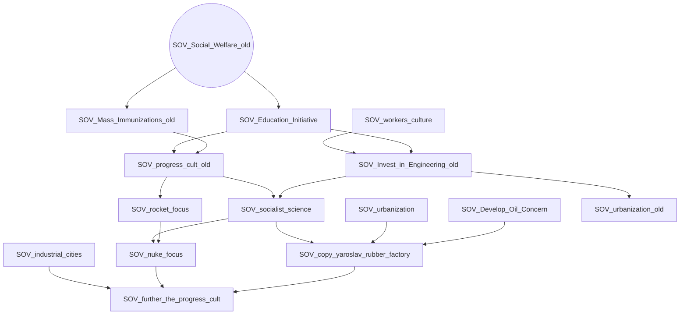
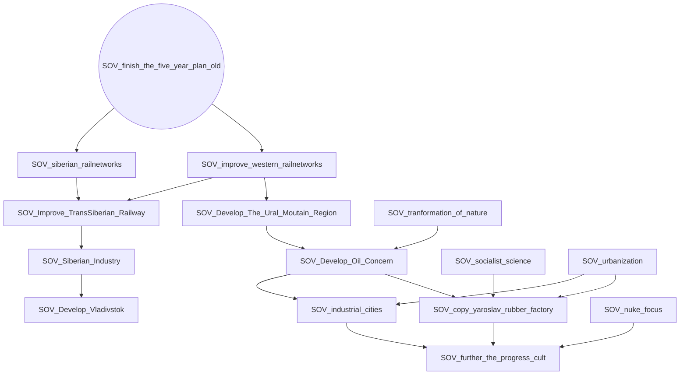
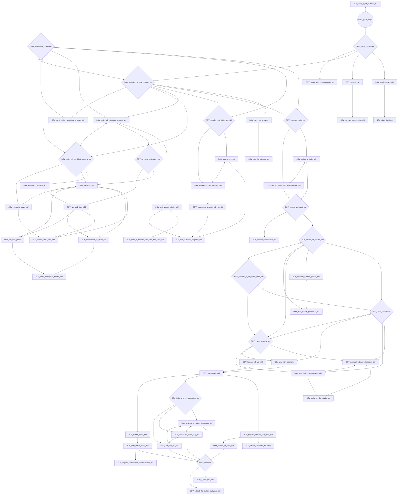
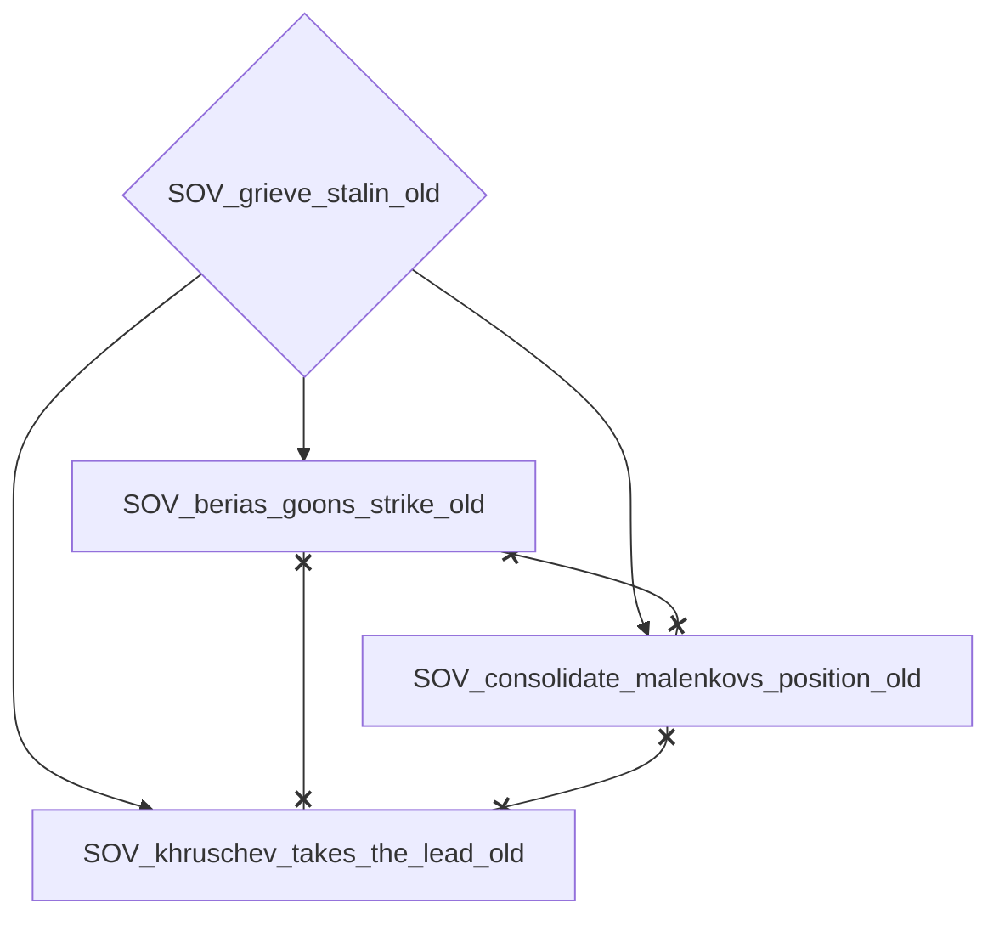
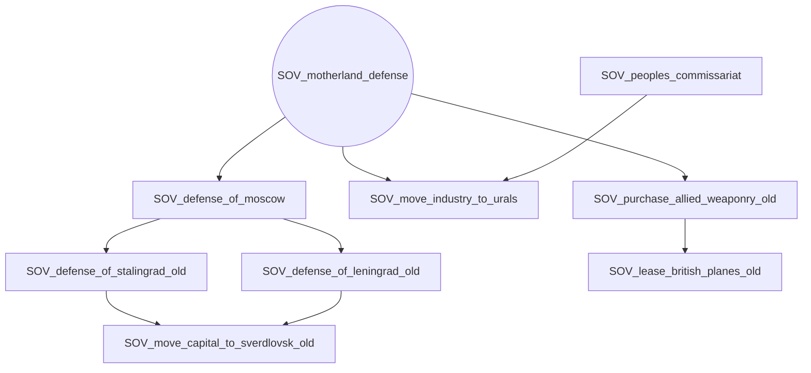
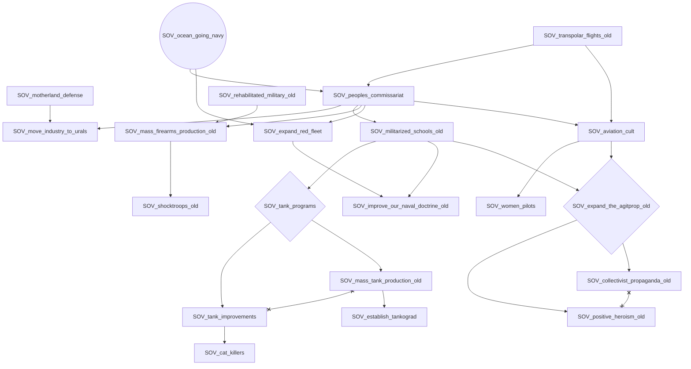
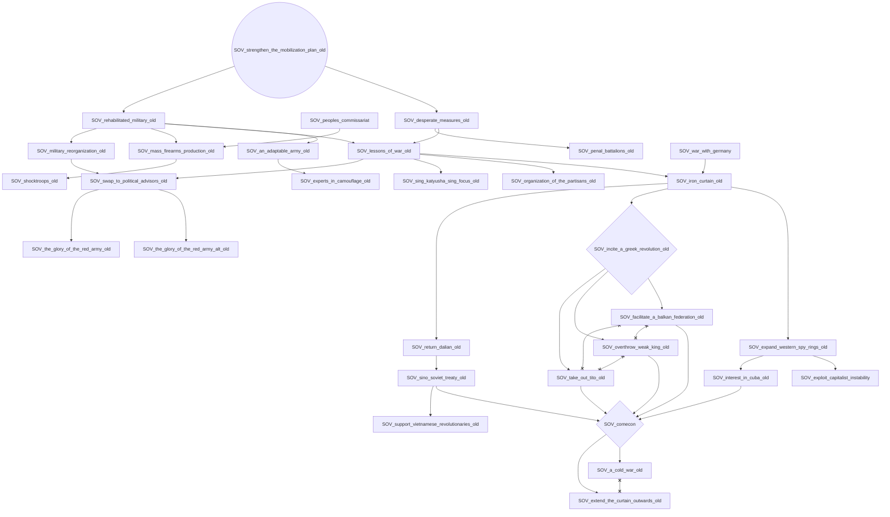
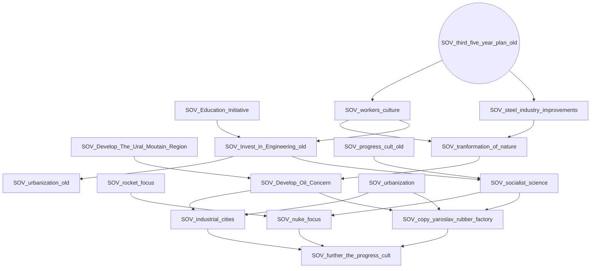
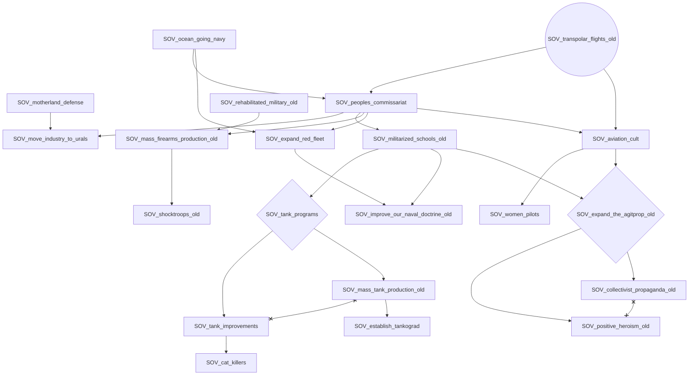

# SOV_Social_Welfare_old

# SOV_finish_the_five_year_plan_old

# SOV_form_a_fifth_column_old

```mermaid
flowchart TD
    n24["SOV_a_cold_war_old"]
    n25["SOV_abolish_death_penalty_old"]
    n26["SOV_accept_constituion_old"]
    n27["SOV_adopt_soviet_policies_old"]
    n28["SOV_agrarian_socialism_old"]
    n29["SOV_all_russian_alligences_old"]
    n30["SOV_amnesty_for_political_opponents_old"]
    n31["SOV_annex_tannu_tuva_old"]
    n32["SOV_anti_colonialist_rebels"]
    n33["SOV_anti_fascist_policies_old"]
    n34["SOV_approach_germany_old"]
    n35["SOV_baltic_freedom_old"]
    n36["SOV_begin_destalinization_old"]
    n37["SOV_carry_revolution_east_old"]
    n38{"SOV_claim_bessarabia"}
    n39["SOV_claim_on_the_straits_old"]
    n40["SOV_claims_in_baltic_old"]
    n41{"SOV_claims_on_poland_old"}
    n42{"SOV_comecon"}
    n43{"SOV_commit_to_the_orthodox_church_old"}
    n44["SOV_conduct_nationwide_inspections_old"]
    n45["SOV_control_scandinavia_old"]
    n46["SOV_counter_coup_old"]
    n47["SOV_create_a_national_directory_old"]
    n48["SOV_crush_our_eastern_rival_old"]
    n49["SOV_cultural_autonomy_old"]
    n50["SOV_demand_balkan_submission_old"]
    n51["SOV_demand_eastern_poland_old"]
    n52["SOV_expand_western_spy_rings_old"]
    n53["SOV_exploit_capitalist_instability"]
    n54["SOV_extend_the_curtain_outwards_old"]
    n55["SOV_facilitate_a_balkan_federation_old"]
    n56{"SOV_far_east_fortification_old"}
    n57["SOV_follow_corportism_old"]
    n58{"SOV_form_a_fifth_column_old"}
    n59["SOV_form_solider_committees_old"]
    n60["SOV_form_the_white_emigres_old"]
    n61["SOV_fortify_mongolian_border_old"]
    n62["SOV_great_purge"]
    n63["SOV_ideological_propaganda_old"]
    n64{"SOV_imperial_legacy_old"}
    n65["SOV_impose_national_unions_old"]
    n66{"SOV_improve_stalin_line"}
    n67["SOV_in_the_name_of_the_czar_old"]
    n68{"SOV_incite_a_greek_revolution_old"}
    n69["SOV_increased_autonomy"]
    n70["SOV_industrial_strategy"]
    n71["SOV_initial_reforms"]
    n72["SOV_interest_in_cuba_old"]
    n73["SOV_intervention_in_china_old"]
    n74{"SOV_invite_romania_old"}
    n75["SOV_iron_curtain_old"]
    n76["SOV_lessons_of_war_old"]
    n77["SOV_localized_quality_control_old"]
    n78{"SOV_middle_east_diplomacy_old"}
    n79{"SOV_new_vozhd_old"}
    n80["SOV_offer_poland_protection_old"]
    n81["SOV_operation_zet"]
    n82["SOV_orthadox_resurgance_old"]
    n83["SOV_our_american_holding_old"]
    n84["SOV_overthrow_weak_king_old"]
    n85["SOV_peoples_virtue_old"]
    n86{"SOV_permanent_revolution"}
    n87["SOV_policy_of_collective_security_old"]
    n88{"SOV_policy_of_individual_security_old"}
    n89{"SOV_polish_autonomy_old"}
    n90{"SOV_power_struggle_old"}
    n91["SOV_preemptive_invasion_of_iran_old"]
    n92["SOV_promote_the_asno_detachment_old"]
    n93["SOV_purge_religous_beurocracy_old"]
    n94["SOV_purge_splinter_factions_old"]
    n95["SOV_recalibration_of_quotas"]
    n96["SOV_recalibration_of_quotas_old"]
    n97["SOV_reclaim_bessarabia_old"]
    n98["SOV_reclaim_polish_overlordship_old"]
    n99["SOV_reconcile_japan_old"]
    n100["SOV_reinstate_royal_exiles_old"]
    n101{"SOV_reject_cosmopolitanism_old"}
    n102["SOV_respect_baltic_self_determination_old"]
    n103["SOV_restore_the_triple_entente_old"]
    n104["SOV_return_dalian_old"]
    n105["SOV_return_to_the_baltics_old"]
    n106["SOV_rule_over_the_mongols_old"]
    n107["SOV_russian_women_fascist_movement_old"]
    n108{"SOV_secure_leningrad_old"}
    n109["SOV_seek_a_defense_pact_with_the_allies_old"]
    n110["SOV_seek_balkan_cooperation_old"]
    n111["SOV_send_military_advisors_to_spain_old"]
    n112["SOV_sino_soviet_treaty_old"]
    n113["SOV_slavic_brotherhood"]
    n114{"SOV_socialism_in_one_country_old"}
    n115["SOV_solidify_internal_control"]
    n116["SOV_solve_the_karelian_question_old"]
    n117["SOV_southern_thrust"]
    n118{"SOV_state_of_perpetual_warfare"}
    n119["SOV_status_of_labour_unions_old"]
    n120["SOV_strike_the_eagle_old"]
    n121["SOV_support_afghan_ideology_old"]
    n122["SOV_support_vietnamese_revolutionaries_old"]
    n123["SOV_take_out_tito_old"]
    n124["SOV_the_end_of_the_imperialist_era_old"]
    n125["SOV_the_free_russian_people_old"]
    n126["SOV_the_khakimov_proposal_old"]
    n127["SOV_the_onslaught_on_colonialism_old"]
    n128["SOV_trotskyite_narrative_old"]
    n129{"SOV_trotskyite_victory"}
    n130["SOV_two_red_flags_old"]
    n131["SOV_union_of_fascist_little_ones_old"]
    n132["SOV_war_with_germany"]
    n133["SOV_war_with_japan"]
    n134["SOV_white_exiles_old"]
    n135{"SOV_workers_of_the_world_unite_old"}
    n136["SOV_world_revolution_old"]
    n42 --> n24
    n30 --> n25
    n59 --> n25
    n82 --> n26
    n134 --> n26
    n67 --> n27
    n30 --> n28
    n59 --> n28
    n131 --> n29
    n107 --> n29
    n85 --> n30
    n81 --> n31
    n99 --> n31
    n130 --> n31
    n63 --> n32
    n128 --> n32
    n87 --> n33
    n88 --> n34
    n125 --> n35
    n70 --> n36
    n32 --> n37
    n41 --> n38
    n135 --> n38
    n50 --> n39
    n110 --> n39
    n66 --> n40
    n108 --> n41
    n112 --> n42
    n72 --> n42
    n55 --> n42
    n123 --> n42
    n84 --> n42
    n57 --> n43
    n70 --> n44
    n108 --> n45
    n58 --> n46
    n28 --> n47
    n25 --> n47
    n49 --> n47
    n106 --> n48
    n30 --> n49
    n59 --> n49
    n38 --> n50
    n74 --> n50
    n41 --> n51
    n75 --> n52
    n52 --> n53
    n42 --> n54
    n68 --> n55
    n87 --> n56
    n92 --> n57
    n60 --> n57
    n85 --> n59
    n79 --> n60
    n73 --> n61
    n133 --> n61
    n136 --> n63
    n36 --> n63
    n26 --> n64
    n29 --> n64
    n57 --> n65
    n86 --> n66
    n114 --> n66
    n90 --> n67
    n75 --> n68
    n125 --> n69
    n71 --> n70
    n115 --> n70
    n129 --> n71
    n52 --> n72
    n130 --> n73
    n81 --> n73
    n41 --> n74
    n135 --> n74
    n76 --> n75
    n132 --> n75
    n95 --> n77
    n128 --> n77
    n86 --> n78
    n114 --> n78
    n90 --> n79
    n41 --> n80
    n56 --> n81
    n88 --> n81
    n27 --> n82
    n106 --> n83
    n68 --> n84
    n90 --> n85
    n129 --> n86
    n114 --> n87
    n86 --> n87
    n114 --> n88
    n86 --> n88
    n125 --> n89
    n46 --> n90
    n121 --> n91
    n79 --> n92
    n28 --> n93
    n25 --> n93
    n49 --> n93
    n67 --> n94
    n44 --> n96
    n119 --> n96
    n98 --> n97
    n64 --> n98
    n88 --> n99
    n27 --> n100
    n94 --> n100
    n57 --> n101
    n66 --> n102
    n89 --> n103
    n64 --> n103
    n75 --> n104
    n64 --> n105
    n64 --> n106
    n101 --> n107
    n102 --> n108
    n40 --> n108
    n33 --> n109
    n38 --> n110
    n74 --> n110
    n114 --> n111
    n86 --> n111
    n104 --> n112
    n64 --> n113
    n89 --> n113
    n129 --> n115
    n64 --> n116
    n78 --> n117
    n136 --> n118
    n70 --> n119
    n89 --> n120
    n64 --> n120
    n78 --> n121
    n112 --> n122
    n68 --> n123
    n127 --> n124
    n37 --> n124
    n47 --> n125
    n93 --> n125
    n33 --> n126
    n117 --> n126
    n91 --> n126
    n32 --> n127
    n36 --> n128
    n44 --> n128
    n58 --> n129
    n56 --> n130
    n43 --> n131
    n38 --> n132
    n74 --> n132
    n81 --> n133
    n130 --> n133
    n94 --> n134
    n118 --> n135
    n86 --> n136
    n24 x--x n54
    n38 x--x n74
    n40 x--x n102
    n41 x--x n135
    n46 x--x n129
    n50 x--x n110
    n51 x--x n80
    n55 x--x n84
    n55 x--x n123
    n58 x--x n62
    n60 x--x n92
    n67 x--x n79
    n67 x--x n85
    n79 x--x n85
    n81 x--x n99
    n81 x--x n130
    n84 x--x n123
    n86 x--x n114
    n87 x--x n88
    n98 x--x n113
    n107 x--x n131
    n117 x--x n121
```

# SOV_great_purge

# SOV_grieve_stalin_old

# SOV_motherland_defense

# SOV_ocean_going_navy

# SOV_strengthen_the_mobilization_plan_old

# SOV_third_five_year_plan_old

# SOV_transpolar_flights_old

