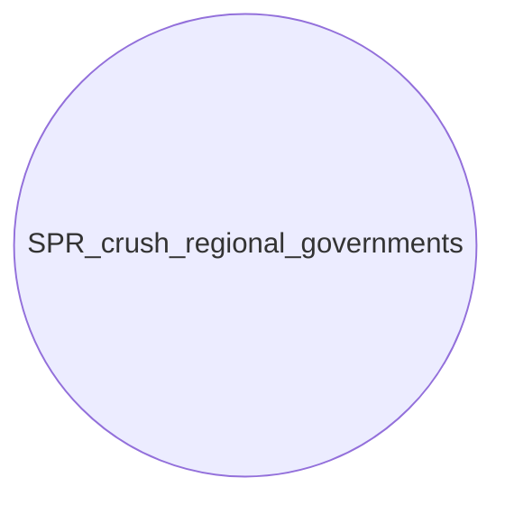

# SPA_a_great_spain

```mermaid
flowchart TD
    n1["SPA_a_fleet_worthy_of_a_king"]
    n2["SPA_a_great_maritime_power"]
    n3(("SPA_a_great_spain"))
    n4["SPA_a_methodical_approach"]
    n5["SPA_a_modern_fighter_fleet"]
    n6["SPA_a_one_party_state"]
    n7["SPA_absorb_carlist_remnants"]
    n8["SPA_absorb_the_portuguese_empire"]
    n9{"SPA_adopt_the_26_points"}
    n10["SPA_all_shall_serve"]
    n11["SPA_alliance_with_the_kaiserreich"]
    n12{"SPA_ally_the_french"}
    n13["SPA_an_armored_corps"]
    n14["SPA_arms_modernization"]
    n15["SPA_artillery_modernization"]
    n16["SPA_autarky"]
    n17["SPA_banish_the_party_leaders"]
    n18["SPA_battle_rites"]
    n19["SPA_bolster_offensive_infrastructure"]
    n20["SPA_capitalist_economic_aid"]
    n21["SPA_carlist_diplomacy"]
    n22["SPA_caudillo_of_spain"]
    n23["SPA_claim_the_andorran_throne"]
    n24["SPA_claim_the_aragonese_possessions"]
    n25["SPA_claim_the_french_throne"]
    n26["SPA_claim_west_africa"]
    n27["SPA_commerce_protection"]
    n28{"SPA_con_paquito"}
    n29["SPA_confirm_the_fueros"]
    n30["SPA_consolidate_the_north"]
    n31["SPA_contact_the_union_militar_espanola"]
    n32["SPA_cultivate_fanaticism"]
    n33["SPA_defenders_of_catholicism"]
    n34["SPA_defenses_against_invasion"]
    n35["SPA_defenses_against_strategic_bombing"]
    n36["SPA_demand_french_north_africa"]
    n37["SPA_develop_all_talent"]
    n38["SPA_dictator_for_life"]
    n39["SPA_dios_patria_rey"]
    n40["SPA_direct_the_universities"]
    n41["SPA_doctrinal_advancements"]
    n42["SPA_domestic_industrial_developments"]
    n43["SPA_eliminate_the_carlists"]
    n44["SPA_embrace_pan_hispanism"]
    n45["SPA_embrace_the_spanish_destiny"]
    n46["SPA_emergency_munitions_corporations"]
    n47["SPA_encourage_local_industrialization"]
    n48["SPA_encourage_local_mining"]
    n49["SPA_ensure_agricultural_self_sufficiency"]
    n50["SPA_equip_the_new_armada"]
    n51["SPA_equipment_modernization"]
    n52["SPA_equipment_shipments"]
    n53["SPA_establish_the_directory"]
    n54["SPA_exemplify_the_art_and_science_of_warfare"]
    n55["SPA_expand_conscription"]
    n56{"SPA_expand_spanish_bases"}
    n57["SPA_expand_the_air_branch"]
    n58["SPA_expand_the_axis_gold_trade"]
    n59["SPA_expand_the_requetes"]
    n60["SPA_expand_the_slipways"]
    n61["SPA_expand_the_special_forces"]
    n62["SPA_expand_the_war_industry"]
    n63["SPA_extol_the_martyrs_of_the_war"]
    n64["SPA_facilitate_pyrenees_freight_transports"]
    n65["SPA_fascist_economic_aid"]
    n66["SPA_foment_a_carlist_split"]
    n67["SPA_found_the_academia_vazquez_de_mella"]
    n68{"SPA_fuse_the_parties"}
    n69["SPA_glory_and_wealth_on_the_sea_lanes"]
    n70["SPA_hand_over_the_ceda_campaign_chest"]
    n71["SPA_head_the_junta_nacional"]
    n72["SPA_imperial_security"]
    n73["SPA_improve_cross_country_railways"]
    n74["SPA_improve_domestic_naval_facilities"]
    n75["SPA_improve_living_standards"]
    n76["SPA_institute_price_controls"]
    n77["SPA_integrate_the_requetes"]
    n78["SPA_invest_in_naval_infrastructure"]
    n79["SPA_italian_shipbuilding_expertise"]
    n80["SPA_join_the_allies"]
    n81{"SPA_join_the_axis"}
    n82["SPA_la_division_azul"]
    n83["SPA_mandatory_pre_military_training"]
    n84["SPA_martyrdom_for_primo_de_rivera"]
    n85["SPA_militarize_the_masses"]
    n86["SPA_motorization"]
    n87{"SPA_national_recovery"}
    n88["SPA_naval_equipment"]
    n89{"SPA_negotiate_carlist_support"}
    n90["SPA_no_compromise_on_carlist_ideals"]
    n91["SPA_obtain_training_staff"]
    n92["SPA_portuguese_aid"]
    n93["SPA_prepare_the_carlist_insurrection"]
    n94["SPA_prepare_the_pyrenees_defenses"]
    n95["SPA_press_the_gibraltar_claim"]
    n96["SPA_primo_de_rivera_prisoner_exchange"]
    n97["SPA_prosperity_of_the_empire"]
    n98["SPA_reassert_american_dominance"]
    n99["SPA_rebuild_the_battlefleet"]
    n100["SPA_reclaim_spanish_africa"]
    n101{"SPA_reduce_reliance_on_foreign_resources"}
    n102["SPA_regional_agrarian_commissions"]
    n103["SPA_restart_small_scale_shipbuilding"]
    n104["SPA_restore_the_empire"]
    n105["SPA_restore_the_iberian_union"]
    n106["SPA_restore_the_monarchy"]
    n107["SPA_retake_gibraltar"]
    n108["SPA_retake_the_americas"]
    n109["SPA_retake_the_spanish_netherlands"]
    n110["SPA_revive_the_spirit_of_the_carlist_wars"]
    n111["SPA_safeguard_the_freedom_of_worship"]
    n112["SPA_save_the_alcazar"]
    n113["SPA_secure_the_national_defense_council"]
    n114{"SPA_secure_the_northern_garrisons"}
    n115{"SPA_settle_the_succession_question"}
    n116{"SPA_sin_paquito"}
    n117{"SPA_spanish_austerity"}
    n118["SPA_spanish_austrian_diplomatic_unity"]
    n119["SPA_stamp_out_the_maquis"]
    n120["SPA_strengthen_the_empire"]
    n121["SPA_strengthen_the_supreme_reality_of_spain"]
    n122["SPA_support_the_war_industry"]
    n123["SPA_supremacy_of_the_communion"]
    n124["SPA_suspend_the_constitution"]
    n125["SPA_syndicalize_production"]
    n126["SPA_tackle_the_vulnerable_fronts"]
    n127["SPA_the_army_of_africa"]
    n128["SPA_the_army_of_africa_model"]
    n129["SPA_the_condor_legion"]
    n130["SPA_the_corpo_truppe_volontarie"]
    n131["SPA_the_crusade_against_democracy"]
    n132["SPA_the_duty_to_work"]
    n133["SPA_the_fifth_column"]
    n134["SPA_the_iberian_pact"]
    n135["SPA_the_latin_bloc"]
    n136["SPA_the_national_and_popular_army_of_spain"]
    n137{"SPA_the_national_syndicalist_state"}
    n138["SPA_the_phalanx_ascendant"]
    n139["SPA_the_plan_imperial"]
    n140["SPA_the_spanish_miracle"]
    n141["SPA_the_stabilization_plan"]
    n142["SPA_the_tangiers_enclave"]
    n143["SPA_the_third_dimension_of_warfare"]
    n144["SPA_the_war_in_the_north"]
    n145["SPA_the_war_of_vengeance"]
    n146["SPA_the_will_to_empire"]
    n147["SPA_unify_the_nationalist_front"]
    n148["SPA_unite_iberia"]
    n149["SPA_unite_the_requetes"]
    n150["SPA_utilize_the_intellectuals"]
    n151["SPR_the_popular_front"]
    n104 --> n1
    n74 --> n2
    n147 --> n4
    n143 --> n5
    n53 --> n6
    n43 --> n6
    n43 --> n7
    n148 --> n8
    n68 --> n9
    n83 --> n10
    n104 --> n11
    n119 --> n11
    n68 --> n12
    n137 --> n12
    n86 --> n13
    n81 --> n13
    n12 --> n13
    n110 --> n14
    n51 --> n15
    n87 --> n16
    n63 --> n17
    n66 --> n17
    n33 --> n18
    n138 --> n19
    n56 --> n20
    n101 --> n20
    n104 --> n21
    n119 --> n21
    n112 --> n22
    n105 --> n23
    n148 --> n24
    n104 --> n25
    n107 --> n26
    n69 --> n27
    n114 --> n28
    n90 --> n29
    n147 --> n30
    n93 --> n31
    n85 --> n32
    n18 --> n32
    n131 --> n33
    n35 --> n34
    n119 --> n35
    n142 --> n36
    n6 --> n37
    n9 --> n38
    n115 --> n39
    n9 --> n40
    n52 --> n41
    n20 --> n42
    n124 --> n43
    n108 --> n44
    n146 --> n45
    n19 --> n46
    n113 --> n46
    n29 --> n47
    n47 --> n48
    n58 --> n49
    n74 --> n50
    n128 --> n51
    n130 --> n52
    n129 --> n52
    n124 --> n53
    n96 --> n53
    n121 --> n54
    n53 --> n55
    n63 --> n55
    n141 --> n56
    n51 --> n57
    n117 --> n58
    n131 --> n59
    n90 --> n59
    n78 --> n60
    n51 --> n61
    n122 --> n62
    n58 --> n62
    n84 --> n63
    n22 --> n63
    n65 --> n64
    n81 --> n65
    n12 --> n65
    n87 --> n65
    n30 --> n66
    n39 --> n67
    n17 --> n68
    n111 --> n68
    n121 --> n69
    n3 --> n70
    n123 --> n71
    n88 --> n72
    n65 --> n73
    n117 --> n73
    n69 --> n74
    n20 --> n75
    n16 --> n76
    n126 --> n77
    n66 --> n77
    n56 --> n78
    n38 --> n78
    n106 --> n78
    n122 --> n79
    n68 --> n80
    n137 --> n81
    n68 --> n81
    n38 --> n82
    n106 --> n82
    n137 --> n83
    n136 --> n83
    n112 --> n84
    n59 --> n85
    n128 --> n86
    n137 --> n87
    n68 --> n87
    n1 --> n88
    n70 --> n89
    n31 --> n90
    n149 --> n90
    n52 --> n91
    n4 --> n92
    n123 --> n93
    n53 --> n94
    n63 --> n94
    n104 --> n95
    n113 --> n96
    n120 --> n97
    n146 --> n98
    n1 --> n99
    n146 --> n100
    n117 --> n101
    n6 --> n102
    n78 --> n103
    n39 --> n104
    n104 --> n105
    n9 --> n106
    n115 --> n106
    n36 --> n107
    n34 --> n107
    n98 --> n108
    n25 --> n109
    n144 --> n110
    n53 --> n111
    n63 --> n111
    n147 --> n112
    n138 --> n113
    n127 --> n114
    n29 --> n115
    n114 --> n116
    n16 --> n117
    n104 --> n118
    n119 --> n118
    n38 --> n119
    n106 --> n119
    n104 --> n120
    n137 --> n121
    n64 --> n122
    n73 --> n122
    n89 --> n123
    n113 --> n124
    n137 --> n125
    n4 --> n126
    n89 --> n127
    n136 --> n128
    n138 --> n129
    n147 --> n129
    n138 --> n130
    n147 --> n130
    n149 --> n131
    n110 --> n131
    n122 --> n132
    n19 --> n133
    n92 --> n134
    n134 --> n135
    n137 --> n136
    n68 --> n136
    n6 --> n137
    n116 --> n138
    n60 --> n139
    n75 --> n140
    n42 --> n140
    n80 --> n141
    n87 --> n141
    n82 --> n142
    n119 --> n142
    n131 --> n143
    n14 --> n143
    n123 --> n144
    n95 --> n145
    n105 --> n145
    n121 --> n146
    n28 --> n147
    n146 --> n148
    n71 --> n149
    n77 --> n150
    n29 --> n150
    n3 x--x n151
    n12 x--x n81
    n16 x--x n65
    n20 x--x n58
    n28 x--x n116
    n38 x--x n106
    n123 x--x n138
    n123 x--x n147
    n138 x--x n147
```

# SPR_crush_regional_governments

```mermaid
flowchart TD
    n152(("SPR_crush_regional_governments"))
```

# SPR_the_popular_front

```mermaid
flowchart TD
    n3["SPA_a_great_spain"]
    n153["SPR_a_frontline_suited_for_intellectuals"]
    n154["SPR_a_new_military_academy"]
    n155["SPR_a_new_way_of_warfare"]
    n156["SPR_a_red_fleet"]
    n157["SPR_a_red_iberia"]
    n158["SPR_against_fascism"]
    n159["SPR_against_trotskyism_and_stalinism"]
    n160["SPR_agrarian_collectivization"]
    n161["SPR_all_must_bear_the_torch"]
    n162["SPR_all_must_do_their_part"]
    n163["SPR_an_army_of_all_classes"]
    n164["SPR_anarchism_knows_no_borders"]
    n165["SPR_anti_fascist_unity"]
    n166["SPR_appeal_for_increased_autonomy"]
    n167["SPR_appropriate_church_riches"]
    n168["SPR_appropriate_the_means_of_production"]
    n169["SPR_arm_the_people"]
    n170["SPR_arm_the_tide"]
    n171{"SPR_arm_the_workers_militias"}
    n172["SPR_autogestion"]
    n173["SPR_avenge_foreign_interference"]
    n174{"SPR_beacon_of_socialism"}
    n175["SPR_class_war"]
    n176["SPR_collective_recovery_efforts"]
    n177["SPR_collectivization_and_workers_control"]
    n178["SPR_collectivize_industry"]
    n179["SPR_communal_autarky"]
    n180["SPR_communal_military_strategies"]
    n181["SPR_communists_in_the_government"]
    n182["SPR_connect_the_country"]
    n183["SPR_crush_the_revolution"]
    n184["SPR_deal_with_the_devil"]
    n185{"SPR_demand_ministerial_positions"}
    n186["SPR_direct_NKVD_assistance"]
    n187{"SPR_disband_the_army"}
    n188["SPR_distribute_arms_to_the_people"]
    n189["SPR_doctrinal_advancements"]
    n190["SPR_end_fascism_at_all_costs"]
    n191["SPR_enemies_of_our_enemy"]
    n192["SPR_engineering_advances"]
    n193["SPR_enlarge_the_weapon_caches"]
    n194["SPR_enlist_the_carabineros"]
    n195["SPR_ensure_loyalty"]
    n196["SPR_expand_soviet_aid"]
    n197["SPR_expand_the_means_of_production"]
    n198["SPR_expand_the_naval_academy"]
    n199["SPR_experiences_from_the_civil_war"]
    n200["SPR_exploit_spains_riches"]
    n201["SPR_faith_in_the_cause"]
    n202["SPR_foreign_arms_purchases"]
    n203["SPR_foreign_industrial_aid"]
    n204["SPR_fortify_la_linea_de_la_concepcion"]
    n205["SPR_fortify_the_central_government"]
    n206["SPR_fortify_the_coastlines"]
    n207["SPR_fortify_the_iron_ring"]
    n208["SPR_fortify_the_pyrenees"]
    n209["SPR_freedom_of_thought"]
    n210["SPR_fuel_for_the_war_machine"]
    n211["SPR_global_defense_council"]
    n212["SPR_hinder_nkvd_interference"]
    n213["SPR_ideological_allies"]
    n214["SPR_improve_military_infrastructure"]
    n215["SPR_increase_arms_production"]
    n216["SPR_international_brigades"]
    n217["SPR_invite_socialist_intellectuals"]
    n218["SPR_join_the_communist_opposition"]
    n219["SPR_join_the_global_fight_against_fascism"]
    n220["SPR_land_redistribution"]
    n221{"SPR_lessons_from_the_civil_war"}
    n222["SPR_literacy_programs"]
    n223["SPR_maintain_the_second_republic"]
    n224["SPR_maintaining_the_fire"]
    n225["SPR_masters_of_our_own_fate"]
    n226["SPR_militarize_the_industry"]
    n227["SPR_militarize_the_people"]
    n228["SPR_modernize_the_armed_forces"]
    n229["SPR_mujeres_libres"]
    n230["SPR_nationalize_the_industry"]
    n231["SPR_naval_design_bureau"]
    n232["SPR_naval_equipment"]
    n233["SPR_navy_modernization"]
    n234["SPR_new_leadership"]
    n235["SPR_no_pasaran"]
    n236["SPR_oppose_the_communists"]
    n237["SPR_petition_for_french_aid"]
    n238["SPR_plant_the_seeds_of_revolution"]
    n239["SPR_portuguese_anarchism"]
    n240{"SPR_prepare_for_the_next_war"}
    n241["SPR_provide_for_the_people"]
    n242["SPR_reaffirm_the_popular_front_strategy"]
    n243["SPR_rebuild_the_nation"]
    n244["SPR_red_bulwark_in_the_west"]
    n245["SPR_reeducate_the_bourgeoisie"]
    n246["SPR_regional_defense_council_of_aragon"]
    n247["SPR_regional_defense_council_of_iberia"]
    n248["SPR_relocate_the_gold_reserves"]
    n249["SPR_repair_and_expand_the_dockyards"]
    n250["SPR_reprofessionalize_the_military"]
    n251["SPR_restore_higher_education"]
    n252["SPR_revive_the_republican_navy"]
    n253["SPR_secularize_the_new_state"]
    n254["SPR_secure_democratic_principles"]
    n255["SPR_secure_the_guardia_civil"]
    n256["SPR_secure_the_guardia_de_asalto"]
    n257["SPR_secure_the_popular_support"]
    n258["SPR_seize_public_transport"]
    n259["SPR_seize_the_gold_reserves"]
    n260["SPR_shared_burdens"]
    n261["SPR_slipway_enlargement"]
    n262["SPR_solidify_government_control"]
    n263["SPR_soviet_equipment_shipments"]
    n264["SPR_soviet_industrial_aid"]
    n265["SPR_soviet_military_advisors"]
    n266["SPR_soviet_recovery_aid"]
    n267["SPR_soviet_technological_advancements"]
    n268["SPR_stabilize_the_nation"]
    n269{"SPR_strengthen_the_anti_fascist_coalition"}
    n270["SPR_strengthen_the_euzko_gudarostea"]
    n271["SPR_subvert_soviet_control"]
    n272["SPR_subvert_the_stalinists"]
    n273["SPR_support_french_communists"]
    n274["SPR_take_the_initiative"]
    n275["SPR_the_anti_fascist_crusade"]
    n276["SPR_the_anti_fascist_workers_revolution"]
    n277["SPR_the_five_year_plan"]
    n278["SPR_the_future_of_the_republic"]
    n279["SPR_the_inevitable_counterblow"]
    n280["SPR_the_maximum_concession"]
    n281["SPR_the_peoples_fleet"]
    n282["SPR_the_popular_army"]
    n151{"SPR_the_popular_front"}
    n283["SPR_the_red_tide"]
    n284["SPR_the_spanish_red_army"]
    n285["SPR_the_stalinist_doctrine"]
    n286["SPR_the_threats_abound"]
    n287["SPR_those_who_would_not_help_us"]
    n288["SPR_torchbearers_of_tomorrow"]
    n289["SPR_train_the_union_youth"]
    n290["SPR_transplant_soviet_industry"]
    n291["SPR_unify_the_london_bureau"]
    n292["SPR_united_under_socialism"]
    n293["SPR_voluntary_mountain_militias"]
    n294{"SPR_war_of_independence"}
    n295["SPR_wartime_industry"]
    n296["SPR_wealth_redistribution"]
    n235 --> n153
    n199 --> n154
    n251 --> n154
    n286 --> n155
    n261 --> n156
    n291 --> n157
    n218 --> n157
    n228 --> n157
    n283 --> n158
    n291 --> n159
    n280 --> n160
    n229 --> n161
    n225 --> n161
    n177 --> n161
    n176 --> n162
    n197 --> n162
    n285 --> n163
    n227 --> n164
    n242 --> n165
    n244 --> n166
    n266 --> n166
    n253 --> n167
    n246 --> n168
    n246 --> n169
    n283 --> n170
    n276 --> n171
    n168 --> n172
    n157 --> n173
    n273 --> n173
    n230 --> n174
    n272 --> n175
    n296 --> n176
    n224 --> n176
    n172 --> n177
    n258 --> n177
    n160 --> n177
    n241 --> n178
    n226 --> n179
    n155 --> n180
    n190 --> n181
    n241 --> n182
    n242 --> n183
    n191 --> n184
    n276 --> n185
    n266 --> n186
    n188 --> n187
    n193 --> n188
    n283 --> n189
    n221 --> n189
    n269 --> n190
    n294 --> n191
    n268 --> n192
    n251 --> n192
    n289 --> n193
    n223 --> n194
    n223 --> n195
    n248 --> n196
    n183 --> n196
    n220 --> n197
    n233 --> n198
    n251 --> n198
    n250 --> n199
    n174 --> n200
    n215 --> n200
    n288 --> n201
    n259 --> n202
    n287 --> n203
    n191 --> n203
    n208 --> n204
    n236 --> n205
    n208 --> n206
    n270 --> n207
    n214 --> n208
    n224 --> n209
    n295 --> n210
    n164 --> n211
    n171 --> n212
    n185 --> n212
    n287 --> n213
    n279 --> n214
    n230 --> n215
    n169 --> n216
    n171 --> n216
    n175 --> n217
    n163 --> n217
    n221 --> n218
    n174 --> n218
    n240 --> n219
    n292 --> n220
    n162 --> n221
    n177 --> n222
    n229 --> n222
    n187 --> n223
    n161 --> n224
    n259 --> n225
    n279 --> n226
    n279 --> n227
    n201 --> n227
    n215 --> n228
    n166 --> n228
    n258 --> n229
    n160 --> n229
    n220 --> n230
    n245 --> n230
    n261 --> n231
    n233 --> n232
    n252 --> n233
    n223 --> n234
    n282 --> n235
    n269 --> n236
    n278 --> n237
    n164 --> n238
    n286 --> n239
    n154 --> n240
    n198 --> n240
    n266 --> n241
    n285 --> n242
    n278 --> n242
    n192 --> n243
    n284 --> n244
    n264 --> n244
    n217 --> n245
    n262 --> n245
    n187 --> n246
    n239 --> n247
    n285 --> n248
    n278 --> n248
    n176 --> n249
    n269 --> n250
    n205 --> n251
    n181 --> n251
    n269 --> n252
    n212 --> n253
    n285 --> n253
    n205 --> n254
    n151 --> n255
    n151 --> n256
    n272 --> n257
    n280 --> n258
    n280 --> n259
    n212 --> n259
    n169 --> n260
    n168 --> n260
    n178 --> n261
    n182 --> n261
    n163 --> n262
    n196 --> n263
    n263 --> n264
    n265 --> n264
    n196 --> n265
    n264 --> n266
    n267 --> n266
    n263 --> n267
    n265 --> n267
    n205 --> n268
    n181 --> n268
    n183 --> n269
    n235 --> n269
    n276 --> n270
    n223 --> n270
    n266 --> n271
    n254 --> n271
    n212 --> n272
    n228 --> n273
    n282 --> n274
    n219 --> n275
    n187 --> n276
    n290 --> n277
    n234 --> n278
    n247 --> n279
    n288 --> n279
    n168 --> n280
    n169 --> n280
    n249 --> n281
    n195 --> n282
    n194 --> n282
    n162 --> n283
    n245 --> n284
    n185 --> n285
    n171 --> n285
    n161 --> n286
    n294 --> n287
    n155 --> n288
    n176 --> n288
    n256 --> n289
    n255 --> n289
    n178 --> n290
    n182 --> n290
    n221 --> n291
    n174 --> n291
    n175 --> n292
    n225 --> n292
    n164 --> n293
    n208 --> n293
    n271 --> n294
    n240 --> n295
    n292 --> n296
    n3 x--x n151
    n190 x--x n236
    n191 x--x n219
    n191 x--x n287
    n212 x--x n285
    n218 x--x n291
    n223 x--x n246
    n223 x--x n276
    n246 x--x n276
    n255 x--x n256
```
