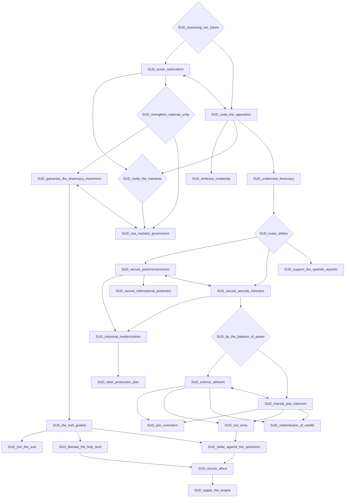
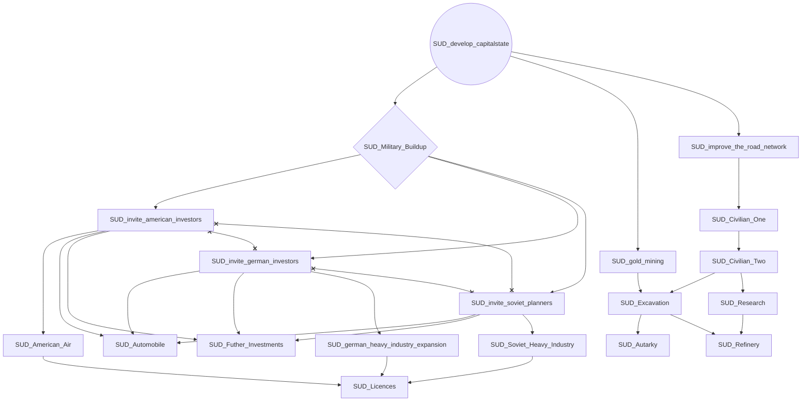
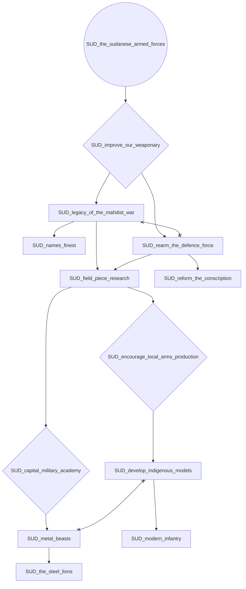

# SUD_assessing_our_future

```mermaid
flowchart TD
    n1["SUD_ansar_nationalism"]
    n2{"SUD_assessing_our_future"}
    n3["SUD_embrace_modernity"]
    n4["SUD_enforce_atheism"]
    n5["SUD_galvanize_the_khatmiyya_movement"]
    n6["SUD_industrial_modernization"]
    n7{"SUD_invite_the_mahdists"}
    n8["SUD_join_comintern"]
    n9["SUD_join_the_axis"]
    n10["SUD_liberate_the_holy_land"]
    n11["SUD_marxist_pan_islamism"]
    n12{"SUD_mass_strikes"}
    n13["SUD_neo_mahdist_government"]
    n14["SUD_red_army"]
    n15["SUD_redistribution_of_wealth"]
    n16["SUD_secure_africa"]
    n17["SUD_secure_international_protection"]
    n18["SUD_secure_parlementarianism"]
    n19["SUD_secure_security_ministers"]
    n20["SUD_steel_production_plan"]
    n21{"SUD_strengthen_national_unity"}
    n22["SUD_strike_against_the_opressors"]
    n23["SUD_support_the_spanish_republic"]
    n24["SUD_the_well_guided"]
    n25{"SUD_tip_the_balance_of_power"}
    n26["SUD_topple_the_empire"]
    n27["SUD_undermine_theocracy"]
    n28["SUD_unite_the_opposition"]
    n2 --> n1
    n28 --> n3
    n25 --> n4
    n21 --> n5
    n19 --> n6
    n18 --> n6
    n1 --> n7
    n28 --> n7
    n4 --> n8
    n11 --> n8
    n24 --> n9
    n24 --> n10
    n25 --> n11
    n27 --> n12
    n21 --> n13
    n7 --> n13
    n11 --> n14
    n4 --> n14
    n11 --> n15
    n4 --> n15
    n22 --> n16
    n10 --> n16
    n18 --> n17
    n12 --> n18
    n12 --> n19
    n6 --> n20
    n1 --> n21
    n24 --> n22
    n14 --> n22
    n12 --> n23
    n5 --> n24
    n19 --> n25
    n16 --> n26
    n28 --> n27
    n2 --> n28
    n1 x--x n28
    n4 x--x n11
    n5 x--x n13
    n18 x--x n19
```

# SUD_develop_capitalstate

```mermaid
flowchart TD
    n29["SUD_American_Air"]
    n30["SUD_Autarky"]
    n31["SUD_Automobile"]
    n32["SUD_Civilian_One"]
    n33["SUD_Civilian_Two"]
    n34["SUD_Excavation"]
    n35["SUD_Futher_Investments"]
    n36["SUD_Licences"]
    n37{"SUD_Military_Buildup"}
    n38["SUD_Refinery"]
    n39["SUD_Research"]
    n40["SUD_Soviet_Heavy_Industry"]
    n41(("SUD_develop_capitalstate"))
    n42["SUD_german_heavy_industry_expansion"]
    n43["SUD_gold_mining"]
    n44["SUD_improve_the_road_network"]
    n45["SUD_invite_american_investors"]
    n46["SUD_invite_german_investors"]
    n47["SUD_invite_soviet_planners"]
    n45 --> n29
    n34 --> n30
    n45 --> n31
    n46 --> n31
    n47 --> n31
    n44 --> n32
    n32 --> n33
    n33 --> n34
    n43 --> n34
    n45 --> n35
    n46 --> n35
    n47 --> n35
    n29 --> n36
    n42 --> n36
    n40 --> n36
    n41 --> n37
    n34 --> n38
    n39 --> n38
    n33 --> n39
    n47 --> n40
    n46 --> n42
    n41 --> n43
    n41 --> n44
    n37 --> n45
    n37 --> n46
    n37 --> n47
    n45 x--x n46
    n45 x--x n47
    n46 x--x n47
```

# SUD_the_sudanese_armed_forces

```mermaid
flowchart TD
    n48{"SUD_capital_military_academy"}
    n49["SUD_develop_indigenous_models"]
    n50{"SUD_encourage_local_arms_production"}
    n51["SUD_field_piece_research"]
    n52{"SUD_improve_our_weaponary"}
    n53["SUD_legacy_of_the_mahdist_war"]
    n54["SUD_metal_beasts"]
    n55["SUD_modern_infantry"]
    n56["SUD_names_finest"]
    n57["SUD_rearm_the_defence_force"]
    n58["SUD_reform_the_conscription"]
    n59["SUD_the_steel_lions"]
    n60(("SUD_the_sudanese_armed_forces"))
    n51 --> n48
    n50 --> n49
    n51 --> n50
    n53 --> n51
    n57 --> n51
    n60 --> n52
    n52 --> n53
    n48 --> n54
    n49 --> n55
    n53 --> n56
    n52 --> n57
    n57 --> n58
    n54 --> n59
    n49 x--x n54
    n53 x--x n57
```
