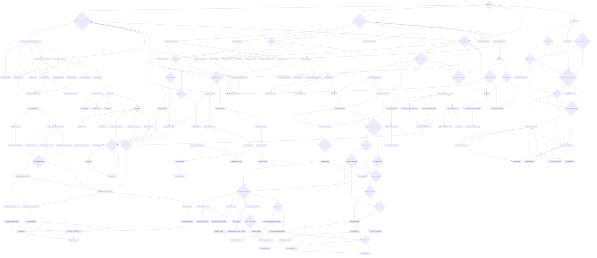

# SWE_defense_act

```mermaid
flowchart TD
    n1["SWE_acquire_ww2_tanks_and_wrecks"]
    n2["SWE_affordable_housing"]
    n3{"SWE_airforce_modernization"}
    n4["SWE_align_more_closely_with_the_landsorganisationen"]
    n5["SWE_all_cards_on_deck"]
    n6["SWE_allow_landsverk_to_operate"]
    n7["SWE_appeal_for_support"]
    n8["SWE_approach_the_allies"]
    n9{"SWE_aquire_modern_panzers"}
    n10["SWE_archapeligo_harrasment"]
    n11{"SWE_as_the_barometer_falls"}
    n12{"SWE_attack_Landsorganisationen"}
    n13["SWE_beneath_sticks_and_stones"]
    n14["SWE_betray_germany_plan"]
    n15["SWE_bofors_anti_tank_gun"]
    n16["SWE_bofors_fly_swatter"]
    n17["SWE_bornholm_crisis"]
    n18["SWE_cement_control_of_the_baltic"]
    n19["SWE_central_nordic_army_command"]
    n20["SWE_centralized_military_aid"]
    n21["SWE_coalition_war_cabinet"]
    n22["SWE_coastal_support"]
    n23{"SWE_continue_the_second_industrial_revolution"}
    n24["SWE_crusade_against_bolshevism"]
    n25["SWE_danish_alignment"]
    n26["SWE_decentralized_industrial_aid"]
    n27["SWE_decentralized_nordic_army_command"]
    n28["SWE_decentralized_nordic_volunteer_group"]
    n29["SWE_deep_mining_complexes"]
    n30{"SWE_defense_above_all"}
    n31{"SWE_defense_act"}
    n32["SWE_defense_in_depth"]
    n33{"SWE_delegation_to_berlin"}
    n34["SWE_demand_atlantic_resource_rights"]
    n35["SWE_demand_demilitarization_of_finnish_border"]
    n36{"SWE_domestic_designs"}
    n37["SWE_economic_deregulation"]
    n38{"SWE_economic_independence"}
    n39{"SWE_economic_integration"}
    n40["SWE_education_reform"]
    n41["SWE_en_svensk_tiger"]
    n42["SWE_end_the_fubkrieg"]
    n43["SWE_establish_nordland"]
    n44["SWE_establish_politburo"]
    n45["SWE_extend_the_time_of_preparedness"]
    n46{"SWE_finland_claims"}
    n47["SWE_finlands_cause_is_ours"]
    n48["SWE_finnish_buffer_state"]
    n49["SWE_finnish_integration"]
    n50["SWE_five_year_plan"]
    n51{"SWE_foreign_designs"}
    n52["SWE_form_rfsu"]
    n53{"SWE_form_saab"}
    n54["SWE_formation_flying"]
    n55["SWE_ga_pa_tactics"]
    n56["SWE_germanify_sweden"]
    n57{"SWE_gotaverken"}
    n58{"SWE_government_weapons_contract"}
    n59["SWE_greater_nordic_reich"]
    n60["SWE_hedgehog_defense"]
    n61["SWE_hemvarnet"]
    n62["SWE_husqvarna_vapenfabrik"]
    n63{"SWE_hygenic_housing"}
    n64["SWE_increase_intelligence_funding"]
    n65{"SWE_individual_liberty_and_prosperity_for_all"}
    n66["SWE_infrastructure"]
    n67["SWE_italian_destroyers"]
    n68["SWE_jagartrupper"]
    n69["SWE_join_allies_for_colonies"]
    n70{"SWE_join_the_anti_soviet_pact"}
    n71["SWE_karnvapenprogram"]
    n72["SWE_king_in_council"]
    n73["SWE_kockums"]
    n74["SWE_kp_bill"]
    n75["SWE_land_air_warfare"]
    n76["SWE_landverk_l_62"]
    n77["SWE_let_fly_all_guns"]
    n78["SWE_license_skf_ball_bearings"]
    n79["SWE_lindholmens_varv"]
    n80["SWE_liquidate_the_monarchy"]
    n81["SWE_lottakaren"]
    n82["SWE_lynx_winter_armored_cars"]
    n83["SWE_marauder_bombers"]
    n84["SWE_meet_with_the_king"]
    n85["SWE_merge_army_complexes"]
    n86{"SWE_military_independence"}
    n87{"SWE_military_integration"}
    n88["SWE_mobilization_of_society"]
    n89{"SWE_mythologize_swedish_history"}
    n90["SWE_narvik_crisis"]
    n91["SWE_neither_death_nor_dishonor"]
    n92["SWE_nordic_centralized_air_command"]
    n93["SWE_nordic_defense_fleet"]
    n94["SWE_nordic_protection_complex"]
    n95["SWE_nordljus"]
    n96["SWE_norma_projektilfabrik"]
    n97["SWE_operation_save_denmark"]
    n98["SWE_operation_save_norway"]
    n99{"SWE_organize_a_putsch"}
    n100{"SWE_paid_holidays"}
    n101["SWE_peoples_commissar_for_defense"]
    n102["SWE_per_albin_bus"]
    n103["SWE_per_albin_line"]
    n104["SWE_police_reforms"]
    n105["SWE_preemptive_strike"]
    n106{"SWE_prevent_a_red_dictatorship"}
    n107{"SWE_privately_managed_holidays"}
    n108["SWE_promote_nordic_identity"]
    n109["SWE_radiojanst"]
    n110["SWE_rapid_mobilization"]
    n111["SWE_rapid_response_force"]
    n112["SWE_rationing"]
    n113["SWE_reclaiming_the_rus"]
    n114["SWE_refit_gotaverken_for_rapid_repairs"]
    n115["SWE_refuge_for_revolutionaries"]
    n116["SWE_refuge_from_war"]
    n117["SWE_reject_saltsjobaden"]
    n118["SWE_research_slot_1"]
    n119["SWE_research_slot_2"]
    n120["SWE_restoring_order"]
    n121["SWE_retool_dockyards"]
    n122["SWE_revoke_anti_militia_laws"]
    n123{"SWE_ring_a_ding_ding"}
    n124["SWE_rockets"]
    n125["SWE_rule_the_baltic"]
    n126["SWE_saltsjobaden_agreement"]
    n127["SWE_sami_reconcilliation"]
    n128["SWE_scandinavian_defense_union"]
    n129["SWE_scramble_for_the_baltic"]
    n130["SWE_secret_mobilization"]
    n131["SWE_sieze_landsverk"]
    n132["SWE_socialist_reforms"]
    n133["SWE_special_forces"]
    n134["SWE_specialized_equipment"]
    n135["SWE_standardize_equipment"]
    n136["SWE_starve_the_fascists_of_iron"]
    n137["SWE_strike_the_capitalist_beast_down"]
    n138["SWE_support_danish_communists"]
    n139["SWE_support_norwegian_communists"]
    n140["SWE_surface_raiders"]
    n141["SWE_swedes_not_sweden_to_finlands_aid"]
    n142["SWE_swedish_finnish_defense_agreement"]
    n143["SWE_swedish_shooting_movement"]
    n144["SWE_tank_development"]
    n145{"SWE_the_aland_issue"}
    n146["SWE_the_aland_question"]
    n147["SWE_the_barrel"]
    n148{"SWE_the_cross_we_bear"}
    n149["SWE_the_lion_of_the_north_rises"]
    n150["SWE_the_narvik_solution"]
    n151["SWE_the_new_order"]
    n152{"SWE_the_nordic_defense_council"}
    n153{"SWE_the_old_enemy_stirs"}
    n154["SWE_the_threat_of_the_iron_curtain"]
    n155{"SWE_totalforsvar"}
    n156["SWE_train_the_sheltered"]
    n157["SWE_undermine_the_fascists"]
    n158{"SWE_unify_the_national_socialist_movement"}
    n159["SWE_united_kingdoms_of_sweden_and_norway"]
    n160{"SWE_universal_basic_income"}
    n161["SWE_unrestricted_submarine_warfare"]
    n162["SWE_uranium_project"]
    n163["SWE_urbanization"]
    n164["SWE_varnplikt"]
    n165["SWE_vasa_ii"]
    n166["SWE_volvo"]
    n167["SWE_war_games"]
    n168["SWE_winter_drill"]
    n169{"SWE_work_projects_for_the_unemployed"}
    n128 --> n1
    n65 --> n2
    n54 --> n3
    n83 --> n3
    n23 --> n4
    n125 --> n5
    n58 --> n6
    n157 --> n7
    n122 --> n7
    n89 --> n8
    n166 --> n9
    n121 --> n10
    n131 --> n11
    n6 --> n11
    n84 --> n12
    n60 --> n13
    n108 --> n14
    n16 --> n15
    n58 --> n16
    n89 --> n17
    n93 --> n18
    n152 --> n19
    n19 --> n20
    n23 --> n21
    n125 --> n22
    n31 --> n23
    n142 --> n24
    n70 --> n24
    n49 --> n24
    n34 --> n25
    n27 --> n26
    n152 --> n27
    n19 --> n28
    n30 --> n29
    n169 --> n30
    n63 --> n30
    n11 --> n32
    n158 --> n33
    n17 --> n34
    n145 --> n35
    n53 --> n36
    n117 --> n37
    n33 --> n38
    n33 --> n39
    n126 --> n40
    n4 --> n41
    n21 --> n41
    n13 --> n42
    n144 --> n42
    n46 --> n43
    n80 --> n44
    n128 --> n45
    n154 --> n45
    n56 --> n46
    n108 --> n46
    n23 --> n47
    n153 --> n47
    n101 --> n48
    n35 --> n49
    n44 --> n50
    n53 --> n51
    n4 --> n52
    n21 --> n52
    n16 --> n53
    n36 --> n54
    n51 --> n54
    n32 --> n55
    n75 --> n55
    n86 --> n56
    n87 --> n56
    n58 --> n57
    n31 --> n58
    n25 --> n59
    n159 --> n59
    n49 --> n59
    n32 --> n60
    n155 --> n61
    n58 --> n62
    n163 --> n63
    n1 --> n64
    n169 --> n65
    n63 --> n65
    n126 --> n66
    n117 --> n66
    n57 --> n67
    n164 --> n68
    n8 --> n69
    n89 --> n70
    n45 --> n71
    n12 --> n72
    n57 --> n73
    n9 --> n74
    n123 --> n74
    n11 --> n75
    n16 --> n76
    n144 --> n77
    n126 --> n78
    n117 --> n78
    n57 --> n79
    n132 --> n80
    n116 --> n80
    n104 --> n80
    n155 --> n81
    n9 --> n82
    n123 --> n82
    n36 --> n83
    n51 --> n83
    n7 --> n84
    n157 --> n84
    n20 --> n85
    n38 --> n86
    n39 --> n86
    n38 --> n87
    n39 --> n87
    n13 --> n88
    n120 --> n89
    n72 --> n89
    n89 --> n90
    n28 --> n91
    n92 --> n91
    n93 --> n91
    n19 --> n92
    n19 --> n93
    n85 --> n94
    n93 --> n95
    n58 --> n96
    n155 --> n97
    n155 --> n98
    n158 --> n99
    n65 --> n100
    n30 --> n100
    n44 --> n101
    n164 --> n102
    n60 --> n103
    n111 --> n103
    n137 --> n104
    n149 --> n105
    n167 --> n105
    n153 --> n106
    n65 --> n107
    n30 --> n107
    n86 --> n108
    n87 --> n108
    n163 --> n109
    n155 --> n110
    n75 --> n111
    n164 --> n112
    n24 --> n113
    n57 --> n114
    n116 --> n115
    n137 --> n116
    n100 --> n117
    n107 --> n117
    n126 --> n118
    n117 --> n118
    n42 --> n119
    n99 --> n120
    n57 --> n121
    n106 --> n122
    n166 --> n123
    n3 --> n124
    n57 --> n125
    n100 --> n126
    n107 --> n126
    n4 --> n127
    n21 --> n127
    n160 --> n128
    n89 --> n129
    n155 --> n130
    n58 --> n131
    n137 --> n132
    n154 --> n133
    n133 --> n134
    n58 --> n135
    n50 --> n136
    n4 --> n137
    n101 --> n138
    n101 --> n139
    n121 --> n140
    n23 --> n141
    n153 --> n141
    n145 --> n142
    n70 --> n142
    n61 --> n143
    n111 --> n144
    n89 --> n145
    n23 --> n146
    n153 --> n146
    n3 --> n147
    n98 --> n148
    n97 --> n148
    n91 --> n148
    n71 --> n149
    n134 --> n149
    n21 --> n150
    n46 --> n151
    n153 --> n152
    n31 --> n153
    n160 --> n154
    n148 --> n154
    n164 --> n155
    n168 --> n156
    n106 --> n157
    n7 --> n158
    n122 --> n158
    n90 --> n159
    n139 --> n160
    n138 --> n160
    n48 --> n160
    n121 --> n161
    n56 --> n162
    n31 --> n163
    n168 --> n164
    n125 --> n165
    n135 --> n166
    n64 --> n167
    n71 --> n167
    n21 --> n168
    n163 --> n169
    n4 x--x n21
    n6 x--x n131
    n8 x--x n90
    n19 x--x n27
    n23 x--x n153
    n30 x--x n65
    n32 x--x n75
    n33 x--x n99
    n35 x--x n142
    n36 x--x n51
    n38 x--x n39
    n43 x--x n151
    n47 x--x n141
    n47 x--x n146
    n54 x--x n83
    n56 x--x n108
    n72 x--x n120
    n74 x--x n82
    n86 x--x n87
    n100 x--x n107
    n106 x--x n152
    n110 x--x n130
    n117 x--x n126
    n121 x--x n125
    n122 x--x n157
    n124 x--x n147
    n128 x--x n154
    n141 x--x n146
```
