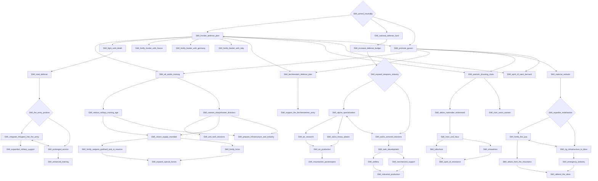
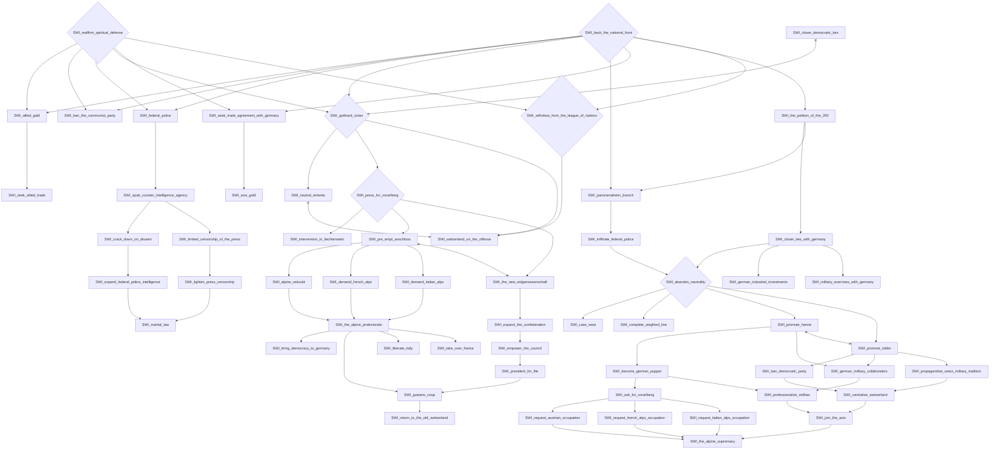
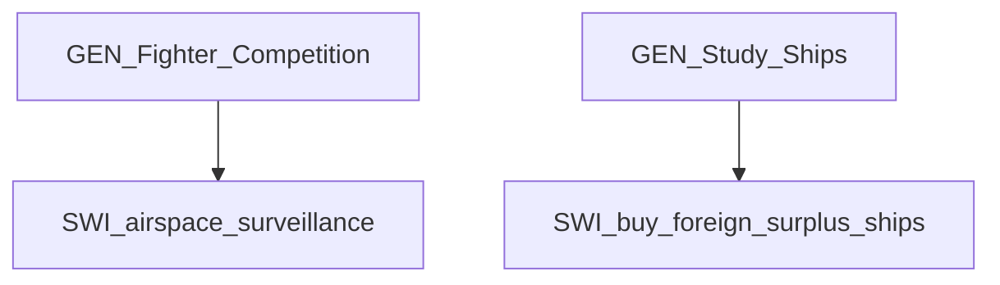

# SWI_armed_neutrality

```mermaid
flowchart TD
    n1["SWI_air_production"]
    n2["SWI_air_research"]
    n3["SWI_aktion_nationaler_widerstand"]
    n4["SWI_all_adults_training"]
    n5["SWI_alpine_specialization"]
    n6["SWI_anti_tank_divisions"]
    n7{"SWI_armed_neutrality"}
    n8["SWI_artillery"]
    n9["SWI_attack_from_the_mountains"]
    n10["SWI_citizen_supply_mandate"]
    n11["SWI_defend_the_skies"]
    n12["SWI_emergency_industry"]
    n13["SWI_enhanced_training"]
    n14["SWI_expand_special_forces"]
    n15{"SWI_expand_weapons_industry"}
    n16["SWI_expanded_military_support"]
    n17{"SWI_expedite_mobilization"}
    n18["SWI_fight_until_death"]
    n19["SWI_fortify_border_with_france"]
    n20["SWI_fortify_border_with_germany"]
    n21["SWI_fortify_border_with_italy"]
    n22["SWI_fortify_sargans_gotthard_and_st_maurice"]
    n23["SWI_fortify_the_jura"]
    n24["SWI_fortify_ticino"]
    n25["SWI_frontier_defense_plan"]
    n26["SWI_heer_und_haus"]
    n27["SWI_increase_defense_budget"]
    n28["SWI_industrial_production"]
    n29["SWI_integrate_refugees_into_the_army"]
    n30["SWI_liechtenstein_defence_plan"]
    n31["SWI_luftschutz"]
    n32["SWI_mechanized_support"]
    n33["SWI_mountaneer_paratroopers"]
    n34["SWI_national_defense_fund"]
    n35["SWI_national_redoubt"]
    n36["SWI_ortswehren"]
    n37["SWI_patriotic_shooting_clubs"]
    n38["SWI_prepare_infrastructure_and_industry"]
    n39["SWI_prolonged_service"]
    n40["SWI_promote_guisan"]
    n41["SWI_reduce_military_training_age"]
    n42["SWI_rig_infrastructure_to_blow"]
    n43["SWI_spirit_of_resistance"]
    n44["SWI_spirit_of_saint_bernard"]
    n45["SWI_support_the_liechtensteiner_army"]
    n46["SWI_swiss_armored_divisions"]
    n47["SWI_swiss_heavy_planes"]
    n48["SWI_tank_development"]
    n49{"SWI_the_army_position"}
    n50["SWI_total_defense"]
    n51["SWI_train_swiss_women"]
    n52["SWI_veteran_sharpshooter_divisions"]
    n47 --> n1
    n2 --> n1
    n5 --> n2
    n37 --> n3
    n40 --> n4
    n25 --> n4
    n15 --> n5
    n52 --> n6
    n48 --> n8
    n23 --> n9
    n52 --> n10
    n41 --> n10
    n9 --> n11
    n12 --> n11
    n42 --> n12
    n39 --> n13
    n22 --> n14
    n24 --> n14
    n27 --> n15
    n29 --> n16
    n35 --> n17
    n25 --> n18
    n25 --> n19
    n25 --> n20
    n25 --> n21
    n10 --> n22
    n17 --> n23
    n10 --> n24
    n7 --> n25
    n3 --> n26
    n34 --> n27
    n32 --> n28
    n8 --> n28
    n49 --> n29
    n40 --> n30
    n25 --> n30
    n26 --> n31
    n48 --> n32
    n1 --> n33
    n7 --> n34
    n40 --> n35
    n26 --> n36
    n40 --> n37
    n25 --> n37
    n52 --> n38
    n41 --> n38
    n49 --> n39
    n7 --> n40
    n4 --> n41
    n17 --> n42
    n31 --> n43
    n36 --> n43
    n40 --> n44
    n25 --> n44
    n30 --> n45
    n15 --> n46
    n5 --> n47
    n46 --> n48
    n50 --> n49
    n18 --> n50
    n37 --> n51
    n4 --> n52
    n5 x--x n46
    n23 x--x n42
    n25 x--x n40
    n29 x--x n39
```

# SWI_back_the_national_front

```mermaid
flowchart TD
    n53{"SWI_abandon_neutrality"}
    n54["SWI_allied_gold"]
    n55["SWI_alpine_redoubt"]
    n56["SWI_ask_for_vorarlberg"]
    n57["SWI_axis_gold"]
    n58{"SWI_back_the_national_front"}
    n59["SWI_ban_democratic_party"]
    n60["SWI_ban_the_communist_party"]
    n61["SWI_become_german_puppet"]
    n62["SWI_bring_democracy_to_germany"]
    n63["SWI_case_west"]
    n64["SWI_centralize_switzerland"]
    n65["SWI_closer_democratic_ties"]
    n66["SWI_closer_ties_with_germany"]
    n67["SWI_complete_siegfried_line"]
    n68["SWI_crack_down_on_dissent"]
    n69["SWI_demand_french_alps"]
    n70["SWI_demand_italian_alps"]
    n71["SWI_empower_the_council"]
    n72["SWI_expand_federal_police_intelligence"]
    n73["SWI_expand_the_confederation"]
    n74["SWI_federal_police"]
    n75["SWI_german_industrial_investments"]
    n76["SWI_german_military_collaboration"]
    n77{"SWI_gotthard_union"}
    n78["SWI_guisans_coup"]
    n79["SWI_infiltrate_federal_police"]
    n80["SWI_intervention_in_liechtenstein"]
    n81["SWI_join_the_axis"]
    n82["SWI_liberate_italy"]
    n83["SWI_limited_censorship_of_the_press"]
    n84["SWI_martial_law"]
    n85["SWI_military_exercises_with_germany"]
    n86["SWI_neutral_entente"]
    n87["SWI_panoramaheim_branch"]
    n88["SWI_pre_empt_anschluss"]
    n89["SWI_president_for_life"]
    n90{"SWI_press_for_vorarlberg"}
    n91["SWI_professionalize_militias"]
    n92["SWI_promote_henne"]
    n93["SWI_promote_tobler"]
    n94["SWI_propagandize_swiss_military_tradition"]
    n95{"SWI_reaffirm_spiritual_defense"}
    n96["SWI_request_austrian_occupation"]
    n97["SWI_request_french_alps_occupation"]
    n98["SWI_request_italian_alps_occupation"]
    n99["SWI_return_to_the_old_switzerland"]
    n100["SWI_seek_allied_trade"]
    n101["SWI_seek_trade_agreement_with_germany"]
    n102["SWI_spab_counter_intelligence_agency"]
    n103["SWI_switzerland_on_the_offense"]
    n104["SWI_take_over_france"]
    n105["SWI_the_alpine_protectorate"]
    n106["SWI_the_alpine_supremacy"]
    n107["SWI_the_new_eidgenossenschaft"]
    n108["SWI_the_petition_of_the_200"]
    n109["SWI_tighten_press_censorship"]
    n110{"SWI_withdraw_from_the_league_of_nations"}
    n66 --> n53
    n79 --> n53
    n95 --> n54
    n58 --> n54
    n88 --> n55
    n61 --> n56
    n101 --> n57
    n93 --> n59
    n95 --> n60
    n58 --> n60
    n92 --> n61
    n105 --> n62
    n53 --> n63
    n94 --> n64
    n59 --> n64
    n108 --> n66
    n53 --> n67
    n102 --> n68
    n88 --> n69
    n88 --> n70
    n73 --> n71
    n68 --> n72
    n107 --> n73
    n95 --> n74
    n58 --> n74
    n66 --> n75
    n93 --> n76
    n92 --> n76
    n95 --> n77
    n58 --> n77
    n105 --> n78
    n89 --> n78
    n87 --> n79
    n90 --> n80
    n91 --> n81
    n64 --> n81
    n105 --> n82
    n102 --> n83
    n72 --> n84
    n109 --> n84
    n66 --> n85
    n77 --> n86
    n58 --> n87
    n108 --> n87
    n90 --> n88
    n71 --> n89
    n77 --> n90
    n61 --> n91
    n76 --> n91
    n53 --> n92
    n53 --> n93
    n93 --> n94
    n56 --> n96
    n56 --> n97
    n56 --> n98
    n78 --> n99
    n54 --> n100
    n95 --> n101
    n58 --> n101
    n74 --> n102
    n77 --> n103
    n110 --> n103
    n105 --> n104
    n55 --> n105
    n69 --> n105
    n70 --> n105
    n96 --> n106
    n98 --> n106
    n97 --> n106
    n81 --> n106
    n90 --> n107
    n58 --> n108
    n83 --> n109
    n95 --> n110
    n58 --> n110
    n65 x--x n77
    n86 x--x n103
    n88 x--x n107
    n92 x--x n93
```

# SWI_reaffirm_spiritual_defense

```mermaid
flowchart TD
    n111["SWI_adopt_romansh"]
    n54["SWI_allied_gold"]
    n112["SWI_alpine_aspirations"]
    n55["SWI_alpine_redoubt"]
    n113["SWI_american_industrial_investments"]
    n114["SWI_arsenal_of_the_alps"]
    n57["SWI_axis_gold"]
    n58{"SWI_back_the_national_front"}
    n115{"SWI_ban_foreign_nazi_propaganda"}
    n116["SWI_ban_national_movement_for_switzerland"]
    n60["SWI_ban_the_communist_party"]
    n62["SWI_bring_democracy_to_germany"]
    n117["SWI_buero_ha"]
    n118["SWI_case_north"]
    n65["SWI_closer_democratic_ties"]
    n119{"SWI_connect_to_the_maginot_line"}
    n68["SWI_crack_down_on_dissent"]
    n69["SWI_demand_french_alps"]
    n70["SWI_demand_italian_alps"]
    n71["SWI_empower_the_council"]
    n120["SWI_exiled_government"]
    n72["SWI_expand_federal_police_intelligence"]
    n121{"SWI_expand_spy_networks"}
    n73["SWI_expand_the_confederation"]
    n122["SWI_export_saboteurs"]
    n74["SWI_federal_police"]
    n123["SWI_fighting_for_the_hills"]
    n124["SWI_fly_over_the_mountains"]
    n125["SWI_freeze_german_assets"]
    n126["SWI_fund_resistance_groups"]
    n77{"SWI_gotthard_union"}
    n78["SWI_guisans_coup"]
    n80["SWI_intervention_in_liechtenstein"]
    n127["SWI_intervention_in_liechtenstein_2"]
    n128["SWI_join_france"]
    n129["SWI_join_the_allies"]
    n130["SWI_jump_into_action"]
    n131["SWI_lay_the_groundwork"]
    n82["SWI_liberate_italy"]
    n83["SWI_limited_censorship_of_the_press"]
    n84["SWI_martial_law"]
    n86["SWI_neutral_entente"]
    n132["SWI_oasis_of_democracy"]
    n88["SWI_pre_empt_anschluss"]
    n89["SWI_president_for_life"]
    n90{"SWI_press_for_vorarlberg"}
    n133{"SWI_pro_helvetia"}
    n95{"SWI_reaffirm_spiritual_defense"}
    n99["SWI_return_to_the_old_switzerland"]
    n134["SWI_secret_pact_with_the_allies"]
    n100["SWI_seek_allied_trade"]
    n101["SWI_seek_trade_agreement_with_germany"]
    n135{"SWI_share_spy_networks"}
    n102["SWI_spab_counter_intelligence_agency"]
    n136["SWI_support_allied_espionage"]
    n103["SWI_switzerland_on_the_offense"]
    n137{"SWI_take_a_stance"}
    n104["SWI_take_over_france"]
    n138["SWI_the_alpine_confederation"]
    n105["SWI_the_alpine_protectorate"]
    n107["SWI_the_new_eidgenossenschaft"]
    n139["SWI_the_second_helvetic_republic"]
    n140["SWI_thunder_in_the_valleys"]
    n109["SWI_tighten_press_censorship"]
    n141["SWI_volunteer_force"]
    n142["SWI_weapons_of_democracy"]
    n110{"SWI_withdraw_from_the_league_of_nations"}
    n133 --> n111
    n95 --> n54
    n58 --> n54
    n139 --> n112
    n88 --> n55
    n65 --> n113
    n131 --> n114
    n101 --> n57
    n95 --> n115
    n115 --> n116
    n133 --> n116
    n95 --> n60
    n58 --> n60
    n105 --> n62
    n133 --> n117
    n129 --> n118
    n128 --> n118
    n134 --> n118
    n115 --> n65
    n65 --> n119
    n102 --> n68
    n88 --> n69
    n88 --> n70
    n73 --> n71
    n142 --> n120
    n68 --> n72
    n136 --> n121
    n107 --> n73
    n132 --> n122
    n95 --> n74
    n58 --> n74
    n114 --> n123
    n114 --> n124
    n118 --> n125
    n129 --> n126
    n128 --> n126
    n134 --> n126
    n95 --> n77
    n58 --> n77
    n105 --> n78
    n89 --> n78
    n90 --> n80
    n134 --> n127
    n137 --> n128
    n119 --> n128
    n137 --> n129
    n122 --> n130
    n141 --> n130
    n142 --> n130
    n129 --> n131
    n128 --> n131
    n134 --> n131
    n105 --> n82
    n102 --> n83
    n72 --> n84
    n109 --> n84
    n77 --> n86
    n134 --> n132
    n90 --> n88
    n71 --> n89
    n77 --> n90
    n95 --> n133
    n78 --> n99
    n135 --> n134
    n54 --> n100
    n95 --> n101
    n58 --> n101
    n121 --> n135
    n74 --> n102
    n115 --> n136
    n77 --> n103
    n110 --> n103
    n113 --> n137
    n119 --> n137
    n105 --> n104
    n142 --> n138
    n112 --> n138
    n55 --> n105
    n69 --> n105
    n70 --> n105
    n90 --> n107
    n128 --> n139
    n114 --> n140
    n83 --> n109
    n132 --> n141
    n140 --> n142
    n124 --> n142
    n123 --> n142
    n95 --> n110
    n58 --> n110
    n117 x--x n135
    n65 x--x n77
    n128 x--x n129
    n128 x--x n134
    n129 x--x n134
    n86 x--x n103
    n88 x--x n107
```

# orphans

```mermaid
flowchart TD
    n143["GEN_Fighter_Competition"]
    n144["GEN_Study_Ships"]
    n145["SWI_airspace_surveillance"]
    n146["SWI_buy_foreign_surplus_ships"]
    n143 --> n145
    n144 --> n146
```
