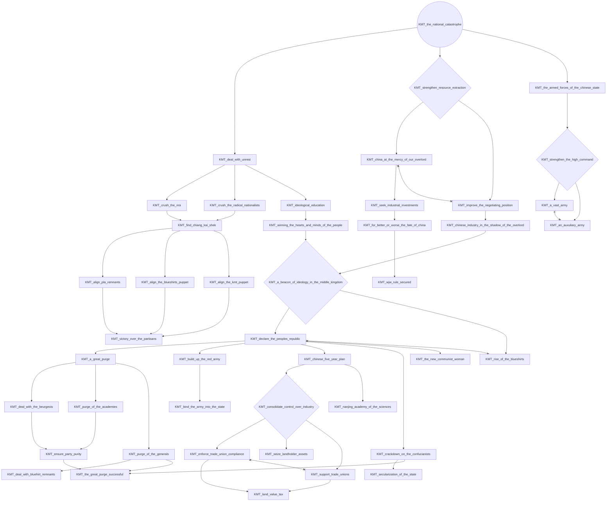

# KMT_the_national_catastrophe

```mermaid
flowchart TD
    n1{"KMT_a_beacon_of_ideology_in_the_middle_kingdom"}
    n2["KMT_a_great_purge"]
    n3["KMT_a_vast_army"]
    n4["KMT_align_pla_remnants"]
    n5["KMT_align_the_blueshirts_puppet"]
    n6["KMT_align_the_kmt_puppet"]
    n7["KMT_an_auxuliary_army"]
    n8["KMT_bind_the_army_into_the_state"]
    n9["KMT_build_up_the_red_army"]
    n10["KMT_china_at_the_mercy_of_our_overlord"]
    n11["KMT_chinese_five_year_plan"]
    n12["KMT_chinese_industry_in_the_shadow_of_the_overlord"]
    n13{"KMT_consolidate_control_over_industry"}
    n14["KMT_crackdown_on_the_confucianists"]
    n15["KMT_crush_the_nra"]
    n16["KMT_crush_the_radical_nationalists"]
    n17["KMT_deal_with_bluehirt_remnants"]
    n18["KMT_deal_with_the_beurgeois"]
    n19["KMT_deal_with_unrest"]
    n20["KMT_declare_the_peoples_republic"]
    n21["KMT_enforce_trade_union_compliance"]
    n22["KMT_ensure_party_purity"]
    n23["KMT_find_chiang_kai_shek"]
    n24["KMT_for_better_or_worse_the_fate_of_china"]
    n25["KMT_ideological_education"]
    n26["KMT_improve_the_negotiating_position"]
    n27["KMT_land_value_tax"]
    n28["KMT_nanjing_academy_of_the_sciences"]
    n29["KMT_purge_of_the_academies"]
    n30["KMT_purge_of_the_generals"]
    n31["KMT_rise_of_the_blueshirts"]
    n32["KMT_secularization_of_the_state"]
    n33["KMT_seek_industrial_investments"]
    n34["KMT_seize_landholder_assets"]
    n35{"KMT_strengthen_resource_extraction"}
    n36{"KMT_strengthen_the_high_command"}
    n37["KMT_support_trade_unions"]
    n38["KMT_the_armed_forces_of_the_chinese_state"]
    n39["KMT_the_great_purge_successful"]
    n40(("KMT_the_national_catastrophe"))
    n41["KMT_the_new_communist_woman"]
    n42["KMT_victory_over_the_partisans"]
    n43["KMT_winning_the_hearts_and_minds_of_the_people"]
    n44["KMT_wjw_rule_secured"]
    n12 --> n1
    n43 --> n1
    n20 --> n2
    n36 --> n3
    n23 --> n4
    n23 --> n5
    n23 --> n6
    n36 --> n7
    n9 --> n8
    n20 --> n9
    n35 --> n10
    n20 --> n11
    n26 --> n12
    n11 --> n13
    n20 --> n14
    n19 --> n15
    n19 --> n16
    n30 --> n17
    n2 --> n18
    n40 --> n19
    n1 --> n20
    n13 --> n21
    n29 --> n22
    n18 --> n22
    n15 --> n23
    n16 --> n23
    n33 --> n24
    n19 --> n25
    n35 --> n26
    n21 --> n27
    n37 --> n27
    n11 --> n28
    n2 --> n29
    n2 --> n30
    n1 --> n31
    n14 --> n32
    n10 --> n33
    n13 --> n34
    n40 --> n35
    n38 --> n36
    n13 --> n37
    n40 --> n38
    n22 --> n39
    n14 --> n39
    n30 --> n39
    n20 --> n41
    n6 --> n42
    n5 --> n42
    n4 --> n42
    n25 --> n43
    n24 --> n44
    n3 x--x n7
    n10 x--x n26
    n20 x--x n31
    n21 x--x n37
```
