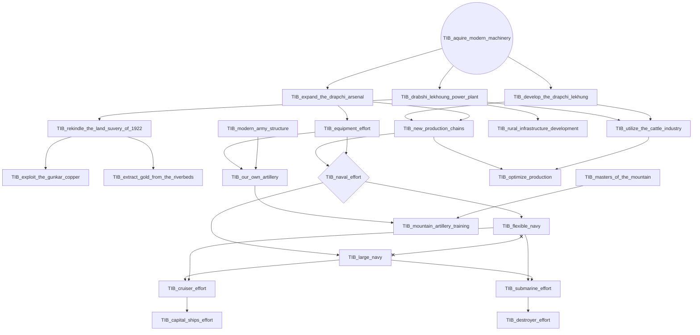
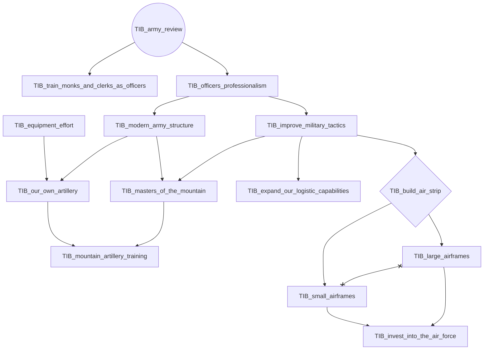
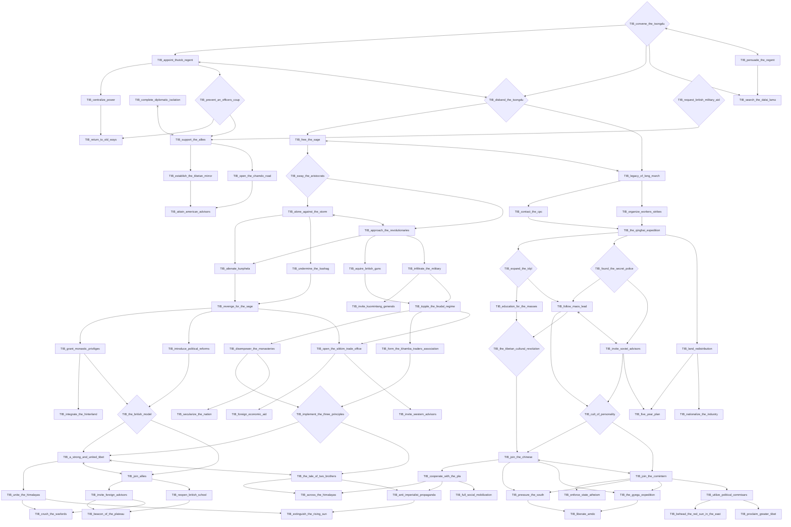
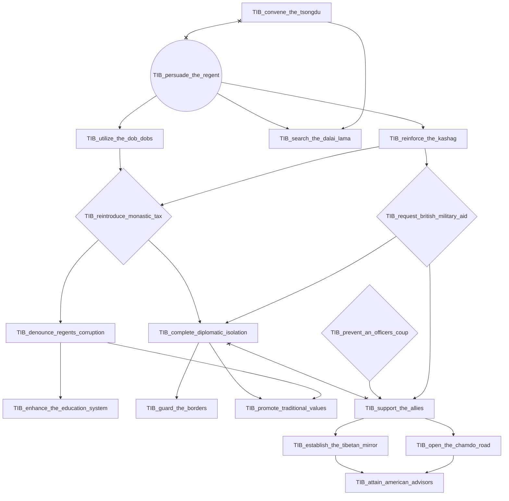

# TIB_aquire_modern_machinery

```mermaid
flowchart TD
    n1(("TIB_aquire_modern_machinery"))
    n2["TIB_capital_ships_effort"]
    n3["TIB_cruiser_effort"]
    n4["TIB_destroyer_effort"]
    n5["TIB_develop_the_drapchi_lekhung"]
    n6["TIB_drabshi_lekhoung_power_plant"]
    n7["TIB_equipment_effort"]
    n8["TIB_expand_the_drapchi_arsenal"]
    n9["TIB_exploit_the_gunkar_copper"]
    n10["TIB_extract_gold_from_the_riverbeds"]
    n11["TIB_flexible_navy"]
    n12["TIB_large_navy"]
    n13["TIB_masters_of_the_mountain"]
    n14["TIB_modern_army_structure"]
    n15["TIB_mountain_artillery_training"]
    n16{"TIB_naval_effort"}
    n17["TIB_new_production_chains"]
    n18["TIB_optimize_production"]
    n19["TIB_our_own_artillery"]
    n20["TIB_rekindle_the_land_suvery_of_1922"]
    n21["TIB_rural_infrastructure_development"]
    n22["TIB_submarine_effort"]
    n23["TIB_utilize_the_cattle_industry"]
    n3 --> n2
    n12 --> n3
    n11 --> n3
    n22 --> n4
    n1 --> n5
    n1 --> n6
    n8 --> n7
    n1 --> n8
    n20 --> n9
    n20 --> n10
    n16 --> n11
    n16 --> n12
    n19 --> n15
    n13 --> n15
    n17 --> n16
    n7 --> n16
    n5 --> n17
    n8 --> n17
    n17 --> n18
    n23 --> n18
    n7 --> n19
    n14 --> n19
    n6 --> n20
    n6 --> n21
    n11 --> n22
    n12 --> n22
    n6 --> n23
    n5 --> n23
    n11 x--x n12
```

# TIB_army_review

```mermaid
flowchart TD
    n24(("TIB_army_review"))
    n25{"TIB_build_air_strip"}
    n7["TIB_equipment_effort"]
    n26["TIB_expand_our_logistic_capabilities"]
    n27["TIB_improve_military_tactics"]
    n28["TIB_invest_into_the_air_force"]
    n29["TIB_large_airframes"]
    n13["TIB_masters_of_the_mountain"]
    n14["TIB_modern_army_structure"]
    n15["TIB_mountain_artillery_training"]
    n30["TIB_officers_professionalism"]
    n19["TIB_our_own_artillery"]
    n31["TIB_small_airframes"]
    n32["TIB_train_monks_and_clerks_as_officers"]
    n27 --> n25
    n27 --> n26
    n30 --> n27
    n31 --> n28
    n29 --> n28
    n25 --> n29
    n14 --> n13
    n27 --> n13
    n30 --> n14
    n19 --> n15
    n13 --> n15
    n24 --> n30
    n7 --> n19
    n14 --> n19
    n25 --> n31
    n24 --> n32
    n29 x--x n31
```

# TIB_convene_the_tsongdu

```mermaid
flowchart TD
    n33["TIB_a_strong_and_united_tibet"]
    n34["TIB_across_the_himalayas"]
    n35["TIB_alienate_kunphela"]
    n36["TIB_alone_against_the_storm"]
    n37["TIB_anti_imperialist_propaganda"]
    n38["TIB_appoint_thutob_regent"]
    n39["TIB_approach_the_revolutionaries"]
    n40["TIB_aquire_british_guns"]
    n41["TIB_attain_american_advisors"]
    n42["TIB_beacon_of_the_plateau"]
    n43["TIB_behead_the_red_sun_in_the_east"]
    n44["TIB_centralize_power"]
    n45["TIB_complete_diplomatic_isolation"]
    n46["TIB_contact_the_cpc"]
    n47{"TIB_convene_the_tsongdu"}
    n48["TIB_cooperate_with_the_pla"]
    n49["TIB_crush_the_warlords"]
    n50{"TIB_cult_of_personality"}
    n51{"TIB_disband_the_tsongdu"}
    n52["TIB_disempower_the_monasteries"]
    n53["TIB_education_for_the_masses"]
    n54["TIB_enforce_state_atheism"]
    n55["TIB_establish_the_tibetan_mirror"]
    n56{"TIB_expand_the_tdyl"}
    n57["TIB_extinguish_the_rising_sun"]
    n58["TIB_five_year_plan"]
    n59["TIB_follow_maos_lead"]
    n60["TIB_foreign_economic_aid"]
    n61["TIB_form_the_khamba_traders_association"]
    n62{"TIB_found_the_secret_police"}
    n63["TIB_free_the_sage"]
    n64["TIB_full_social_mobilization"]
    n65["TIB_grant_monastic_priviliges"]
    n66{"TIB_implement_the_three_principles"}
    n67["TIB_infiltrate_the_military"]
    n68["TIB_integrate_the_hinterland"]
    n69["TIB_introduce_political_reforms"]
    n70["TIB_invite_foreign_advisors"]
    n71["TIB_invite_kuomintang_generals"]
    n72["TIB_invite_soviet_advisors"]
    n73["TIB_invite_western_advisors"]
    n74["TIB_join_allies"]
    n75["TIB_join_the_chinese"]
    n76["TIB_join_the_comintern"]
    n77["TIB_land_redistribution"]
    n78["TIB_legacy_of_long_march"]
    n79["TIB_liberate_amdo"]
    n80["TIB_nationalize_the_industry"]
    n81["TIB_open_the_chamdo_road"]
    n82["TIB_open_the_sikkim_trade_office"]
    n83["TIB_organize_workers_strikes"]
    n84["TIB_persuade_the_regent"]
    n85["TIB_pressure_the_south"]
    n86{"TIB_prevent_an_officers_coup"}
    n87["TIB_proclaim_greater_tibet"]
    n88["TIB_reopen_british_school"]
    n89{"TIB_request_british_military_aid"}
    n90["TIB_return_to_old_ways"]
    n91["TIB_revenge_for_the_sage"]
    n92["TIB_search_the_dalai_lama"]
    n93["TIB_secularize_the_nation"]
    n94["TIB_support_the_allies"]
    n95{"TIB_sway_the_aristocrats"}
    n96{"TIB_the_british_model"}
    n97["TIB_the_gyegu_expedition"]
    n98["TIB_the_qinghai_expedition"]
    n99["TIB_the_tale_of_two_brothers"]
    n100{"TIB_the_tibetan_cultural_revolution"}
    n101["TIB_topple_the_feudal_regime"]
    n102["TIB_undermine_the_kashag"]
    n103["TIB_unite_the_himalayas"]
    n104["TIB_utilize_political_commisars"]
    n66 --> n33
    n96 --> n33
    n48 --> n34
    n99 --> n34
    n36 --> n35
    n39 --> n35
    n95 --> n36
    n99 --> n37
    n48 --> n37
    n47 --> n38
    n95 --> n39
    n39 --> n40
    n81 --> n41
    n55 --> n41
    n70 --> n42
    n88 --> n42
    n104 --> n43
    n38 --> n44
    n78 --> n46
    n75 --> n48
    n103 --> n49
    n70 --> n49
    n59 --> n50
    n72 --> n50
    n47 --> n51
    n101 --> n52
    n56 --> n53
    n76 --> n54
    n94 --> n55
    n98 --> n56
    n37 --> n57
    n103 --> n57
    n72 --> n58
    n77 --> n58
    n62 --> n59
    n56 --> n59
    n82 --> n60
    n101 --> n61
    n98 --> n62
    n51 --> n63
    n48 --> n64
    n91 --> n65
    n61 --> n66
    n52 --> n66
    n39 --> n67
    n65 --> n68
    n91 --> n69
    n74 --> n70
    n67 --> n71
    n62 --> n72
    n82 --> n73
    n96 --> n74
    n50 --> n75
    n100 --> n75
    n50 --> n76
    n98 --> n77
    n51 --> n78
    n85 --> n79
    n97 --> n79
    n77 --> n80
    n94 --> n81
    n91 --> n82
    n101 --> n82
    n78 --> n83
    n76 --> n85
    n75 --> n85
    n38 --> n86
    n104 --> n87
    n74 --> n88
    n44 --> n90
    n86 --> n90
    n35 --> n91
    n102 --> n91
    n47 --> n92
    n84 --> n92
    n52 --> n93
    n89 --> n94
    n86 --> n94
    n63 --> n95
    n69 --> n96
    n65 --> n96
    n76 --> n97
    n75 --> n97
    n83 --> n98
    n46 --> n98
    n66 --> n99
    n53 --> n100
    n59 --> n100
    n40 --> n101
    n67 --> n101
    n36 --> n102
    n33 --> n103
    n76 --> n104
    n33 x--x n74
    n33 x--x n99
    n36 x--x n39
    n38 x--x n51
    n45 x--x n94
    n47 x--x n84
    n59 x--x n72
    n63 x--x n78
    n75 x--x n76
```

# TIB_persuade_the_regent

```mermaid
flowchart TD
    n41["TIB_attain_american_advisors"]
    n45["TIB_complete_diplomatic_isolation"]
    n47["TIB_convene_the_tsongdu"]
    n105["TIB_denounce_regents_corruption"]
    n106["TIB_enhance_the_education_system"]
    n55["TIB_establish_the_tibetan_mirror"]
    n107["TIB_guard_the_borders"]
    n81["TIB_open_the_chamdo_road"]
    n84(("TIB_persuade_the_regent"))
    n86{"TIB_prevent_an_officers_coup"}
    n108["TIB_promote_traditional_values"]
    n109["TIB_reinforce_the_kashag"]
    n110{"TIB_reintroduce_monastic_tax"}
    n89{"TIB_request_british_military_aid"}
    n92["TIB_search_the_dalai_lama"]
    n94["TIB_support_the_allies"]
    n111["TIB_utilize_the_dob_dobs"]
    n81 --> n41
    n55 --> n41
    n89 --> n45
    n110 --> n45
    n110 --> n105
    n105 --> n106
    n94 --> n55
    n45 --> n107
    n94 --> n81
    n105 --> n108
    n45 --> n108
    n84 --> n109
    n109 --> n110
    n111 --> n110
    n109 --> n89
    n47 --> n92
    n84 --> n92
    n89 --> n94
    n86 --> n94
    n84 --> n111
    n45 x--x n94
    n47 x--x n84
```
