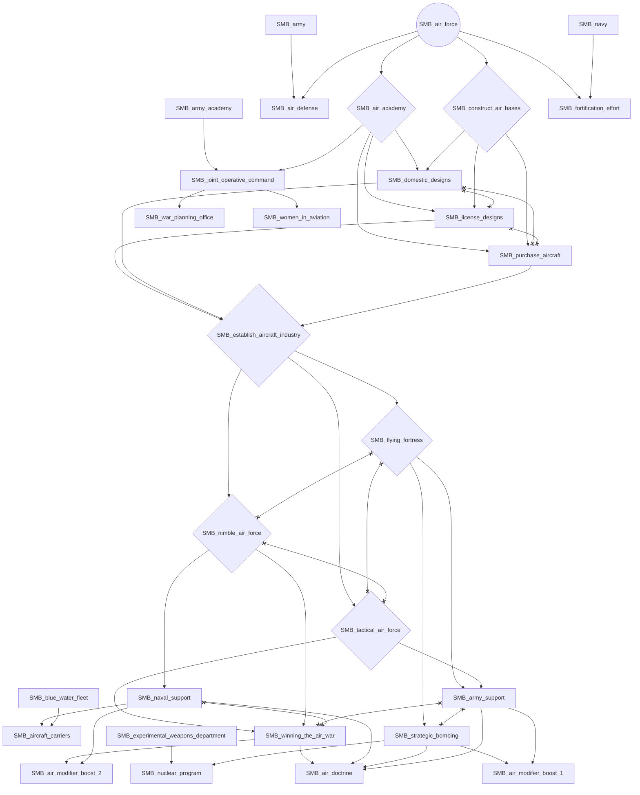
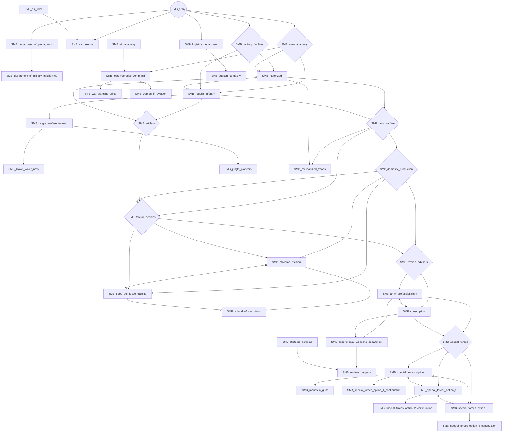
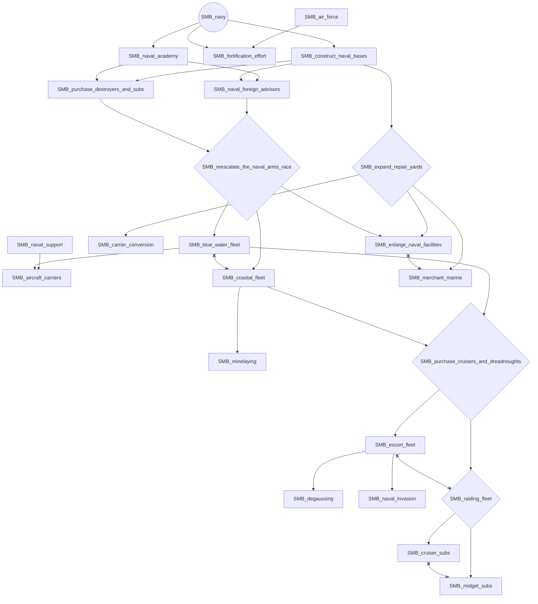

# SMB_air_force

```mermaid
flowchart TD
    n1{"SMB_air_academy"}
    n2["SMB_air_defense"]
    n3["SMB_air_doctrine"]
    n4(("SMB_air_force"))
    n5["SMB_air_modifier_boost_1"]
    n6["SMB_air_modifier_boost_2"]
    n7["SMB_aircraft_carriers"]
    n8["SMB_army"]
    n9["SMB_army_academy"]
    n10["SMB_army_support"]
    n11["SMB_blue_water_fleet"]
    n12{"SMB_construct_air_bases"}
    n13["SMB_domestic_designs"]
    n14{"SMB_establish_aircraft_industry"}
    n15["SMB_experimental_weapons_department"]
    n16{"SMB_flying_fortress"}
    n17["SMB_fortification_effort"]
    n18["SMB_joint_operative_command"]
    n19["SMB_license_designs"]
    n20["SMB_naval_support"]
    n21["SMB_navy"]
    n22{"SMB_nimble_air_force"}
    n23["SMB_nuclear_program"]
    n24["SMB_purchase_aircraft"]
    n25["SMB_strategic_bombing"]
    n26{"SMB_tactical_air_force"}
    n27["SMB_war_planning_office"]
    n28["SMB_winning_the_air_war"]
    n29["SMB_women_in_aviation"]
    n4 --> n1
    n8 --> n2
    n4 --> n2
    n28 --> n3
    n20 --> n3
    n25 --> n3
    n10 --> n3
    n25 --> n5
    n10 --> n5
    n28 --> n6
    n20 --> n6
    n20 --> n7
    n11 --> n7
    n16 --> n10
    n26 --> n10
    n4 --> n12
    n1 --> n13
    n12 --> n13
    n19 --> n14
    n13 --> n14
    n24 --> n14
    n14 --> n16
    n4 --> n17
    n21 --> n17
    n9 --> n18
    n1 --> n18
    n1 --> n19
    n12 --> n19
    n22 --> n20
    n14 --> n22
    n15 --> n23
    n25 --> n23
    n1 --> n24
    n12 --> n24
    n16 --> n25
    n14 --> n26
    n18 --> n27
    n26 --> n28
    n22 --> n28
    n18 --> n29
    n10 x--x n25
    n10 x--x n28
    n13 x--x n19
    n13 x--x n24
    n16 x--x n22
    n16 x--x n26
    n19 x--x n24
    n20 x--x n28
    n22 x--x n26
```

# SMB_army

```mermaid
flowchart TD
    n30["SMB_a_land_of_mountains"]
    n1["SMB_air_academy"]
    n2["SMB_air_defense"]
    n4["SMB_air_force"]
    n8(("SMB_army"))
    n9{"SMB_army_academy"}
    n31["SMB_army_professionalism"]
    n32{"SMB_artillery"}
    n33["SMB_atacama_training"]
    n34["SMB_brown_water_navy"]
    n35["SMB_conscription"]
    n36["SMB_department_of_military_intelligence"]
    n37["SMB_department_of_propaganda"]
    n38{"SMB_domestic_production"}
    n15["SMB_experimental_weapons_department"]
    n39{"SMB_foreign_advisors"}
    n40{"SMB_foreign_designs"}
    n18["SMB_joint_operative_command"]
    n41["SMB_jungle_pioneers"]
    n42["SMB_jungle_warfare_training"]
    n43["SMB_logistics_department"]
    n44["SMB_mechanized_troops"]
    n45{"SMB_military_facilities"}
    n46["SMB_motorized"]
    n47["SMB_mountain_guns"]
    n23["SMB_nuclear_program"]
    n48["SMB_regular_infantry"]
    n49{"SMB_special_forces"}
    n50["SMB_special_forces_option_1"]
    n51["SMB_special_forces_option_1_continuation"]
    n52["SMB_special_forces_option_2"]
    n53["SMB_special_forces_option_2_continuation"]
    n54["SMB_special_forces_option_3"]
    n55["SMB_special_forces_option_3_continuation"]
    n25["SMB_strategic_bombing"]
    n56["SMB_support_company"]
    n57{"SMB_tank_warfare"}
    n58["SMB_tierra_del_fuego_training"]
    n27["SMB_war_planning_office"]
    n29["SMB_women_in_aviation"]
    n33 --> n30
    n58 --> n30
    n8 --> n2
    n4 --> n2
    n8 --> n9
    n39 --> n31
    n48 --> n32
    n46 --> n32
    n38 --> n33
    n40 --> n33
    n42 --> n34
    n39 --> n35
    n37 --> n36
    n8 --> n37
    n57 --> n38
    n31 --> n15
    n35 --> n15
    n38 --> n39
    n40 --> n39
    n57 --> n40
    n32 --> n40
    n9 --> n18
    n1 --> n18
    n42 --> n41
    n48 --> n42
    n8 --> n43
    n57 --> n44
    n46 --> n44
    n8 --> n45
    n45 --> n46
    n9 --> n46
    n50 --> n47
    n15 --> n23
    n25 --> n23
    n9 --> n48
    n45 --> n48
    n31 --> n49
    n35 --> n49
    n49 --> n50
    n50 --> n51
    n49 --> n52
    n52 --> n53
    n49 --> n54
    n54 --> n55
    n43 --> n56
    n46 --> n57
    n48 --> n57
    n38 --> n58
    n40 --> n58
    n18 --> n27
    n18 --> n29
    n31 x--x n35
    n33 x--x n58
    n38 x--x n40
    n46 x--x n48
    n50 x--x n52
    n50 x--x n54
    n52 x--x n54
```

# SMB_navy

```mermaid
flowchart TD
    n4["SMB_air_force"]
    n7["SMB_aircraft_carriers"]
    n11["SMB_blue_water_fleet"]
    n59["SMB_carrier_conversion"]
    n60["SMB_coastal_fleet"]
    n61["SMB_construct_naval_bases"]
    n62["SMB_cruiser_subs"]
    n63["SMB_degaussing"]
    n64["SMB_enlarge_naval_facilities"]
    n65["SMB_escort_fleet"]
    n66{"SMB_expand_repair_yards"}
    n17["SMB_fortification_effort"]
    n67["SMB_merchant_marine"]
    n68["SMB_midget_subs"]
    n69["SMB_minelaying"]
    n70["SMB_naval_academy"]
    n71["SMB_naval_foreign_advisors"]
    n72["SMB_naval_invasion"]
    n20["SMB_naval_support"]
    n21(("SMB_navy"))
    n73{"SMB_purchase_cruisers_and_dreadnoughts"}
    n74["SMB_purchase_destroyers_and_subs"]
    n75{"SMB_raiding_fleet"}
    n76{"SMB_reescalate_the_naval_arms_race"}
    n20 --> n7
    n11 --> n7
    n76 --> n11
    n66 --> n59
    n76 --> n60
    n21 --> n61
    n75 --> n62
    n65 --> n63
    n66 --> n64
    n76 --> n64
    n73 --> n65
    n61 --> n66
    n4 --> n17
    n21 --> n17
    n66 --> n67
    n75 --> n68
    n60 --> n69
    n21 --> n70
    n70 --> n71
    n61 --> n71
    n65 --> n72
    n11 --> n73
    n60 --> n73
    n61 --> n74
    n70 --> n74
    n73 --> n75
    n71 --> n76
    n74 --> n76
    n11 x--x n60
    n62 x--x n68
    n64 x--x n67
    n65 x--x n75
```
