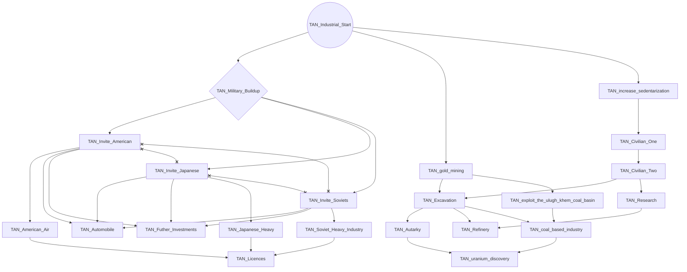
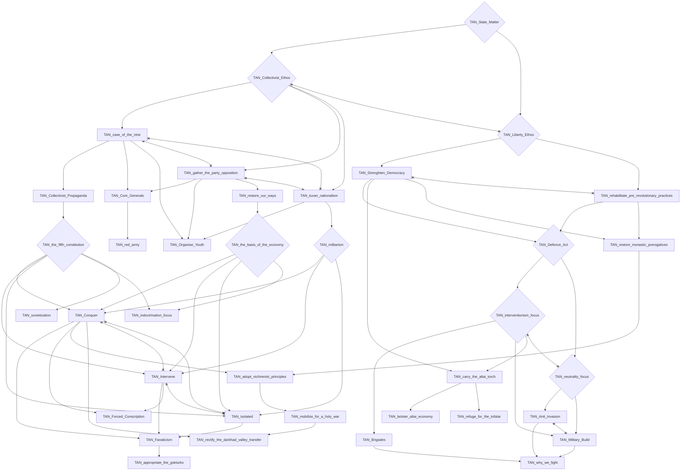
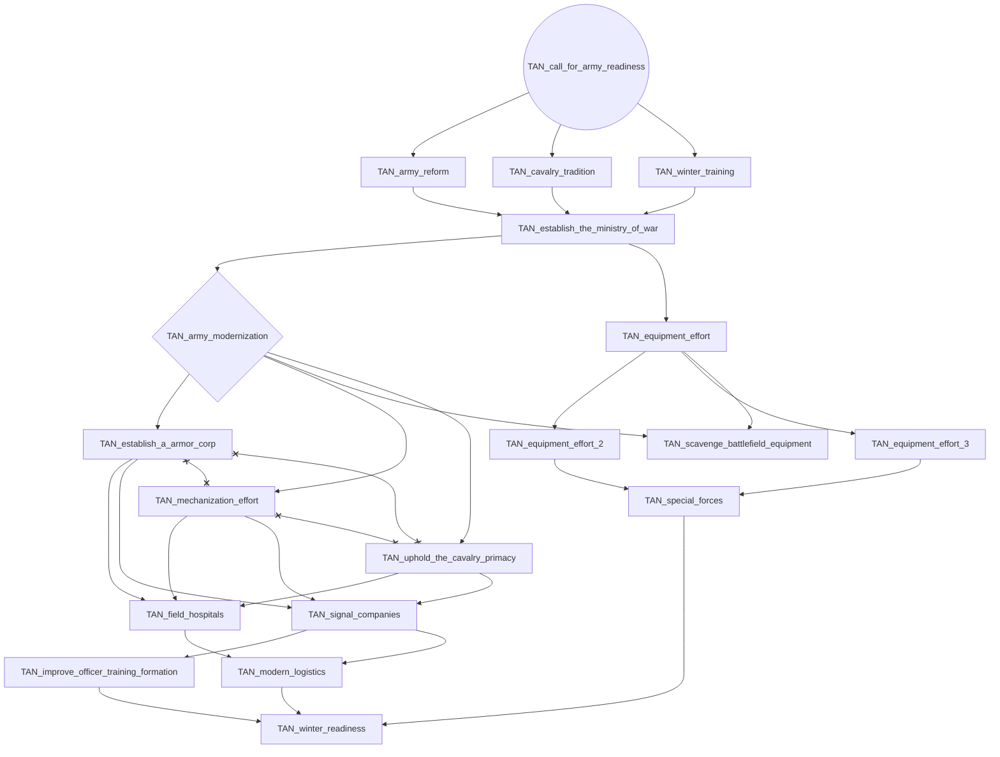
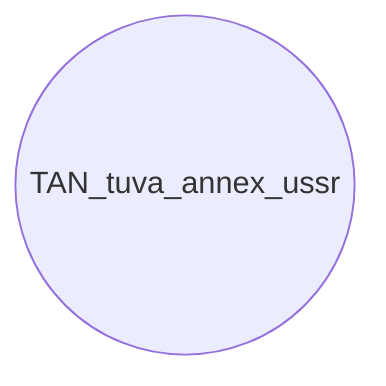

# TAN_Industrial_Start

```mermaid
flowchart TD
    n1["TAN_American_Air"]
    n2["TAN_Autarky"]
    n3["TAN_Automobile"]
    n4["TAN_Civilian_One"]
    n5["TAN_Civilian_Two"]
    n6["TAN_Excavation"]
    n7["TAN_Futher_Investments"]
    n8(("TAN_Industrial_Start"))
    n9["TAN_Invite_American"]
    n10["TAN_Invite_Japanese"]
    n11["TAN_Invite_Soviets"]
    n12["TAN_Japanese_Heavy"]
    n13["TAN_Licences"]
    n14{"TAN_Military_Buildup"}
    n15["TAN_Refinery"]
    n16["TAN_Research"]
    n17["TAN_Soviet_Heavy_Industry"]
    n18["TAN_coal_based_industry"]
    n19["TAN_exploit_the_ulugh_khem_coal_basin"]
    n20["TAN_gold_mining"]
    n21["TAN_increase_sedentarization"]
    n22["TAN_uranium_discovery"]
    n9 --> n1
    n6 --> n2
    n9 --> n3
    n10 --> n3
    n11 --> n3
    n21 --> n4
    n4 --> n5
    n5 --> n6
    n20 --> n6
    n9 --> n7
    n10 --> n7
    n11 --> n7
    n14 --> n9
    n14 --> n10
    n14 --> n11
    n10 --> n12
    n1 --> n13
    n12 --> n13
    n17 --> n13
    n8 --> n14
    n6 --> n15
    n16 --> n15
    n5 --> n16
    n11 --> n17
    n6 --> n18
    n19 --> n18
    n20 --> n19
    n8 --> n20
    n8 --> n21
    n2 --> n22
    n18 --> n22
    n9 x--x n10
    n9 x--x n11
    n10 x--x n11
```

# TAN_State_Matter

```mermaid
flowchart TD
    n23["TAN_Anti_Invasion"]
    n24["TAN_Brigades"]
    n25{"TAN_Collectivist_Ethos"}
    n26["TAN_Collectivist_Propaganda"]
    n27["TAN_Com_Generals"]
    n28["TAN_Conquer"]
    n29{"TAN_Defence_Act"}
    n30["TAN_Fanaticism"]
    n31["TAN_Forced_Conscription"]
    n32["TAN_Intervene"]
    n33["TAN_Isolated"]
    n34{"TAN_Liberty_Ethos"}
    n35["TAN_Military_Build"]
    n36["TAN_Organise_Youth"]
    n37{"TAN_State_Matter"}
    n38["TAN_Strenghten_Democracy"]
    n39["TAN_adopt_nichirenist_principles"]
    n40["TAN_appropriate_the_gokturks"]
    n41["TAN_bolster_altai_economy"]
    n42["TAN_carry_the_altai_torch"]
    n43["TAN_case_of_the_nine"]
    n44["TAN_gather_the_party_opposition"]
    n45["TAN_indoctrination_focus"]
    n46{"TAN_interventionism_focus"}
    n47{"TAN_militarism"}
    n48["TAN_mobilize_for_a_holy_war"]
    n49{"TAN_neutrality_focus"}
    n50["TAN_rectify_the_darkhad_valley_transfer"]
    n51["TAN_red_army"]
    n52["TAN_refuge_for_the_tofalar"]
    n53["TAN_rehabilitate_pre_revolutionary_practices"]
    n54["TAN_restore_monastic_prerogatives"]
    n55["TAN_restore_our_ways"]
    n56["TAN_sovietization"]
    n57{"TAN_the_basis_of_the_economy"}
    n58{"TAN_the_fifth_constitution"}
    n59["TAN_tuvan_nationalism"]
    n60["TAN_why_we_fight"]
    n49 --> n23
    n46 --> n24
    n37 --> n25
    n43 --> n26
    n43 --> n27
    n44 --> n27
    n47 --> n28
    n58 --> n28
    n57 --> n28
    n53 --> n29
    n38 --> n29
    n33 --> n30
    n32 --> n30
    n28 --> n30
    n28 --> n31
    n32 --> n31
    n47 --> n32
    n58 --> n32
    n57 --> n32
    n47 --> n33
    n58 --> n33
    n57 --> n33
    n37 --> n34
    n49 --> n35
    n46 --> n35
    n59 --> n36
    n43 --> n36
    n44 --> n36
    n34 --> n38
    n54 --> n39
    n28 --> n39
    n30 --> n40
    n42 --> n41
    n38 --> n42
    n46 --> n42
    n25 --> n43
    n25 --> n44
    n58 --> n45
    n57 --> n45
    n29 --> n46
    n59 --> n47
    n39 --> n48
    n29 --> n49
    n28 --> n50
    n48 --> n50
    n27 --> n51
    n42 --> n52
    n34 --> n53
    n53 --> n54
    n38 --> n54
    n44 --> n55
    n58 --> n56
    n55 --> n57
    n26 --> n58
    n25 --> n59
    n23 --> n60
    n35 --> n60
    n24 --> n60
    n23 x--x n35
    n25 x--x n34
    n28 x--x n32
    n28 x--x n33
    n32 x--x n33
    n38 x--x n53
    n43 x--x n44
    n43 x--x n59
    n44 x--x n59
    n46 x--x n49
```

# TAN_call_for_army_readiness

```mermaid
flowchart TD
    n61{"TAN_army_modernization"}
    n62["TAN_army_reform"]
    n63(("TAN_call_for_army_readiness"))
    n64["TAN_cavalry_tradition"]
    n65["TAN_equipment_effort"]
    n66["TAN_equipment_effort_2"]
    n67["TAN_equipment_effort_3"]
    n68["TAN_establish_a_armor_corp"]
    n69["TAN_establish_the_ministry_of_war"]
    n70["TAN_field_hospitals"]
    n71["TAN_improve_officer_training_formation"]
    n72["TAN_mechanization_effort"]
    n73["TAN_modern_logistics"]
    n74["TAN_scavenge_battlefield_equipment"]
    n75["TAN_signal_companies"]
    n76["TAN_special_forces"]
    n77["TAN_uphold_the_cavalry_primacy"]
    n78["TAN_winter_readiness"]
    n79["TAN_winter_training"]
    n69 --> n61
    n63 --> n62
    n63 --> n64
    n69 --> n65
    n65 --> n66
    n65 --> n67
    n61 --> n68
    n62 --> n69
    n79 --> n69
    n64 --> n69
    n72 --> n70
    n77 --> n70
    n68 --> n70
    n75 --> n71
    n61 --> n72
    n70 --> n73
    n75 --> n73
    n65 --> n74
    n61 --> n74
    n68 --> n75
    n72 --> n75
    n77 --> n75
    n67 --> n76
    n66 --> n76
    n61 --> n77
    n76 --> n78
    n71 --> n78
    n73 --> n78
    n63 --> n79
    n68 x--x n72
    n68 x--x n77
    n72 x--x n77
```

# TAN_tuva_annex_ussr

```mermaid
flowchart TD
    n80(("TAN_tuva_annex_ussr"))
```
