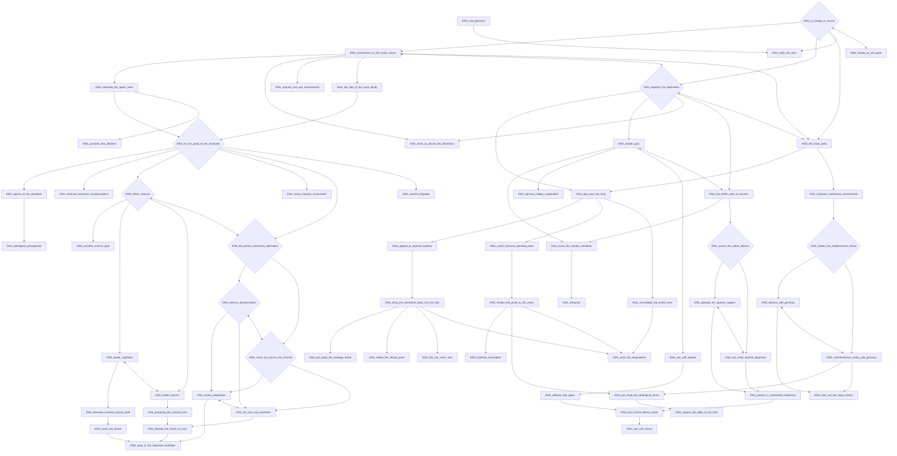
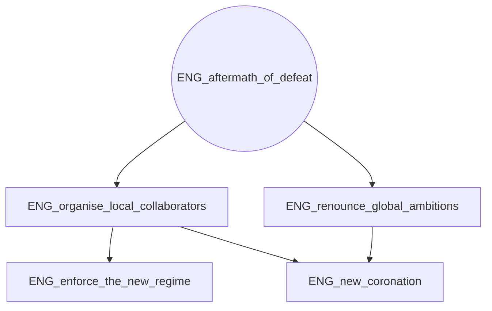
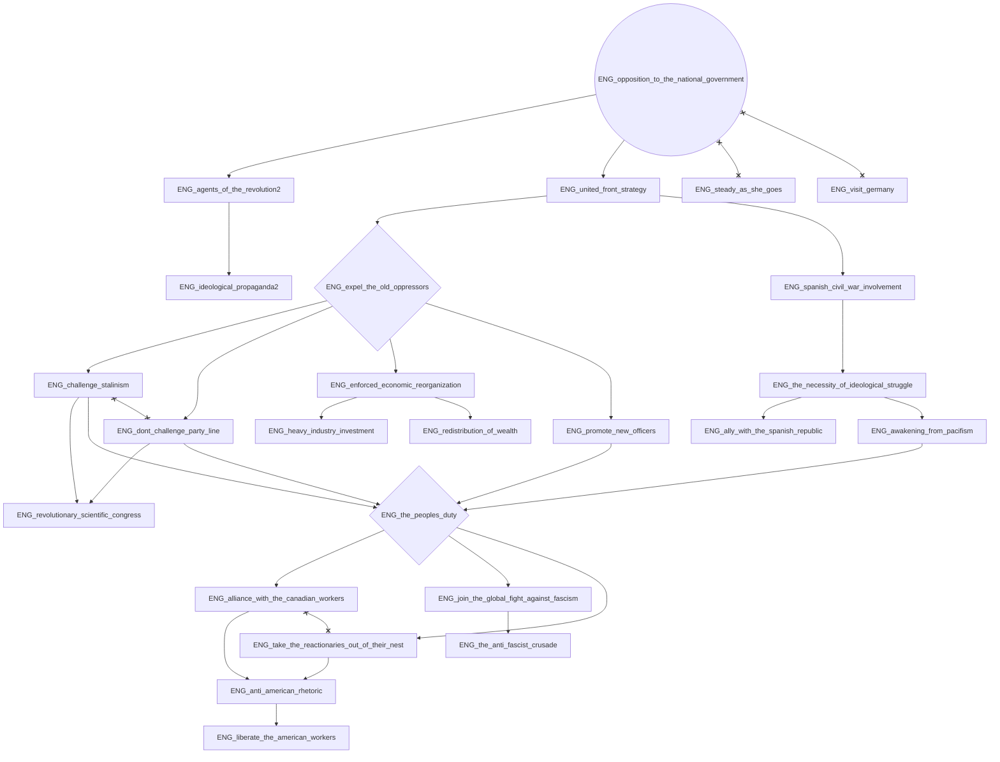
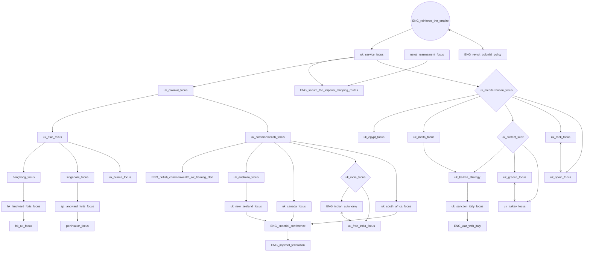
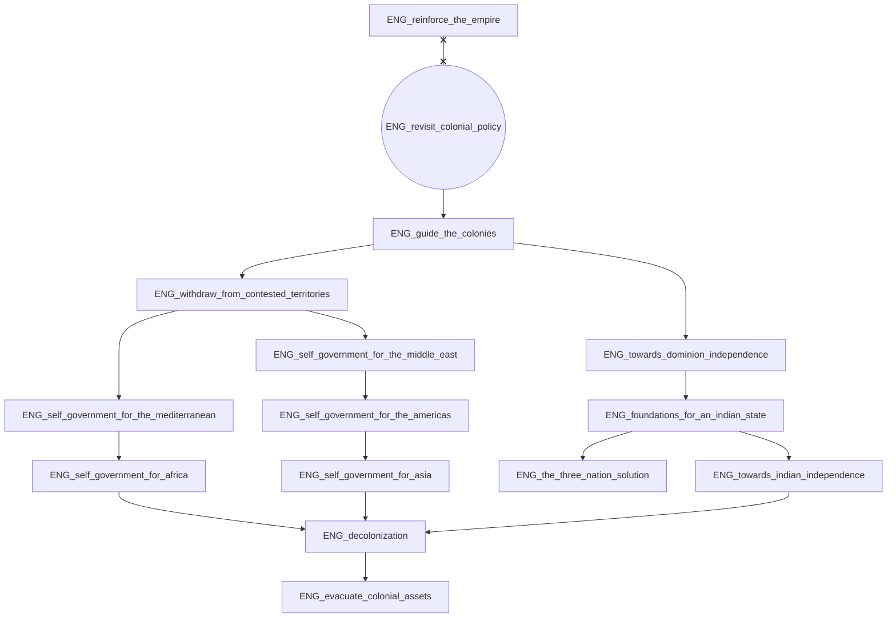
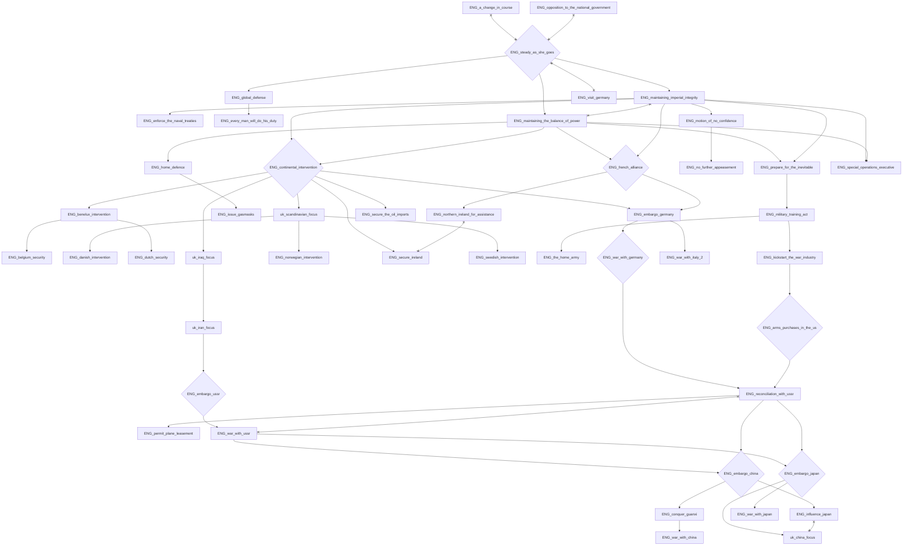
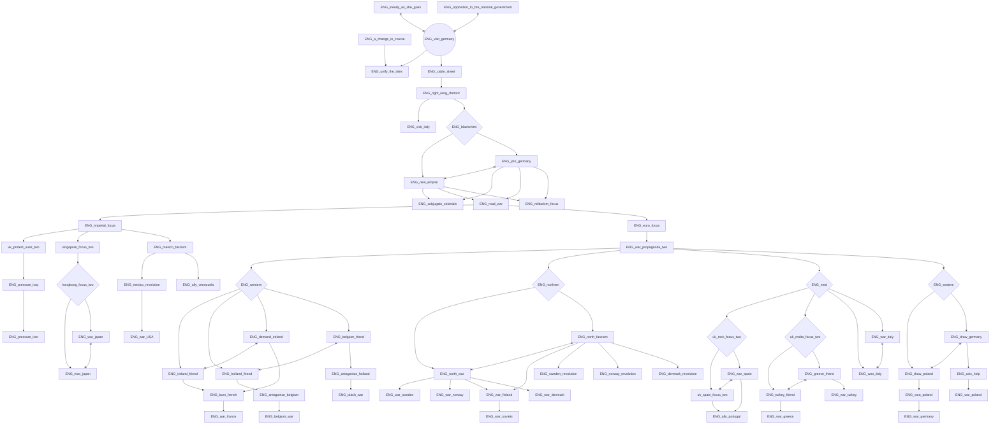
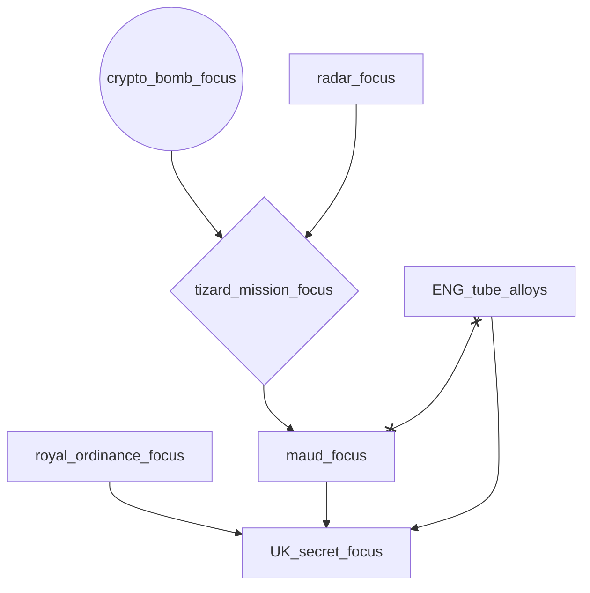

# ENG_a_change_in_course

# ENG_aftermath_of_defeat

# ENG_opposition_to_the_national_government

# ENG_reinforce_the_empire

# ENG_revisit_colonial_policy

# ENG_steady_as_she_goes

# ENG_visit_germany

# crypto_bomb_focus

# limited_rearmament_focus

```mermaid
flowchart TD
    n255["ENG_a_s_warfare"]
    n256["ENG_admiralty_naval_staff"]
    n257["ENG_anti_non_contact_committee"]
    n258["ENG_anti_submarine_training_school"]
    n259["ENG_chiefs_of_staff_committee"]
    n260["ENG_expand_the_repair_yards"]
    n261["ENG_expand_the_secret_intelligence_service_focus"]
    n262["ENG_motorized_focus"]
    n263["ENG_parachute_regiments"]
    n98["ENG_secure_the_imperial_shipping_routes"]
    n264["ENG_special_air_service"]
    n265["ENG_tank_focus"]
    n266["ENG_tank_variant_focus"]
    n267["ENG_the_wartime_cabinet_committee"]
    n248["ENG_tube_alloys"]
    n268["ENG_vanguard"]
    n269["ENG_vickers_experimental_facility_focus"]
    n249["UK_secret_focus"]
    n270["air_defense_focus"]
    n271["air_rearmament_focus"]
    n272["aircraft_production_focus"]
    n273["bomber_command_focus"]
    n274["coastal_command_focus"]
    n250["crypto_bomb_focus"]
    n275["fighter_command_focus"]
    n276["general_rearmament_focus"]
    n277(("limited_rearmament_focus"))
    n251["maud_focus"]
    n103["naval_rearmament_focus"]
    n252{"radar_focus"}
    n253["royal_ordinance_focus"]
    n278["shadow_scheme_focus"]
    n254{"tizard_mission_focus"}
    n279["uk_amphibious_focus"]
    n280["uk_battleship_focus"]
    n281["uk_carrier_focus"]
    n282["uk_convoy_focus"]
    n283["uk_destroyer_focus"]
    n284["uk_extra_tech_slot"]
    n285["uk_industrial_focus"]
    n286["uk_jet_focus"]
    n287["uk_naval_gunnery"]
    n124["uk_service_focus"]
    n288["uk_small_arms_focus"]
    n289{"uk_waves_focus"}
    n283 --> n255
    n289 --> n256
    n103 --> n257
    n282 --> n258
    n271 --> n259
    n103 --> n259
    n280 --> n260
    n281 --> n260
    n277 --> n261
    n277 --> n262
    n264 --> n263
    n103 --> n98
    n124 --> n98
    n276 --> n264
    n262 --> n265
    n265 --> n266
    n277 --> n267
    n252 --> n248
    n280 --> n268
    n285 --> n269
    n253 --> n249
    n251 --> n249
    n248 --> n249
    n277 --> n270
    n276 --> n271
    n275 --> n272
    n273 --> n272
    n274 --> n272
    n271 --> n273
    n271 --> n274
    n271 --> n275
    n277 --> n276
    n254 --> n251
    n276 --> n103
    n270 --> n252
    n285 --> n253
    n277 --> n278
    n250 --> n254
    n252 --> n254
    n103 --> n279
    n289 --> n280
    n289 --> n281
    n283 --> n282
    n103 --> n283
    n285 --> n284
    n278 --> n285
    n272 --> n286
    n289 --> n287
    n253 --> n288
    n103 --> n289
    n248 x--x n251
    n280 x--x n281
```

