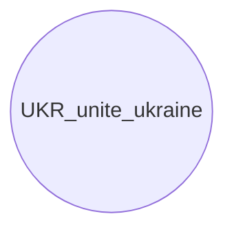

# UKR_free_and_at_peace

```mermaid
flowchart TD
    n1["UKR_Refinery"]
    n2["UKR_a_condominium_in_western_ukraine"]
    n3["UKR_alliance_with_the_kaiserreich"]
    n4["UKR_ally_with_bermondt_avalov"]
    n5["UKR_approach_poland"]
    n6["UKR_arsenal_factory"]
    n7["UKR_azovstal"]
    n8["UKR_build_trainer_aircrafts"]
    n9["UKR_cement_military_rule"]
    n10["UKR_coal_mining"]
    n11["UKR_common_doctrinal_development"]
    n12["UKR_conscript_management_focus"]
    n13["UKR_construction_technologies"]
    n14["UKR_continue_communist_rule"]
    n15{"UKR_cossack_heritage"}
    n16["UKR_cult_of_action"]
    n17["UKR_defy_the_polish_cossack"]
    n18["UKR_demand_ukrainian_bessarabia"]
    n19["UKR_deterrence"]
    n20["UKR_develop_the_west"]
    n21["UKR_diversify_artillery_types"]
    n22["UKR_diversify_factory_183"]
    n23["UKR_economic_reforms"]
    n24["UKR_elect_the_verkhovna_rada"]
    n25["UKR_embrace_the_1919_map"]
    n26{"UKR_empower_the_head_of_state"}
    n27["UKR_encourage_exports"]
    n28["UKR_encourage_the_proletariat"]
    n29["UKR_expand_the_mining_industry"]
    n30["UKR_forest_training"]
    n31{"UKR_free_and_at_peace"}
    n32["UKR_free_the_oppressed_cossacks"]
    n33["UKR_heavy_steel_production"]
    n34["UKR_ideological_propaganda"]
    n35["UKR_industrial_development"]
    n36["UKR_industrial_technologies"]
    n37["UKR_infantry_anti_tank_tactics"]
    n38["UKR_integrated_weapon_developments"]
    n39["UKR_invest_along_the_coast"]
    n40["UKR_invite_foreign_investors"]
    n41["UKR_join_intermarium"]
    n42["UKR_join_the_allies"]
    n43["UKR_join_the_axis"]
    n44["UKR_kharkiv_aviation_factory"]
    n45["UKR_kharkiv_locomotive_plant"]
    n46["UKR_kyiv_aviation_plant_12"]
    n47["UKR_legacy_of_the_sich_riflemen"]
    n48["UKR_look_to_the_skies"]
    n49["UKR_military_cooperation_with_poland"]
    n50["UKR_modern_combat_doctrine"]
    n51["UKR_motorized_support"]
    n52["UKR_national_military_academy"]
    n53["UKR_naval_aviation"]
    n54["UKR_obtain_church_blessings"]
    n55["UKR_organize_the_army"]
    n56["UKR_oun_militias"]
    n57{"UKR_our_place_in_the_world"}
    n58["UKR_political_batallions"]
    n59["UKR_political_commissars"]
    n60["UKR_press_the_habsburg_claim"]
    n61["UKR_protect_crimea"]
    n62["UKR_radar_network"]
    n63["UKR_railway_artillery"]
    n64["UKR_railway_construction"]
    n65["UKR_rally_around_the_king"]
    n66{"UKR_reborn_through_war"}
    n67["UKR_red_army"]
    n68["UKR_refine_air_doctrine"]
    n69["UKR_restore_the_hetmanate"]
    n70["UKR_revise_the_defence_industry"]
    n71["UKR_revolutionary_guards"]
    n72["UKR_road_construction"]
    n73["UKR_small_arms_equipment"]
    n74["UKR_support_designers_innovations"]
    n75["UKR_take_a_pro_russian_stance"]
    n76["UKR_train_mechanics"]
    n77["UKR_train_pilots"]
    n78["UKR_ukraine_has_not_yet_perished"]
    n79{"UKR_use_the_morozov_design_bureau"}
    n80["UKR_we_were_born_in_a_great_hour"]
    n81["UKR_why_we_fight"]
    n82["UKR_winter_equipment"]
    n10 --> n1
    n38 --> n1
    n5 --> n2
    n57 --> n3
    n15 --> n4
    n24 --> n5
    n69 --> n5
    n55 --> n6
    n36 --> n7
    n48 --> n8
    n80 --> n9
    n7 --> n10
    n49 --> n11
    n55 --> n12
    n35 --> n13
    n66 --> n14
    n31 --> n14
    n69 --> n15
    n9 --> n16
    n15 --> n17
    n16 --> n18
    n15 --> n18
    n23 --> n19
    n13 --> n20
    n6 --> n21
    n79 --> n22
    n24 --> n23
    n66 --> n24
    n31 --> n24
    n18 --> n25
    n66 --> n26
    n31 --> n26
    n23 --> n27
    n14 --> n28
    n28 --> n29
    n37 --> n30
    n57 --> n32
    n79 --> n33
    n7 --> n33
    n71 --> n34
    n36 --> n35
    n66 --> n36
    n31 --> n36
    n73 --> n37
    n33 --> n38
    n13 --> n39
    n23 --> n40
    n5 --> n41
    n19 --> n42
    n16 --> n43
    n56 --> n43
    n48 --> n44
    n79 --> n45
    n48 --> n46
    n69 --> n47
    n55 --> n48
    n2 --> n49
    n37 --> n50
    n21 --> n50
    n22 --> n51
    n50 --> n52
    n76 --> n53
    n74 --> n53
    n69 --> n54
    n66 --> n55
    n31 --> n55
    n9 --> n56
    n15 --> n57
    n14 --> n58
    n58 --> n59
    n65 --> n60
    n19 --> n61
    n68 --> n62
    n21 --> n63
    n45 --> n63
    n13 --> n64
    n47 --> n65
    n59 --> n67
    n77 --> n68
    n74 --> n68
    n26 --> n69
    n69 --> n70
    n59 --> n71
    n13 --> n72
    n55 --> n73
    n8 --> n74
    n44 --> n74
    n46 --> n74
    n57 --> n75
    n8 --> n76
    n44 --> n76
    n46 --> n76
    n8 --> n77
    n44 --> n77
    n46 --> n77
    n16 --> n78
    n56 --> n78
    n55 --> n79
    n26 --> n80
    n19 --> n81
    n37 --> n82
    n4 x--x n17
    n14 x--x n24
    n14 x--x n26
    n22 x--x n45
    n24 x--x n26
    n31 x--x n66
    n32 x--x n75
    n69 x--x n80
```

# UKR_reborn_through_war

```mermaid
flowchart TD
    n1["UKR_Refinery"]
    n2["UKR_a_condominium_in_western_ukraine"]
    n3["UKR_alliance_with_the_kaiserreich"]
    n4["UKR_ally_with_bermondt_avalov"]
    n5["UKR_approach_poland"]
    n6["UKR_arsenal_factory"]
    n7["UKR_azovstal"]
    n8["UKR_build_trainer_aircrafts"]
    n9["UKR_cement_military_rule"]
    n10["UKR_coal_mining"]
    n11["UKR_common_doctrinal_development"]
    n12["UKR_conscript_management_focus"]
    n13["UKR_construction_technologies"]
    n14["UKR_continue_communist_rule"]
    n15{"UKR_cossack_heritage"}
    n16["UKR_cult_of_action"]
    n17["UKR_defy_the_polish_cossack"]
    n18["UKR_demand_ukrainian_bessarabia"]
    n19["UKR_deterrence"]
    n20["UKR_develop_the_west"]
    n21["UKR_diversify_artillery_types"]
    n22["UKR_diversify_factory_183"]
    n23["UKR_economic_reforms"]
    n24["UKR_elect_the_verkhovna_rada"]
    n25["UKR_embrace_the_1919_map"]
    n26{"UKR_empower_the_head_of_state"}
    n27["UKR_encourage_exports"]
    n28["UKR_encourage_the_proletariat"]
    n29["UKR_expand_the_mining_industry"]
    n30["UKR_forest_training"]
    n31{"UKR_free_and_at_peace"}
    n32["UKR_free_the_oppressed_cossacks"]
    n33["UKR_heavy_steel_production"]
    n34["UKR_ideological_propaganda"]
    n35["UKR_industrial_development"]
    n36["UKR_industrial_technologies"]
    n37["UKR_infantry_anti_tank_tactics"]
    n38["UKR_integrated_weapon_developments"]
    n39["UKR_invest_along_the_coast"]
    n40["UKR_invite_foreign_investors"]
    n41["UKR_join_intermarium"]
    n42["UKR_join_the_allies"]
    n43["UKR_join_the_axis"]
    n44["UKR_kharkiv_aviation_factory"]
    n45["UKR_kharkiv_locomotive_plant"]
    n46["UKR_kyiv_aviation_plant_12"]
    n47["UKR_legacy_of_the_sich_riflemen"]
    n48["UKR_look_to_the_skies"]
    n49["UKR_military_cooperation_with_poland"]
    n50["UKR_modern_combat_doctrine"]
    n51["UKR_motorized_support"]
    n52["UKR_national_military_academy"]
    n53["UKR_naval_aviation"]
    n54["UKR_obtain_church_blessings"]
    n55["UKR_organize_the_army"]
    n56["UKR_oun_militias"]
    n57{"UKR_our_place_in_the_world"}
    n58["UKR_political_batallions"]
    n59["UKR_political_commissars"]
    n60["UKR_press_the_habsburg_claim"]
    n61["UKR_protect_crimea"]
    n62["UKR_radar_network"]
    n63["UKR_railway_artillery"]
    n64["UKR_railway_construction"]
    n65["UKR_rally_around_the_king"]
    n66{"UKR_reborn_through_war"}
    n67["UKR_red_army"]
    n68["UKR_refine_air_doctrine"]
    n69["UKR_restore_the_hetmanate"]
    n70["UKR_revise_the_defence_industry"]
    n71["UKR_revolutionary_guards"]
    n72["UKR_road_construction"]
    n73["UKR_small_arms_equipment"]
    n74["UKR_support_designers_innovations"]
    n75["UKR_take_a_pro_russian_stance"]
    n76["UKR_train_mechanics"]
    n77["UKR_train_pilots"]
    n78["UKR_ukraine_has_not_yet_perished"]
    n79{"UKR_use_the_morozov_design_bureau"}
    n80["UKR_we_were_born_in_a_great_hour"]
    n81["UKR_why_we_fight"]
    n82["UKR_winter_equipment"]
    n10 --> n1
    n38 --> n1
    n5 --> n2
    n57 --> n3
    n15 --> n4
    n24 --> n5
    n69 --> n5
    n55 --> n6
    n36 --> n7
    n48 --> n8
    n80 --> n9
    n7 --> n10
    n49 --> n11
    n55 --> n12
    n35 --> n13
    n66 --> n14
    n31 --> n14
    n69 --> n15
    n9 --> n16
    n15 --> n17
    n16 --> n18
    n15 --> n18
    n23 --> n19
    n13 --> n20
    n6 --> n21
    n79 --> n22
    n24 --> n23
    n66 --> n24
    n31 --> n24
    n18 --> n25
    n66 --> n26
    n31 --> n26
    n23 --> n27
    n14 --> n28
    n28 --> n29
    n37 --> n30
    n57 --> n32
    n79 --> n33
    n7 --> n33
    n71 --> n34
    n36 --> n35
    n66 --> n36
    n31 --> n36
    n73 --> n37
    n33 --> n38
    n13 --> n39
    n23 --> n40
    n5 --> n41
    n19 --> n42
    n16 --> n43
    n56 --> n43
    n48 --> n44
    n79 --> n45
    n48 --> n46
    n69 --> n47
    n55 --> n48
    n2 --> n49
    n37 --> n50
    n21 --> n50
    n22 --> n51
    n50 --> n52
    n76 --> n53
    n74 --> n53
    n69 --> n54
    n66 --> n55
    n31 --> n55
    n9 --> n56
    n15 --> n57
    n14 --> n58
    n58 --> n59
    n65 --> n60
    n19 --> n61
    n68 --> n62
    n21 --> n63
    n45 --> n63
    n13 --> n64
    n47 --> n65
    n59 --> n67
    n77 --> n68
    n74 --> n68
    n26 --> n69
    n69 --> n70
    n59 --> n71
    n13 --> n72
    n55 --> n73
    n8 --> n74
    n44 --> n74
    n46 --> n74
    n57 --> n75
    n8 --> n76
    n44 --> n76
    n46 --> n76
    n8 --> n77
    n44 --> n77
    n46 --> n77
    n16 --> n78
    n56 --> n78
    n55 --> n79
    n26 --> n80
    n19 --> n81
    n37 --> n82
    n4 x--x n17
    n14 x--x n24
    n14 x--x n26
    n22 x--x n45
    n24 x--x n26
    n31 x--x n66
    n32 x--x n75
    n69 x--x n80
```

# UKR_unite_ukraine

```mermaid
flowchart TD
    n83(("UKR_unite_ukraine"))
```
