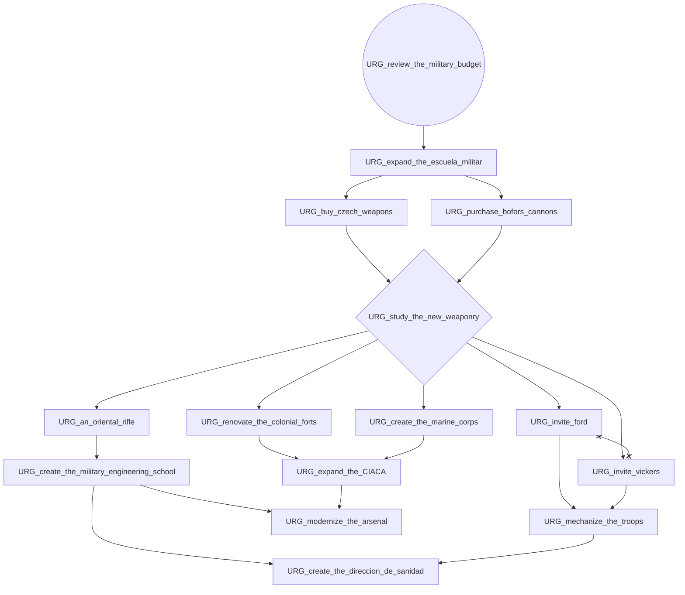
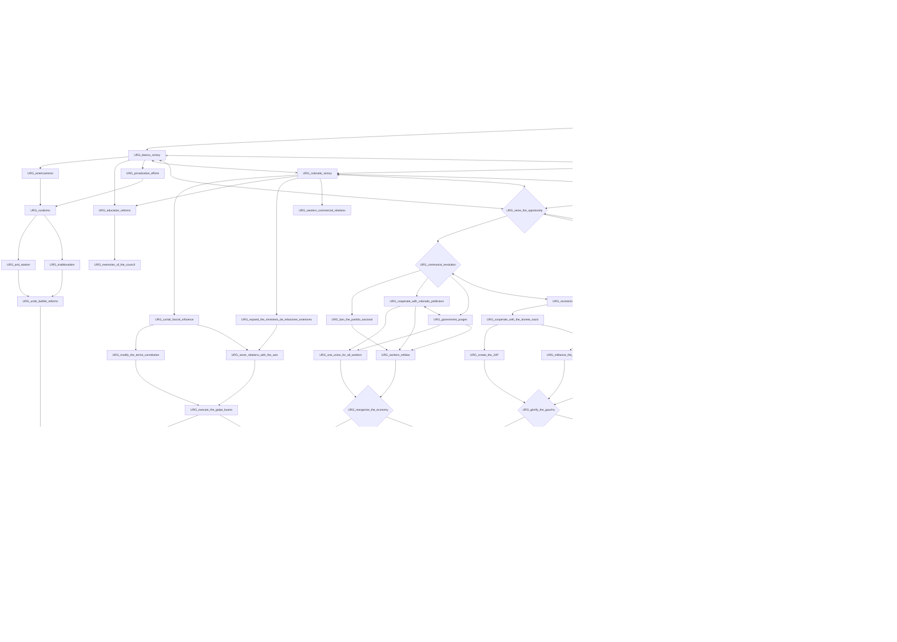

# URG_review_the_military_budget

```mermaid
flowchart TD
    n1["URG_an_oriental_rifle"]
    n2["URG_buy_czech_weapons"]
    n3["URG_create_the_direccion_de_sanidad"]
    n4["URG_create_the_marine_corps"]
    n5["URG_create_the_military_engineering_school"]
    n6["URG_expand_the_CIACA"]
    n7["URG_expand_the_escuela_militar"]
    n8["URG_invite_ford"]
    n9["URG_invite_vickers"]
    n10["URG_mechanize_the_troops"]
    n11["URG_modernize_the_arsenal"]
    n12["URG_purchase_bofors_cannons"]
    n13["URG_renovate_the_colonial_forts"]
    n14(("URG_review_the_military_budget"))
    n15{"URG_study_the_new_weaponry"}
    n15 --> n1
    n7 --> n2
    n5 --> n3
    n10 --> n3
    n15 --> n4
    n1 --> n5
    n13 --> n6
    n4 --> n6
    n14 --> n7
    n15 --> n8
    n15 --> n9
    n8 --> n10
    n9 --> n10
    n5 --> n11
    n6 --> n11
    n7 --> n12
    n15 --> n13
    n2 --> n15
    n12 --> n15
    n8 x--x n9
```

# URG_the_terra_dictatorship

```mermaid
flowchart TD
    n16{"URG_1938_elections"}
    n17["URG_across_the_uruguay_river"]
    n18["URG_americanismo"]
    n19["URG_anti_statism"]
    n20["URG_authoritarian_liberalism"]
    n21["URG_axis_loans"]
    n22["URG_ban_the_partido_nacional"]
    n23["URG_blanco_victory"]
    n24{"URG_champion_of_the_people"}
    n25["URG_colorado_victory"]
    n26{"URG_communist_revolution"}
    n27["URG_constitutional_reforms"]
    n28["URG_cooperate_with_colorado_politicians"]
    n29["URG_cooperate_with_the_bonete_nazis"]
    n30["URG_crackdown_on_the_revolutionaries"]
    n31["URG_create_the_JUP"]
    n32["URG_cross_the_andes"]
    n33["URG_curtail_fascist_influence"]
    n34{"URG_democracia_y_paz"}
    n35["URG_destroy_bipartidism"]
    n36["URG_education_reforms"]
    n37["URG_embrace_our_catholic_heritage"]
    n38{"URG_empower_the_CGT"}
    n39["URG_enshrine_worker_rights"]
    n40["URG_execute_the_golpe_bueno"]
    n41["URG_expand_the_ministerio_de_relaciones_exteriores"]
    n42["URG_expand_the_montevideo_treaty"]
    n43["URG_follow_moscow"]
    n44["URG_further_batllist_reforms"]
    n45{"URG_glorify_the_gaucho"}
    n46["URG_government_purges"]
    n47["URG_join_the_allies"]
    n48["URG_join_the_axis"]
    n49["URG_la_patria_o_la_tumba"]
    n50{"URG_legacy_of_saravia"}
    n51["URG_legalize_female_suffrage"]
    n52["URG_libertad_o_muerte"]
    n53["URG_march_northwards"]
    n54["URG_march_on_buenos_aires"]
    n55["URG_memories_of_the_council"]
    n56["URG_militarize_the_society"]
    n57["URG_modify_the_terrist_constitution"]
    n58["URG_nationalize_foreign_monopolies"]
    n59["URG_one_union_for_all_workers"]
    n60["URG_platine_ambitions"]
    n61["URG_privatization_efforts"]
    n62["URG_protect_the_revolution"]
    n63["URG_public_works_projects"]
    n64["URG_purge_batllist_influence"]
    n65["URG_reapproach_the_soviet_union"]
    n66["URG_reformism"]
    n67{"URG_reorganise_the_economy"}
    n68["URG_repeat_the_paraguayan_war"]
    n69["URG_retake_the_misiones_orientales"]
    n70["URG_revisionist_coup"]
    n71["URG_ruralismo"]
    n72{"URG_seize_the_opprotunity"}
    n73["URG_sever_relations_with_the_axis"]
    n74["URG_social_reforms"]
    n75["URG_socialist_victory"]
    n76["URG_solidarismo"]
    n77["URG_spread_the_revolution"]
    n78["URG_switzerland_of_the_americas"]
    n79["URG_take_a_stance"]
    n80["URG_the_american_revolution"]
    n81["URG_the_dream_of_artigas"]
    n82(("URG_the_terra_dictatorship"))
    n83{"URG_tiranos_temblad"}
    n84["URG_traditionalism"]
    n85["URG_undo_batllist_reforms"]
    n86["URG_we_stand_alone"]
    n87["URG_western_commercial_relations"]
    n88["URG_work_with_the_PCU"]
    n89["URG_work_with_the_anarchists"]
    n90["URG_work_with_the_batllists"]
    n91["URG_workers_militias"]
    n21 --> n16
    n30 --> n16
    n81 --> n17
    n23 --> n18
    n71 --> n19
    n82 --> n20
    n27 --> n21
    n26 --> n22
    n16 --> n23
    n90 --> n24
    n89 --> n24
    n16 --> n25
    n72 --> n26
    n51 --> n27
    n20 --> n27
    n76 --> n27
    n26 --> n28
    n70 --> n29
    n27 --> n30
    n29 --> n31
    n54 --> n32
    n25 --> n33
    n74 --> n34
    n63 --> n34
    n75 --> n35
    n25 --> n36
    n23 --> n36
    n70 --> n37
    n66 --> n38
    n65 --> n38
    n75 --> n39
    n57 --> n40
    n73 --> n40
    n25 --> n41
    n34 --> n42
    n50 --> n42
    n24 --> n42
    n67 --> n43
    n75 --> n44
    n64 --> n45
    n56 --> n45
    n31 --> n45
    n26 --> n46
    n34 --> n47
    n50 --> n47
    n24 --> n47
    n45 --> n48
    n68 --> n49
    n32 --> n49
    n53 --> n49
    n85 --> n50
    n82 --> n51
    n42 --> n52
    n78 --> n52
    n47 --> n52
    n54 --> n53
    n60 --> n54
    n36 --> n55
    n37 --> n56
    n33 --> n57
    n35 --> n58
    n46 --> n59
    n28 --> n59
    n48 --> n60
    n86 --> n60
    n23 --> n61
    n83 --> n62
    n40 --> n63
    n29 --> n64
    n37 --> n64
    n88 --> n65
    n44 --> n66
    n39 --> n66
    n91 --> n67
    n59 --> n67
    n54 --> n68
    n81 --> n69
    n72 --> n70
    n18 --> n71
    n61 --> n71
    n16 --> n72
    n33 --> n73
    n41 --> n73
    n40 --> n74
    n16 --> n75
    n82 --> n76
    n83 --> n77
    n34 --> n78
    n50 --> n78
    n24 --> n78
    n42 --> n79
    n47 --> n79
    n67 --> n80
    n43 --> n81
    n80 --> n81
    n69 --> n83
    n17 --> n83
    n71 --> n84
    n84 --> n85
    n19 --> n85
    n45 --> n86
    n25 --> n87
    n75 --> n88
    n38 --> n89
    n38 --> n90
    n46 --> n91
    n28 --> n91
    n22 --> n91
    n23 x--x n25
    n23 x--x n72
    n23 x--x n75
    n25 x--x n72
    n25 x--x n75
    n26 x--x n70
    n28 x--x n46
    n42 x--x n47
    n42 x--x n78
    n43 x--x n80
    n47 x--x n78
    n48 x--x n86
    n62 x--x n77
    n72 x--x n75
    n89 x--x n90
```
