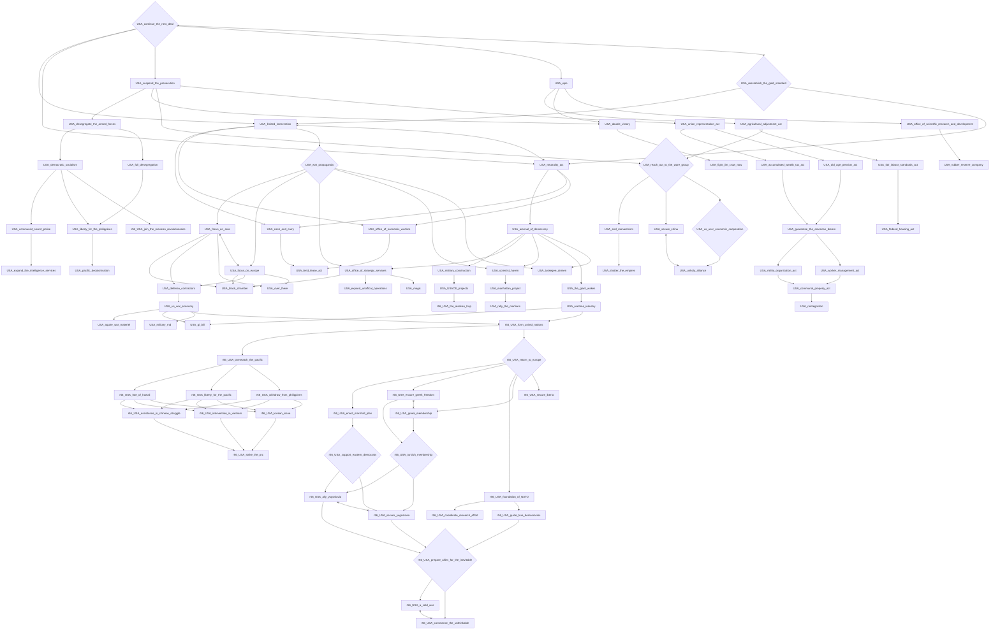
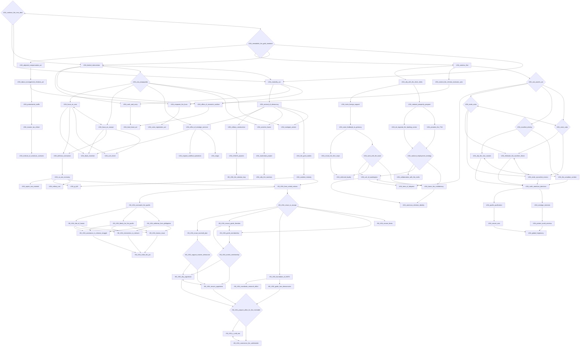
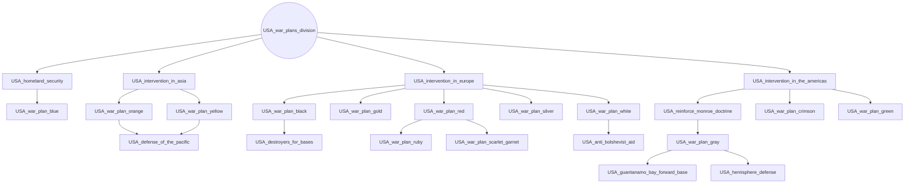

# USA_continue_the_new_deal

```mermaid
flowchart TD
    n1["USA_USACE_projects"]
    n2["USA_accumulated_wealth_tax_act"]
    n3["USA_agricultural_adjustment_act"]
    n4["USA_aquire_war_materiel"]
    n5["USA_arsenal_of_democracy"]
    n6["USA_black_chamber"]
    n7["USA_cash_and_carry"]
    n8["USA_communal_property_act"]
    n9["USA_communist_secret_police"]
    n10{"USA_continue_the_new_deal"}
    n11["USA_defense_contractors"]
    n12["USA_democratic_socialism"]
    n13["USA_desegregate_the_armed_forces"]
    n14["USA_double_victory"]
    n15["USA_end_monarchism"]
    n16["USA_expand_the_intelligence_services"]
    n17["USA_expand_unoffical_operations"]
    n18["USA_fair_labour_standards_act"]
    n19["USA_federal_housing_act"]
    n20["USA_fight_jim_crow_now"]
    n21["USA_focus_on_asia"]
    n22["USA_focus_on_europe"]
    n23["USA_full_desegregation"]
    n24["USA_gi_bill"]
    n25["USA_guarantee_the_american_dream"]
    n26["USA_lend_lease_act"]
    n27["USA_liberty_for_the_philippines"]
    n28["USA_limited_intervention"]
    n29["USA_magic"]
    n30["USA_manhattan_project"]
    n31["USA_military_construction"]
    n32["USA_military_rnd"]
    n33["USA_militia_organization_act"]
    n34["USA_neutrality_act"]
    n35["USA_office_of_economic_warfare"]
    n36["USA_office_of_scientific_research_and_development"]
    n37["USA_office_of_strategic_services"]
    n38["USA_old_age_pension_act"]
    n39["USA_over_there"]
    n40["USA_pacific_decolonisation"]
    n41["USA_rally_the_martians"]
    n42{"USA_reach_out_to_the_ware_group"}
    n43{"USA_reestablish_the_gold_standard"}
    n44["USA_reintegration"]
    n45["USA_rubber_reserve_company"]
    n46["USA_scientist_haven"]
    n47["USA_secure_china"]
    n48["USA_shatter_the_empires"]
    n49["USA_suspend_the_presecution"]
    n50["USA_the_giant_wakes"]
    n51["USA_tuskegee_airmen"]
    n52["USA_unholy_alliance"]
    n53["USA_union_representation_act"]
    n54{"USA_us_ussr_economic_cooperation"}
    n55["USA_us_war_economy"]
    n56{"USA_war_propaganda"}
    n57["USA_wartime_industry"]
    n58["USA_worker_management_act"]
    n59["USA_wpa"]
    n60["r56_USA_a_cold_war"]
    n61["r56_USA_ally_yugoslavia"]
    n62["r56_USA_assistance_in_chinese_struggle"]
    n63["r56_USA_commence_the_unthinkable"]
    n64["r56_USA_coordinate_research_effort"]
    n65["r56_USA_enact_marshall_plan"]
    n66["r56_USA_ensure_greek_freedom"]
    n67["r56_USA_fate_of_hawaii"]
    n68["r56_USA_form_united_nations"]
    n69["r56_USA_foundation_of_NATO"]
    n70["r56_USA_greek_membership"]
    n71["r56_USA_guide_true_democracies"]
    n72["r56_USA_intervention_in_vietnam"]
    n73["r56_USA_join_the_mexican_revolutionaries"]
    n74["r56_USA_korean_issue"]
    n75["r56_USA_liberty_for_the_pacific"]
    n76["r56_USA_overwatch_the_pacific"]
    n77{"r56_USA_prepare_allies_for_the_inevitable"}
    n78{"r56_USA_return_to_europe"}
    n79["r56_USA_secure_iberia"]
    n80["r56_USA_secure_yugoslavia"]
    n81["r56_USA_strike_the_prc"]
    n82{"r56_USA_support_eastern_democrats"}
    n83["r56_USA_the_alaskan_trap"]
    n84{"r56_USA_turkish_membership"}
    n85["r56_USA_withdraw_from_philippines"]
    n31 --> n1
    n53 --> n2
    n59 --> n3
    n55 --> n4
    n34 --> n5
    n22 --> n6
    n21 --> n6
    n37 --> n6
    n34 --> n7
    n28 --> n7
    n58 --> n8
    n33 --> n8
    n12 --> n9
    n22 --> n11
    n21 --> n11
    n13 --> n12
    n49 --> n13
    n59 --> n14
    n49 --> n14
    n42 --> n15
    n9 --> n16
    n37 --> n17
    n3 --> n18
    n18 --> n19
    n14 --> n20
    n56 --> n21
    n56 --> n22
    n13 --> n23
    n55 --> n24
    n57 --> n24
    n38 --> n25
    n2 --> n25
    n35 --> n26
    n7 --> n26
    n12 --> n27
    n23 --> n27
    n10 --> n28
    n43 --> n28
    n37 --> n29
    n46 --> n30
    n5 --> n31
    n55 --> n32
    n25 --> n33
    n10 --> n34
    n43 --> n34
    n34 --> n35
    n28 --> n35
    n59 --> n36
    n56 --> n37
    n5 --> n37
    n53 --> n38
    n22 --> n39
    n21 --> n39
    n27 --> n40
    n30 --> n41
    n49 --> n42
    n3 --> n42
    n8 --> n44
    n36 --> n45
    n56 --> n46
    n5 --> n46
    n42 --> n47
    n15 --> n48
    n10 --> n49
    n5 --> n50
    n56 --> n51
    n5 --> n51
    n54 --> n52
    n49 --> n53
    n42 --> n54
    n11 --> n55
    n28 --> n56
    n50 --> n57
    n25 --> n58
    n10 --> n59
    n77 --> n60
    n84 --> n61
    n82 --> n61
    n75 --> n62
    n85 --> n62
    n67 --> n62
    n77 --> n63
    n69 --> n64
    n78 --> n65
    n78 --> n66
    n76 --> n67
    n57 --> n68
    n55 --> n68
    n78 --> n69
    n78 --> n70
    n69 --> n71
    n75 --> n72
    n85 --> n72
    n67 --> n72
    n12 --> n73
    n75 --> n74
    n85 --> n74
    n67 --> n74
    n76 --> n75
    n68 --> n76
    n80 --> n77
    n61 --> n77
    n71 --> n77
    n68 --> n78
    n78 --> n79
    n84 --> n80
    n82 --> n80
    n62 --> n81
    n72 --> n81
    n74 --> n81
    n65 --> n82
    n1 --> n83
    n66 --> n84
    n70 --> n84
    n76 --> n85
    n10 x--x n43
    n21 x--x n22
    n28 x--x n34
    n47 x--x n52
    n60 x--x n63
    n61 x--x n80
    n66 x--x n70
```

# USA_reestablish_the_gold_standard

```mermaid
flowchart TD
    n1["USA_USACE_projects"]
    n86["USA_adjusted_compensation_act"]
    n87["USA_ally_the_new_canada"]
    n88["USA_ally_with_the_silver_shirts"]
    n89["USA_america_first"]
    n90["USA_american_christian_identity"]
    n4["USA_aquire_war_materiel"]
    n5["USA_arsenal_of_democracy"]
    n6["USA_black_chamber"]
    n7["USA_cash_and_carry"]
    n91["USA_collaboration_with_the_mafia"]
    n10{"USA_continue_the_new_deal"}
    n92["USA_cult_of_washington"]
    n93["USA_de_regulate_the_banking_sector"]
    n11["USA_defense_contractors"]
    n94["USA_eliminate_the_southern_threat"]
    n95["USA_empower_the_huac"]
    n96["USA_enforced_loyalty"]
    n17["USA_expand_unoffical_operations"]
    n97["USA_extend_the_chinese_exclusion_acts"]
    n21["USA_focus_on_asia"]
    n22["USA_focus_on_europe"]
    n24["USA_gi_bill"]
    n98["USA_global_hegemony"]
    n99["USA_heirs_of_lafayette"]
    n100["USA_honor_the_confederacy"]
    n101["USA_income_tax_reform"]
    n102["USA_institute_of_american_sciences"]
    n103{"USA_invite_cuba"}
    n104["USA_invite_foreign_support"]
    n105["USA_invite_synarchist_mexico"]
    n106["USA_labour_management_relations_act"]
    n26["USA_lend_lease_act"]
    n28["USA_limited_intervention"]
    n29["USA_magic"]
    n30["USA_manhattan_project"]
    n107{"USA_manifest_destiny"}
    n31["USA_military_construction"]
    n32["USA_military_rnd"]
    n108{"USA_national_employment_strategy"}
    n109["USA_national_prosperity_program"]
    n34["USA_neutrality_act"]
    n110["USA_north_american_dominion"]
    n35["USA_office_of_economic_warfare"]
    n37["USA_office_of_strategic_services"]
    n39["USA_over_there"]
    n111["USA_pacific_pacification"]
    n112["USA_privatize_the_TVA"]
    n113["USA_protect_south_america"]
    n114["USA_protectionist_tariffs"]
    n41["USA_rally_the_martians"]
    n115["USA_recruit_the_free_corps"]
    n43{"USA_reestablish_the_gold_standard"}
    n46["USA_scientist_haven"]
    n116["USA_secure_asia"]
    n117{"USA_seize_cuba"}
    n118["USA_send_lindbergh_to_germany"]
    n119["USA_strategic_interests"]
    n120["USA_the_canadian_corridor"]
    n50["USA_the_giant_wakes"]
    n51["USA_tuskegee_airmen"]
    n55["USA_us_war_economy"]
    n121["USA_voter_registration_act"]
    n122{"USA_war_powers_act"}
    n56{"USA_war_propaganda"}
    n57["USA_wartime_industry"]
    n123{"USA_work_with_the_bund"}
    n60["r56_USA_a_cold_war"]
    n61["r56_USA_ally_yugoslavia"]
    n62["r56_USA_assistance_in_chinese_struggle"]
    n63["r56_USA_commence_the_unthinkable"]
    n64["r56_USA_coordinate_research_effort"]
    n65["r56_USA_enact_marshall_plan"]
    n66["r56_USA_ensure_greek_freedom"]
    n67["r56_USA_fate_of_hawaii"]
    n68["r56_USA_form_united_nations"]
    n69["r56_USA_foundation_of_NATO"]
    n70["r56_USA_greek_membership"]
    n71["r56_USA_guide_true_democracies"]
    n72["r56_USA_intervention_in_vietnam"]
    n74["r56_USA_korean_issue"]
    n75["r56_USA_liberty_for_the_pacific"]
    n76["r56_USA_overwatch_the_pacific"]
    n77{"r56_USA_prepare_allies_for_the_inevitable"}
    n78{"r56_USA_return_to_europe"}
    n79["r56_USA_secure_iberia"]
    n80["r56_USA_secure_yugoslavia"]
    n81["r56_USA_strike_the_prc"]
    n82{"r56_USA_support_eastern_democrats"}
    n83["r56_USA_the_alaskan_trap"]
    n84{"r56_USA_turkish_membership"}
    n85["r56_USA_withdraw_from_philippines"]
    n31 --> n1
    n43 --> n86
    n107 --> n87
    n89 --> n88
    n43 --> n89
    n100 --> n90
    n92 --> n90
    n55 --> n4
    n34 --> n5
    n22 --> n6
    n21 --> n6
    n37 --> n6
    n34 --> n7
    n28 --> n7
    n108 --> n91
    n123 --> n92
    n108 --> n92
    n109 --> n93
    n22 --> n11
    n21 --> n11
    n117 --> n94
    n103 --> n94
    n97 --> n95
    n106 --> n95
    n115 --> n96
    n123 --> n96
    n37 --> n17
    n89 --> n97
    n56 --> n21
    n56 --> n22
    n55 --> n24
    n57 --> n24
    n116 --> n98
    n113 --> n98
    n122 --> n99
    n92 --> n99
    n123 --> n100
    n108 --> n100
    n114 --> n101
    n101 --> n102
    n122 --> n103
    n88 --> n104
    n117 --> n105
    n103 --> n105
    n86 --> n106
    n35 --> n26
    n7 --> n26
    n10 --> n28
    n43 --> n28
    n37 --> n29
    n46 --> n30
    n122 --> n107
    n5 --> n31
    n55 --> n32
    n112 --> n108
    n93 --> n108
    n88 --> n109
    n10 --> n34
    n43 --> n34
    n120 --> n110
    n87 --> n110
    n94 --> n110
    n105 --> n110
    n34 --> n35
    n28 --> n35
    n56 --> n37
    n5 --> n37
    n22 --> n39
    n21 --> n39
    n110 --> n111
    n109 --> n112
    n119 --> n113
    n106 --> n114
    n30 --> n41
    n118 --> n115
    n56 --> n46
    n5 --> n46
    n111 --> n116
    n122 --> n117
    n104 --> n118
    n110 --> n119
    n107 --> n120
    n5 --> n50
    n56 --> n51
    n5 --> n51
    n11 --> n55
    n95 --> n121
    n89 --> n122
    n28 --> n56
    n50 --> n57
    n118 --> n123
    n77 --> n60
    n84 --> n61
    n82 --> n61
    n75 --> n62
    n85 --> n62
    n67 --> n62
    n77 --> n63
    n69 --> n64
    n78 --> n65
    n78 --> n66
    n76 --> n67
    n57 --> n68
    n55 --> n68
    n78 --> n69
    n78 --> n70
    n69 --> n71
    n75 --> n72
    n85 --> n72
    n67 --> n72
    n75 --> n74
    n85 --> n74
    n67 --> n74
    n76 --> n75
    n68 --> n76
    n80 --> n77
    n61 --> n77
    n71 --> n77
    n68 --> n78
    n78 --> n79
    n84 --> n80
    n82 --> n80
    n62 --> n81
    n72 --> n81
    n74 --> n81
    n65 --> n82
    n1 --> n83
    n66 --> n84
    n70 --> n84
    n76 --> n85
    n87 x--x n120
    n10 x--x n43
    n92 x--x n100
    n94 x--x n105
    n21 x--x n22
    n103 x--x n117
    n28 x--x n34
    n60 x--x n63
    n61 x--x n80
    n66 x--x n70
```

# USA_war_department

```mermaid
flowchart TD
    n124["USA_90_division_gamble"]
    n125["USA_CAS"]
    n126["USA_TAC"]
    n127["USA_advanced_basing"]
    n128["USA_advanced_mahanian_doctrine"]
    n129["USA_air_support"]
    n130{"USA_air_war_plans_division"}
    n131["USA_airborne_divisions"]
    n132["USA_amphibious_operations"]
    n133["USA_armored_infantry"]
    n134["USA_army_of_the_united_states"]
    n135["USA_army_rangers"]
    n136["USA_bangalore_torpedo"]
    n137["USA_battleship_primacy"]
    n138{"USA_build_the_pentagon"}
    n139["USA_bureau_of_aeronautics"]
    n140{"USA_bureau_of_ships"}
    n141["USA_carrier_primacy"]
    n142["USA_combined_bomber_offensive"]
    n143["USA_continue_dieselisation"]
    n144["USA_convoy_tactics"]
    n145["USA_department_of_defense"]
    n146["USA_enter_the_jet_age"]
    n147["USA_escort_effort"]
    n148["USA_escort_fighters"]
    n149["USA_expand_shipyard_facilities"]
    n150["USA_expand_the_USMC"]
    n151["USA_first_special_service_force"]
    n152["USA_fleet_submarines"]
    n153["USA_flying_fortress"]
    n154["USA_fund_the_navy"]
    n155["USA_liberty_ships"]
    n156["USA_louisiana_maneuvers"]
    n157["USA_main_battle_tanks"]
    n158["USA_maritime_commission"]
    n159["USA_mobilize_the_national_guard"]
    n160["USA_mobilize_the_railways"]
    n161["USA_naval_air_coordination"]
    n162["USA_naval_radar"]
    n163["USA_selective_training_act"]
    n164["USA_strategic_bombing"]
    n165["USA_support_rock_island"]
    n166["USA_tank_destroyer_doctrine"]
    n167{"USA_tank_experiments"}
    n168["USA_the_worlds_loco_works"]
    n169["USA_three_dimensional_assault_force"]
    n170["USA_two_ocean_navy_act"]
    n171["USA_unrestricted_submarine_warfare"]
    n172["USA_us_air_force"]
    n173["USA_us_army_airforce"]
    n174["USA_victory_program"]
    n175["USA_walkie_talkies"]
    n176(("USA_war_department"))
    n177["USA_womens_armed_service_integration_act"]
    n138 --> n124
    n129 --> n125
    n129 --> n126
    n149 --> n127
    n128 --> n127
    n137 --> n128
    n130 --> n129
    n176 --> n130
    n156 --> n131
    n154 --> n132
    n157 --> n133
    n166 --> n133
    n156 --> n134
    n134 --> n135
    n175 --> n136
    n140 --> n137
    n176 --> n138
    n141 --> n139
    n170 --> n140
    n140 --> n141
    n164 --> n142
    n160 --> n143
    n147 --> n144
    n124 --> n145
    n174 --> n145
    n145 --> n146
    n173 --> n146
    n172 --> n146
    n140 --> n147
    n129 --> n148
    n164 --> n148
    n137 --> n149
    n154 --> n150
    n163 --> n151
    n140 --> n152
    n164 --> n153
    n170 --> n154
    n158 --> n155
    n163 --> n156
    n167 --> n157
    n176 --> n158
    n176 --> n159
    n176 --> n160
    n141 --> n161
    n161 --> n162
    n139 --> n162
    n176 --> n163
    n130 --> n164
    n163 --> n165
    n138 --> n165
    n167 --> n166
    n165 --> n167
    n160 --> n168
    n132 --> n169
    n150 --> n169
    n176 --> n170
    n152 --> n171
    n142 --> n172
    n153 --> n172
    n125 --> n173
    n126 --> n173
    n138 --> n174
    n165 --> n175
    n134 --> n177
    n124 x--x n174
    n129 x--x n164
    n137 x--x n141
    n157 x--x n166
```

# USA_war_plans_division

```mermaid
flowchart TD
    n178["USA_anti_bolshevist_aid"]
    n179["USA_defense_of_the_pacific"]
    n180["USA_destroyers_for_bases"]
    n181["USA_guantanamo_bay_forward_base"]
    n182["USA_hemisphere_defense"]
    n183["USA_homeland_security"]
    n184["USA_intervention_in_asia"]
    n185["USA_intervention_in_europe"]
    n186["USA_intervention_in_the_americas"]
    n187["USA_reinforce_monroe_doctrine"]
    n188["USA_war_plan_black"]
    n189["USA_war_plan_blue"]
    n190["USA_war_plan_crimson"]
    n191["USA_war_plan_gold"]
    n192["USA_war_plan_gray"]
    n193["USA_war_plan_green"]
    n194["USA_war_plan_orange"]
    n195["USA_war_plan_red"]
    n196["USA_war_plan_ruby"]
    n197["USA_war_plan_scarlet_garnet"]
    n198["USA_war_plan_silver"]
    n199["USA_war_plan_white"]
    n200["USA_war_plan_yellow"]
    n201(("USA_war_plans_division"))
    n199 --> n178
    n200 --> n179
    n194 --> n179
    n188 --> n180
    n192 --> n181
    n192 --> n182
    n201 --> n183
    n201 --> n184
    n201 --> n185
    n201 --> n186
    n186 --> n187
    n185 --> n188
    n183 --> n189
    n186 --> n190
    n185 --> n191
    n187 --> n192
    n186 --> n193
    n184 --> n194
    n185 --> n195
    n195 --> n196
    n195 --> n197
    n185 --> n198
    n185 --> n199
    n184 --> n200
```
