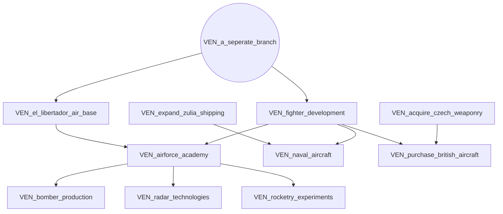
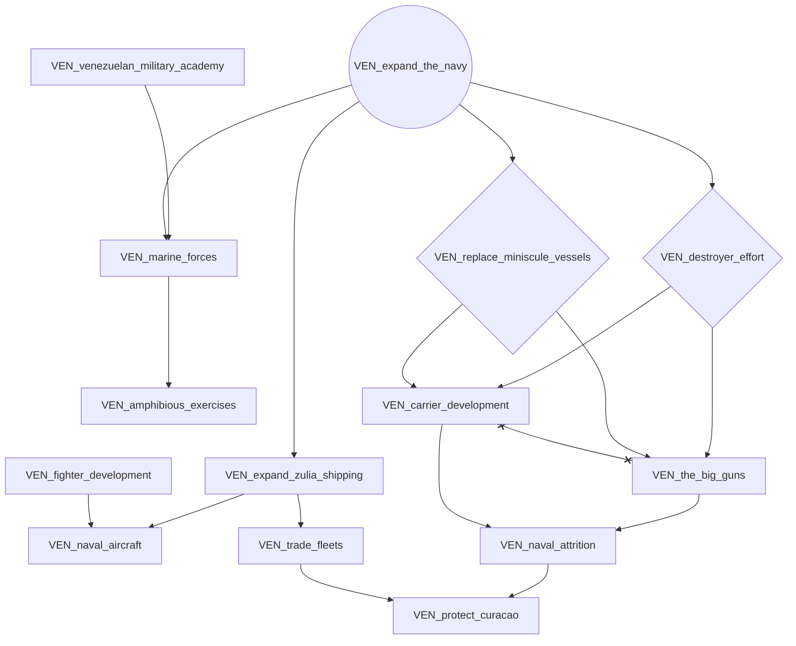
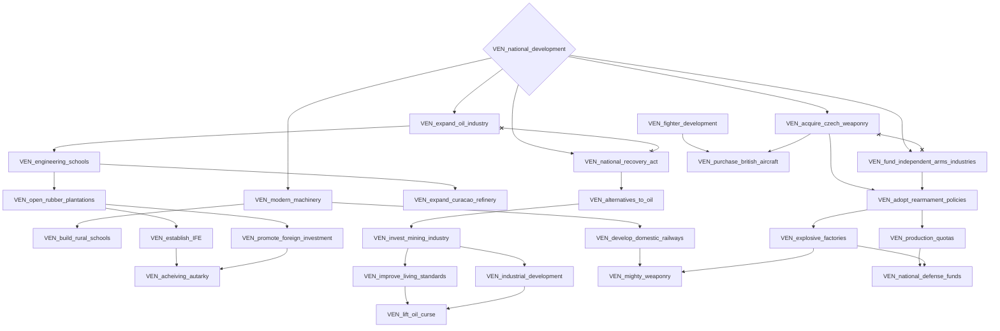
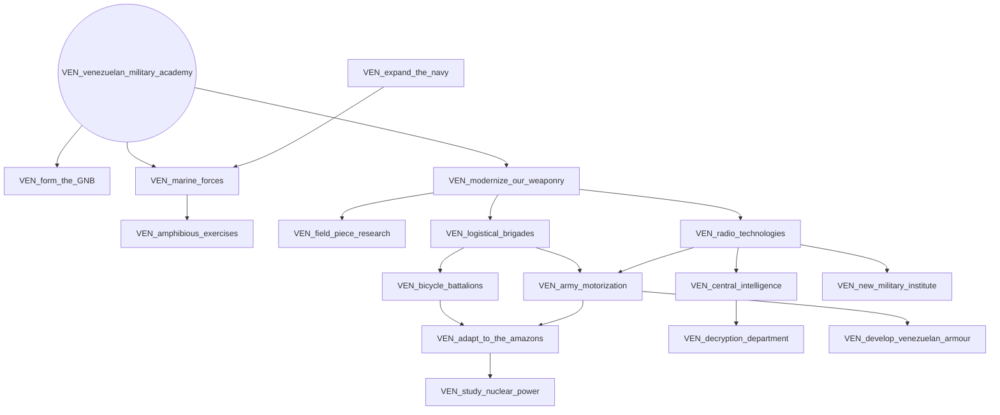

# VEN_a_seperate_branch

```mermaid
flowchart TD
    n1(("VEN_a_seperate_branch"))
    n2["VEN_acquire_czech_weaponry"]
    n3["VEN_airforce_academy"]
    n4["VEN_bomber_production"]
    n5["VEN_el_libertador_air_base"]
    n6["VEN_expand_zulia_shipping"]
    n7["VEN_fighter_development"]
    n8["VEN_naval_aircraft"]
    n9["VEN_purchase_british_aircraft"]
    n10["VEN_radar_technologies"]
    n11["VEN_rocketry_experiments"]
    n5 --> n3
    n7 --> n3
    n3 --> n4
    n1 --> n5
    n1 --> n7
    n6 --> n8
    n7 --> n8
    n7 --> n9
    n2 --> n9
    n3 --> n10
    n3 --> n11
```

# VEN_congress

```mermaid
flowchart TD
    n12{"VEN_1935_elections"}
    n13["VEN_50_50_oil_act"]
    n14["VEN_DSN"]
    n15["VEN_abolish_death_penalty"]
    n16{"VEN_alliance_with_bolivia"}
    n17{"VEN_alliance_with_honduras"}
    n18["VEN_alliance_with_mexico"]
    n19["VEN_alliance_with_south_south_america"]
    n20{"VEN_allow_new_elections"}
    n21["VEN_american_student_exchange"]
    n22["VEN_amnesty_to_communists"]
    n23["VEN_anarchism_knows_no_borders"]
    n24["VEN_annex_colombia"]
    n25{"VEN_anti_submarine"}
    n26["VEN_arm_the_companies"]
    n27["VEN_arms_protect_the_nation"]
    n28["VEN_arms_protect_the_nation2"]
    n29["VEN_arnoldo_gabaldon"]
    n30["VEN_assisted_oil_development"]
    n31["VEN_attack_america"]
    n32["VEN_attack_america_communist"]
    n33{"VEN_attack_bolivia"}
    n34["VEN_attack_britain"]
    n35{"VEN_attack_central_america"}
    n36["VEN_attack_cuba"]
    n37["VEN_attack_ecuador"]
    n38["VEN_attack_germany"]
    n39["VEN_attack_hispaniola"]
    n40["VEN_attack_japan"]
    n41["VEN_attack_mexico"]
    n42["VEN_attack_peru"]
    n43["VEN_attack_south_south_america"]
    n44["VEN_barranquilla_plan"]
    n45["VEN_bolivarian_development"]
    n46{"VEN_bolivarian_socialist_theory"}
    n47["VEN_british_air_bases"]
    n48{"VEN_by_any_means"}
    n49["VEN_caribbean_naval_hub"]
    n50["VEN_central_university"]
    n51["VEN_communist_reforms"]
    n52["VEN_concessions_to_oil_unions"]
    n53{"VEN_congress"}
    n54["VEN_connect_the_cities"]
    n55{"VEN_constitute_womens_rights"}
    n56{"VEN_creole_indivisible"}
    n57["VEN_crush_communists"]
    n58["VEN_cult_of_creole"]
    n59{"VEN_cult_of_personality"}
    n60["VEN_demand_guyana"]
    n61["VEN_depoliticize_the_army"]
    n62["VEN_eleazar_contreras"]
    n63["VEN_eliminating_the_competition"]
    n64["VEN_embargo_japan"]
    n65["VEN_enforce_army_loyalty"]
    n66["VEN_enpower_the_pcv"]
    n67["VEN_expand_ecuadorian_cocoa_fields"]
    n68{"VEN_expand_gran_colombia"}
    n69["VEN_exploit_colombian_rubber"]
    n70["VEN_export_oil_aggressively"]
    n71["VEN_fate_of_jimenez"]
    n72["VEN_food_importation"]
    n73["VEN_foreign_expeditions"]
    n74["VEN_form_CPAI"]
    n75["VEN_form_cuban_divisons"]
    n76["VEN_generation_of_28"]
    n77["VEN_german_advisors"]
    n78["VEN_german_oil_deal"]
    n79["VEN_german_relations"]
    n80["VEN_gran_colombia"]
    n81["VEN_health_and_social_assistance"]
    n82["VEN_housing_act"]
    n83{"VEN_institute_1936_constitution"}
    n84["VEN_intergrate_caribbean"]
    n85["VEN_intervention_in_brazil"]
    n86["VEN_introduce_political_commissars"]
    n87["VEN_invite_polish_exiles"]
    n88["VEN_invite_soviet_officers"]
    n89["VEN_isaias_angarita"]
    n90["VEN_jewish_asylum"]
    n91["VEN_join_allies"]
    n92{"VEN_join_axis"}
    n93["VEN_labour_reforms"]
    n94["VEN_latin_america_guardian"]
    n95["VEN_legacy_of_piracy"]
    n96["VEN_legalize_communism"]
    n97["VEN_liberalize_oil_trade"]
    n98["VEN_marcos_jimenez"]
    n99["VEN_militarize_the_people"]
    n100["VEN_military_colleges"]
    n101["VEN_military_youth"]
    n102["VEN_miraflores_concessions"]
    n103["VEN_modern_pirate_navy"]
    n104["VEN_national_literacy_programs"]
    n105["VEN_nationalist_education"]
    n106["VEN_nationalize_the_banking_sector"]
    n107["VEN_neutrality_focus"]
    n108["VEN_neutrality_focus2"]
    n109["VEN_new_republic"]
    n110["VEN_non_agression_colombia"]
    n111{"VEN_oil_protection"}
    n112["VEN_oil_protection_squadrons"]
    n113["VEN_paramilitarism"]
    n114["VEN_peoples_university_of_venezuela"]
    n115["VEN_prepare_amphibious_landings"]
    n116{"VEN_president_betancourts_legacy"}
    n117["VEN_presidential_amendment"]
    n118["VEN_privatize_oil"]
    n119["VEN_promote_political_cooperation"]
    n120["VEN_protect_workers_rights"]
    n121["VEN_puntofijo_pact"]
    n122["VEN_purge_disloyal_officers"]
    n123["VEN_push_north"]
    n124["VEN_push_to_end_captalism"]
    n125{"VEN_rebellion"}
    n126["VEN_rebellion_recoverment_effots"]
    n127["VEN_recruit_haitian_pilots"]
    n128["VEN_redistribution_of_wealth"]
    n129{"VEN_reorganization_of_congress"}
    n130["VEN_reorganize_the_ARDI"]
    n131["VEN_reshuffle_of_general_staff"]
    n132["VEN_seize_curacao"]
    n133["VEN_seize_government_assets"]
    n134["VEN_seize_public_services"]
    n135["VEN_seize_trinidad"]
    n136["VEN_soviet_tank_factories"]
    n137["VEN_spanish_civil_war_involvement"]
    n138["VEN_spread_the_south_american_revolution"]
    n139["VEN_strike_panama"]
    n140["VEN_support_argentinian_revolution"]
    n141["VEN_support_brazillian_revolution"]
    n142["VEN_support_chilean_revolution"]
    n143["VEN_support_colombian_revolution"]
    n144["VEN_support_peruvian_revolution"]
    n145{"VEN_suspend_elections"}
    n146["VEN_tax_reforms"]
    n147["VEN_tax_reforms_socialist"]
    n148["VEN_under_soviet_dominion"]
    n149["VEN_unify_bolivariana_army"]
    n150["VEN_unify_political_command"]
    n151["VEN_unite_the_caribbean_under_venezuela"]
    n152["VEN_venezuelan_fortress"]
    n153["VEN_venezuelan_way_of_communism"]
    n154{"VEN_viva_venezuela"}
    n155["VEN_western_agreements"]
    n156["VEN_zulia_line"]
    n53 --> n12
    n121 --> n13
    n22 --> n13
    n102 --> n14
    n61 --> n15
    n68 --> n16
    n68 --> n17
    n35 --> n18
    n17 --> n18
    n16 --> n19
    n33 --> n19
    n15 --> n20
    n146 --> n20
    n155 --> n21
    n46 --> n22
    n99 --> n23
    n80 --> n24
    n64 --> n25
    n73 --> n25
    n58 --> n26
    n110 --> n27
    n156 --> n27
    n108 --> n28
    n81 --> n29
    n91 --> n30
    n151 --> n31
    n124 --> n32
    n68 --> n33
    n124 --> n34
    n68 --> n35
    n115 --> n36
    n24 --> n37
    n25 --> n38
    n115 --> n39
    n25 --> n40
    n35 --> n41
    n17 --> n41
    n24 --> n42
    n16 --> n43
    n33 --> n43
    n130 --> n44
    n150 --> n45
    n125 --> n46
    n30 --> n47
    n72 --> n47
    n112 --> n48
    n134 --> n48
    n133 --> n48
    n84 --> n49
    n90 --> n50
    n29 --> n50
    n66 --> n51
    n51 --> n52
    n49 --> n54
    n82 --> n55
    n106 --> n55
    n119 --> n55
    n48 --> n56
    n98 --> n57
    n125 --> n58
    n101 --> n59
    n24 --> n60
    n109 --> n61
    n12 --> n62
    n48 --> n63
    n47 --> n64
    n98 --> n65
    n125 --> n66
    n45 --> n67
    n150 --> n68
    n45 --> n69
    n58 --> n70
    n89 --> n71
    n91 --> n72
    n47 --> n73
    n122 --> n74
    n54 --> n75
    n130 --> n76
    n79 --> n77
    n79 --> n78
    n62 --> n79
    n98 --> n79
    n92 --> n80
    n154 --> n80
    n62 --> n81
    n120 --> n82
    n117 --> n83
    n14 --> n83
    n131 --> n83
    n39 --> n84
    n135 --> n84
    n36 --> n84
    n43 --> n85
    n19 --> n85
    n18 --> n85
    n41 --> n85
    n136 --> n86
    n88 --> n86
    n108 --> n87
    n148 --> n88
    n12 --> n89
    n81 --> n90
    n55 --> n91
    n83 --> n91
    n20 --> n91
    n83 --> n92
    n55 --> n92
    n59 --> n92
    n109 --> n93
    n25 --> n94
    n49 --> n95
    n89 --> n96
    n61 --> n97
    n93 --> n97
    n12 --> n98
    n63 --> n99
    n145 --> n100
    n113 --> n101
    n65 --> n101
    n62 --> n102
    n95 --> n103
    n13 --> n104
    n100 --> n105
    n118 --> n105
    n120 --> n106
    n83 --> n107
    n55 --> n107
    n59 --> n107
    n20 --> n107
    n129 --> n108
    n116 --> n108
    n56 --> n108
    n12 --> n109
    n111 --> n110
    n107 --> n111
    n26 --> n112
    n98 --> n113
    n52 --> n114
    n123 --> n115
    n104 --> n116
    n147 --> n116
    n102 --> n117
    n145 --> n118
    n96 --> n119
    n89 --> n120
    n46 --> n121
    n66 --> n122
    n92 --> n123
    n154 --> n123
    n142 --> n124
    n141 --> n124
    n140 --> n124
    n143 --> n124
    n144 --> n124
    n44 --> n125
    n76 --> n125
    n51 --> n126
    n121 --> n126
    n22 --> n126
    n54 --> n127
    n52 --> n128
    n128 --> n129
    n114 --> n129
    n53 --> n130
    n102 --> n131
    n80 --> n132
    n123 --> n132
    n70 --> n133
    n70 --> n134
    n115 --> n135
    n148 --> n136
    n57 --> n137
    n122 --> n137
    n153 --> n138
    n37 --> n139
    n60 --> n139
    n42 --> n139
    n138 --> n140
    n138 --> n141
    n138 --> n142
    n138 --> n143
    n138 --> n144
    n57 --> n145
    n93 --> n146
    n13 --> n147
    n129 --> n148
    n150 --> n149
    n139 --> n150
    n49 --> n151
    n56 --> n152
    n129 --> n153
    n83 --> n154
    n55 --> n154
    n59 --> n154
    n89 --> n155
    n109 --> n155
    n111 --> n156
    n12 x--x n130
    n16 x--x n33
    n17 x--x n35
    n18 x--x n41
    n19 x--x n43
    n22 x--x n121
    n38 x--x n40
    n46 x--x n58
    n46 x--x n66
    n56 x--x n63
    n58 x--x n66
    n62 x--x n89
    n62 x--x n98
    n62 x--x n109
    n80 x--x n123
    n89 x--x n98
    n89 x--x n109
    n91 x--x n92
    n91 x--x n107
    n91 x--x n154
    n92 x--x n107
    n92 x--x n154
    n98 x--x n109
    n100 x--x n118
    n107 x--x n154
    n108 x--x n148
    n108 x--x n153
    n110 x--x n156
    n148 x--x n153
```

# VEN_expand_the_navy

```mermaid
flowchart TD
    n157["VEN_amphibious_exercises"]
    n158["VEN_carrier_development"]
    n159{"VEN_destroyer_effort"}
    n160(("VEN_expand_the_navy"))
    n6["VEN_expand_zulia_shipping"]
    n7["VEN_fighter_development"]
    n161["VEN_marine_forces"]
    n8["VEN_naval_aircraft"]
    n162["VEN_naval_attrition"]
    n163["VEN_protect_curacao"]
    n164{"VEN_replace_miniscule_vessels"}
    n165["VEN_the_big_guns"]
    n166["VEN_trade_fleets"]
    n167["VEN_venezuelan_military_academy"]
    n161 --> n157
    n159 --> n158
    n164 --> n158
    n160 --> n159
    n160 --> n6
    n167 --> n161
    n160 --> n161
    n6 --> n8
    n7 --> n8
    n165 --> n162
    n158 --> n162
    n162 --> n163
    n166 --> n163
    n160 --> n164
    n159 --> n165
    n164 --> n165
    n6 --> n166
    n158 x--x n165
```

# VEN_national_development

```mermaid
flowchart TD
    n168["VEN_acheiving_autarky"]
    n2["VEN_acquire_czech_weaponry"]
    n169["VEN_adopt_rearmament_policies"]
    n170["VEN_alternatives_to_oil"]
    n171["VEN_build_rural_schools"]
    n172["VEN_develop_domestic_railways"]
    n173["VEN_engineering_schools"]
    n174["VEN_establish_IFE"]
    n175["VEN_expand_curacao_refinery"]
    n176["VEN_expand_oil_industry"]
    n177["VEN_explosive_factories"]
    n7["VEN_fighter_development"]
    n178["VEN_fund_independent_arms_industries"]
    n179["VEN_improve_living_standards"]
    n180["VEN_industrial_development"]
    n181["VEN_invest_mining_industry"]
    n182["VEN_lift_oil_curse"]
    n183["VEN_mighty_weaponry"]
    n184["VEN_modern_machinery"]
    n185["VEN_national_defense_funds"]
    n186{"VEN_national_development"}
    n187["VEN_national_recovery_act"]
    n188["VEN_open_rubber_plantations"]
    n189["VEN_production_quotas"]
    n190["VEN_promote_foreign_investment"]
    n9["VEN_purchase_british_aircraft"]
    n174 --> n168
    n190 --> n168
    n186 --> n2
    n2 --> n169
    n178 --> n169
    n187 --> n170
    n184 --> n171
    n184 --> n172
    n176 --> n173
    n188 --> n174
    n173 --> n175
    n186 --> n176
    n169 --> n177
    n186 --> n178
    n181 --> n179
    n181 --> n180
    n170 --> n181
    n179 --> n182
    n180 --> n182
    n172 --> n183
    n177 --> n183
    n186 --> n184
    n189 --> n185
    n177 --> n185
    n186 --> n187
    n173 --> n188
    n169 --> n189
    n188 --> n190
    n7 --> n9
    n2 --> n9
    n2 x--x n178
    n176 x--x n187
```

# VEN_venezuelan_military_academy

```mermaid
flowchart TD
    n191["VEN_adapt_to_the_amazons"]
    n157["VEN_amphibious_exercises"]
    n192["VEN_army_motorization"]
    n193["VEN_bicycle_battalions"]
    n194["VEN_central_intelligence"]
    n195["VEN_decryption_department"]
    n196["VEN_develop_venezuelan_armour"]
    n160["VEN_expand_the_navy"]
    n197["VEN_field_piece_research"]
    n198["VEN_form_the_GNB"]
    n199["VEN_logistical_brigades"]
    n161["VEN_marine_forces"]
    n200["VEN_modernize_our_weaponry"]
    n201["VEN_new_military_institute"]
    n202["VEN_radio_technologies"]
    n203["VEN_study_nuclear_power"]
    n167(("VEN_venezuelan_military_academy"))
    n193 --> n191
    n192 --> n191
    n161 --> n157
    n199 --> n192
    n202 --> n192
    n199 --> n193
    n202 --> n194
    n194 --> n195
    n192 --> n196
    n200 --> n197
    n167 --> n198
    n200 --> n199
    n167 --> n161
    n160 --> n161
    n167 --> n200
    n202 --> n201
    n200 --> n202
    n191 --> n203
```
