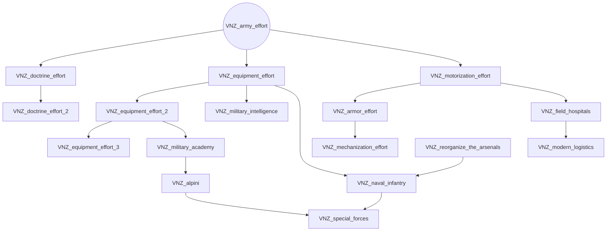
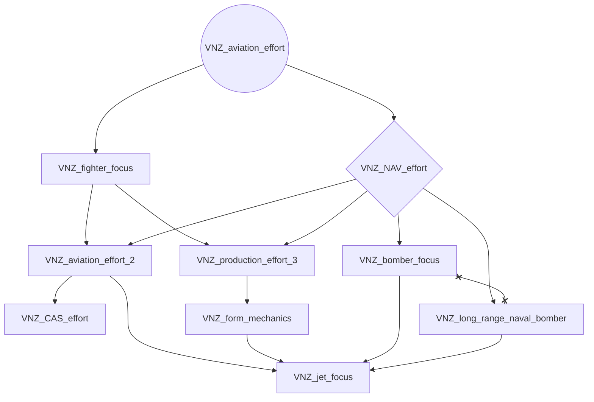
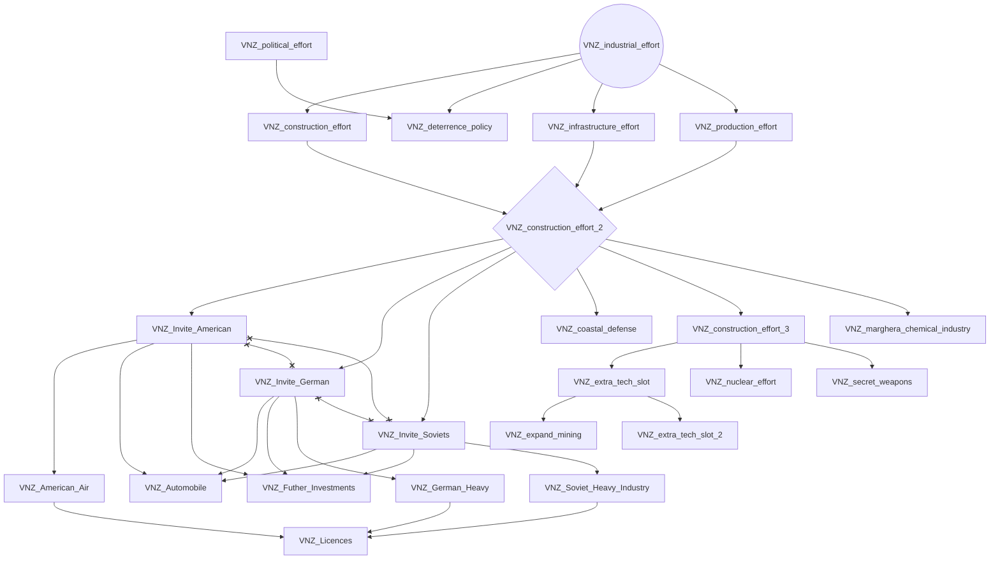
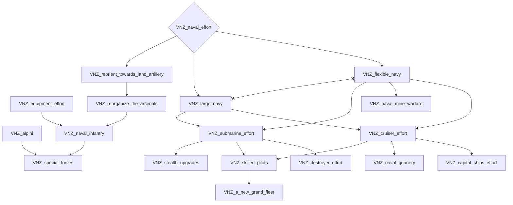
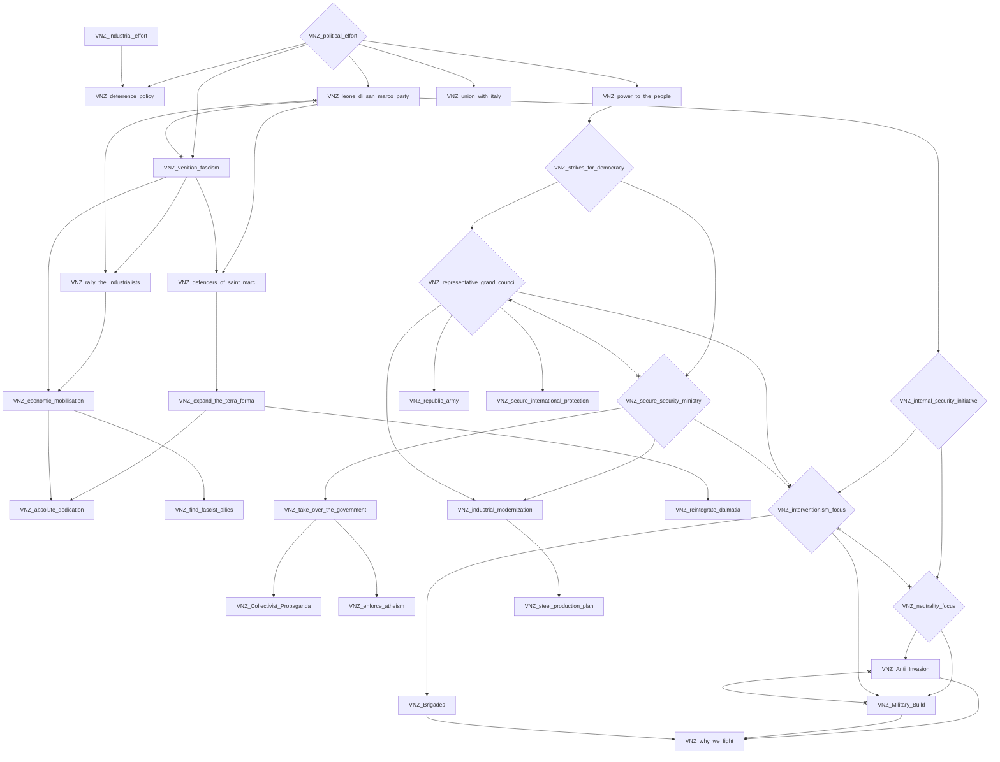

# VNZ_army_effort

```mermaid
flowchart TD
    n1["VNZ_alpini"]
    n2["VNZ_armor_effort"]
    n3(("VNZ_army_effort"))
    n4["VNZ_doctrine_effort"]
    n5["VNZ_doctrine_effort_2"]
    n6["VNZ_equipment_effort"]
    n7["VNZ_equipment_effort_2"]
    n8["VNZ_equipment_effort_3"]
    n9["VNZ_field_hospitals"]
    n10["VNZ_mechanization_effort"]
    n11["VNZ_military_academy"]
    n12["VNZ_military_intelligence"]
    n13["VNZ_modern_logistics"]
    n14["VNZ_motorization_effort"]
    n15["VNZ_naval_infantry"]
    n16["VNZ_reorganize_the_arsenals"]
    n17["VNZ_special_forces"]
    n11 --> n1
    n14 --> n2
    n3 --> n4
    n4 --> n5
    n3 --> n6
    n6 --> n7
    n7 --> n8
    n14 --> n9
    n2 --> n10
    n7 --> n11
    n6 --> n12
    n9 --> n13
    n3 --> n14
    n16 --> n15
    n6 --> n15
    n1 --> n17
    n15 --> n17
```

# VNZ_aviation_effort

```mermaid
flowchart TD
    n18["VNZ_CAS_effort"]
    n19{"VNZ_NAV_effort"}
    n20(("VNZ_aviation_effort"))
    n21["VNZ_aviation_effort_2"]
    n22["VNZ_bomber_focus"]
    n23["VNZ_fighter_focus"]
    n24["VNZ_form_mechanics"]
    n25["VNZ_jet_focus"]
    n26["VNZ_long_range_naval_bomber"]
    n27["VNZ_production_effort_3"]
    n21 --> n18
    n20 --> n19
    n23 --> n21
    n19 --> n21
    n19 --> n22
    n20 --> n23
    n27 --> n24
    n21 --> n25
    n24 --> n25
    n22 --> n25
    n26 --> n25
    n19 --> n26
    n23 --> n27
    n19 --> n27
    n22 x--x n26
```

# VNZ_industrial_effort

```mermaid
flowchart TD
    n28["VNZ_American_Air"]
    n29["VNZ_Automobile"]
    n30["VNZ_Futher_Investments"]
    n31["VNZ_German_Heavy"]
    n32["VNZ_Invite_American"]
    n33["VNZ_Invite_German"]
    n34["VNZ_Invite_Soviets"]
    n35["VNZ_Licences"]
    n36["VNZ_Soviet_Heavy_Industry"]
    n37["VNZ_coastal_defense"]
    n38["VNZ_construction_effort"]
    n39{"VNZ_construction_effort_2"}
    n40["VNZ_construction_effort_3"]
    n41["VNZ_deterrence_policy"]
    n42["VNZ_expand_mining"]
    n43["VNZ_extra_tech_slot"]
    n44["VNZ_extra_tech_slot_2"]
    n45(("VNZ_industrial_effort"))
    n46["VNZ_infrastructure_effort"]
    n47["VNZ_marghera_chemical_industry"]
    n48["VNZ_nuclear_effort"]
    n49["VNZ_political_effort"]
    n50["VNZ_production_effort"]
    n51["VNZ_secret_weapons"]
    n32 --> n28
    n32 --> n29
    n33 --> n29
    n34 --> n29
    n32 --> n30
    n33 --> n30
    n34 --> n30
    n33 --> n31
    n39 --> n32
    n39 --> n33
    n39 --> n34
    n28 --> n35
    n31 --> n35
    n36 --> n35
    n34 --> n36
    n39 --> n37
    n45 --> n38
    n46 --> n39
    n38 --> n39
    n50 --> n39
    n39 --> n40
    n49 --> n41
    n45 --> n41
    n43 --> n42
    n40 --> n43
    n43 --> n44
    n45 --> n46
    n39 --> n47
    n40 --> n48
    n45 --> n50
    n40 --> n51
    n32 x--x n33
    n32 x--x n34
    n33 x--x n34
```

# VNZ_naval_effort

```mermaid
flowchart TD
    n52["VNZ_a_new_grand_fleet"]
    n1["VNZ_alpini"]
    n53["VNZ_capital_ships_effort"]
    n54["VNZ_cruiser_effort"]
    n55["VNZ_destroyer_effort"]
    n6["VNZ_equipment_effort"]
    n56["VNZ_flexible_navy"]
    n57["VNZ_large_navy"]
    n58{"VNZ_naval_effort"}
    n59["VNZ_naval_gunnery"]
    n15["VNZ_naval_infantry"]
    n60["VNZ_naval_mine_warfare"]
    n16["VNZ_reorganize_the_arsenals"]
    n61["VNZ_reorient_towards_land_artillery"]
    n62["VNZ_skilled_pilots"]
    n17["VNZ_special_forces"]
    n63["VNZ_stealth_upgrades"]
    n64["VNZ_submarine_effort"]
    n62 --> n52
    n54 --> n53
    n57 --> n54
    n56 --> n54
    n64 --> n55
    n58 --> n56
    n58 --> n57
    n54 --> n59
    n16 --> n15
    n6 --> n15
    n56 --> n60
    n61 --> n16
    n58 --> n61
    n64 --> n62
    n54 --> n62
    n1 --> n17
    n15 --> n17
    n64 --> n63
    n56 --> n64
    n57 --> n64
    n56 x--x n57
```

# VNZ_political_effort

```mermaid
flowchart TD
    n65["VNZ_Anti_Invasion"]
    n66["VNZ_Brigades"]
    n67["VNZ_Collectivist_Propaganda"]
    n68["VNZ_Military_Build"]
    n69["VNZ_absolute_dedication"]
    n70["VNZ_defenders_of_saint_marc"]
    n41["VNZ_deterrence_policy"]
    n71["VNZ_economic_mobilisation"]
    n72["VNZ_enforce_atheism"]
    n73["VNZ_expand_the_terra_ferma"]
    n74["VNZ_find_fascist_allies"]
    n45["VNZ_industrial_effort"]
    n75["VNZ_industrial_modernization"]
    n76{"VNZ_internal_security_initiative"}
    n77{"VNZ_interventionism_focus"}
    n78["VNZ_leone_di_san_marco_party"]
    n79{"VNZ_neutrality_focus"}
    n49{"VNZ_political_effort"}
    n80["VNZ_power_to_the_people"]
    n81["VNZ_rally_the_industrialists"]
    n82["VNZ_reintegrate_dalmatia"]
    n83{"VNZ_representative_grand_council"}
    n84["VNZ_republic_army"]
    n85["VNZ_secure_international_protection"]
    n86{"VNZ_secure_security_ministry"}
    n87["VNZ_steel_production_plan"]
    n88{"VNZ_strikes_for_democracy"}
    n89["VNZ_take_over_the_government"]
    n90["VNZ_union_with_italy"]
    n91["VNZ_venitian_fascism"]
    n92["VNZ_why_we_fight"]
    n79 --> n65
    n77 --> n66
    n89 --> n67
    n79 --> n68
    n77 --> n68
    n73 --> n69
    n71 --> n69
    n78 --> n70
    n91 --> n70
    n49 --> n41
    n45 --> n41
    n81 --> n71
    n91 --> n71
    n89 --> n72
    n70 --> n73
    n71 --> n74
    n86 --> n75
    n83 --> n75
    n78 --> n76
    n76 --> n77
    n83 --> n77
    n86 --> n77
    n49 --> n78
    n76 --> n79
    n49 --> n80
    n91 --> n81
    n78 --> n81
    n73 --> n82
    n88 --> n83
    n83 --> n84
    n83 --> n85
    n88 --> n86
    n75 --> n87
    n80 --> n88
    n86 --> n89
    n49 --> n90
    n49 --> n91
    n65 --> n92
    n68 --> n92
    n66 --> n92
    n65 x--x n68
    n77 x--x n79
    n78 x--x n91
    n83 x--x n86
```
