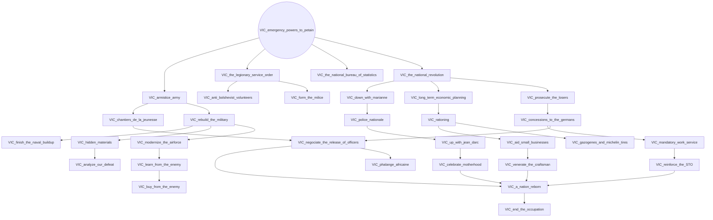

# VIC_emergency_powers_to_petain

```mermaid
flowchart TD
    n1["VIC_a_nation_reborn"]
    n2["VIC_aid_small_businesses"]
    n3["VIC_analyze_our_defeat"]
    n4["VIC_anti_bolshevist_volunteers"]
    n5["VIC_armistice_army"]
    n6["VIC_buy_from_the_enemy"]
    n7["VIC_celebrate_motherhood"]
    n8["VIC_chantiers_de_la_jeunesse"]
    n9["VIC_concessions_to_the_germans"]
    n10["VIC_down_with_marianne"]
    n11(("VIC_emergency_powers_to_petain"))
    n12["VIC_end_the_occupation"]
    n13["VIC_finish_the_naval_buildup"]
    n14["VIC_form_the_milice"]
    n15["VIC_gazogenes_and_michelin_tires"]
    n16["VIC_hidden_materials"]
    n17["VIC_learn_from_the_enemy"]
    n18["VIC_long_term_economic_planning"]
    n19["VIC_mandatory_work_service"]
    n20["VIC_modernize_the_airforce"]
    n21["VIC_negociate_the_release_of_officers"]
    n22["VIC_phalange_africaine"]
    n23["VIC_police_nationale"]
    n24["VIC_prosecute_the_losers"]
    n25["VIC_rationing"]
    n26["VIC_rebuild_the_military"]
    n27["VIC_reinforce_the_STO"]
    n28["VIC_the_legionary_service_order"]
    n29["VIC_the_national_bureau_of_statistics"]
    n30["VIC_the_national_revolution"]
    n31["VIC_up_with_jean_darc"]
    n32["VIC_venerate_the_craftsman"]
    n7 --> n1
    n32 --> n1
    n27 --> n1
    n21 --> n1
    n25 --> n2
    n16 --> n3
    n28 --> n4
    n11 --> n5
    n17 --> n6
    n31 --> n7
    n5 --> n8
    n24 --> n9
    n30 --> n10
    n1 --> n12
    n26 --> n13
    n28 --> n14
    n25 --> n15
    n26 --> n16
    n20 --> n17
    n30 --> n18
    n9 --> n19
    n26 --> n20
    n8 --> n21
    n9 --> n21
    n21 --> n22
    n10 --> n23
    n30 --> n24
    n18 --> n25
    n5 --> n26
    n19 --> n27
    n11 --> n28
    n11 --> n29
    n11 --> n30
    n23 --> n31
    n2 --> n32
```
