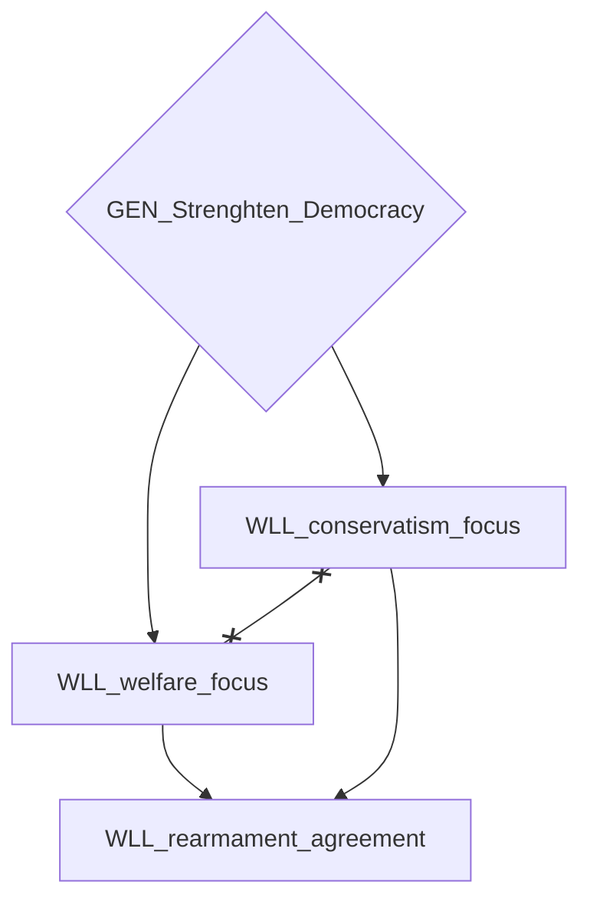

# orphans

```mermaid
flowchart TD
    n1{"GEN_Strenghten_Democracy"}
    n2["WLL_conservatism_focus"]
    n3["WLL_rearmament_agreement"]
    n4["WLL_welfare_focus"]
    n1 --> n2
    n4 --> n3
    n2 --> n3
    n1 --> n4
    n2 x--x n4
```
