# Scenarios Catalog

Full inventory of focus-tree arcs for the seven majors (GER, SOV, JAP, ITA, ENG, USA, FRA) plus HUN, based on the Road to 56 focus trees. Every arc in this catalog is a candidate for the scenario pool; the pool is the full catalog plus the seed arcs already implemented. Arc ids are sequential over the pool; implemented arcs keep their existing ids (1-8).

Cross-reference: `docs/gdd/Scenarios.md` defines the arc schema (aggressor, targets, joiners, ladder, levers, derail, telemetry). This file only lists which focus branches become which arc, their flip gates, and their target variants.

## Arc anatomy

- **Type**: `historical` (no flip), `flip` (ideology gate by the crises phase, like arcs 5/6), `imperial` (gate on neutrality/fascism, like `ENG_god_save_the_king`).
- **Target variants**: every arc has two target sets, A and B, rolled 50/50 at pick. The roll is logged (`sc_pick` carries the variant). Seeding, crises, ultimatums, and derail checks follow the chosen variant.
- **Flip gates** mirror arcs 5/6: a flip arc derails (`britain_not_fascist`-style) if the aggressor is not on the required ideology by the crises phase. `imperial` gates accept `neutrality` OR `fascism`.
- **Implementation order**: cheapest first (target variants for existing arcs, then new flip gates, then new historical arcs). No new mechanics per arc; the shared engine (seed / join / ladder / derail / telemetry / `$ai_scenario_focus_boost`) is reused.

## Implemented arcs (1-8)

| # | Aggressor | Branch | Type | Targets | Blocks | Key focuses |
|---|---|---|---|---|---|---|
| 1 | GER | Axis eastern expansion | historical | A: CZE, POL / B: FRA, ENG | Axis | `danzig_or_war`, `demand_sudetenland`, `war_with_france`, `around_maginot` |
| 2 | SOV | Western push | historical | A: POL, FIN / B: CZE, BUL | Comintern | `imperial_legacy`, `reclaim_polish_overlordship`, `westward_bound`, `secure_finland` |
| 3 | JAP | Southern road | historical | A: CHI, PHI / B: BRM, INS, MAL | Co-Prosperity | `strike_the_southern_road`, `reinforce_the_beijing_garrison` |
| 4 | ITA | Balkan claims | historical | A: YUG, GRE / B: FRA, ENG | Mare Nostrum | `balkan_ambition`, `italys_destiny`, `war_with_greece` |
| 5 | ENG | Fascist Britain | flip (fascism) | A: FRA, SOV / B: GER, ITA | New Empire | `a_change_in_course`, `war_france`, `war_with_ussr` |
| 6 | USA | Red America | flip (communism) | A: CAN, JAP / B: ENG, SOV | People's Internationale | `suspend_the_presecution`, `end_monarchism`, `shatter_the_empires` |
| 7 | FRA | Napoleonic France | historical | A: GER, ITA / B: ENG | Continental System | `the_new_continental_system`, `crush_germany`, `nothern_italy_claim` |
| 8 | HUN | Habsburg restoration | imperial | A: CZE, ROU / B: YUG, SLO | Danubian Empire | `proclaim_the_restoration`, `claim_transylvania`, `march_to_the_shore` |

## German branches beyond Arc 1

| # | Branch | Type | Targets | Gate | Key focuses |
|---|---|---|---|---|---|
| 9 | Communist Germany (world revolution) | flip (communism) | A: ENG, FRA, ITA / B: SOV, USA, JAP | `GER_world_revolution` | `root_out_imperialism`, `hegemony_over_europe`, `wage_war_on_capitalism`, `strike_at_the_rising_sun` |
| 10 | Monarchist Germany (Kaiserreich) | flip (monarchy/neutrality) | A: SOV, DEN / B: VEN, FRA | `GER_restore_the_empire` | `soviet_invasion`, `restore_klein_venedig`, `demand_northern_schleswig` |
| 11 | Atlantic / naval war with the UK-USA | historical | A: ENG / B: USA | none | `crossing_the_atlantic`, `atlantic_naval_bases` |
| 12 | Middle East / anti-Soviet pact | historical | A: SOV / B: IRQ, PER | none | `influence_the_middle_east`, `claim_old_colonies_in_the_east`, `wage_war_on_capitalism` |

## Soviet branches beyond Arc 2

| # | Branch | Type | Targets | Gate | Key focuses |
|---|---|---|---|---|---|
| 13 | White Russia (post civil war) | flip (fascism or monarchy) | A: GER, POL, FIN / B: UKR, Baltic | SOV not communist by crises | `beaten_but_not_defeated`, `white_exiles`, `imperial_legacy`, `strike_the_eagle` |
| 14 | Southern thrust (Turkey / Persia / India) | historical | A: TUR, IRQ, PER / B: PAK, RAJ, AFG | none | `the_last_break_southward`, `preemptive_invasion_of_iran`, `into_the_plateau` |
| 15 | Eastern push (Japan / Manchuria / Alaska) | historical | A: JAP, MAN / B: USA, CAN | none | `crush_our_eastern_rival`, `our_american_holding`, `restore_the_old_eastern_empire` |

## Japanese branches beyond Arc 3

| # | Branch | Type | Targets | Gate | Key focuses |
|---|---|---|---|---|---|
| 16 | Communist Japan (pan-Asian revolution) | flip (communism) | A: CHI, SOV / B: ENG, USA, SEA | `JAP_raise_the_red_flag_high` | `put_an_end_to_chinese_feudalism`, `spread_the_revolutuon_south`, `free_asians_from_soviet_opression` |
| 17 | Northern push (hokushin-ron) | historical | A: SOV, MON / B: SOV, CHI | none | `hokushin_ron`, `sea_establish_the_northern_resource_area`, `strike_the_soviets`, `preemptive_strike_soviet` |
| 18 | Old oppressors (against the USA) | historical | A: USA / B: ENG | none | `strike_the_old_oppressors`, `ultimate_deterrence` |

## Italian branches beyond Arc 4

| # | Branch | Type | Targets | Gate | Key focuses |
|---|---|---|---|---|---|
| 19 | War with France / UK | historical | A: FRA / B: ENG | none | `war_with_france`, `war_with_the_uk`, `demand_ticino` |
| 20 | Mediterranean empire | historical | A: TUR, ROM / B: FRA, ENG | none | `a_time_for_war`, `claims_on_turkey_bba`, `all_roads_lead_to_rome` |
| 21 | Communist Italy | flip (communism) | A: FRA, ENG / B: BUL, YUG | `ITA_pugno_alzato` | `pugno_alzato`, `the_enemies_of_capitalism`, `liberate_the_workers_of_africa` |

## British branches beyond Arc 5

| # | Branch | Type | Targets | Gate | Key focuses |
|---|---|---|---|---|---|
| 22 | Imperial / monarchist restoration | imperial (neutrality/fascism) | A: RAJ, dominions / B: USA, JAP | `ENG_god_save_the_king` | `reclaim_the_jewel_in_the_crown`, `bring_the_dominions_back_into_the_fold`, `unite_the_anglosphere` |
| 23 | Communist Britain | flip (communism) | A: GER, USA, CAN / B: SOV | none (communism path) | `soviet_cooperation`, `the_one_true_revolution`, `liberate_the_home_of_marx`, `liberate_the_american_workers` |

## American branches beyond Arc 6

| # | Branch | Type | Targets | Gate | Key focuses |
|---|---|---|---|---|---|
| 24 | War Plan (historical pacific / anti-imperial) | historical | A: JAP / B: ENG, CAN | none | `war_plan_orange`, `war_plan_black`, `defense_of_the_pacific`, `intervention_in_europe` |
| 25 | End monarchism / global hegemony | historical or flip | A: ENG, GER, HUN, JAP / B: (hegemony) | none | `end_monarchism`, `shatter_the_empires`, `global_hegemony`, `seize_cuba` |

## French branches beyond Arc 7

| # | Branch | Type | Targets | Gate | Key focuses |
|---|---|---|---|---|---|
| 26 | Monarchist France (legitimist / Latin union) | flip (monarchy/neutrality) | A: SPR, ADR, MEX / B: SOV | `FRA_restore_ancient_reights` | `secure_the_crown_of_spain`, `claim_the_andorran_throne`, `restore_the_mexican_monarchy`, `second_march_on_moscow` |
| 27 | Dismantle Germany (revanchist) | historical | A: GER (partition) / B: ENG (destroy Albion) | none | `dismantle_germany`, `crush_germany`, `destroy_albion`, `strike_empire` |
| 28 | Plan XIV / neutral-Italy border | historical | A: SWI / B: ITA | none | `plan_xiv`, `return_to_dalmatia`, `nothern_italy_claim` |

## Focus paths per arc

Which focus branch each scenario pushes, derived from the Rt56 trees (node
and edge data generated from `docs/gdd/National Focuses/*.md` by
`.scratch/scripts/build_scenario_graphs.py`). Reading a diagram:

- **`([id])` rounded** - a branch entry / path root (not itself boosted).
- **`[[id]]` double-bordered** - a key focus the director boosts with
  `$ai_scenario_focus_boost()` and logs with `sc_focus`.
- **`[id]` plain** - an intermediate prerequisite on the path (not boosted).
- **`A --> B`** - B requires A.
- **`A x--x B`** - mutually exclusive: taking one hides the other, so the
  boost on the wrong side of a fork is dead (the Arc 3 / s10 lesson; Arc 7
  shows the Bonapartist fork).

### Germany


#### Arc 1: Axis expansion

```mermaid
flowchart TD
    subgraph arc1
        GER_anschluss["GER_anschluss"]
        GER_around_maginot[["GER_around_maginot"]]
        GER_befriend_czechoslovakia["GER_befriend_czechoslovakia"]
        GER_befriend_poland["GER_befriend_poland"]
        GER_danzig_or_war[["GER_danzig_or_war"]]
        GER_demand_sudetenland[["GER_demand_sudetenland"]]
        GER_fate_of_czechoslovakia["GER_fate_of_czechoslovakia"]
        GER_first_vienna_award["GER_first_vienna_award"]
        GER_operation_weserubung["GER_operation_weserubung"]
        GER_reassert_eastern_claims["GER_reassert_eastern_claims"]
        GER_remilitarize_the_rhineland(["GER_remilitarize_the_rhineland"])
        GER_reorganize_the_wehrmacht["GER_reorganize_the_wehrmacht"]
        GER_war_with_france[["GER_war_with_france"]]
        GER_anschluss --> GER_befriend_czechoslovakia
        GER_anschluss --> GER_demand_sudetenland
        GER_anschluss --> GER_reassert_eastern_claims
        GER_around_maginot --> GER_war_with_france
        GER_befriend_czechoslovakia --> GER_befriend_poland
        GER_befriend_poland --> GER_around_maginot
        GER_befriend_poland --> GER_operation_weserubung
        GER_danzig_or_war --> GER_around_maginot
        GER_danzig_or_war --> GER_operation_weserubung
        GER_demand_sudetenland --> GER_first_vienna_award
        GER_fate_of_czechoslovakia --> GER_befriend_poland
        GER_first_vienna_award --> GER_fate_of_czechoslovakia
        GER_operation_weserubung --> GER_war_with_france
        GER_reassert_eastern_claims --> GER_danzig_or_war
        GER_remilitarize_the_rhineland --> GER_reorganize_the_wehrmacht
        GER_reorganize_the_wehrmacht --> GER_anschluss
        GER_befriend_czechoslovakia x--x GER_demand_sudetenland
        GER_befriend_poland x--x GER_danzig_or_war
    end
```

#### Arc 9: German Atlantic

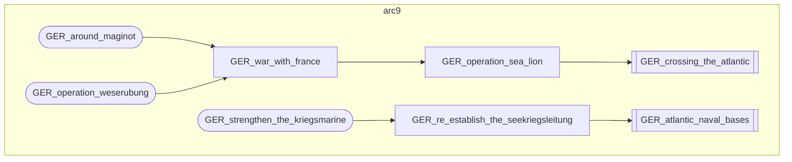

#### Arc 10: German Middle East

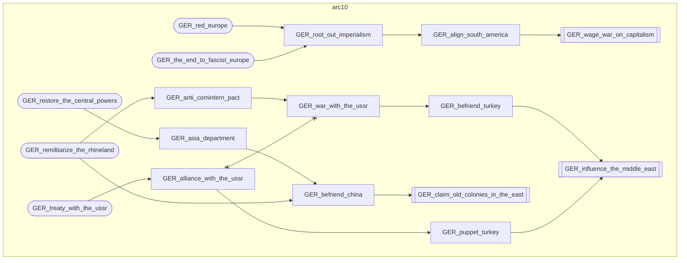

#### Arc 23: Communist Germany

```mermaid
flowchart TD
    subgraph arc23
        GER_align_south_america["GER_align_south_america"]
        GER_hegemony_over_europe[["GER_hegemony_over_europe"]]
        GER_instigate_middle_eastern_revolutions["GER_instigate_middle_eastern_revolutions"]
        GER_liberate_austria(["GER_liberate_austria"])
        GER_liberate_italy["GER_liberate_italy"]
        GER_protect_the_revolution(["GER_protect_the_revolution"])
        GER_red_europe["GER_red_europe"]
        GER_root_out_imperialism[["GER_root_out_imperialism"]]
        GER_strengthen_the_proletarian_international["GER_strengthen_the_proletarian_international"]
        GER_strike_at_the_rising_sun[["GER_strike_at_the_rising_sun"]]
        GER_support_the_proletarian_uprising(["GER_support_the_proletarian_uprising"])
        GER_the_end_to_fascist_europe["GER_the_end_to_fascist_europe"]
        GER_the_proletarian_legion["GER_the_proletarian_legion"]
        GER_wage_war_on_capitalism[["GER_wage_war_on_capitalism"]]
        GER_align_south_america --> GER_wage_war_on_capitalism
        GER_instigate_middle_eastern_revolutions --> GER_strike_at_the_rising_sun
        GER_liberate_austria --> GER_liberate_italy
        GER_liberate_italy --> GER_the_end_to_fascist_europe
        GER_protect_the_revolution --> GER_the_proletarian_legion
        GER_red_europe --> GER_root_out_imperialism
        GER_root_out_imperialism --> GER_align_south_america
        GER_root_out_imperialism --> GER_hegemony_over_europe
        GER_root_out_imperialism --> GER_instigate_middle_eastern_revolutions
        GER_strengthen_the_proletarian_international --> GER_red_europe
        GER_support_the_proletarian_uprising --> GER_strengthen_the_proletarian_international
        GER_support_the_proletarian_uprising --> GER_the_proletarian_legion
        GER_the_end_to_fascist_europe --> GER_root_out_imperialism
        GER_the_proletarian_legion --> GER_red_europe
    end
```

#### Arc 24: Monarchist Germany

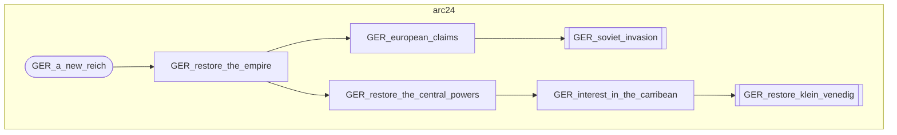

### Soviet Union


#### Arc 2: Soviet expansion

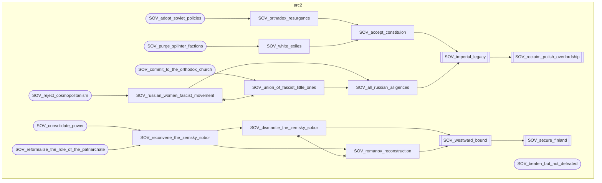

#### Arc 11: Soviet South

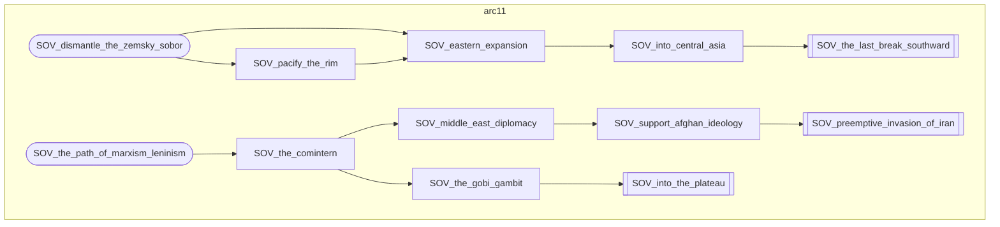

#### Arc 12: Soviet East

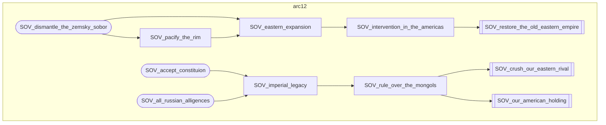

#### Arc 25: White Russia

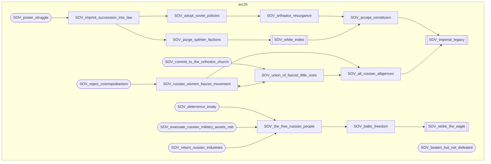

### Japan


#### Arc 3: Japanese expansion

```mermaid
flowchart TD
    subgraph arc3
        JAP_demand_tonkinese_bases["JAP_demand_tonkinese_bases"]
        JAP_nanshin_ron["JAP_nanshin_ron"]
        JAP_occupy_siam["JAP_occupy_siam"]
        JAP_reinforce_the_beijing_garrison[["JAP_reinforce_the_beijing_garrison"]]
        JAP_revere_the_emperor_destroy_the_traitors(["JAP_revere_the_emperor_destroy_the_traitors"])
        JAP_revisit_the_thirteen_demands["JAP_revisit_the_thirteen_demands"]
        JAP_sea_pressure_siam["JAP_sea_pressure_siam"]
        JAP_sea_purge_the_kodoha_faction(["JAP_sea_purge_the_kodoha_faction"])
        JAP_strike_the_southern_road[["JAP_strike_the_southern_road"]]
        JAP_demand_tonkinese_bases --> JAP_occupy_siam
        JAP_demand_tonkinese_bases --> JAP_sea_pressure_siam
        JAP_nanshin_ron --> JAP_demand_tonkinese_bases
        JAP_occupy_siam --> JAP_strike_the_southern_road
        JAP_revere_the_emperor_destroy_the_traitors --> JAP_nanshin_ron
        JAP_revere_the_emperor_destroy_the_traitors --> JAP_revisit_the_thirteen_demands
        JAP_revisit_the_thirteen_demands --> JAP_reinforce_the_beijing_garrison
        JAP_sea_pressure_siam --> JAP_strike_the_southern_road
        JAP_sea_purge_the_kodoha_faction --> JAP_nanshin_ron
        JAP_sea_purge_the_kodoha_faction --> JAP_revisit_the_thirteen_demands
        JAP_occupy_siam x--x JAP_sea_pressure_siam
        JAP_revere_the_emperor_destroy_the_traitors x--x JAP_sea_purge_the_kodoha_faction
    end
```

#### Arc 13: Japanese North

```mermaid
flowchart TD
    subgraph arc13
        JAP_a_green_persimmon["JAP_a_green_persimmon"]
        JAP_crush_the_internal_factions["JAP_crush_the_internal_factions"]
        JAP_democratic_war_with_china["JAP_democratic_war_with_china"]
        JAP_ensure_civil_liberties(["JAP_ensure_civil_liberties"])
        JAP_hokushin_ron[["JAP_hokushin_ron"]]
        JAP_kantokuen["JAP_kantokuen"]
        JAP_limit_the_emperors_power(["JAP_limit_the_emperors_power"])
        JAP_revere_the_emperor_destroy_the_traitors(["JAP_revere_the_emperor_destroy_the_traitors"])
        JAP_sea_establish_the_northern_resource_area[["JAP_sea_establish_the_northern_resource_area"]]
        JAP_sea_purge_the_kodoha_faction(["JAP_sea_purge_the_kodoha_faction"])
        JAP_strike_the_soviets[["JAP_strike_the_soviets"]]
        JAP_support_the_kodoha_faction(["JAP_support_the_kodoha_faction"])
        JAP_the_persimmon_has_ripened["JAP_the_persimmon_has_ripened"]
        JAP_utilize_ainu_expertise["JAP_utilize_ainu_expertise"]
        JAP_a_green_persimmon --> JAP_sea_establish_the_northern_resource_area
        JAP_crush_the_internal_factions --> JAP_democratic_war_with_china
        JAP_democratic_war_with_china --> JAP_strike_the_soviets
        JAP_ensure_civil_liberties --> JAP_crush_the_internal_factions
        JAP_hokushin_ron --> JAP_utilize_ainu_expertise
        JAP_kantokuen --> JAP_a_green_persimmon
        JAP_kantokuen --> JAP_the_persimmon_has_ripened
        JAP_limit_the_emperors_power --> JAP_crush_the_internal_factions
        JAP_revere_the_emperor_destroy_the_traitors --> JAP_hokushin_ron
        JAP_sea_purge_the_kodoha_faction --> JAP_hokushin_ron
        JAP_support_the_kodoha_faction --> JAP_hokushin_ron
        JAP_the_persimmon_has_ripened --> JAP_sea_establish_the_northern_resource_area
        JAP_utilize_ainu_expertise --> JAP_kantokuen
        JAP_a_green_persimmon x--x JAP_the_persimmon_has_ripened
        JAP_revere_the_emperor_destroy_the_traitors x--x JAP_sea_purge_the_kodoha_faction
        JAP_sea_purge_the_kodoha_faction x--x JAP_support_the_kodoha_faction
    end
```

#### Arc 14: Japanese Old Oppressors

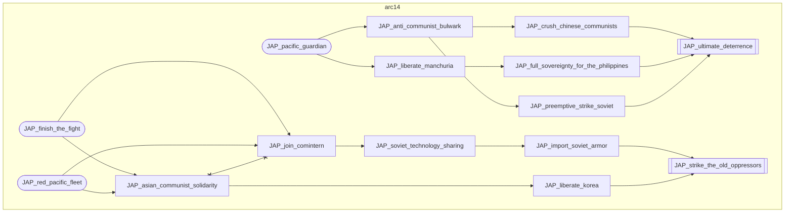

#### Arc 26: Communist Japan

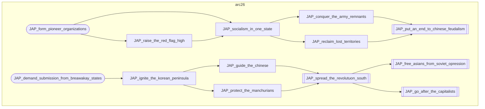

### Italy


#### Arc 4: Italian expansion

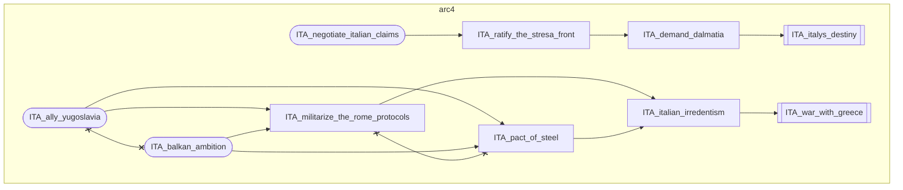

#### Arc 15: Italian West

```mermaid
flowchart TD
    subgraph arc15
        ITA_ally_yugoslavia["ITA_ally_yugoslavia"]
        ITA_balkan_ambition["ITA_balkan_ambition"]
        ITA_demand_ticino[["ITA_demand_ticino"]]
        ITA_foreign_affairs(["ITA_foreign_affairs"])
        ITA_italian_irredentism["ITA_italian_irredentism"]
        ITA_militarize_the_rome_protocols["ITA_militarize_the_rome_protocols"]
        ITA_pact_of_steel["ITA_pact_of_steel"]
        ITA_request_control_of_french_territories["ITA_request_control_of_french_territories"]
        ITA_war_with_france[["ITA_war_with_france"]]
        ITA_war_with_the_uk[["ITA_war_with_the_uk"]]
        ITA_ally_yugoslavia --> ITA_militarize_the_rome_protocols
        ITA_ally_yugoslavia --> ITA_pact_of_steel
        ITA_balkan_ambition --> ITA_militarize_the_rome_protocols
        ITA_balkan_ambition --> ITA_pact_of_steel
        ITA_foreign_affairs --> ITA_ally_yugoslavia
        ITA_foreign_affairs --> ITA_balkan_ambition
        ITA_italian_irredentism --> ITA_request_control_of_french_territories
        ITA_italian_irredentism --> ITA_war_with_france
        ITA_italian_irredentism --> ITA_war_with_the_uk
        ITA_militarize_the_rome_protocols --> ITA_italian_irredentism
        ITA_militarize_the_rome_protocols --> ITA_war_with_the_uk
        ITA_pact_of_steel --> ITA_italian_irredentism
        ITA_pact_of_steel --> ITA_request_control_of_french_territories
        ITA_request_control_of_french_territories --> ITA_demand_ticino
        ITA_war_with_france --> ITA_demand_ticino
        ITA_ally_yugoslavia x--x ITA_balkan_ambition
        ITA_militarize_the_rome_protocols x--x ITA_pact_of_steel
        ITA_request_control_of_french_territories x--x ITA_war_with_france
    end
```

#### Arc 16: Italian Mediterranean

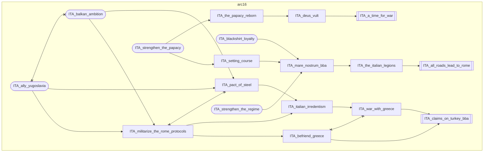

#### Arc 27: Communist Italy

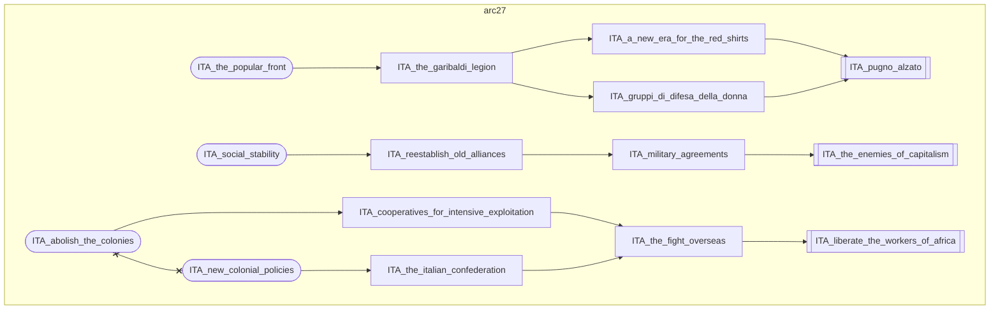

### United Kingdom


#### Arc 5: Fascist Britain

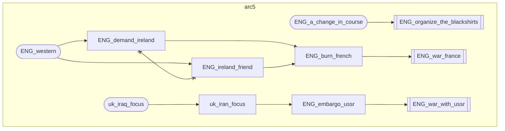

#### Arc 17: British Imperial Restoration

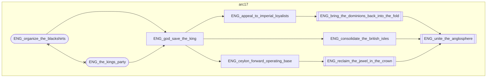

#### Arc 28: Communist Britain

```mermaid
flowchart TD
    subgraph arc28
        ENG_alliance_with_the_canadian_workers["ENG_alliance_with_the_canadian_workers"]
        ENG_anti_american_rhetoric["ENG_anti_american_rhetoric"]
        ENG_enforce_decolonization["ENG_enforce_decolonization"]
        ENG_follow_moscow["ENG_follow_moscow"]
        ENG_for_the_good_of_the_revolution(["ENG_for_the_good_of_the_revolution"])
        ENG_liberate_the_american_workers[["ENG_liberate_the_american_workers"]]
        ENG_liberate_the_home_of_marx[["ENG_liberate_the_home_of_marx"]]
        ENG_preparing_the_second_front["ENG_preparing_the_second_front"]
        ENG_reach_out_across_the_channel["ENG_reach_out_across_the_channel"]
        ENG_soviet_cooperation[["ENG_soviet_cooperation"]]
        ENG_tackle_fascism["ENG_tackle_fascism"]
        ENG_take_the_reactionaries_out_of_their_nest["ENG_take_the_reactionaries_out_of_their_nest"]
        ENG_the_british_communist_alternative["ENG_the_british_communist_alternative"]
        ENG_the_one_true_revolution[["ENG_the_one_true_revolution"]]
        ENG_the_peoples_duty(["ENG_the_peoples_duty"])
        ENG_alliance_with_the_canadian_workers --> ENG_anti_american_rhetoric
        ENG_anti_american_rhetoric --> ENG_liberate_the_american_workers
        ENG_enforce_decolonization --> ENG_soviet_cooperation
        ENG_enforce_decolonization --> ENG_the_one_true_revolution
        ENG_follow_moscow --> ENG_tackle_fascism
        ENG_for_the_good_of_the_revolution --> ENG_follow_moscow
        ENG_for_the_good_of_the_revolution --> ENG_the_british_communist_alternative
        ENG_preparing_the_second_front --> ENG_liberate_the_home_of_marx
        ENG_reach_out_across_the_channel --> ENG_soviet_cooperation
        ENG_reach_out_across_the_channel --> ENG_the_one_true_revolution
        ENG_tackle_fascism --> ENG_preparing_the_second_front
        ENG_take_the_reactionaries_out_of_their_nest --> ENG_anti_american_rhetoric
        ENG_the_british_communist_alternative --> ENG_enforce_decolonization
        ENG_the_british_communist_alternative --> ENG_reach_out_across_the_channel
        ENG_the_one_true_revolution --> ENG_liberate_the_home_of_marx
        ENG_the_peoples_duty --> ENG_alliance_with_the_canadian_workers
        ENG_the_peoples_duty --> ENG_take_the_reactionaries_out_of_their_nest
        ENG_alliance_with_the_canadian_workers x--x ENG_take_the_reactionaries_out_of_their_nest
        ENG_enforce_decolonization x--x ENG_reach_out_across_the_channel
        ENG_follow_moscow x--x ENG_the_british_communist_alternative
        ENG_soviet_cooperation x--x ENG_the_one_true_revolution
    end
```

### United States


#### Arc 6: Red America

```mermaid
flowchart TD
    subgraph arc6
        USA_agricultural_adjustment_act["USA_agricultural_adjustment_act"]
        USA_continue_the_new_deal(["USA_continue_the_new_deal"])
        USA_end_monarchism[["USA_end_monarchism"]]
        USA_reach_out_to_the_ware_group["USA_reach_out_to_the_ware_group"]
        USA_shatter_the_empires[["USA_shatter_the_empires"]]
        USA_suspend_the_presecution[["USA_suspend_the_presecution"]]
        USA_us_ussr_economic_cooperation[["USA_us_ussr_economic_cooperation"]]
        USA_wpa["USA_wpa"]
        USA_agricultural_adjustment_act --> USA_reach_out_to_the_ware_group
        USA_continue_the_new_deal --> USA_suspend_the_presecution
        USA_continue_the_new_deal --> USA_wpa
        USA_end_monarchism --> USA_shatter_the_empires
        USA_reach_out_to_the_ware_group --> USA_end_monarchism
        USA_reach_out_to_the_ware_group --> USA_us_ussr_economic_cooperation
        USA_suspend_the_presecution --> USA_reach_out_to_the_ware_group
        USA_wpa --> USA_agricultural_adjustment_act
    end
```

#### Arc 18: American War Plan

```mermaid
flowchart TD
    subgraph arc18
        USA_defense_of_the_pacific[["USA_defense_of_the_pacific"]]
        USA_intervention_in_asia["USA_intervention_in_asia"]
        USA_intervention_in_europe[["USA_intervention_in_europe"]]
        USA_war_plan_black[["USA_war_plan_black"]]
        USA_war_plan_orange[["USA_war_plan_orange"]]
        USA_war_plan_yellow["USA_war_plan_yellow"]
        USA_war_plans_division(["USA_war_plans_division"])
        USA_intervention_in_asia --> USA_war_plan_orange
        USA_intervention_in_asia --> USA_war_plan_yellow
        USA_intervention_in_europe --> USA_war_plan_black
        USA_war_plan_orange --> USA_defense_of_the_pacific
        USA_war_plan_yellow --> USA_defense_of_the_pacific
        USA_war_plans_division --> USA_intervention_in_asia
        USA_war_plans_division --> USA_intervention_in_europe
    end
```

#### Arc 19: American Global Hegemony

```mermaid
flowchart TD
    subgraph arc19
        USA_agricultural_adjustment_act["USA_agricultural_adjustment_act"]
        USA_continue_the_new_deal(["USA_continue_the_new_deal"])
        USA_end_monarchism[["USA_end_monarchism"]]
        USA_global_hegemony[["USA_global_hegemony"]]
        USA_north_american_dominion(["USA_north_american_dominion"])
        USA_pacific_pacification["USA_pacific_pacification"]
        USA_protect_south_america["USA_protect_south_america"]
        USA_reach_out_to_the_ware_group["USA_reach_out_to_the_ware_group"]
        USA_secure_asia["USA_secure_asia"]
        USA_shatter_the_empires[["USA_shatter_the_empires"]]
        USA_strategic_interests["USA_strategic_interests"]
        USA_suspend_the_presecution["USA_suspend_the_presecution"]
        USA_wpa["USA_wpa"]
        USA_agricultural_adjustment_act --> USA_reach_out_to_the_ware_group
        USA_continue_the_new_deal --> USA_suspend_the_presecution
        USA_continue_the_new_deal --> USA_wpa
        USA_end_monarchism --> USA_shatter_the_empires
        USA_north_american_dominion --> USA_pacific_pacification
        USA_north_american_dominion --> USA_strategic_interests
        USA_pacific_pacification --> USA_secure_asia
        USA_protect_south_america --> USA_global_hegemony
        USA_reach_out_to_the_ware_group --> USA_end_monarchism
        USA_secure_asia --> USA_global_hegemony
        USA_strategic_interests --> USA_protect_south_america
        USA_suspend_the_presecution --> USA_reach_out_to_the_ware_group
        USA_wpa --> USA_agricultural_adjustment_act
    end
```

### France


#### Arc 7: Napoleonic France

```mermaid
flowchart TD
    subgraph arc7
        FRA_action_francaise(["FRA_action_francaise"])
        FRA_brumaire_movement[["FRA_brumaire_movement"]]
        FRA_compromise_with_germany["FRA_compromise_with_germany"]
        FRA_crush_germany[["FRA_crush_germany"]]
        FRA_nothern_italy_claim[["FRA_nothern_italy_claim"]]
        FRA_our_natural_borders["FRA_our_natural_borders"]
        FRA_papal_rehabilitation[["FRA_papal_rehabilitation"]]
        FRA_repeal_the_law_of_exile[["FRA_repeal_the_law_of_exile"]]
        FRA_the_new_continental_system[["FRA_the_new_continental_system"]]
        FRA_action_francaise --> FRA_papal_rehabilitation
        FRA_action_francaise --> FRA_repeal_the_law_of_exile
        FRA_brumaire_movement --> FRA_the_new_continental_system
        FRA_compromise_with_germany --> FRA_nothern_italy_claim
        FRA_our_natural_borders --> FRA_crush_germany
        FRA_our_natural_borders --> FRA_nothern_italy_claim
        FRA_papal_rehabilitation --> FRA_brumaire_movement
        FRA_repeal_the_law_of_exile --> FRA_brumaire_movement
        FRA_the_new_continental_system --> FRA_compromise_with_germany
        FRA_the_new_continental_system --> FRA_our_natural_borders
        FRA_compromise_with_germany x--x FRA_our_natural_borders
    end
```

#### Arc 20: French Monarchist Revival

```mermaid
flowchart TD
    subgraph arc20
        FRA_assist_the_carlist_cause["FRA_assist_the_carlist_cause"]
        FRA_claim_the_andorran_throne[["FRA_claim_the_andorran_throne"]]
        FRA_compromise_with_germany["FRA_compromise_with_germany"]
        FRA_crush_germany["FRA_crush_germany"]
        FRA_destroy_albion["FRA_destroy_albion"]
        FRA_intervene_in_the_spanish_civil_war["FRA_intervene_in_the_spanish_civil_war"]
        FRA_our_natural_borders["FRA_our_natural_borders"]
        FRA_restore_the_mexican_monarchy[["FRA_restore_the_mexican_monarchy"]]
        FRA_second_march_on_moscow[["FRA_second_march_on_moscow"]]
        FRA_secure_the_crown_of_spain[["FRA_secure_the_crown_of_spain"]]
        FRA_support_the_legitimatises(["FRA_support_the_legitimatises"])
        FRA_the_new_continental_system(["FRA_the_new_continental_system"])
        FRA_assist_the_carlist_cause --> FRA_intervene_in_the_spanish_civil_war
        FRA_compromise_with_germany --> FRA_destroy_albion
        FRA_crush_germany --> FRA_second_march_on_moscow
        FRA_destroy_albion --> FRA_restore_the_mexican_monarchy
        FRA_intervene_in_the_spanish_civil_war --> FRA_secure_the_crown_of_spain
        FRA_our_natural_borders --> FRA_crush_germany
        FRA_our_natural_borders --> FRA_destroy_albion
        FRA_secure_the_crown_of_spain --> FRA_claim_the_andorran_throne
        FRA_support_the_legitimatises --> FRA_assist_the_carlist_cause
        FRA_the_new_continental_system --> FRA_compromise_with_germany
        FRA_the_new_continental_system --> FRA_our_natural_borders
        FRA_compromise_with_germany x--x FRA_our_natural_borders
    end
```

#### Arc 21: French Revenge

```mermaid
flowchart TD
    subgraph arc21
        FRA_assistance_treaty["FRA_assistance_treaty"]
        FRA_brumaire_movement(["FRA_brumaire_movement"])
        FRA_claim_rhineland["FRA_claim_rhineland"]
        FRA_collectivisation["FRA_collectivisation"]
        FRA_commune_proclamation["FRA_commune_proclamation"]
        FRA_compromise_with_germany["FRA_compromise_with_germany"]
        FRA_crush_germany[["FRA_crush_germany"]]
        FRA_demand_wallonia["FRA_demand_wallonia"]
        FRA_destroy_albion[["FRA_destroy_albion"]]
        FRA_dismantle_germany[["FRA_dismantle_germany"]]
        FRA_humanite_unie["FRA_humanite_unie"]
        FRA_ideological_indoctrination["FRA_ideological_indoctrination"]
        FRA_our_natural_borders["FRA_our_natural_borders"]
        FRA_pcf_sfio_coalition(["FRA_pcf_sfio_coalition"])
        FRA_state_reorganisation(["FRA_state_reorganisation"])
        FRA_strike_empire[["FRA_strike_empire"]]
        FRA_support_ppf(["FRA_support_ppf"])
        FRA_syndicalist_revolution["FRA_syndicalist_revolution"]
        FRA_the_new_continental_system["FRA_the_new_continental_system"]
        FRA_ultimatum_to_belgium["FRA_ultimatum_to_belgium"]
        FRA_union_latins(["FRA_union_latins"])
        FRA_we_want_petain(["FRA_we_want_petain"])
        FRA_assistance_treaty --> FRA_strike_empire
        FRA_brumaire_movement --> FRA_the_new_continental_system
        FRA_claim_rhineland --> FRA_dismantle_germany
        FRA_collectivisation --> FRA_assistance_treaty
        FRA_collectivisation --> FRA_humanite_unie
        FRA_commune_proclamation --> FRA_assistance_treaty
        FRA_commune_proclamation --> FRA_collectivisation
        FRA_compromise_with_germany --> FRA_destroy_albion
        FRA_demand_wallonia --> FRA_claim_rhineland
        FRA_humanite_unie --> FRA_strike_empire
        FRA_ideological_indoctrination --> FRA_commune_proclamation
        FRA_ideological_indoctrination --> FRA_syndicalist_revolution
        FRA_our_natural_borders --> FRA_crush_germany
        FRA_our_natural_borders --> FRA_destroy_albion
        FRA_pcf_sfio_coalition --> FRA_commune_proclamation
        FRA_pcf_sfio_coalition --> FRA_ideological_indoctrination
        FRA_state_reorganisation --> FRA_demand_wallonia
        FRA_state_reorganisation --> FRA_ultimatum_to_belgium
        FRA_support_ppf --> FRA_demand_wallonia
        FRA_support_ppf --> FRA_ultimatum_to_belgium
        FRA_syndicalist_revolution --> FRA_collectivisation
        FRA_the_new_continental_system --> FRA_compromise_with_germany
        FRA_the_new_continental_system --> FRA_our_natural_borders
        FRA_ultimatum_to_belgium --> FRA_claim_rhineland
        FRA_union_latins --> FRA_demand_wallonia
        FRA_union_latins --> FRA_ultimatum_to_belgium
        FRA_we_want_petain --> FRA_demand_wallonia
        FRA_we_want_petain --> FRA_ultimatum_to_belgium
        FRA_assistance_treaty x--x FRA_humanite_unie
        FRA_compromise_with_germany x--x FRA_our_natural_borders
        FRA_demand_wallonia x--x FRA_ultimatum_to_belgium
        FRA_support_ppf x--x FRA_we_want_petain
    end
```

#### Arc 22: French Plan XIV

```mermaid
flowchart TD
    subgraph arc22
        FRA_brumaire_movement(["FRA_brumaire_movement"])
        FRA_claim_rhineland["FRA_claim_rhineland"]
        FRA_compromise_with_germany["FRA_compromise_with_germany"]
        FRA_demand_wallonia(["FRA_demand_wallonia"])
        FRA_dismantle_germany["FRA_dismantle_germany"]
        FRA_nothern_italy_claim[["FRA_nothern_italy_claim"]]
        FRA_our_natural_borders["FRA_our_natural_borders"]
        FRA_plan_xiv[["FRA_plan_xiv"]]
        FRA_return_to_dalmatia[["FRA_return_to_dalmatia"]]
        FRA_the_new_continental_system["FRA_the_new_continental_system"]
        FRA_ultimatum_to_belgium(["FRA_ultimatum_to_belgium"])
        FRA_brumaire_movement --> FRA_the_new_continental_system
        FRA_claim_rhineland --> FRA_dismantle_germany
        FRA_compromise_with_germany --> FRA_nothern_italy_claim
        FRA_demand_wallonia --> FRA_claim_rhineland
        FRA_dismantle_germany --> FRA_plan_xiv
        FRA_nothern_italy_claim --> FRA_return_to_dalmatia
        FRA_our_natural_borders --> FRA_nothern_italy_claim
        FRA_the_new_continental_system --> FRA_compromise_with_germany
        FRA_the_new_continental_system --> FRA_our_natural_borders
        FRA_ultimatum_to_belgium --> FRA_claim_rhineland
        FRA_compromise_with_germany x--x FRA_our_natural_borders
        FRA_demand_wallonia x--x FRA_ultimatum_to_belgium
    end
```

### Hungary


#### Arc 8: Habsburg restoration

```mermaid
flowchart TD
    subgraph arc8
        HUN_claim_galicia[["HUN_claim_galicia"]]
        HUN_claim_transylvania[["HUN_claim_transylvania"]]
        HUN_demand_a_referendum["HUN_demand_a_referendum"]
        HUN_elect_a_king(["HUN_elect_a_king"])
        HUN_invite_the_habsburg_prince["HUN_invite_the_habsburg_prince"]
        HUN_march_to_the_shore[["HUN_march_to_the_shore"]]
        HUN_proclaim_the_restoration_of_austria_hungary[["HUN_proclaim_the_restoration_of_austria_hungary"]]
        HUN_protect_czechoslovakia["HUN_protect_czechoslovakia"]
        HUN_take_austria_by_force["HUN_take_austria_by_force"]
        HUN_claim_transylvania --> HUN_march_to_the_shore
        HUN_demand_a_referendum --> HUN_proclaim_the_restoration_of_austria_hungary
        HUN_elect_a_king --> HUN_invite_the_habsburg_prince
        HUN_invite_the_habsburg_prince --> HUN_demand_a_referendum
        HUN_invite_the_habsburg_prince --> HUN_take_austria_by_force
        HUN_proclaim_the_restoration_of_austria_hungary --> HUN_protect_czechoslovakia
        HUN_protect_czechoslovakia --> HUN_claim_galicia
        HUN_protect_czechoslovakia --> HUN_claim_transylvania
        HUN_take_austria_by_force --> HUN_proclaim_the_restoration_of_austria_hungary
        HUN_demand_a_referendum x--x HUN_take_austria_by_force
    end
```

## Pool and selection

- Random sessions pick from the full pool with equal weights. The list grows with implementation; pin options exist only for implemented arcs.
- Derail repicks the next eligible never-derailed arc. A derailed arc never re-enters the pool in the same session.
- Target variants are rolled at pick (per-arc 50/50) and remain fixed for the session. Logging carries the variant name alongside `sc_pick`.

## Open design questions

- Whether `HUN` gets more than one arc (currently only Habsburg restoration). No decision yet.