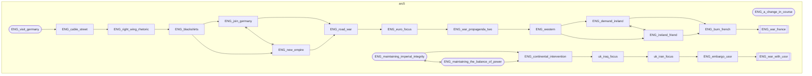

# Scenarios Catalog

Generated from `docs/scenarios/*.toml` by `core/tools/build_scenario_catalog.py` -
do not edit by hand. The arc schema lives in `docs/gdd/Scenarios.md`.

## Reading a diagram

- `([id])` rounded - a branch entry / path root.
- `[[id]]` double-bordered - a key focus the director boosts and logs.
- `[id]` plain - an intermediate prerequisite, boosted as part of the path closure.
- `A --> B` - B requires A.
- `A x--x B` - mutually exclusive: taking one hides the other.

## United Kingdom

| # | Aggressor | Arc | Variant A | Variant B | Key focuses | Status |
|---|---|---|---|---|---|---|
| 5 | ENG | Fascist britain | FRA, SOV | GER, ITA | `a_change_in_course`, `war_france`, `a_change_in_course`, `war_with_ussr` | ready |

### Arc 5: Fascist britain

The flip arc: Britain changes course, organizes the Blackshirts and turns
outward. The variant roll picks the continental pair (FRA, SOV) or the
central pair (GER, ITA); the ladder releases the crisis at the crises rung
and ultimatums plus join offers at peak. Without a fascist government by
the crises rung the arc derails.

**Telemetry labels**: `sc_goal`: eng_on_fra, eng_on_ger, eng_on_ita, eng_on_sov, fra_on_eng, ger_on_eng, ita_on_eng, sov_on_eng; `sc_justify`: eng_on_fra, eng_on_ger, eng_on_ita, eng_on_sov.

```mermaid
flowchart TD
    subgraph arc5
        ENG_a_change_in_course(["ENG_a_change_in_course"])
        ENG_blackshirts["ENG_blackshirts"]
        ENG_burn_french["ENG_burn_french"]
        ENG_cable_street["ENG_cable_street"]
        ENG_continental_intervention["ENG_continental_intervention"]
        ENG_demand_ireland["ENG_demand_ireland"]
        ENG_embargo_ussr["ENG_embargo_ussr"]
        ENG_euro_focus["ENG_euro_focus"]
        ENG_ireland_friend["ENG_ireland_friend"]
        ENG_join_germany["ENG_join_germany"]
        ENG_maintaining_imperial_integrity(["ENG_maintaining_imperial_integrity"])
        ENG_maintaining_the_balance_of_power(["ENG_maintaining_the_balance_of_power"])
        ENG_new_empire["ENG_new_empire"]
        ENG_right_wing_rhetoric["ENG_right_wing_rhetoric"]
        ENG_road_war["ENG_road_war"]
        ENG_visit_germany(["ENG_visit_germany"])
        ENG_war_france[["ENG_war_france"]]
        ENG_war_propaganda_two["ENG_war_propaganda_two"]
        ENG_war_with_ussr[["ENG_war_with_ussr"]]
        ENG_western["ENG_western"]
        uk_iran_focus["uk_iran_focus"]
        uk_iraq_focus["uk_iraq_focus"]
        ENG_blackshirts --> ENG_join_germany
        ENG_blackshirts --> ENG_new_empire
        ENG_burn_french --> ENG_war_france
        ENG_cable_street --> ENG_right_wing_rhetoric
        ENG_continental_intervention --> uk_iraq_focus
        ENG_demand_ireland --> ENG_burn_french
        ENG_embargo_ussr --> ENG_war_with_ussr
        ENG_euro_focus --> ENG_war_propaganda_two
        ENG_ireland_friend --> ENG_burn_french
        ENG_join_germany --> ENG_road_war
        ENG_maintaining_imperial_integrity --> ENG_continental_intervention
        ENG_maintaining_the_balance_of_power --> ENG_continental_intervention
        ENG_new_empire --> ENG_road_war
        ENG_right_wing_rhetoric --> ENG_blackshirts
        ENG_road_war --> ENG_euro_focus
        ENG_visit_germany --> ENG_cable_street
        ENG_war_propaganda_two --> ENG_western
        ENG_western --> ENG_demand_ireland
        ENG_western --> ENG_ireland_friend
        uk_iran_focus --> ENG_embargo_ussr
        uk_iraq_focus --> uk_iran_focus
        ENG_demand_ireland x--x ENG_ireland_friend
        ENG_join_germany x--x ENG_new_empire
        ENG_maintaining_imperial_integrity x--x ENG_maintaining_the_balance_of_power
    end
```
