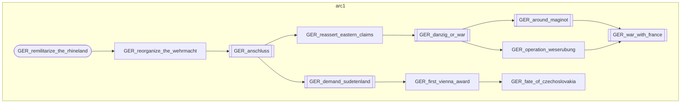
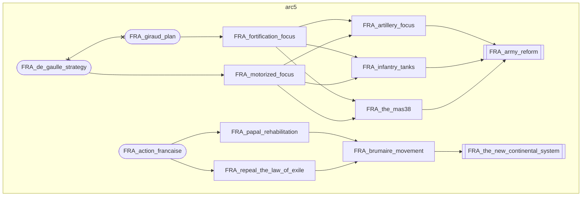

# Scenarios Catalog

Generated from `docs/scenarios/*.toml` by `core/tools/build_scenario_catalog.py` -
do not edit by hand. The arc schema lives in `docs/gdd/Scenarios.md`.

## Reading a diagram

- `([id])` rounded - a branch entry / path root.
- `[[id]]` double-bordered - a key focus the director boosts and logs.
- `[id]` plain - an intermediate prerequisite, boosted as part of the path closure.
- `A --> B` - B requires A.
- `A x--x B` - mutually exclusive: taking one hides the other.

## United States

| # | Aggressor | Arc | Variant a | Key focuses | Status |
|---|---|---|---|---|---|
| - | USA | Fascist america scenario | CAN, MEX | `ally_with_the_silver_shirts`, `recruit_the_free_corps`, `work_with_the_bund`, `voter_registration_act`, `national_prosperity_program`, `privatize_the_TVA`, `de_regulate_the_banking_sector`, `national_employment_strategy`, `honor_the_confederacy` | draft |

### Arc -: Fascist america scenario

The non-historical arc: a fascist America turns on the hemisphere. The name is
fiction - the vanilla mechanics deliver a non-aligned "American Junta" (the
civil-war regime), so the join filter reads non-aligned, not fascism. The arc
holds its clock until that regime change, then releases claims and incidents at
the crises rung and ultimatums plus join offers at peak.

**Telemetry labels**: `sc_goal`: ; `sc_justify`: .

```mermaid
flowchart TD
    subgraph arc0
        USA_adjusted_compensation_act["USA_adjusted_compensation_act"]
        USA_ally_with_the_silver_shirts[["USA_ally_with_the_silver_shirts"]]
        USA_america_first["USA_america_first"]
        USA_de_regulate_the_banking_sector[["USA_de_regulate_the_banking_sector"]]
        USA_empower_the_huac["USA_empower_the_huac"]
        USA_extend_the_chinese_exclusion_acts["USA_extend_the_chinese_exclusion_acts"]
        USA_honor_the_confederacy[["USA_honor_the_confederacy"]]
        USA_invite_foreign_support["USA_invite_foreign_support"]
        USA_labour_management_relations_act["USA_labour_management_relations_act"]
        USA_national_employment_strategy[["USA_national_employment_strategy"]]
        USA_national_prosperity_program[["USA_national_prosperity_program"]]
        USA_privatize_the_TVA[["USA_privatize_the_TVA"]]
        USA_recruit_the_free_corps[["USA_recruit_the_free_corps"]]
        USA_reestablish_the_gold_standard(["USA_reestablish_the_gold_standard"])
        USA_send_lindbergh_to_germany["USA_send_lindbergh_to_germany"]
        USA_voter_registration_act[["USA_voter_registration_act"]]
        USA_work_with_the_bund[["USA_work_with_the_bund"]]
        USA_adjusted_compensation_act --> USA_labour_management_relations_act
        USA_ally_with_the_silver_shirts --> USA_invite_foreign_support
        USA_ally_with_the_silver_shirts --> USA_national_prosperity_program
        USA_america_first --> USA_ally_with_the_silver_shirts
        USA_america_first --> USA_extend_the_chinese_exclusion_acts
        USA_de_regulate_the_banking_sector --> USA_national_employment_strategy
        USA_empower_the_huac --> USA_voter_registration_act
        USA_extend_the_chinese_exclusion_acts --> USA_empower_the_huac
        USA_invite_foreign_support --> USA_send_lindbergh_to_germany
        USA_labour_management_relations_act --> USA_empower_the_huac
        USA_national_employment_strategy --> USA_honor_the_confederacy
        USA_national_prosperity_program --> USA_de_regulate_the_banking_sector
        USA_national_prosperity_program --> USA_privatize_the_TVA
        USA_privatize_the_TVA --> USA_national_employment_strategy
        USA_reestablish_the_gold_standard --> USA_adjusted_compensation_act
        USA_reestablish_the_gold_standard --> USA_america_first
        USA_send_lindbergh_to_germany --> USA_recruit_the_free_corps
        USA_send_lindbergh_to_germany --> USA_work_with_the_bund
        USA_work_with_the_bund --> USA_honor_the_confederacy
    end
```

## Germany

| # | Aggressor | Arc | Variant a | Variant b | Key focuses | Status |
|---|---|---|---|---|---|---|
| 1 | GER | Nazi germany scenario | CZE, POL | FRA, ENG | `remilitarize_the_rhineland`, `anschluss`, `demand_sudetenland`, `danzig_or_war`, `around_maginot`, `war_with_france` | ready |

### Arc 1: Nazi germany scenario

The historical arc: Germany remilitarizes, absorbs Austria, pressures
Czechoslovakia and Poland through ultimatums, then turns on France. The
variant roll picks the eastern pair (CZE, POL) or the western pair
(FRA, ENG); the ladder releases claims and incidents at the crises rung
and ultimatums plus join offers at peak.

**Telemetry labels**: `sc_goal`: cze_on_ger, eng_on_ger, fra_on_ger, ger_on_cze, ger_on_eng, ger_on_fra, ger_on_pol, pol_on_ger; `sc_justify`: ger_on_cze, ger_on_eng, ger_on_fra, ger_on_pol.

```mermaid
flowchart TD
    subgraph arc1
        GER_anschluss[["GER_anschluss"]]
        GER_around_maginot[["GER_around_maginot"]]
        GER_danzig_or_war[["GER_danzig_or_war"]]
        GER_demand_sudetenland[["GER_demand_sudetenland"]]
        GER_fate_of_czechoslovakia["GER_fate_of_czechoslovakia"]
        GER_first_vienna_award["GER_first_vienna_award"]
        GER_operation_weserubung["GER_operation_weserubung"]
        GER_reassert_eastern_claims["GER_reassert_eastern_claims"]
        GER_remilitarize_the_rhineland(["GER_remilitarize_the_rhineland"])
        GER_reorganize_the_wehrmacht["GER_reorganize_the_wehrmacht"]
        GER_war_with_france[["GER_war_with_france"]]
        GER_anschluss --> GER_demand_sudetenland
        GER_anschluss --> GER_reassert_eastern_claims
        GER_around_maginot --> GER_war_with_france
        GER_danzig_or_war --> GER_around_maginot
        GER_danzig_or_war --> GER_operation_weserubung
        GER_demand_sudetenland --> GER_first_vienna_award
        GER_first_vienna_award --> GER_fate_of_czechoslovakia
        GER_operation_weserubung --> GER_war_with_france
        GER_reassert_eastern_claims --> GER_danzig_or_war
        GER_remilitarize_the_rhineland --> GER_reorganize_the_wehrmacht
        GER_reorganize_the_wehrmacht --> GER_anschluss
    end
```

## Italy

| # | Aggressor | Arc | Variant a | Variant b | Key focuses | Status |
|---|---|---|---|---|---|---|
| 2 | ITA | Fascist italy scenario | ENG, FRA | YUG, SWI | `ethiopian_war_logistics_bba`, `italian_highways_bba`, `culto_del_duce`, `strengthen_the_regime`, `subdue_the_sentinels`, `ethiopian_war_logistics_bba`, `italian_highways_bba`, `culto_del_duce`, `strengthen_the_regime`, `all_roads_lead_to_rome` | ready |

### Arc 2: Fascist italy scenario

The historical arc: Italy consolidates at home and in Ethiopia, then presses
its rivals around the Mediterranean. The variant roll picks the western pair
(ENG, FRA) or the Adriatic-Alpine pair (YUG, SWI); the ladder releases claims
and incidents at the crises rung and ultimatums plus join offers at peak.

**Telemetry labels**: `sc_goal`: eng_on_ita, fra_on_ita, ita_on_eng, ita_on_fra, ita_on_swi, ita_on_yug, swi_on_ita, yug_on_ita; `sc_justify`: ita_on_eng, ita_on_fra, ita_on_swi, ita_on_yug.

```mermaid
flowchart TD
    subgraph arc2
        ITA_agents_of_the_church["ITA_agents_of_the_church"]
        ITA_all_roads_lead_to_rome[["ITA_all_roads_lead_to_rome"]]
        ITA_bend_the_bars["ITA_bend_the_bars"]
        ITA_blackshirt_loyalty["ITA_blackshirt_loyalty"]
        ITA_christian_democracy["ITA_christian_democracy"]
        ITA_consolidate_power["ITA_consolidate_power"]
        ITA_conspiracies_in_the_shadows["ITA_conspiracies_in_the_shadows"]
        ITA_cooperate_with_moderates["ITA_cooperate_with_moderates"]
        ITA_crush_opposition["ITA_crush_opposition"]
        ITA_culto_del_duce[["ITA_culto_del_duce"]]
        ITA_democratic_king["ITA_democratic_king"]
        ITA_depose_mussolini(["ITA_depose_mussolini"])
        ITA_dino_grandi_focus["ITA_dino_grandi_focus"]
        ITA_disband_the_blackshirts["ITA_disband_the_blackshirts"]
        ITA_divino_duce["ITA_divino_duce"]
        ITA_ethiopian_war_logistics_bba(["ITA_ethiopian_war_logistics_bba"])
        ITA_expand_intelligence_services["ITA_expand_intelligence_services"]
        ITA_expand_the_royal_guard["ITA_expand_the_royal_guard"]
        ITA_gloria_al_regno_d_italia["ITA_gloria_al_regno_d_italia"]
        ITA_italian_highways_bba(["ITA_italian_highways_bba"])
        ITA_italo_balbo_focus["ITA_italo_balbo_focus"]
        ITA_la_battaglia_del_grano["ITA_la_battaglia_del_grano"]
        ITA_la_battaglia_per_la_terra["ITA_la_battaglia_per_la_terra"]
        ITA_la_battaglia_per_le_nascite["ITA_la_battaglia_per_le_nascite"]
        ITA_mare_nostrum_bba["ITA_mare_nostrum_bba"]
        ITA_monarchia_d_italia["ITA_monarchia_d_italia"]
        ITA_power_to_the_king["ITA_power_to_the_king"]
        ITA_purge_the_party["ITA_purge_the_party"]
        ITA_revoke_the_acerbo_law["ITA_revoke_the_acerbo_law"]
        ITA_seek_papal_support["ITA_seek_papal_support"]
        ITA_servizio_informazione_militare["ITA_servizio_informazione_militare"]
        ITA_setting_course["ITA_setting_course"]
        ITA_solid_progress(["ITA_solid_progress"])
        ITA_stop_the_squandering["ITA_stop_the_squandering"]
        ITA_strengthen_the_papacy["ITA_strengthen_the_papacy"]
        ITA_strengthen_the_regime[["ITA_strengthen_the_regime"]]
        ITA_struggle_in_ethiopia(["ITA_struggle_in_ethiopia"])
        ITA_subdue_the_sentinels[["ITA_subdue_the_sentinels"]]
        ITA_the_abyssinian_fiasco(["ITA_the_abyssinian_fiasco"])
        ITA_the_fate_of_mussolini["ITA_the_fate_of_mussolini"]
        ITA_the_italian_legions["ITA_the_italian_legions"]
        ITA_towards_a_greater_italy["ITA_towards_a_greater_italy"]
        ITA_triumph_in_africa_bba["ITA_triumph_in_africa_bba"]
        ITA_undermine_the_duce["ITA_undermine_the_duce"]
        ITA_utilize_the_blackshirts["ITA_utilize_the_blackshirts"]
        ITA_agents_of_the_church --> ITA_strengthen_the_papacy
        ITA_bend_the_bars --> ITA_subdue_the_sentinels
        ITA_blackshirt_loyalty --> ITA_mare_nostrum_bba
        ITA_blackshirt_loyalty --> ITA_towards_a_greater_italy
        ITA_christian_democracy --> ITA_cooperate_with_moderates
        ITA_christian_democracy --> ITA_expand_intelligence_services
        ITA_consolidate_power --> ITA_purge_the_party
        ITA_cooperate_with_moderates --> ITA_crush_opposition
        ITA_crush_opposition --> ITA_setting_course
        ITA_culto_del_duce --> ITA_la_battaglia_del_grano
        ITA_culto_del_duce --> ITA_la_battaglia_per_la_terra
        ITA_democratic_king --> ITA_cooperate_with_moderates
        ITA_democratic_king --> ITA_expand_intelligence_services
        ITA_democratic_king --> ITA_gloria_al_regno_d_italia
        ITA_depose_mussolini --> ITA_dino_grandi_focus
        ITA_depose_mussolini --> ITA_italo_balbo_focus
        ITA_depose_mussolini --> ITA_monarchia_d_italia
        ITA_dino_grandi_focus --> ITA_consolidate_power
        ITA_dino_grandi_focus --> ITA_stop_the_squandering
        ITA_disband_the_blackshirts --> ITA_expand_the_royal_guard
        ITA_divino_duce --> ITA_blackshirt_loyalty
        ITA_expand_intelligence_services --> ITA_crush_opposition
        ITA_expand_the_royal_guard --> ITA_gloria_al_regno_d_italia
        ITA_gloria_al_regno_d_italia --> ITA_setting_course
        ITA_italo_balbo_focus --> ITA_consolidate_power
        ITA_italo_balbo_focus --> ITA_stop_the_squandering
        ITA_la_battaglia_del_grano --> ITA_la_battaglia_per_le_nascite
        ITA_la_battaglia_per_la_terra --> ITA_la_battaglia_per_le_nascite
        ITA_la_battaglia_per_le_nascite --> ITA_strengthen_the_regime
        ITA_mare_nostrum_bba --> ITA_the_italian_legions
        ITA_monarchia_d_italia --> ITA_power_to_the_king
        ITA_monarchia_d_italia --> ITA_revoke_the_acerbo_law
        ITA_power_to_the_king --> ITA_disband_the_blackshirts
        ITA_power_to_the_king --> ITA_seek_papal_support
        ITA_power_to_the_king --> ITA_utilize_the_blackshirts
        ITA_purge_the_party --> ITA_the_fate_of_mussolini
        ITA_revoke_the_acerbo_law --> ITA_christian_democracy
        ITA_revoke_the_acerbo_law --> ITA_democratic_king
        ITA_revoke_the_acerbo_law --> ITA_disband_the_blackshirts
        ITA_seek_papal_support --> ITA_agents_of_the_church
        ITA_servizio_informazione_militare --> ITA_triumph_in_africa_bba
        ITA_setting_course --> ITA_mare_nostrum_bba
        ITA_setting_course --> ITA_towards_a_greater_italy
        ITA_solid_progress --> ITA_servizio_informazione_militare
        ITA_stop_the_squandering --> ITA_purge_the_party
        ITA_strengthen_the_papacy --> ITA_setting_course
        ITA_strengthen_the_regime --> ITA_mare_nostrum_bba
        ITA_strengthen_the_regime --> ITA_towards_a_greater_italy
        ITA_struggle_in_ethiopia --> ITA_servizio_informazione_militare
        ITA_struggle_in_ethiopia --> ITA_undermine_the_duce
        ITA_the_abyssinian_fiasco --> ITA_servizio_informazione_militare
        ITA_the_fate_of_mussolini --> ITA_divino_duce
        ITA_the_italian_legions --> ITA_all_roads_lead_to_rome
        ITA_towards_a_greater_italy --> ITA_bend_the_bars
        ITA_triumph_in_africa_bba --> ITA_culto_del_duce
        ITA_undermine_the_duce --> ITA_conspiracies_in_the_shadows
        ITA_utilize_the_blackshirts --> ITA_expand_the_royal_guard
        ITA_christian_democracy x--x ITA_democratic_king
        ITA_dino_grandi_focus x--x ITA_italo_balbo_focus
        ITA_dino_grandi_focus x--x ITA_monarchia_d_italia
        ITA_disband_the_blackshirts x--x ITA_utilize_the_blackshirts
        ITA_italo_balbo_focus x--x ITA_monarchia_d_italia
        ITA_la_battaglia_del_grano x--x ITA_la_battaglia_per_la_terra
        ITA_mare_nostrum_bba x--x ITA_towards_a_greater_italy
        ITA_power_to_the_king x--x ITA_revoke_the_acerbo_law
        ITA_solid_progress x--x ITA_struggle_in_ethiopia
        ITA_solid_progress x--x ITA_the_abyssinian_fiasco
        ITA_struggle_in_ethiopia x--x ITA_the_abyssinian_fiasco
    end
```

## Japan

| # | Aggressor | Arc | Variant a | Variant b | Key focuses | Status |
|---|---|---|---|---|---|---|
| 3 | JAP | Militarist japan scenario | CHI, AST | SOV, MON | `reinforce_the_beijing_garrison`, `new_order_in_east_asia`, `sea_greater_east_asian_co_properity_sphere`, `nanshin_ron`, `ensure_temporary_peace_with_china`, `formalize_japan_china_manchukuo_alliance`, `sea_greater_east_asian_co_properity_sphere`, `hokushin_ron` | ready |

### Arc 3: Militarist japan scenario

The historical arc: Japan tightens its hold on Manchuria and northern China,
then turns on its rivals across the continent and the Pacific. The variant roll
picks the southward pair (CHI, AST) or the strike-north pair (SOV, MON); the
ladder releases claims and incidents at the crises rung and ultimatums plus
join offers at peak.

**Telemetry labels**: `sc_goal`: ast_on_jap, chi_on_jap, jap_on_ast, jap_on_chi, jap_on_mon, jap_on_sov, mon_on_jap, sov_on_jap; `sc_justify`: jap_on_ast, jap_on_chi, jap_on_mon, jap_on_sov.

```mermaid
flowchart TD
    subgraph arc3
        JAP_enact_religious_organizations_law["JAP_enact_religious_organizations_law"]
        JAP_ensure_temporary_peace_with_china[["JAP_ensure_temporary_peace_with_china"]]
        JAP_formalize_japan_china_manchukuo_alliance[["JAP_formalize_japan_china_manchukuo_alliance"]]
        JAP_hokushin_ron[["JAP_hokushin_ron"]]
        JAP_imperial_rule_assistance_association["JAP_imperial_rule_assistance_association"]
        JAP_issue_the_ten_commandments_for_marriage["JAP_issue_the_ten_commandments_for_marriage"]
        JAP_konoes_first_cabinet["JAP_konoes_first_cabinet"]
        JAP_nanshin_ron[["JAP_nanshin_ron"]]
        JAP_new_order_in_east_asia[["JAP_new_order_in_east_asia"]]
        JAP_new_order_movement["JAP_new_order_movement"]
        JAP_promulgate_the_military_ministers_system["JAP_promulgate_the_military_ministers_system"]
        JAP_reinforce_the_beijing_garrison[["JAP_reinforce_the_beijing_garrison"]]
        JAP_reiterate_the_three_principles_of_hirota["JAP_reiterate_the_three_principles_of_hirota"]
        JAP_reprimand_hamada_kunimatsu["JAP_reprimand_hamada_kunimatsu"]
        JAP_revere_the_emperor_destroy_the_traitors(["JAP_revere_the_emperor_destroy_the_traitors"])
        JAP_revisit_the_thirteen_demands["JAP_revisit_the_thirteen_demands"]
        JAP_sea_greater_east_asian_co_properity_sphere[["JAP_sea_greater_east_asian_co_properity_sphere"]]
        JAP_sea_national_spiritual_mobliization_movement["JAP_sea_national_spiritual_mobliization_movement"]
        JAP_sea_purge_the_kodoha_faction(["JAP_sea_purge_the_kodoha_faction"])
        JAP_sea_state_general_mobilization_law["JAP_sea_state_general_mobilization_law"]
        JAP_support_the_kodoha_faction(["JAP_support_the_kodoha_faction"])
        JAP_the_harakiri_debate["JAP_the_harakiri_debate"]
        JAP_enact_religious_organizations_law --> JAP_new_order_movement
        JAP_hokushin_ron --> JAP_ensure_temporary_peace_with_china
        JAP_imperial_rule_assistance_association --> JAP_sea_greater_east_asian_co_properity_sphere
        JAP_issue_the_ten_commandments_for_marriage --> JAP_enact_religious_organizations_law
        JAP_konoes_first_cabinet --> JAP_new_order_in_east_asia
        JAP_konoes_first_cabinet --> JAP_sea_national_spiritual_mobliization_movement
        JAP_new_order_movement --> JAP_imperial_rule_assistance_association
        JAP_promulgate_the_military_ministers_system --> JAP_reprimand_hamada_kunimatsu
        JAP_promulgate_the_military_ministers_system --> JAP_the_harakiri_debate
        JAP_reiterate_the_three_principles_of_hirota --> JAP_formalize_japan_china_manchukuo_alliance
        JAP_reiterate_the_three_principles_of_hirota --> JAP_sea_national_spiritual_mobliization_movement
        JAP_reprimand_hamada_kunimatsu --> JAP_reiterate_the_three_principles_of_hirota
        JAP_revere_the_emperor_destroy_the_traitors --> JAP_hokushin_ron
        JAP_revere_the_emperor_destroy_the_traitors --> JAP_nanshin_ron
        JAP_revere_the_emperor_destroy_the_traitors --> JAP_revisit_the_thirteen_demands
        JAP_revisit_the_thirteen_demands --> JAP_reinforce_the_beijing_garrison
        JAP_sea_national_spiritual_mobliization_movement --> JAP_issue_the_ten_commandments_for_marriage
        JAP_sea_national_spiritual_mobliization_movement --> JAP_sea_state_general_mobilization_law
        JAP_sea_purge_the_kodoha_faction --> JAP_hokushin_ron
        JAP_sea_purge_the_kodoha_faction --> JAP_nanshin_ron
        JAP_sea_purge_the_kodoha_faction --> JAP_promulgate_the_military_ministers_system
        JAP_sea_purge_the_kodoha_faction --> JAP_revisit_the_thirteen_demands
        JAP_sea_state_general_mobilization_law --> JAP_enact_religious_organizations_law
        JAP_support_the_kodoha_faction --> JAP_hokushin_ron
        JAP_the_harakiri_debate --> JAP_konoes_first_cabinet
        JAP_reprimand_hamada_kunimatsu x--x JAP_the_harakiri_debate
        JAP_revere_the_emperor_destroy_the_traitors x--x JAP_sea_purge_the_kodoha_faction
        JAP_sea_purge_the_kodoha_faction x--x JAP_support_the_kodoha_faction
    end
```

## Soviet Union

| # | Aggressor | Arc | Variant a | Variant b | Key focuses | Status |
|---|---|---|---|---|---|---|
| 4 | SOV | Soviet west scenario | EST, LAT, LIT | POL, ROM | `Mass_Immunizations`, `restoration_and_development`, `the_bloc_of_rights_and_trotskyites`, `the_comintern`, `baltic_security`, `claims_in_baltic`, `secure_leningrad`, `control_scandinavia`, `Mass_Immunizations`, `restoration_and_development`, `the_bloc_of_rights_and_trotskyites`, `the_comintern`, `baltic_security`, `respect_baltic_self_determination`, `claims_on_poland`, `demand_eastern_poland` | ready |

### Arc 4: Soviet west scenario

The historical arc: the Soviet Union consolidates its western approaches,
pressing the Baltic states first then Poland and Romania. The variant roll
picks the Baltic trio (EST, LAT, LIT) or the western pair (POL, ROM); the
ladder releases claims and incidents at the crises rung and ultimatums plus
join offers at peak.

**Telemetry labels**: `sc_goal`: est_on_sov, lat_on_sov, lit_on_sov, pol_on_sov, rom_on_sov, sov_on_est, sov_on_lat, sov_on_lit, sov_on_pol, sov_on_rom; `sc_justify`: sov_on_est, sov_on_lat, sov_on_lit, sov_on_pol, sov_on_rom.

```mermaid
flowchart TD
    subgraph arc4
        SOV_Mass_Immunizations[["SOV_Mass_Immunizations"]]
        SOV_baltic_security[["SOV_baltic_security"]]
        SOV_claims_in_baltic[["SOV_claims_in_baltic"]]
        SOV_claims_on_poland[["SOV_claims_on_poland"]]
        SOV_control_scandinavia[["SOV_control_scandinavia"]]
        SOV_demand_eastern_poland[["SOV_demand_eastern_poland"]]
        SOV_finish_the_five_year_plan["SOV_finish_the_five_year_plan"]
        SOV_heavy_industry(["SOV_heavy_industry"])
        SOV_industrial_modernization["SOV_industrial_modernization"]
        SOV_infrastructure_effort_nsb(["SOV_infrastructure_effort_nsb"])
        SOV_optimize_production_lines["SOV_optimize_production_lines"]
        SOV_reorganize_the_pc_of_heavy_industry["SOV_reorganize_the_pc_of_heavy_industry"]
        SOV_respect_baltic_self_determination[["SOV_respect_baltic_self_determination"]]
        SOV_restoration_and_development[["SOV_restoration_and_development"]]
        SOV_secure_leningrad[["SOV_secure_leningrad"]]
        SOV_shift_to_armaments_production["SOV_shift_to_armaments_production"]
        SOV_the_anti_soviet_trotskyist_center["SOV_the_anti_soviet_trotskyist_center"]
        SOV_the_bloc_of_rights_and_trotskyites[["SOV_the_bloc_of_rights_and_trotskyites"]]
        SOV_the_centre["SOV_the_centre"]
        SOV_the_comintern[["SOV_the_comintern"]]
        SOV_the_military_conspiracy["SOV_the_military_conspiracy"]
        SOV_the_path_of_marxism_leninism(["SOV_the_path_of_marxism_leninism"])
        SOV_the_stalin_constitution["SOV_the_stalin_constitution"]
        SOV_the_workers_dictatorship["SOV_the_workers_dictatorship"]
        SOV_the_zinovyevite_terrorist_center["SOV_the_zinovyevite_terrorist_center"]
        SOV_third_five_year_plan["SOV_third_five_year_plan"]
        SOV_baltic_security --> SOV_claims_in_baltic
        SOV_baltic_security --> SOV_respect_baltic_self_determination
        SOV_claims_in_baltic --> SOV_claims_on_poland
        SOV_claims_in_baltic --> SOV_secure_leningrad
        SOV_claims_on_poland --> SOV_demand_eastern_poland
        SOV_finish_the_five_year_plan --> SOV_third_five_year_plan
        SOV_heavy_industry --> SOV_Mass_Immunizations
        SOV_heavy_industry --> SOV_finish_the_five_year_plan
        SOV_industrial_modernization --> SOV_restoration_and_development
        SOV_infrastructure_effort_nsb --> SOV_finish_the_five_year_plan
        SOV_optimize_production_lines --> SOV_restoration_and_development
        SOV_reorganize_the_pc_of_heavy_industry --> SOV_industrial_modernization
        SOV_respect_baltic_self_determination --> SOV_claims_on_poland
        SOV_respect_baltic_self_determination --> SOV_secure_leningrad
        SOV_secure_leningrad --> SOV_control_scandinavia
        SOV_shift_to_armaments_production --> SOV_optimize_production_lines
        SOV_the_anti_soviet_trotskyist_center --> SOV_the_workers_dictatorship
        SOV_the_centre --> SOV_the_stalin_constitution
        SOV_the_comintern --> SOV_baltic_security
        SOV_the_military_conspiracy --> SOV_the_bloc_of_rights_and_trotskyites
        SOV_the_path_of_marxism_leninism --> SOV_the_centre
        SOV_the_path_of_marxism_leninism --> SOV_the_comintern
        SOV_the_stalin_constitution --> SOV_the_zinovyevite_terrorist_center
        SOV_the_workers_dictatorship --> SOV_the_military_conspiracy
        SOV_the_zinovyevite_terrorist_center --> SOV_the_anti_soviet_trotskyist_center
        SOV_third_five_year_plan --> SOV_reorganize_the_pc_of_heavy_industry
        SOV_third_five_year_plan --> SOV_shift_to_armaments_production
        SOV_claims_in_baltic x--x SOV_respect_baltic_self_determination
        SOV_reorganize_the_pc_of_heavy_industry x--x SOV_shift_to_armaments_production
    end
```

## France

| # | Aggressor | Arc | Variant a | Key focuses | Status |
|---|---|---|---|---|---|
| 5 | FRA | Napoleonic france scenario | BEL, HOL, LUX | `the_new_continental_system`, `army_reform` | ready |

### Arc 5: Napoleonic france scenario

The non-historical arc: France leaves the Third Republic behind, restores an
empire, and presses its natural borders into the Low Countries. A single target
set (BEL, HOL, LUX) means no variant roll; the ladder releases claims and
incidents at the crises rung and ultimatums plus join offers at peak. Join
offers are filtered to states on France's continent that share its government.

**Telemetry labels**: `sc_goal`: bel_on_fra, fra_on_bel, fra_on_hol, fra_on_lux, hol_on_fra, lux_on_fra; `sc_justify`: fra_on_bel, fra_on_hol, fra_on_lux.

```mermaid
flowchart TD
    subgraph arc5
        FRA_action_francaise(["FRA_action_francaise"])
        FRA_army_reform[["FRA_army_reform"]]
        FRA_artillery_focus["FRA_artillery_focus"]
        FRA_brumaire_movement["FRA_brumaire_movement"]
        FRA_de_gaulle_strategy(["FRA_de_gaulle_strategy"])
        FRA_fortification_focus["FRA_fortification_focus"]
        FRA_giraud_plan(["FRA_giraud_plan"])
        FRA_infantry_tanks["FRA_infantry_tanks"]
        FRA_motorized_focus["FRA_motorized_focus"]
        FRA_papal_rehabilitation["FRA_papal_rehabilitation"]
        FRA_repeal_the_law_of_exile["FRA_repeal_the_law_of_exile"]
        FRA_the_mas38["FRA_the_mas38"]
        FRA_the_new_continental_system[["FRA_the_new_continental_system"]]
        FRA_action_francaise --> FRA_papal_rehabilitation
        FRA_action_francaise --> FRA_repeal_the_law_of_exile
        FRA_artillery_focus --> FRA_army_reform
        FRA_brumaire_movement --> FRA_the_new_continental_system
        FRA_de_gaulle_strategy --> FRA_motorized_focus
        FRA_fortification_focus --> FRA_artillery_focus
        FRA_fortification_focus --> FRA_infantry_tanks
        FRA_fortification_focus --> FRA_the_mas38
        FRA_giraud_plan --> FRA_fortification_focus
        FRA_infantry_tanks --> FRA_army_reform
        FRA_motorized_focus --> FRA_artillery_focus
        FRA_motorized_focus --> FRA_infantry_tanks
        FRA_motorized_focus --> FRA_the_mas38
        FRA_papal_rehabilitation --> FRA_brumaire_movement
        FRA_repeal_the_law_of_exile --> FRA_brumaire_movement
        FRA_the_mas38 --> FRA_army_reform
        FRA_de_gaulle_strategy x--x FRA_giraud_plan
    end
```

## United Kingdom

| # | Aggressor | Arc | Variant a | Variant b | Variant c | Variant d | Key focuses | Status |
|---|---|---|---|---|---|---|---|---|
| 6 | ENG | Monarchical great britain scenario | ITA, IRE | JAP, IRE | SOV, IRE | USA, IRE | `consolidate_the_british_isles`, `take_out_the_regia_marina`, `consolidate_the_british_isles`, `bring_the_dominions_back_into_the_fold`, `consolidate_the_british_isles`, `pre_empt_the_ideological_threat`, `consolidate_the_british_isles`, `unite_the_anglosphere` | ready |

### Arc 6: Monarchical great britain scenario

The non-historical arc: Britain turns to the Crown, consolidates the Isles,
then presses its chosen rival among the great powers. The variant roll picks
the rival pair - Italy, Japan, the Soviets or the United States - always beside
Ireland; the ladder releases claims and incidents at the crises rung and
ultimatums plus join offers at peak.

**Telemetry labels**: `sc_goal`: eng_on_ire, eng_on_ita, eng_on_jap, eng_on_sov, eng_on_usa, ire_on_eng, ita_on_eng, jap_on_eng, sov_on_eng, usa_on_eng; `sc_justify`: eng_on_ire, eng_on_ita, eng_on_jap, eng_on_sov, eng_on_usa.

```mermaid
flowchart TD
    subgraph arc6
        ENG_a_change_in_course(["ENG_a_change_in_course"])
        ENG_alliance_with_germany["ENG_alliance_with_germany"]
        ENG_appeal_to_imperial_loyalists["ENG_appeal_to_imperial_loyalists"]
        ENG_bring_the_dominions_back_into_the_fold[["ENG_bring_the_dominions_back_into_the_fold"]]
        ENG_ceylon_forward_operating_base["ENG_ceylon_forward_operating_base"]
        ENG_consolidate_the_british_isles[["ENG_consolidate_the_british_isles"]]
        ENG_god_save_the_king["ENG_god_save_the_king"]
        ENG_isolate_the_mediterranean_threat["ENG_isolate_the_mediterranean_threat"]
        ENG_noninterference_treaty_with_germany["ENG_noninterference_treaty_with_germany"]
        ENG_organize_the_blackshirts["ENG_organize_the_blackshirts"]
        ENG_pre_empt_the_ideological_threat[["ENG_pre_empt_the_ideological_threat"]]
        ENG_reassess_continental_commitments["ENG_reassess_continental_commitments"]
        ENG_reclaim_the_jewel_in_the_crown["ENG_reclaim_the_jewel_in_the_crown"]
        ENG_take_out_the_regia_marina[["ENG_take_out_the_regia_marina"]]
        ENG_the_kings_party["ENG_the_kings_party"]
        ENG_unite_the_anglosphere[["ENG_unite_the_anglosphere"]]
        ENG_a_change_in_course --> ENG_organize_the_blackshirts
        ENG_a_change_in_course --> ENG_the_kings_party
        ENG_alliance_with_germany --> ENG_take_out_the_regia_marina
        ENG_appeal_to_imperial_loyalists --> ENG_bring_the_dominions_back_into_the_fold
        ENG_bring_the_dominions_back_into_the_fold --> ENG_unite_the_anglosphere
        ENG_ceylon_forward_operating_base --> ENG_reclaim_the_jewel_in_the_crown
        ENG_consolidate_the_british_isles --> ENG_unite_the_anglosphere
        ENG_god_save_the_king --> ENG_appeal_to_imperial_loyalists
        ENG_god_save_the_king --> ENG_ceylon_forward_operating_base
        ENG_god_save_the_king --> ENG_consolidate_the_british_isles
        ENG_isolate_the_mediterranean_threat --> ENG_alliance_with_germany
        ENG_isolate_the_mediterranean_threat --> ENG_noninterference_treaty_with_germany
        ENG_noninterference_treaty_with_germany --> ENG_pre_empt_the_ideological_threat
        ENG_noninterference_treaty_with_germany --> ENG_take_out_the_regia_marina
        ENG_organize_the_blackshirts --> ENG_god_save_the_king
        ENG_reassess_continental_commitments --> ENG_isolate_the_mediterranean_threat
        ENG_reclaim_the_jewel_in_the_crown --> ENG_pre_empt_the_ideological_threat
        ENG_reclaim_the_jewel_in_the_crown --> ENG_unite_the_anglosphere
        ENG_the_kings_party --> ENG_god_save_the_king
        ENG_the_kings_party --> ENG_reassess_continental_commitments
        ENG_alliance_with_germany x--x ENG_noninterference_treaty_with_germany
        ENG_organize_the_blackshirts x--x ENG_the_kings_party
    end
```
